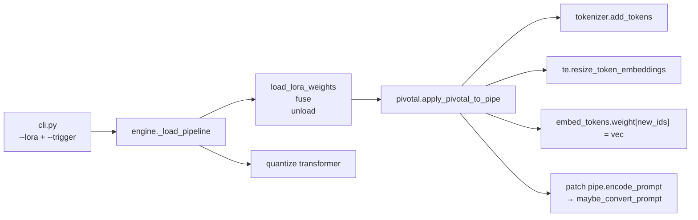

## Source

See `artifacts/frames/31-pivotal-tuning-embeddings-frame.mdx`. V23b cancelled after verifying end-to-end that ai-toolkit pivotal LoRAs drop their TE training through imageCLI.

## Problem

imageCLI's LoRA load path fuses the transformer adapter but never touches the tokenizer or text encoder. Any `emb_params` tensor written alongside the LoRA by ai-toolkit is silently discarded. A pivotal-trained LoRA is indistinguishable from a non-pivotal one at inference. No errors, no warnings — training compute for the TE-side is wasted.

## Outcome

A pivotal LoRA trained via ai-toolkit (`network:` + `embedding:` blocks) generates images through imageCLI that reflect the trained trigger word. **Two complementary success signals** (both required — silent failure risk makes visual alone insufficient):

1. **Deterministic assertion (code-level, runs every load):**
   - `tokenizer.convert_tokens_to_ids(trigger) == first_placeholder_id`
   - `torch.allclose(te.get_input_embeddings().weight[placeholder_ids], emb_params.to(te.device, te.dtype))`
   - Raises if either fails — closes the silent-failure loop at wire-time, not via visual output.

2. **Visual A/B (smoke test, one-shot manual verification):**
   - Same pivotal LoRA, same seed, same prompt containing the trigger
   - Generated WITH the fix vs WITHOUT the fix (pre-patch imagecli behavior)
   - Faces must differ — proves the TE vectors are actually reaching the transformer.

Target engines: `flux2-klein` (quanto FP8) and `flux2-klein-fp4` (NVFP4). `flux2-klein-fp8` (torchao) is a bonus.

## Appetite

| Phase | Budget | Notes |
|---|---|---|
| Code (loader, wiring, CLI, docs, unit tests) | ≈1 focused day | Collapsed from the frame's F-full estimate by Finding #1 below |
| Verification (train 250-step pivotal LoRA + A/B compare) | ≈2–3 h wall-clock | Training on RTX 5070 Ti + 2 generations + visual compare. Mickael already has the V23 infrastructure, so no setup cost |
| **Total** | **≈1 day + half-day verification** | |

## Key Findings

**TL;DR — the frame's core risk evaporates under verification.** The Qwen3/CLIP asymmetry that the frame treated as a hard constraint is a non-issue: Klein's `Qwen2Tokenizer` + Qwen3 text encoder support the same HF standard API (`add_tokens`, `resize_token_embeddings`, `get_input_embeddings().weight.data`) that diffusers' `TextualInversionLoaderMixin` is built on, *and* that ai-toolkit's training code uses. We don't need to port anything — we just need to call the standard methods in the right order. The remaining findings (save format, load order, quantization isolation, prompt-wiring point) are implementation inputs, not risk factors.

### 1. The Qwen3-vs-CLIP asymmetry is a non-issue

The frame warned that porting diffusers' `TextualInversionLoaderMixin` to Qwen3 BPE would be hard. Verification shows it's unnecessary — the mixin logic is already tokenizer-agnostic.

**`_maybe_convert_prompt` (diffusers 0.36):**

```python
def _maybe_convert_prompt(self, prompt, tokenizer):
    tokens = tokenizer.tokenize(prompt)
    unique_tokens = set(tokens)
    for token in unique_tokens:
        if token in tokenizer.added_tokens_encoder:
            replacement = token
            i = 1
            while f"{token}_{i}" in tokenizer.added_tokens_encoder:
                replacement += f" {token}_{i}"
                i += 1
            prompt = prompt.replace(token, replacement)
    return prompt
```

Every symbol here (`tokenize`, `added_tokens_encoder`) is standard `PreTrainedTokenizerBase` API. **Verified working on Klein's `Qwen2Tokenizer`:**

```
>>> tok = AutoTokenizer.from_pretrained('black-forest-labs/FLUX.2-klein-4B', subfolder='tokenizer')
>>> type(tok).__name__
'Qwen2Tokenizer'
>>> tok.add_tokens(['lyraface', 'lyraface_1', 'lyraface_2', 'lyraface_3'])
4
>>> tok.added_tokens_encoder['lyraface']
151669
>>> tok.encode('lyraface in space', add_special_tokens=False)
[151669, 304, 3550]
```

The mixin logic can be copied verbatim (~15 lines) — no porting needed.

### 2. ai-toolkit's training code uses exactly the same HF API we need

From `toolkit/embedding.py:54-80`:

```python
num_added_tokens = tokenizer.add_tokens(placeholder_tokens)  # ← standard HF
text_encoder.resize_token_embeddings(len(tokenizer))          # ← standard HF
token_embeds = text_encoder.get_input_embeddings().weight.data
token_embeds[token_id] = ...                                  # ← direct write
```

Training and inference use the exact same three-call path. imageCLI's fix is literally "do what training does, but after loading instead of during training". Placeholder token names (verified from training code):

```
trigger, trigger_1, trigger_2, ..., trigger_{N-1}
```

No brackets, no index-0 suffix. This **matches diffusers' `_maybe_convert_prompt` expansion format byte-for-byte** — interoperability is free.

### 3. Klein TE is a standard HF `PreTrainedModel`

```
model_type: qwen3
hidden_size: 2560     (← not 3072; the frame confused TE hidden with transformer hidden)
vocab_size: 151936
class: Qwen2Model inherits PreTrainedModel
  ├── get_input_embeddings()      ✓
  ├── set_input_embeddings()      ✓
  └── resize_token_embeddings()   ✓ (default mean_resizing=True, overwritten anyway)
```

The `resize_token_embeddings` default calls `_get_resized_embeddings` which grows `embed_tokens.weight` by the delta. New rows are mean-initialized, then we overwrite them with the trained vectors. Fully standard path.

### 4. ai-toolkit save format (verified from `toolkit/embedding.py:178-214`)

**Merged format** (the primary target — what V23+ will produce):

| Key | Shape | Location |
|---|---|---|
| `emb_params` | `(N, 2560)` | Inside the LoRA safetensors via `extra_state_dict` |
| LoRA keys | various `.lora_A`/`.lora_B` | Rest of the file |

Trigger string is NOT in the file. User must provide it (CLI flag or frontmatter).

**Standalone format** `{trigger}{step_num}.safetensors`:

| Key | Shape | Notes |
|---|---|---|
| `emb_params` | `(N, 2560)` | Single tensor |
| metadata `name` | JSON string | Trigger word |
| metadata `step` | JSON int | Training step |
| metadata `string_to_param` | `{"*": "emb_params"}` | A1111 compat pointer |

Trigger can be auto-detected from metadata `name` or filename.

### 5. Quantization + LoRA fuse are independent code paths

Current `_load_pipeline` call order in `flux2_klein.py`:

```
1. from_pretrained(bf16)           → loads TE + transformer + VAE
2. load_lora_weights(path)          → touches transformer only (PEFT adapters)
3. set_adapters(scale)              → if scale != 1.0
4. fuse_lora()                      → merges adapter into transformer.weight
5. unload_lora_weights()            → removes adapter structure from transformer
6. quantize(transformer, qfloat8)   → quanto FP8 on transformer
7. freeze(transformer)
8. QLinear.forward = _fwd_cont      → Marlin contiguity patch
```

**Where to inject the embedding load:** between step 5 and step 6 (or before step 2 — doesn't matter, they touch disjoint modules). The TE is still in bf16 on CPU at that point, so `embed_tokens.weight.data[new_row] = vec` is a normal bf16 assignment.

`flux2_klein_fp4.py` has the same structure, ending with `_runtime_quantize_transformer_to_nvfp4(transformer)` (line 335). Only `nn.Linear` modules are quantized — `embed_tokens` (an `nn.Embedding`) is untouched.

**`unload_lora_weights()` does NOT touch the TE** — it only removes PEFT wrappers from the transformer. The tokenizer/TE changes survive independently. ✓

### 6. Prompt expansion wiring point — 4 inference paths, 1 patch

There are four inference paths through the engines, not three. Tracing each:

| Path | Entry | Call to `pipe` | Hits `encode_prompt`? |
|---|---|---|---|
| 1. Single | `ImageEngine.generate` → `self._pipe(prompt=...)` | `prompt=` | Yes (pipeline `__call__` calls it internally) |
| 2. All-on-GPU batch | `encode_and_generate` → `self._pipe(prompt=...)` | `prompt=` | Yes |
| 3. 2-phase batch — encode | `engine.encode_prompt` → `self._pipe.encode_prompt(prompt=...)` | `prompt=` | Yes (direct) |
| 4. 2-phase batch — generate | `generate_from_embeddings` → `self._pipe(prompt_embeds=...)` | `prompt_embeds=` | **No — bypasses `encode_prompt`** |

Monkey-patching `self._pipe.encode_prompt` covers paths 1–3. Path 4 doesn't need covering because it consumes the *output* of path 3 — the prompt was already rewritten in phase 1 before encoding, so the resulting `prompt_embeds` already reflects the expanded tokens. No second expansion is needed or possible at path 4.

**Conclusion:** one instance-method replacement covers all four paths correctly. The patch applies at path 3 (which is called directly in phase 1) and path 1/2 (which call path 3 internally). Path 4 inherits the fix through its dependency on phase-1 output.

## Files Impacted

| File | Change | Reason |
|---|---|---|
| `src/imagecli/pivotal.py` | **new** (~100 lines) | `load_pivotal_embedding`, `apply_pivotal_to_pipe`, `expand_prompt_for_pivotal`, `patch_encode_prompt` |
| `src/imagecli/engines/flux2_klein.py` | +5 lines in `_load_pipeline` | call `apply_pivotal_to_pipe` between LoRA fuse/unload and quantize |
| `src/imagecli/engines/flux2_klein_fp4.py` | +5 lines in `_load_pipeline` | same; before `_runtime_quantize_transformer_to_nvfp4` |
| `src/imagecli/engines/flux2_klein_fp8.py` | +5 lines in `_load_pipeline` | bonus engine (torchao FP8) |
| `src/imagecli/engine.py` | `ImageEngine.__init__` takes `embedding_path: str\|None`, `trigger: str\|None` | plumbing |
| `src/imagecli/cli.py` | `--embedding`, `--trigger` flags on `generate` + `batch`; threading to `get_engine`/`_run_generate` | CLI surface |
| `src/imagecli/markdown.py` | `embedding_path`, `trigger` fields on `PromptDoc` | frontmatter support |
| `docs/lora.md` | new "Pivotal tuning inference" section | docs |
| `CLAUDE.md` | small note in markdown frontmatter block + LoRA section | docs |
| `tests/test_pivotal.py` | **new** — unit tests for loader, prompt expansion, token add | tests |

**10 files, ~250 LOC** including tests and docs. No new dependencies (reuses `safetensors`, `transformers`, `diffusers`, `torch` which are already in `uv.lock`).

## Shapes

| # | Name | Scope | Verdict |
|---|---|---|---|
| 1 | Inline minimal implementation (new `pivotal.py` + engine hooks) | S | **Recommended** |
| 2 | Subclass `Flux2KleinPipeline` with `TextualInversionLoaderMixin` | M | Rejected — extra coupling, no functional upside, still needs format shim |
| 3 | Upstream PR to diffusers | L (elapsed) | Rejected — wrong timeline for V24 unblock; correct long-term follow-up |

### Shape 1: Inline minimal implementation (single new module)



**What it is:** single new file `src/imagecli/pivotal.py` (~100 lines) exposing four pure functions. Engines call `apply_pivotal_to_pipe(pipe, emb_path, trigger)` once in `_load_pipeline`. No subclassing, no mixin import, no diffusers internals touched.

**Trade-offs:**
- Pro: minimal surface area, single file to audit, no upstream dep
- Pro: works identically on all three Klein engines via one function call
- Pro: easy to unit-test in isolation (mock a pipeline with just `tokenizer` + `text_encoder` attributes)
- Pro: decouples from diffusers version — if HF adds `TextualInversionLoaderMixin` to `Flux2KleinPipeline` later, we can delete our code and switch
- Con: we copy ~15 lines of `_maybe_convert_prompt` logic (but it's trivial, and the alternative is importing a 500-line mixin for 15 lines of utility)
- Con: monkey-patching `pipe.encode_prompt` has a small cognitive cost — a future reader has to notice the instance method was replaced

**Rough scope:** S

### Shape 2: Subclass Flux2KleinPipeline with TextualInversionLoaderMixin

Create `ImageCLIFlux2KleinPipeline(Flux2KleinPipeline, TextualInversionLoaderMixin)` in a new `src/imagecli/pipelines.py`. Override `from_pretrained` to return our subclass. Call `pipe.load_textual_inversion(path, token=trigger)` directly.

**Trade-offs:**
- Pro: uses diffusers' battle-tested machinery
- Pro: future-proofed against diffusers internal changes to the mixin
- Con: `TextualInversionLoaderMixin.load_textual_inversion` expects a specific state-dict layout (string_to_param metadata key lookup), not the raw `emb_params` tensor ai-toolkit writes. We'd still need a format-converter shim
- Con: `from_pretrained` interception is fragile — diffusers resolves pipeline classes via `_get_pipeline_class` reading `model_index.json`. Returning our subclass requires either explicit instantiation (bypassing `from_pretrained`'s auto-detection) or monkey-patching `_auto_class`
- Con: the mixin has known CLIP assumptions sprinkled through error messages and default token handling that we'd inherit as dead code
- Con: every engine still needs the same 5-line call; we gain nothing over Shape 1 at the call site
- Con: breaks the "minimal surface area" invariant of the imageCLI codebase

**Rough scope:** M — more plumbing than Shape 1 for zero functional benefit, given we already verified the HF standard API path works.

### Shape 3: Upstream PR to diffusers (add mixin to Flux2KleinPipeline)

Submit a PR adding `TextualInversionLoaderMixin` to `Flux2KleinPipeline` (and optionally `Flux2Pipeline`). Wait for merge. Pin our dep to the new diffusers version.

**Trade-offs:**
- Pro: solves the problem for every diffusers user, not just imageCLI
- Pro: future imageCLI code collapses to `pipe.load_textual_inversion(path, token=trigger)`
- Con: blocks V24+ Lyra exploration for weeks-to-months on upstream review
- Con: still need the imageCLI wiring regardless (trigger flag, frontmatter, prompt expansion at encode time unless we find a cleaner hook)
- Con: the mixin has CLIP-shaped state-dict parsing that might reject `emb_params`-only files without metadata. Upstream fix may need a format-parse branch too.

**Rough scope:** L (elapsed, not effort) — not the right tool for this timeline.

## Fit Check

**Recommended: Shape 1 — inline minimal implementation.**

All three shapes satisfy the *functional* constraints from the frame (works on both engines, survives unload + quantization, zero new deps). The elimination is on second-order criteria:

| Criterion | Shape 1 | Shape 2 | Shape 3 |
|---|---|---|---|
| Unblocks V24+ within appetite | ✓ (≈1 day) | ✓ (≈2 days) | ✗ (weeks, upstream review) |
| Matches imageCLI "thin, flat, simple" convention | ✓ | ✗ (extra class, pipeline interception) | — |
| Avoids diffusers internal coupling | ✓ | ✗ (subclasses + overrides `from_pretrained`) | — |
| Code at the engine call-site | 1 line | 1 line | 1 line (same) |
| Format shim required for `emb_params` | no (we write the parser) | **yes** (mixin expects `string_to_param` metadata layout) | no (upstream handles it) |
| LOC we own | ~100 | ~80 + a subclass + interception | 0 (after merge) |
| LOC of diffusers we depend on | ~15 copied | ~500 imported (via mixin) | ~500 upstreamed |
| Interface extensibility (future multi-LoRA) | ✓ (pure functions, pipe + path pairs) | ⚠️ (mixin assumes one TI set per pipe) | ⚠️ |

**Eliminated:**
- **Shape 2.** The mixin's `load_textual_inversion` does not parse raw `emb_params` tensors — it expects the `string_to_param` metadata pointer pattern. We'd still write the format shim ourselves, *plus* inherit the mixin's CLIP-shaped assumptions, *plus* fight diffusers' `from_pretrained` auto-class resolution to inject our subclass. Net: more coupling, same code.
- **Shape 3.** Correct long-term direction, wrong timeline for unblocking V24. Can be done *in addition to* Shape 1 once the imageCLI-local fix has proven the pattern in production.

## Locked Decisions (resolved during analysis)

These were initially "unresolved" but are product/contract-level and must not be deferred to spec:

### A. Trigger discovery UX — `--trigger` explicit, with sibling fallback

| Source | Trigger detection | Behavior |
|---|---|---|
| `--trigger lyraface` flag | Explicit | Use as-is |
| Frontmatter `trigger: lyraface` | Explicit | Use as-is (CLI flag overrides) |
| Standalone sibling file (`<lora-basename>_emb*.safetensors` or `{trigger}*.safetensors` next to the LoRA) | Auto-detect from filename + metadata `name` | Log the inferred trigger; require confirmation via flag on ambiguous sibling match |
| `emb_params` present in LoRA file + no trigger resolved | — | **Hard error** with a clear message: `LoRA contains emb_params (pivotal tuning) but no trigger word was provided. Pass --trigger <word> or add trigger: to frontmatter.` — NOT a silent continue. |

Rationale: the current silent-drop failure is exactly what we are fixing. Replacing it with a silent "no trigger resolved" continue would recreate the same class of bug. Hard error forces the user to surface intent.

### B. Smoke test is a deliverable, not an open question

Mickael already has the V23 infrastructure for training tiny pivotal LoRAs. The verification plan is: train a 250-step pivotal LoRA in ai-toolkit, generate WITH the fix + WITHOUT the fix at identical seed, compare visually, PLUS the deterministic assertions from the Outcome section run on every load. The spec operationalizes this; it is not an unresolved shape input.

## Unresolved (legitimately spec-phase)

1. **Number of placeholder tokens `N`.** Derived at runtime from `emb_params.shape[0]`. Spec should confirm this is the sole source of truth and document the validation: `emb_params.shape[-1] == te.hidden_size (2560)` — hard error on mismatch, to catch LoRAs trained against the wrong base model.
2. **Prompt expansion NOT idempotent on pre-expanded input.** Architect review caught this: `_maybe_convert_prompt` tokenizes then replaces `trigger` wherever found, which will double-expand a manually pre-expanded prompt. E.g. `"lyraface lyraface_1 lyraface_2 lyraface_3 cat"` becomes `"lyraface lyraface_1 lyraface_2 lyraface_3 lyraface_1 lyraface_2 lyraface_3 cat"`. Spec must document: **users write the bare trigger once; the pipeline handles expansion**. Document in `docs/lora.md` and enforce nothing at the CLI level (warning would be noisy and it's a trivial diagnostic via `--verbose` at the first inference).
3. **Zero-N and wrong-shape guards.** If a non-pivotal LoRA happens to carry a tensor key named `emb_params` (collision), or if the tensor is `(N, wrong_hidden)`, the loader must validate shape and raise before writing. Spec enumerates: `emb_params.ndim == 2`, `emb_params.shape[-1] == te.config.hidden_size`, `emb_params.shape[0] >= 1`, `emb_params.shape[0] < 32` (sanity cap).
4. **Standalone-format detection.** ai-toolkit's A1111-compat standalone file has `emb_params` as a tensor key and metadata `string_to_param = {"*": "emb_params"}`. The loader should detect the format by checking `'emb_params' in tensors` (matching ai-toolkit's own `load_embedding_from_file`), not by parsing metadata first. Spec confirms.
5. **`flux2-klein-fp8` (torchao) inclusion scope.** Same code path, different quantization. Spec to confirm whether ship-all-three or gate fp8 as a follow-up PR.
6. **Error-path UX polish.** Specific messages for: missing trigger, shape mismatch, unreadable safetensors, empty `emb_params`. Small but the kind of thing that bit us in the past (PuLID CA silent `strict=False` load).

None of these are shape-eliminating. They are the detail list for `/spec`.
