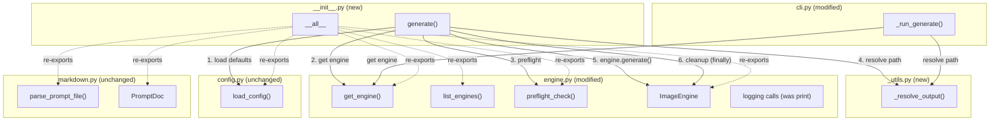
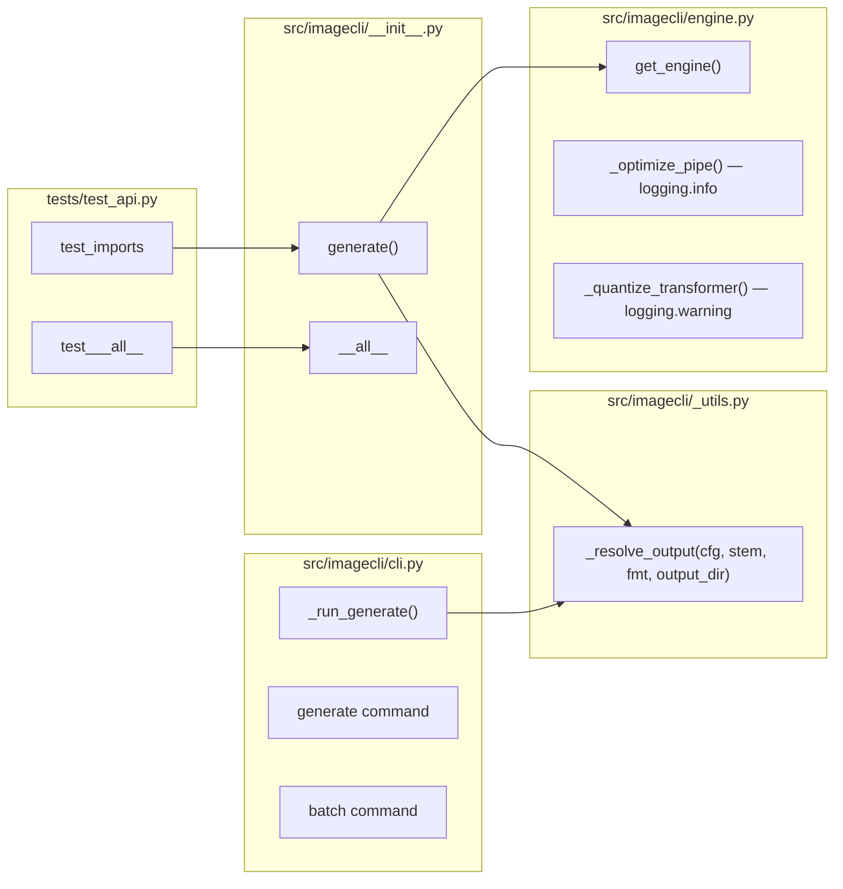

## Summary

Add a public Python API to imageCLI by: (1) converting bare `print()` calls in `engine.py` to `logging`, (2) extracting `_resolve_output` from `cli.py` to a shared `_utils.py`, (3) populating `__init__.py` with re-exports, `__all__`, and a convenience `generate()` function, (4) writing tests and API docs.

## Architecture





## Agents

| Agent | Task count | Files |
|-------|-----------|-------|
| backend-dev | 3 | `_utils.py`, `engine.py`, `cli.py`, `__init__.py` |
| tester | 1 | `tests/test_api.py` |
| doc-writer | 1 | `docs/api.md` |

## Consistency Report

| Metric | Value |
|--------|-------|
| Success criteria | 17 |
| Covered by tasks | 17/17 |
| Uncovered | 0 |
| Untraced tasks | 0 |

## Micro-Tasks

### Slice 1: Re-exports + `__all__` + `print()` → `logging`

#### Task 1.1 — Convert `print()` to `logging` in `engine.py` [P]
- **Agent:** backend-dev
- **File:** `src/imagecli/engine.py`
- **Spec trace:** SC-11 (`engine.py print() calls replaced with logging`)
- **Phase:** RED → GREEN
- **Difficulty:** 1
- **Time:** 3 min

**Description:** Add `import logging` at top. Replace `print(f"Compiling ...")` (line 144) with `logging.info(...)`. Replace `print(f"Warning: quantization failed ...")` (line 175) with `logging.warning(...)`.

**Code snippet:**
```python
import logging

logger = logging.getLogger(__name__)

# line 144:
logger.info("Compiling %s with torch.compile (first run will be slower) …", pipe_attr)

# line 175:
logger.warning("Quantization failed (%s), proceeding with bf16 (~20GB VRAM required).", e)
```

**Verify:**
```bash
grep -n 'print(' src/imagecli/engine.py | grep -v '# ' | wc -l
```
**Expected:** `0`

---

#### Task 1.2 — Extract `_resolve_output` to `_utils.py` [P]
- **Agent:** backend-dev
- **File:** `src/imagecli/_utils.py` (create), `src/imagecli/cli.py` (modify)
- **Spec trace:** SC-13 (anti-clobber via shared `_resolve_output`)
- **Phase:** RED → GREEN
- **Difficulty:** 2
- **Time:** 5 min

**Description:** Create `src/imagecli/_utils.py` with `_resolve_output(cfg, stem, fmt, output_dir)` moved from `cli.py`. Update `cli.py` to import from `_utils`. Suppress `warnings.warn` from `load_config()` in the library path.

**Code snippet (`_utils.py`):**
```python
from __future__ import annotations
from pathlib import Path

def resolve_output(cfg: dict, stem: str, fmt: str, output_dir: str | None) -> Path:
    out_dir = Path(output_dir or cfg.get("output_dir", "images/images_out"))
    out_dir.mkdir(parents=True, exist_ok=True)
    ext = fmt.lstrip(".")
    candidate = out_dir / f"{stem}.{ext}"
    n = 1
    while candidate.exists():
        candidate = out_dir / f"{stem}_{n}.{ext}"
        n += 1
    return candidate
```

**Code snippet (`cli.py` change):**
```python
# Replace inline _resolve_output with:
from imagecli._utils import resolve_output as _resolve_output
```

**Verify:**
```bash
grep -n '_resolve_output\|resolve_output' src/imagecli/cli.py src/imagecli/_utils.py
```
**Expected:** `_utils.py` defines it, `cli.py` imports it

---

#### Task 1.3 — Write `__init__.py` with re-exports + `__all__`
- **Agent:** backend-dev
- **File:** `src/imagecli/__init__.py`
- **Spec trace:** SC-1 through SC-5 (imports work, `__all__` defined)
- **Phase:** RED → GREEN
- **Difficulty:** 1
- **Time:** 3 min
- **Depends on:** 1.1, 1.2

**Description:** Populate `__init__.py` with re-exports of all public symbols and define `__all__`. Do NOT include `generate()` yet (that's Slice 2).

**Code snippet:**
```python
from imagecli.config import load_config
from imagecli.engine import (
    ImageEngine,
    InsufficientResourcesError,
    get_engine,
    list_engines,
    preflight_check,
)
from imagecli.markdown import PromptDoc, parse_prompt_file

__all__ = [
    "generate",
    "get_engine",
    "list_engines",
    "preflight_check",
    "load_config",
    "parse_prompt_file",
    "ImageEngine",
    "InsufficientResourcesError",
    "PromptDoc",
]
```

**Verify:**
```bash
cd /home/mickael/projects/imageCLI && uv run python -c "from imagecli import get_engine, list_engines, preflight_check, ImageEngine, PromptDoc, InsufficientResourcesError, parse_prompt_file, load_config; print('OK')"
```
**Expected:** `OK`

---

#### RED-GATE: Slice 1

```bash
cd /home/mickael/projects/imageCLI && uv run python -c "
from imagecli import get_engine, list_engines, preflight_check
from imagecli import ImageEngine, PromptDoc, InsufficientResourcesError
from imagecli import parse_prompt_file, load_config
print('Slice 1 gate: PASS')
" && grep -c 'print(' src/imagecli/engine.py | grep '^0$' && echo "No bare prints: PASS"
```

---

### Slice 2: Convenience `generate()` + shared `_resolve_output`

#### Task 2.1 — Implement `generate()` in `__init__.py`
- **Agent:** backend-dev
- **File:** `src/imagecli/__init__.py`
- **Spec trace:** SC-6 through SC-14 (generate returns Path, config defaults, preflight, cleanup, silence, output precedence, anti-clobber, compile passthrough)
- **Phase:** RED → GREEN
- **Difficulty:** 3
- **Time:** 8 min
- **Depends on:** 1.3

**Description:** Add the convenience `generate()` function. Uses `None` sentinels for all optional params. Loads config via `load_config()` (suppressing warnings), resolves defaults, instantiates engine, runs preflight, generates, cleans up in `finally`, returns `Path`.

**Code snippet:**
```python
import warnings
from pathlib import Path

def generate(
    prompt: str,
    *,
    engine: str | None = None,
    width: int | None = None,
    height: int | None = None,
    steps: int | None = None,
    guidance: float | None = None,
    seed: int | None = None,
    negative_prompt: str = "",
    output_path: str | Path | None = None,
    output_dir: str | Path | None = None,
    format: str | None = None,
    compile: bool = True,
) -> Path:
    """Generate an image from a text prompt. Returns the path to the saved image."""
    with warnings.catch_warnings():
        warnings.simplefilter("ignore")
        cfg = load_config()

    engine_name = engine or cfg["engine"]
    w = width or cfg["width"]
    h = height or cfg["height"]
    s = steps or cfg["steps"]
    g = guidance or cfg["guidance"]
    fmt = format or cfg.get("format", "png")

    if output_path is not None:
        out = Path(output_path)
        out.parent.mkdir(parents=True, exist_ok=True)
    else:
        from imagecli._utils import resolve_output
        out = resolve_output(cfg, "image", fmt, str(output_dir) if output_dir else None)

    eng = get_engine(engine_name, compile=compile)
    preflight_check(eng)

    try:
        return eng.generate(
            prompt,
            negative_prompt=negative_prompt,
            width=w,
            height=h,
            steps=s,
            guidance=g,
            seed=seed,
            output_path=out,
        )
    finally:
        eng.cleanup()
```

**Verify:**
```bash
cd /home/mickael/projects/imageCLI && uv run python -c "from imagecli import generate; print(type(generate))"
```
**Expected:** `<class 'function'>`

---

#### RED-GATE: Slice 2

```bash
cd /home/mickael/projects/imageCLI && uv run python -c "
from imagecli import generate
import inspect
sig = inspect.signature(generate)
assert 'prompt' in str(sig), 'missing prompt param'
assert 'engine' in sig.parameters, 'missing engine param'
assert 'compile' in sig.parameters, 'missing compile param'
assert sig.parameters['engine'].default is None, 'engine default should be None'
print('Slice 2 gate: PASS')
"
```

---

### Slice 3: Tests + API docs

#### Task 3.1 — Write `tests/test_api.py` [P]
- **Agent:** tester
- **File:** `tests/test_api.py`
- **Spec trace:** SC-17 (unit test verifies `__all__`), SC-1 through SC-5 (imports)
- **Phase:** GREEN
- **Difficulty:** 2
- **Time:** 5 min
- **Depends on:** 2.1

**Description:** Test that all `__all__` entries are importable, that `__all__` matches actual module-level names, and that importing `imagecli` does not import `typer` or `rich`.

**Code snippet:**
```python
import imagecli

def test_all_exports_importable():
    for name in imagecli.__all__:
        assert hasattr(imagecli, name), f"{name} in __all__ but not in module"

def test_all_matches_module():
    public = {n for n in dir(imagecli) if not n.startswith("_")}
    assert set(imagecli.__all__) == public

def test_no_cli_imports_at_module_level():
    import sys
    assert "typer" not in sys.modules or "typer" not in dir(imagecli)
```

**Verify:**
```bash
cd /home/mickael/projects/imageCLI && uv run pytest tests/test_api.py -v
```
**Expected:** All tests pass

---

#### Task 3.2 — Write `docs/api.md` [P]
- **Agent:** doc-writer
- **File:** `docs/api.md`
- **Spec trace:** SC-16 (docs/api.md documents all public symbols)
- **Phase:** GREEN
- **Difficulty:** 2
- **Time:** 5 min
- **Depends on:** 2.1

**Description:** Document all public symbols from `__all__` with usage examples. Include: `generate()`, `get_engine()`, `list_engines()`, `preflight_check()`, `parse_prompt_file()`, `load_config()`, `ImageEngine`, `PromptDoc`, `InsufficientResourcesError`.

**Verify:**
```bash
for sym in generate get_engine list_engines preflight_check parse_prompt_file load_config ImageEngine PromptDoc InsufficientResourcesError; do
  grep -q "$sym" docs/api.md || echo "MISSING: $sym"
done
```
**Expected:** No output (all symbols documented)

---

#### RED-GATE: Slice 3

```bash
cd /home/mickael/projects/imageCLI && uv run pytest tests/test_api.py -v && echo "Tests: PASS"
```
