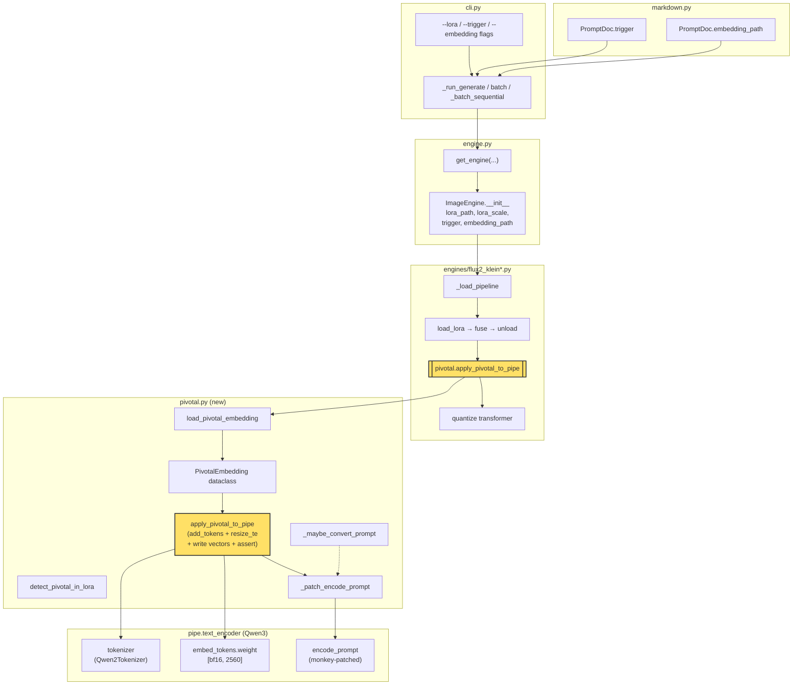
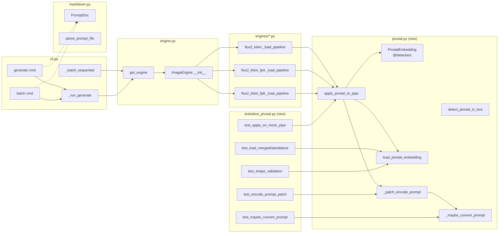

## Summary

Build a single `src/imagecli/pivotal.py` module (~100 LOC) that parses ai-toolkit pivotal embedding safetensors, adds placeholder tokens to Klein's Qwen2Tokenizer, writes the trained vectors into the Qwen3 TE's `embed_tokens.weight`, and monkey-patches `pipe.encode_prompt` to expand the bare trigger into its multi-vector form before tokenization. Wire into `flux2-klein` (quanto FP8) and `flux2-klein-fp4` (NVFP4) engines between LoRA fuse/unload and transformer quantization; bonus wire into `flux2-klein-fp8` (torchao) at the same slot. Verify via deterministic round-trip assertion at load time + visual A/B smoke test.

## Architecture

### Data flow (load time → inference)



### File × function map



## Bootstrap Context (from analysis)

- **Klein tokenizer** is `Qwen2Tokenizer` (BPE), supports `add_tokens`, populates `added_tokens_encoder`. TE is `Qwen3Model`, `hidden_size=2560`, `vocab_size=151936`, supports `resize_token_embeddings`.
- **ai-toolkit save format** (`toolkit/embedding.py:178-214`): merged = `emb_params` key inside the LoRA safetensors via `extra_state_dict`; standalone = `emb_params` tensor + metadata `string_to_param = {"*": "emb_params"}` + metadata `name` (trigger).
- **Placeholder token naming**: `trigger, trigger_1, trigger_2, ..., trigger_{N-1}` (no brackets, no `_0`). Matches diffusers `_maybe_convert_prompt` expansion format.
- **Load order**: insert between `unload_lora_weights()` and `quantize(transformer)` on quanto FP8, between `unload_lora_weights()` and `transformer.to("cuda")` on NVFP4. TE stays on CPU in bf16 at this point — disjoint from transformer quantization.
- **bf16 precision**: fp32→bf16→fp32 round-trip has error up to ~7.8e-3 (one bf16 ULP at magnitude 1). SC-6 uses `atol=1e-2`.
- **`_maybe_convert_prompt` double-expansion**: non-idempotent. Warn user at runtime if `{trigger}_1` already in prompt.
- **`generate_from_embeddings` path**: bypasses `encode_prompt` by passing `prompt_embeds=`, but inherits the fix because phase-1 encoding (which does hit the patched `encode_prompt`) produces the embeddings it consumes.

## Agents

| Agent | Tasks | Files |
|---|---|---|
| backend-dev | 17 | `src/imagecli/pivotal.py`, `engine.py`, `cli.py`, `markdown.py`, `engines/flux2_klein.py`, `engines/flux2_klein_fp4.py`, `engines/flux2_klein_fp8.py` |
| tester | 6 | `tests/test_pivotal.py`, `tests/fixtures/pivotal/*.safetensors` |
| doc-writer | 2 | `docs/lora.md`, `CLAUDE.md` |

## Consistency Report

| Spec item | Plan coverage |
|---|---|
| SC-1 (module imports) | T1.1, T1.2 |
| SC-2a (merged load) | T1.3, T1.6 (test) |
| SC-2b (standalone load) | T1.4, T1.6 (test) |
| SC-3 (shape validation) | T1.5, T1.7 (test) |
| SC-4 (missing trigger error) | T1.8, T1.9 (test) |
| SC-5a (add_tokens exact N) | T2.3, T2.9 (test) |
| SC-5b (unload_lora independence) | T2.3, T2.9 (test) |
| SC-6 (round-trip assertion, atol=1e-2) | T2.4, T2.9 (test) |
| SC-7 (klein e2e) | T2.10 (RED-GATE) |
| SC-8 (fp4 e2e) | T3.2 (RED-GATE) |
| SC-9 (visual A/B + artifacts) | T4.4 (manual), T4.5 |
| SC-10 (batch mode) | T4.1, T4.2, T4.6 (RED-GATE) |
| SC-11a (loader tests) | T1.6, T1.7 |
| SC-11b (expand + patch tests) | T1.10, T2.5 |
| SC-12 (docs) | T4.3 |
| SC-13 (fp8 bonus + deferral) | T5.1, T5.2 |
| U1-U5 (CLI affordances) | T2.6, T2.7, T4.1 |
| N1-N2 (frontmatter) | T2.8 |
| L1-L6 (library API) | T1.1–T1.5, T2.1–T2.2 |
| S1-S5 (engine integration) | T2.3, T2.6, T2.7, T2.11, T3.1, T5.1 |

**Coverage:** 15/15 success criteria mapped, all breadboard affordances covered. No untraced tasks. No exempt items.

## Slices

| # | Slice | Tasks | Demo criterion | Depends on |
|---|---|---|---|---|
| V1 | Pivotal library core (pure) | T1.1–T1.11 | `uv run pytest tests/test_pivotal.py` green | — |
| V2 | flux2-klein wire-up + CLI + assertion | T2.1–T2.11 | `imagecli generate "lyraface cat" --lora X --trigger lyraface -e flux2-klein` succeeds, assertion passes | V1 |
| V3 | flux2-klein-fp4 wire-up | T3.1–T3.2 | same command with `-e flux2-klein-fp4` | V2 |
| V4 | Batch + docs + visual A/B | T4.1–T4.6 | `imagecli batch … --lora … --trigger …` on mixed dir; A/B images under `~/.roxabi/forge/lyra/brand/V24-pivotal-verification/` | V3 |
| V5 | flux2-klein-fp8 bonus (optional) | T5.1–T5.2 | same command with `-e flux2-klein-fp8` | V4; deferral rule in SC-13 |

## Micro-Tasks

**Legend:** `[P]` = parallel-safe with siblings in same phase. RED = failing test first. GREEN = make it pass. RED-GATE = slice acceptance sentinel.

---

### Slice V1 — Pivotal library core

#### Phase 1: RED (tests first)

**T1.6** `[P]` — Write loader tests (merged + standalone formats) — **tester**, difficulty 2, 8 min
- File: `tests/test_pivotal.py`
- Spec trace: SC-2a, SC-2b, SC-11a
- Shape:
  ```python
  def test_load_merged_format(tmp_path):
      # Build a fake LoRA safetensors with emb_params + dummy lora keys
      import torch
      from safetensors.torch import save_file
      path = tmp_path / "lora.safetensors"
      save_file({
          "emb_params": torch.randn(4, 2560, dtype=torch.float32),
          "transformer.blocks.0.lora_A.weight": torch.zeros(16, 3072),
      }, path)
      from imagecli.pivotal import load_pivotal_embedding
      piv = load_pivotal_embedding(path, trigger="lyraface")
      assert piv is not None
      assert piv.trigger == "lyraface"
      assert piv.num_tokens == 4
      assert piv.vectors.shape == (4, 2560)
      assert piv.source == "merged"

  def test_load_standalone_format(tmp_path):
      # Build a standalone A1111-compat safetensors
      ...
  ```
- Verify: `uv run pytest tests/test_pivotal.py::test_load_merged_format tests/test_pivotal.py::test_load_standalone_format -v`
- Expected: both tests FAIL (module doesn't exist yet)

**T1.7** `[P]` — Write shape validation tests (4 conditions) — **tester**, difficulty 2, 6 min
- File: `tests/test_pivotal.py`
- Spec trace: SC-3, SC-11a
- Shape: 4 tests, one per condition (`ndim != 2`, `shape[0] < 1`, `shape[0] > 32`, `shape[-1] != 2560`). Each builds a fake safetensors with a malformed `emb_params` and expects a `ValueError` with the relevant shape message.
- Verify: `uv run pytest tests/test_pivotal.py -k "shape" -v`
- Expected: 4 FAIL (module doesn't exist)

**T1.9** `[P]` — Write missing-trigger error test — **tester**, difficulty 1, 4 min
- File: `tests/test_pivotal.py`
- Spec trace: SC-4, SC-11a
- Shape: call `load_pivotal_embedding(path_with_emb_params, trigger=None, embedding_path=None)` → expects `ValueError` whose message contains `--trigger`.
- Verify: `uv run pytest tests/test_pivotal.py::test_missing_trigger_hard_error -v`
- Expected: FAIL

**T1.10** `[P]` — Write `_maybe_convert_prompt` tests (multi-vector, no-op, substring collision, double-expansion) — **tester**, difficulty 3, 10 min
- File: `tests/test_pivotal.py`
- Spec trace: SC-11b
- Shape:
  ```python
  def _make_tok(added: list[str]):
      from unittest.mock import MagicMock
      tok = MagicMock()
      tok.added_tokens_encoder = {t: 151669 + i for i, t in enumerate(added)}
      tok.tokenize = lambda s: s.split()
      return tok

  def test_maybe_convert_prompt_multi_vector():
      from imagecli.pivotal import _maybe_convert_prompt
      tok = _make_tok(["lyraface", "lyraface_1", "lyraface_2", "lyraface_3"])
      out = _maybe_convert_prompt("lyraface in space", tok)
      assert out == "lyraface lyraface_1 lyraface_2 lyraface_3 in space"

  def test_maybe_convert_prompt_no_trigger():
      tok = _make_tok([])
      assert _maybe_convert_prompt("plain prompt", tok) == "plain prompt"

  def test_maybe_convert_prompt_already_expanded_warns(caplog):
      tok = _make_tok(["lyraface", "lyraface_1", "lyraface_2", "lyraface_3"])
      out = _maybe_convert_prompt("lyraface lyraface_1 cat", tok)
      assert "double-expansion" in caplog.text.lower()
  ```
- Verify: `uv run pytest tests/test_pivotal.py -k "maybe_convert" -v`
- Expected: 3-4 FAIL

#### Phase 2: GREEN (implementation)

**T1.1** — Create `PivotalEmbedding` dataclass + module scaffold — **backend-dev**, difficulty 1, 4 min
- File: `src/imagecli/pivotal.py` (new)
- Spec trace: L1
- Shape:
  ```python
  """Pivotal tuning embedding loader for Klein 4B (Qwen3 TE).

  Parses ai-toolkit pivotal embeddings (merged into LoRA safetensors or
  standalone A1111-format files), adds placeholder tokens to the tokenizer,
  writes trained vectors into text_encoder.embed_tokens.weight, and patches
  pipe.encode_prompt to expand the bare trigger before tokenization.
  """
  from __future__ import annotations
  import logging
  from dataclasses import dataclass
  from pathlib import Path
  from typing import Literal
  import torch

  logger = logging.getLogger(__name__)

  _MAX_NUM_TOKENS = 32

  @dataclass
  class PivotalEmbedding:
      trigger: str
      vectors: "torch.Tensor"  # shape (N, hidden_size), fp32 or bf16
      num_tokens: int
      source: Literal["merged", "standalone"]
      source_path: Path
  ```
- Verify: `uv run python -c "from imagecli.pivotal import PivotalEmbedding; print(PivotalEmbedding)"`
- Expected: `<class 'imagecli.pivotal.PivotalEmbedding'>`

**T1.2** — Implement `detect_pivotal_in_lora` — **backend-dev**, difficulty 1, 3 min
- File: `src/imagecli/pivotal.py`
- Spec trace: L6
- Shape:
  ```python
  def detect_pivotal_in_lora(lora_path: Path | str) -> bool:
      """Return True if the LoRA safetensors contains an emb_params key."""
      from safetensors import safe_open
      with safe_open(str(lora_path), framework="pt", device="cpu") as f:
          return "emb_params" in f.keys()
  ```
- Verify: `uv run python -c "from imagecli.pivotal import detect_pivotal_in_lora; print(detect_pivotal_in_lora.__doc__)"`

**T1.3** — Implement merged-format loader branch — **backend-dev**, difficulty 2, 6 min
- File: `src/imagecli/pivotal.py`
- Spec trace: L2, SC-2a
- Shape: load tensor via `safetensors.safe_open`, read `emb_params`, return `PivotalEmbedding(source="merged", ...)`. Does NOT validate yet (validation is T1.5).

**T1.4** — Implement standalone-format loader branch — **backend-dev**, difficulty 2, 6 min
- File: `src/imagecli/pivotal.py`
- Spec trace: L2, SC-2b
- Shape: same loader dispatches on `embedding_path is not None` → reads `emb_params` from standalone file. Trigger can come from metadata `name` if not passed explicitly.

**T1.5** — Implement validation + trigger resolution + `load_pivotal_embedding` entry point — **backend-dev**, difficulty 3, 10 min
- File: `src/imagecli/pivotal.py`
- Spec trace: L2, SC-3, SC-4
- Shape:
  ```python
  def load_pivotal_embedding(
      lora_path: Path | str | None,
      trigger: str | None,
      *,
      embedding_path: Path | str | None = None,
      te_hidden_size: int = 2560,
  ) -> PivotalEmbedding | None:
      # 1. Resolve source: explicit embedding_path → standalone; else lora_path has emb_params → merged; else None
      # 2. If no pivotal found and no trigger given → return None (caller decides warn vs continue)
      # 3. If emb_params present but no trigger → raise ValueError("... --trigger ... silent-drop ...")
      # 4. Validate shape: ndim==2, 1<=shape[0]<=_MAX_NUM_TOKENS, shape[-1]==te_hidden_size
      # 5. Build PivotalEmbedding, return
  ```
  Error message for SC-4:
  ```
  "LoRA contains emb_params (pivotal tuning) but no trigger was provided. "
  "Pass --trigger <word> or set trigger: in frontmatter. "
  "Without a trigger the embeddings are silently ignored."
  ```

**T1.8** — Implement `_maybe_convert_prompt` — **backend-dev**, difficulty 2, 5 min
- File: `src/imagecli/pivotal.py`
- Spec trace: L4, SC-11b
- Shape: copy diffusers' logic verbatim, add a warn-log branch when `{token}_1` already appears in the tokenized prompt.
  ```python
  def _maybe_convert_prompt(prompt: str, tokenizer) -> str:
      tokens = tokenizer.tokenize(prompt)
      unique = set(tokens)
      for token in unique:
          if token not in tokenizer.added_tokens_encoder:
              continue
          # Build multi-vector expansion
          replacement = token
          i = 1
          while f"{token}_{i}" in tokenizer.added_tokens_encoder:
              replacement += f" {token}_{i}"
              i += 1
          if replacement == token:
              continue  # single-vector
          # Double-expansion guard: if any of the suffixes already in tokens, warn
          if any(f"{token}_{j}" in unique for j in range(1, i)):
              logger.warning(
                  "Prompt already contains placeholder '%s_1' — possible double-expansion. "
                  "Write the bare trigger once and let pivotal.py expand it.",
                  token,
              )
              continue  # skip expansion, user already did it
          prompt = prompt.replace(token, replacement)
      return prompt
  ```

#### Phase 3: RED-GATE V1

**T1.11** — **RED-GATE V1** — all pivotal library tests pass — **tester**, difficulty 1, 2 min
- Spec trace: V1 acceptance
- Verify: `uv run pytest tests/test_pivotal.py -v`
- Expected: all tests in test_pivotal.py PASS (loader, shape validation, missing trigger, maybe_convert_prompt, double-expansion warn)
- **Blocks:** V2

---

### Slice V2 — flux2-klein wire-up + CLI + assertion

#### Phase 1: RED

**T2.9** `[P]` — Write `apply_pivotal_to_pipe` test with mock pipe — **tester**, difficulty 3, 10 min
- File: `tests/test_pivotal.py`
- Spec trace: SC-5a, SC-5b, SC-6, SC-11b
- Shape:
  ```python
  def _make_mock_pipe():
      from unittest.mock import MagicMock
      import torch
      pipe = MagicMock()
      # Qwen-like tokenizer mock
      pipe.tokenizer = MagicMock()
      pipe.tokenizer.added_tokens_encoder = {}
      pipe.tokenizer.add_tokens = MagicMock(side_effect=lambda toks:
          (pipe.tokenizer.added_tokens_encoder.update({t: 151669 + i for i, t in enumerate(toks)}), len(toks))[1])
      pipe.tokenizer.convert_tokens_to_ids = lambda t: pipe.tokenizer.added_tokens_encoder[t]
      pipe.tokenizer.__len__ = MagicMock(return_value=151669 + 100)
      # TE mock with resize + embed_tokens
      weight = torch.zeros(151673, 2560, dtype=torch.bfloat16)
      emb = MagicMock()
      emb.weight = torch.nn.Parameter(weight)
      pipe.text_encoder = MagicMock()
      pipe.text_encoder.get_input_embeddings = MagicMock(return_value=emb)
      pipe.text_encoder.resize_token_embeddings = MagicMock()
      pipe.text_encoder.config = MagicMock(hidden_size=2560)
      return pipe

  def test_apply_adds_exactly_n_tokens(tmp_path):
      pipe = _make_mock_pipe()
      piv = PivotalEmbedding(trigger="lyraface",
                              vectors=torch.randn(4, 2560, dtype=torch.float32),
                              num_tokens=4, source="merged", source_path=tmp_path/"x.safetensors")
      ids = apply_pivotal_to_pipe(pipe, piv)
      assert len(ids) == 4
      pipe.tokenizer.add_tokens.assert_called_once()
      call_arg = pipe.tokenizer.add_tokens.call_args[0][0]
      assert call_arg == ["lyraface", "lyraface_1", "lyraface_2", "lyraface_3"]

  def test_apply_round_trip_assertion(tmp_path):
      pipe = _make_mock_pipe()
      vecs = torch.randn(4, 2560, dtype=torch.float32)
      piv = PivotalEmbedding("lyraface", vecs, 4, "merged", tmp_path/"x.safetensors")
      apply_pivotal_to_pipe(pipe, piv)  # should not raise

  def test_apply_independent_of_unload_lora_weights(tmp_path):
      pipe = _make_mock_pipe()
      piv = PivotalEmbedding("lyraface", torch.randn(4, 2560), 4, "merged", tmp_path/"x.safetensors")
      ids = apply_pivotal_to_pipe(pipe, piv)
      # Simulate unload (no-op for TE/tokenizer)
      pipe.unload_lora_weights = MagicMock()
      pipe.unload_lora_weights()
      assert pipe.tokenizer.added_tokens_encoder["lyraface"] == ids[0]
  ```
- Verify: `uv run pytest tests/test_pivotal.py -k "apply" -v`
- Expected: FAIL (apply_pivotal_to_pipe not implemented)

**T2.5** `[P]` — Write `_patch_encode_prompt` test — **tester**, difficulty 2, 6 min
- File: `tests/test_pivotal.py`
- Spec trace: SC-11b, L5
- Shape: build a mock pipe whose `encode_prompt` records the prompt it was called with. Apply `_patch_encode_prompt`. Call `pipe.encode_prompt(prompt="lyraface cat")`. Assert the recorded prompt is the expanded form.
- Verify: `uv run pytest tests/test_pivotal.py::test_patch_encode_prompt -v`
- Expected: FAIL

#### Phase 2: GREEN

**T2.1** — Implement `apply_pivotal_to_pipe` with round-trip assertion (SC-6, atol=1e-2) — **backend-dev**, difficulty 4, 15 min
- File: `src/imagecli/pivotal.py`
- Spec trace: L3, SC-5a, SC-5b, SC-6
- Shape:
  ```python
  def apply_pivotal_to_pipe(pipe, pivotal: PivotalEmbedding) -> list[int]:
      import torch
      tok = pipe.tokenizer
      te = pipe.text_encoder
      trigger = pivotal.trigger
      N = pivotal.num_tokens
      placeholder_tokens = [trigger] + [f"{trigger}_{i}" for i in range(1, N)]
      added = tok.add_tokens(placeholder_tokens)
      if added != N:
          raise ValueError(
              f"Trigger {trigger!r} (or its suffixes) already exist in the tokenizer "
              f"vocabulary. Only {added}/{N} tokens added. Use a different trigger word."
          )
      te.resize_token_embeddings(len(tok))
      placeholder_ids = [tok.convert_tokens_to_ids(t) for t in placeholder_tokens]
      # Write vectors
      embed_tokens = te.get_input_embeddings()
      weight = embed_tokens.weight
      vecs = pivotal.vectors.to(device=weight.device, dtype=weight.dtype)
      with torch.no_grad():
          for i, pid in enumerate(placeholder_ids):
              weight[pid] = vecs[i]
      # Round-trip assertion (SC-6)
      assert tok.convert_tokens_to_ids(trigger) == placeholder_ids[0], \
          f"round-trip id mismatch: {tok.convert_tokens_to_ids(trigger)} vs {placeholder_ids[0]}"
      te_rows = embed_tokens.weight[placeholder_ids].detach().float().cpu()
      src = pivotal.vectors.detach().float().cpu()
      assert torch.allclose(te_rows, src, atol=1e-2), \
          f"pivotal round-trip failed: max diff {(te_rows - src).abs().max().item()}"
      logger.info("Pivotal: loaded %d tokens for '%s' from %s", N, trigger, pivotal.source_path)
      return placeholder_ids
  ```

**T2.2** — Implement `_patch_encode_prompt` — **backend-dev**, difficulty 2, 6 min
- File: `src/imagecli/pivotal.py`
- Spec trace: L5, SC-10
- Shape:
  ```python
  def _patch_encode_prompt(pipe) -> None:
      """Wrap pipe.encode_prompt so it runs _maybe_convert_prompt before delegating.

      Called once after apply_pivotal_to_pipe. Instance-level patch — not global.
      Covers: path 1 (generate → __call__ → encode_prompt), path 2 (all-on-GPU
      encode_and_generate → __call__), path 3 (2-phase batch phase-1
      engine.encode_prompt). Path 4 (generate_from_embeddings) bypasses encode_prompt
      entirely but consumes embeddings from phase 3, which went through this patch.
      """
      original = pipe.encode_prompt
      tokenizer = pipe.tokenizer
      logged_first_expansion = [False]  # closure-carried flag

      def _patched_encode_prompt(*args, **kwargs):
          prompt = kwargs.get("prompt")
          if prompt is None and args:
              prompt = args[0]
              args = args[1:]
          if isinstance(prompt, str):
              new_prompt = _maybe_convert_prompt(prompt, tokenizer)
              if new_prompt != prompt:
                  if not logged_first_expansion[0]:
                      logger.info("Pivotal: expanded %r → %r", prompt, new_prompt)
                      logged_first_expansion[0] = True
                  else:
                      logger.debug("Pivotal: expanded %r → %r", prompt, new_prompt)
              kwargs["prompt"] = new_prompt
          elif isinstance(prompt, list):
              kwargs["prompt"] = [_maybe_convert_prompt(p, tokenizer) for p in prompt]
          return original(*args, **kwargs)

      pipe.encode_prompt = _patched_encode_prompt
  ```

**T2.3** — Extend `ImageEngine.__init__` + `get_engine` with `trigger` + `embedding_path` — **backend-dev**, difficulty 2, 6 min
- File: `src/imagecli/engine.py`
- Spec trace: S1, S2
- Shape: add params to `ImageEngine.__init__(..., trigger: str | None = None, embedding_path: str | None = None)`; store on self; thread through `get_engine`.

**T2.4** — Wire `flux2_klein.py::_load_pipeline` hook — **backend-dev**, difficulty 2, 6 min
- File: `src/imagecli/engines/flux2_klein.py`
- Spec trace: S3
- Shape: after line 50 (`logger.info("LoRA fused into base weights.")`) and before line 52 (`logger.info("Quantizing transformer to float8...")`) insert:
  ```python
  if self.lora_path or self.embedding_path:
      from imagecli.pivotal import load_pivotal_embedding, apply_pivotal_to_pipe, _patch_encode_prompt
      pivotal = load_pivotal_embedding(
          self.lora_path, self.trigger,
          embedding_path=self.embedding_path,
          te_hidden_size=self._pipe.text_encoder.config.hidden_size,
      )
      if pivotal is not None:
          apply_pivotal_to_pipe(self._pipe, pivotal)
          _patch_encode_prompt(self._pipe)
  ```

**T2.6** — Extend `PromptDoc` with `trigger` + `embedding_path` + parser wire-up — **backend-dev**, difficulty 1, 4 min
- File: `src/imagecli/markdown.py`
- Spec trace: N1, N2
- Shape: add `trigger: str | None = None` and `embedding_path: str | None = None` fields to `PromptDoc`; pop in `parse_prompt_file`.

**T2.7** — Add `--trigger` and `--embedding` flags to `generate` + thread through `_run_generate` — **backend-dev**, difficulty 2, 8 min
- File: `src/imagecli/cli.py`
- Spec trace: U1, U3, S1.5
- Shape: add Typer options `--trigger` and `--embedding` to `generate` command; add `trigger` + `embedding_path` params to `_run_generate`; resolve `trigger = trigger_flag or doc.trigger`, `emb = emb_flag or doc.embedding_path`; pass to `get_engine`.

#### Phase 3: RED-GATE V2

**T2.10** — **RED-GATE V2** — klein CLI smoke + unit tests green — **tester**, difficulty 1, 4 min
- Spec trace: SC-7, V2 acceptance
- Verify:
  ```bash
  uv run pytest tests/test_pivotal.py -v
  uv run ruff check src/imagecli/pivotal.py src/imagecli/engine.py src/imagecli/cli.py src/imagecli/markdown.py src/imagecli/engines/flux2_klein.py
  uv run imagecli generate "lyraface cat on a bench" \
      --lora /home/mickael/.roxabi/forge/lyra/brand/V23-EXPLORATION/<pivotal_checkpoint>.safetensors \
      --trigger lyraface -e flux2-klein -W 512 -H 512 -s 20 --seed 42 \
      -o /tmp/pivotal-smoke.png
  ```
- Expected: pytest green, ruff clean, imagecli generates a valid PNG, log contains `Pivotal: loaded N tokens for 'lyraface'` AND `Pivotal: expanded 'lyraface cat...'` (or assertion error with diff if misrouted)
- **Blocks:** V3
- **Note:** if no pivotal checkpoint exists yet, train one via ai-toolkit first (~30 min on RTX 5070 Ti at 250 steps)

---

### Slice V3 — flux2-klein-fp4 wire-up

**T3.1** — Wire `flux2_klein_fp4.py::_load_pipeline` hook — **backend-dev**, difficulty 2, 6 min
- File: `src/imagecli/engines/flux2_klein_fp4.py`
- Spec trace: S4
- Shape: insert pivotal hook at TWO places:
  1. In the LoRA branch (after line 331 `unload_lora_weights`, before line 333 `transformer.to("cuda")`)
  2. In the no-LoRA branch (lines 337-345) — after `from_pretrained` and before the `transformer.to("cuda")` on line 342, guarded by `if self.embedding_path:`
- Code:
  ```python
  # After LoRA fuse/unload, before transformer.to("cuda")
  if self.lora_path or self.embedding_path:
      from imagecli.pivotal import load_pivotal_embedding, apply_pivotal_to_pipe, _patch_encode_prompt
      pivotal = load_pivotal_embedding(
          self.lora_path, self.trigger,
          embedding_path=self.embedding_path,
          te_hidden_size=self._pipe.text_encoder.config.hidden_size,
      )
      if pivotal is not None:
          apply_pivotal_to_pipe(self._pipe, pivotal)
          _patch_encode_prompt(self._pipe)
  ```

**T3.2** — **RED-GATE V3** — fp4 engine smoke — **tester**, difficulty 1, 3 min
- Spec trace: SC-8, V3 acceptance
- Verify: same as T2.10 but `-e flux2-klein-fp4`
- Expected: valid PNG, assertion passes, logs show pivotal active
- **Blocks:** V4

---

### Slice V4 — Batch + docs + visual A/B

**T4.1** — Add `--trigger` + `--embedding` flags to `batch` command + thread through single-engine path — **backend-dev**, difficulty 2, 8 min
- File: `src/imagecli/cli.py`
- Spec trace: U2, U4, S2.5
- Shape: add Typer options to `batch` command; at `get_engine` call (line 316-319) thread `trigger=trigger or parsed[0][1].trigger, embedding_path=embedding or parsed[0][1].embedding_path`.

**T4.2** — Thread `trigger` + `embedding_path` through `_batch_sequential` mid-loop — **backend-dev**, difficulty 2, 6 min
- File: `src/imagecli/cli.py`
- Spec trace: S2.6
- Shape: at the mid-loop `get_engine` construction (line 558-564), resolve `trigger = trigger_override or doc.trigger`, `embedding_path = emb_override or doc.embedding_path`; pass both into `get_engine`.

**T4.3** `[P]` — Document pivotal tuning in `docs/lora.md` + update `CLAUDE.md` — **doc-writer**, difficulty 2, 10 min
- File: `docs/lora.md`, `CLAUDE.md`
- Spec trace: SC-12
- Shape: add a "Pivotal tuning inference" section to `docs/lora.md` with: what pivotal is (brief), usage (`--trigger`/`--embedding` flags, frontmatter fields), the "bare trigger once" user rule (non-idempotent expansion, write the trigger ONCE — the pipeline expands it), supported engines (flux2-klein, flux2-klein-fp4, flux2-klein-fp8 if shipped), error messages to expect. Update `CLAUDE.md` markdown-frontmatter block to list `trigger:` and `embedding_path:`. Also mention that the LoRA file must have been trained by ai-toolkit with the `embedding:` block.

**T4.6** — **RED-GATE V4a** — batch smoke test — **tester**, difficulty 1, 4 min
- Spec trace: SC-10
- Verify:
  ```bash
  uv run pytest tests/test_pivotal.py tests/test_batch.py -v
  uv run ruff check src/imagecli/
  # Create a tiny batch dir with 2 .md files using the pivotal LoRA
  mkdir -p /tmp/pivotal-batch
  cat > /tmp/pivotal-batch/a.md <<EOF
  ---
  engine: flux2-klein
  trigger: lyraface
  width: 512
  height: 512
  steps: 20
  ---
  lyraface standing in a forest
  EOF
  cat > /tmp/pivotal-batch/b.md <<EOF
  ---
  engine: flux2-klein
  trigger: lyraface
  width: 512
  height: 512
  steps: 20
  ---
  lyraface sitting on a bench
  EOF
  uv run imagecli batch /tmp/pivotal-batch/ --lora /path/to/pivotal.safetensors --output-dir /tmp/pivotal-batch-out
  ```
- Expected: both images generated, pivotal expansion log fires at least once, both files non-empty

**T4.4** — **MANUAL** Visual A/B verification artifact — **backend-dev** (or manual), difficulty 2, 45 min wall-clock
- Spec trace: SC-9
- Steps:
  1. If not already trained, train a 250-step pivotal LoRA in ai-toolkit on 10 Lyra reference images (Mickael has infra)
  2. Generate with the pivotal fix: `imagecli generate "<bare_trigger> in a field" --lora X --trigger <trigger> -e flux2-klein --seed 42`
  3. `git stash` the pivotal.py + engine hooks, rebuild the venv imports, OR `git checkout HEAD~N` to a pre-fix commit — generate the SAME command with the SAME seed (will silently degrade to vanilla LoRA)
  4. Save both to `~/.roxabi/forge/lyra/brand/V24-pivotal-verification/`:
     - `before_seed42_flux2-klein.png`
     - `after_seed42_flux2-klein.png`
     - `README.md` with: LoRA checkpoint step, seed, engine, one-sentence note on the silent-drop failure mode this verifies
  5. Restore working tree
- Verify: `ls ~/.roxabi/forge/lyra/brand/V24-pivotal-verification/ && cat ~/.roxabi/forge/lyra/brand/V24-pivotal-verification/README.md`
- Expected: before+after PNGs + README exist, faces visibly differ on inspection

**T4.5** — **RED-GATE V4b** — V4 completion — **tester**, difficulty 1, 2 min
- Spec trace: V4 acceptance
- Verify: T4.6 green + T4.4 artifacts present + `grep -l "Pivotal tuning" docs/lora.md` non-empty
- Expected: all three conditions true
- **Blocks:** V5 (or triggers deferral check)

---

### Slice V5 — flux2-klein-fp8 bonus (optional)

**DEFERRAL CHECK (before T5.1):** If the elapsed wall-clock on slices 1–4 exceeds 1.5× the appetite (~1.5 days code + ~4.5 h verification), stop here, file a follow-up issue `feat: pivotal tuning support on flux2-klein-fp8 (torchao)`, and report to user. Otherwise continue.

**T5.1** — Wire `flux2_klein_fp8.py::_load_pipeline` hook — **backend-dev**, difficulty 2, 5 min
- File: `src/imagecli/engines/flux2_klein_fp8.py`
- Spec trace: S5, SC-13
- Shape: same pattern as T2.4 — insert after `unload_lora_weights` (line 65) and before `quantize_(...)` (line 70):
  ```python
  if self.lora_path or self.embedding_path:
      from imagecli.pivotal import load_pivotal_embedding, apply_pivotal_to_pipe, _patch_encode_prompt
      pivotal = load_pivotal_embedding(
          self.lora_path, self.trigger,
          embedding_path=self.embedding_path,
          te_hidden_size=self._pipe.text_encoder.config.hidden_size,
      )
      if pivotal is not None:
          apply_pivotal_to_pipe(self._pipe, pivotal)
          _patch_encode_prompt(self._pipe)
  ```

**T5.2** — **RED-GATE V5** — fp8 smoke — **tester**, difficulty 1, 3 min
- Spec trace: SC-13, V5 acceptance
- Verify: T2.10 command with `-e flux2-klein-fp8`
- Expected: valid PNG, assertion passes

---

## Task Summary

| Slice | Tasks | Parallel groups |
|---|---|---|
| V1 | 11 (T1.1–T1.11) | RED: T1.6 `[P]`, T1.7 `[P]`, T1.9 `[P]`, T1.10 `[P]` (4-way). GREEN: T1.1 → T1.2 → T1.3 → T1.4 → T1.5 → T1.8 (sequential, same file). T1.11 gate. |
| V2 | 8 (T2.1–T2.10, skipping gaps) | RED: T2.5 `[P]`, T2.9 `[P]`. GREEN: T2.1 → T2.2 → T2.3 → T2.4 → T2.6 → T2.7 (mostly sequential on pivotal.py + engine.py + markdown.py). T2.10 gate. |
| V3 | 2 (T3.1, T3.2) | sequential |
| V4 | 5 (T4.1–T4.6 with gap) | T4.3 `[P]` with T4.1/T4.2 (different files). T4.4 manual after code tasks. T4.5 final gate. T4.6 sub-gate. |
| V5 | 2 (T5.1, T5.2) | sequential, optional per deferral rule |
| **Total** | **28 tasks** | |

Total time estimate: ~4 h coding + ~1 h RED-GATE verification + ~45 min visual A/B wall-clock = roughly matches the spec's "≈1 day code + half-day verification" appetite.

## Task IDs

<!-- Generated by /plan. Used by /implement to resume tasks on session restart. -->
- T1.1: 13 — Create PivotalEmbedding dataclass + pivotal.py module scaffold
- T1.2: 14 — Implement detect_pivotal_in_lora
- T1.3: 15 — Implement merged-format loader branch
- T1.4: 16 — Implement standalone-format loader branch
- T1.5: 17 — Implement load_pivotal_embedding entry point (validation + trigger resolution)
- T1.6: 18 — [P] Write loader tests (merged + standalone formats)
- T1.7: 19 — [P] Write shape validation tests (4 conditions)
- T1.8: 20 — Implement _maybe_convert_prompt with double-expansion warn
- T1.9: 21 — [P] Write missing-trigger error test
- T1.10: 22 — [P] Write _maybe_convert_prompt tests (4 cases)
- T1.11: 23 — RED-GATE V1 — all pivotal library tests pass
- T2.1: 24 — Implement apply_pivotal_to_pipe with round-trip assertion (atol=1e-2)
- T2.2: 25 — Implement _patch_encode_prompt (instance-level monkey-patch)
- T2.3: 26 — Extend ImageEngine.__init__ + get_engine with trigger + embedding_path
- T2.4: 27 — Wire flux2_klein.py::_load_pipeline hook
- T2.5: 28 — [P] Write _patch_encode_prompt test
- T2.6: 29 — Extend PromptDoc with trigger + embedding_path fields
- T2.7: 30 — Add --trigger + --embedding flags to generate command + thread _run_generate
- T2.9: 31 — [P] Write apply_pivotal_to_pipe tests (mock pipe)
- T2.10: 32 — RED-GATE V2 — klein CLI smoke + unit + lint
- T3.1: 33 — Wire flux2_klein_fp4.py::_load_pipeline hook (LoRA + no-LoRA branches)
- T3.2: 34 — RED-GATE V3 — fp4 engine smoke
- T4.1: 35 — Add --trigger + --embedding flags to batch command (single-engine path)
- T4.2: 36 — Thread trigger + embedding_path through _batch_sequential mid-loop
- T4.3: 37 — [P] Document pivotal tuning in docs/lora.md + update CLAUDE.md
- T4.4: 38 — MANUAL Visual A/B verification artifact
- T4.6: 39 — RED-GATE V4a — batch smoke test
- T4.5: 40 — RED-GATE V4b — V4 slice acceptance
- T5.1: 41 — Wire flux2_klein_fp8.py::_load_pipeline hook (bonus, subject to deferral rule)
- T5.2: 42 — RED-GATE V5 — fp8 smoke
