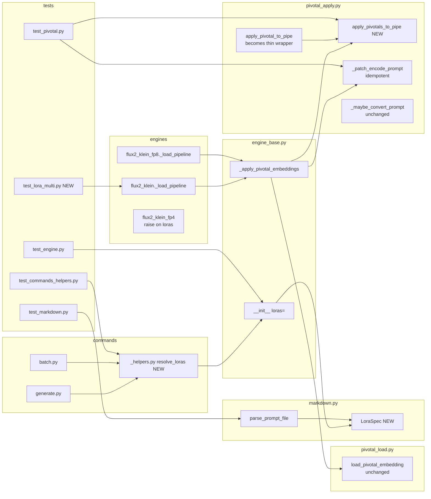

## Summary

Introduce `LoraSpec` + `ImageEngine.loras: list[LoraSpec]` as the canonical internal LoRA representation; replace the singular apply path with an atomic `apply_pivotals_to_pipe(pipe, pivotals)`; extend the Klein engines' fuse loop; lift markdown + CLI + daemon surfaces to accept the list, with a strict compat shim for the existing singular fields (mixed-form raises).

## Architecture

### Data flow

```mermaid
flowchart TD
    subgraph Input
      MD[prompt.md\nfrontmatter `loras:`] --> PARSER[markdown.py\nparse_prompt_file]
      CLI_IN["CLI --lora/--trigger\n(repeatable)"] --> HELPER[commands/_helpers.py\nresolve_loras]
      NATS_IN[NATS payload\nloras list] --> ADAPTER[nats/adapter.py]
    end
    PARSER -->|PromptDoc.loras| CMD[commands/generate.py\nbatch.py]
    CMD --> HELPER
    ADAPTER --> HELPER
    HELPER -->|loras: list[LoraSpec]| ENG[ImageEngine.__init__]
    ENG -->|self.loras| PIPE[engine._load_pipeline]
    PIPE -->|iter: load_lora_weights\nfuse_lora| FUSED[fused base pipeline]
    FUSED --> APPLY[engine_base._apply_pivotal_embeddings]
    APPLY -->|per spec: load_pivotal_embedding| LOADED["list[PivotalEmbedding]"]
    LOADED --> BATCH[pivotal_apply.apply_pivotals_to_pipe\n**NEW** atomic]
    BATCH --> PATCH[pivotal_apply._patch_encode_prompt\nidempotent]
    PATCH --> READY[engine ready]
    style BATCH fill:#fde68a,stroke:#d97706
    style PATCH fill:#bae6fd,stroke:#0284c7
```

### File × function map



## Bootstrap Context

From analysis:
- Engine base (`src/imagecli/engine_base.py`) is the single seam for pivotal apply after #57.
- `pivotal_apply.py` already uses an atomic pre-check for a single trigger; extension is the multi-trigger accumulator.
- `flux2_klein.py` and `flux2_klein_fp8.py` both route through `_apply_pivotal_embeddings` — one refactor covers both for the apply path; each still needs its fuse loop extended individually (`fp4` stays raise-only).
- Diffusers supports multi-adapter fuse via `adapter_name=` + `set_adapters(..., adapter_weights=[...])` + `fuse_lora()`.
- Override policy (CLI replaces frontmatter list) matches existing single-field override semantics.

## Agents

| Agent | Tasks | Files |
|---|---|---|
| backend-dev | 18 | `src/imagecli/engine_base.py`, `pivotal_apply.py`, `markdown.py`, `engines/flux2_klein*.py`, `commands/*.py`, `nats/adapter.py`, `daemon.py` |
| tester | 10 | `tests/test_pivotal.py`, `test_markdown.py`, `test_commands_helpers.py`, `test_engine.py`, `test_lora_multi.py` (new) |
| architect | 2 | review of `LoraSpec` placement + `apply_pivotals_to_pipe` atomicity contract |
| doc-writer | 2 | `docs/lora.md`, CLAUDE.md touch-up if frontmatter example changes |

Parallel-safe: Slice 1 + Slice 4 tasks can run in parallel once their scope is distinct (no shared files).

## Consistency Report

Coverage: 16/16 AC traced. Every breadboard ID (U1–U5, N1–N3, S1–S7) maps to at least one task. No untraced tasks. No exemptions.

## Micro-Tasks

**Conventions:** Each task targets ~5–10 min. `[P]` = parallel-safe (no shared file with siblings). RED-GATE = run tests at slice boundary, must pass before next slice starts.

---

### Slice V1 — Internal data model + engine shim (RED→GREEN→REFACTOR)

**T1 [RED] [P]** — `tester` — Write failing tests for `LoraSpec` and `ImageEngine(loras=...)` shim.
- File: `tests/test_engine.py` (append)
- Tests:
  - `test_lora_spec_is_frozen_dataclass` — assert `LoraSpec(path="x")` works; attempted `spec.path = "y"` raises.
  - `test_engine_init_stores_loras_list` — subclass of `ImageEngine` with trivial `_load`; assert `eng.loras == [LoraSpec(path="x")]`.
  - `test_engine_init_singular_fold` — pass `lora_path="a"`, `lora_scale=0.7`, `trigger="t"`, `embedding_path="e"` → `loras` == `[LoraSpec(path="a", scale=0.7, trigger="t", embedding_path="e")]`.
  - `test_engine_init_empty_fold` — no LoRA kwargs → `loras == []`.
  - `test_engine_init_mixed_form_raises` — `loras=[...]` + any singular → `ValueError` with both field names in message.
- Verify: `uv run pytest tests/test_engine.py -k "lora_spec or loras_list or singular_fold or empty_fold or mixed_form"`
- Expected: 5 failing tests.
- Spec trace: SC-1, SC-2, SC-3, SC-4 | Slice V1 | Difficulty 2

**T2 [GREEN]** — `backend-dev` — Add `LoraSpec` dataclass + `loras` kwarg + shim to `ImageEngine`.
- File: `src/imagecli/engine_base.py`
- Add frozen `@dataclass(frozen=True) LoraSpec` at module scope (or import from a new `src/imagecli/lora_spec.py` if architect prefers — see T3).
- Change `__init__` signature: add `loras: list[LoraSpec] | None = None` before the singular kwargs.
- Logic: if `loras` not None and any singular kwarg set → raise `ValueError(f"Pass either loras= or singular fields (lora_path/trigger/lora_scale/embedding_path), not both")`.
  Else fold singular into `self.loras`: `[LoraSpec(path=lora_path, scale=lora_scale, trigger=trigger, embedding_path=embedding_path)]` when `lora_path is not None`, else `[]`.
- Keep singular attrs (`self.lora_path`, etc.) populated from `self.loras[0]` when N=1 for subclasses/daemon that still read them — mark with a comment for later removal.
- Verify: `uv run pytest tests/test_engine.py -k "lora_spec or loras_list or singular_fold or empty_fold or mixed_form"`
- Expected: 5 tests pass.
- Spec trace: SC-1, SC-2, SC-3, SC-4 | Slice V1 | Difficulty 3

**T3** — `architect` — Decide `LoraSpec` module placement.
- Context: `engine_base.py` is already near 300 lines (quality-gate limit). A new module `src/imagecli/lora_spec.py` avoids further growth and keeps the dataclass importable by `markdown.py` + commands without pulling engine internals.
- Output: one-line decision in PR. Default: new module.
- Verify: `wc -l src/imagecli/engine_base.py` ≤ 300.
- Spec trace: SC-1 | Slice V1 | Difficulty 1

**T4 [RED-GATE]** — `tester` — Run full test suite; existing tests must still pass.
- Verify: `uv run pytest`
- Expected: all green; no regressions.
- Spec trace: SC-13 (singular CLI byte-identical) | Slice V1 | Difficulty 1

---

### Slice V2 — Atomic multi-trigger pivotal apply (RED→GREEN)

**T5 [RED]** — `tester` — Write failing tests for `apply_pivotals_to_pipe` (plural) + idempotent patch.
- File: `tests/test_pivotal.py` (append)
- Tests:
  - `test_apply_pivotals_n1_parity` — one PivotalEmbedding → same outcome as old singular.
  - `test_apply_pivotals_n2_distinct_triggers` — two triggers, both added in one `add_tokens` call (spy), TE resized once, per-LoRA round-trip passes, returned placeholder-id lists match.
  - `test_apply_pivotals_cross_collision_raises_atomically` — trigger `A` + trigger `A_1` (second collides with first's suffix): raise before any tokenizer mutation; post-raise, `len(tokenizer)` unchanged.
  - `test_apply_pivotals_preexisting_collision_raises` — trigger already in vocab: same atomic guarantee.
  - `test_patch_encode_prompt_idempotent` — call `_patch_encode_prompt(pipe)` twice; assert `pipe.encode_prompt` is wrapped exactly once (e.g. sentinel `pipe._imagecli_pivotal_patched == True`; second call is no-op).
  - `test_maybe_convert_prompt_multiple_triggers` — prompt `"lyraface and mickface"` with both triggers in `added_tokens_encoder` + both have suffixes → both expanded in a single call.
- Use `FakePipe` / `FakeTokenizer` / `FakeTextEncoder` test doubles already present in `test_pivotal.py` (extend as needed).
- Verify: `uv run pytest tests/test_pivotal.py -k "apply_pivotals or idempotent or multiple_triggers"`
- Expected: 6 failing tests.
- Spec trace: SC-5, SC-6, SC-7, SC-8, SC-9, SC-10 | Slice V2 | Difficulty 3

**T6 [GREEN]** — `backend-dev` — Implement `apply_pivotals_to_pipe` + idempotency guard.
- File: `src/imagecli/pivotal_apply.py`
- Add `def apply_pivotals_to_pipe(pipe, pivotals: list[PivotalEmbedding]) -> list[list[int]]:`
  - Build full `placeholder_tokens` list per pivotal, flatten.
  - Atomic pre-check: check collisions against `added_tokens_encoder` + base `get_vocab()` AND check for intra-set duplicates. Any collision → `ValueError` naming all collisions. Tokenizer untouched.
  - Single `tok.add_tokens(all_placeholders)` call; verify count matches sum(n_i).
  - Single `te.resize_token_embeddings(len(tok))`.
  - Per pivotal: write vectors into `embed_tokens.weight` rows, run round-trip assertion.
  - Return `list[list[int]]` of per-pivotal placeholder ids.
- Refactor `apply_pivotal_to_pipe(pipe, pivotal)` to: `return apply_pivotals_to_pipe(pipe, [pivotal])[0]`.
- Modify `_patch_encode_prompt(pipe)`:
  - At entry, check `getattr(pipe, "_imagecli_pivotal_patched", False)` → return early.
  - Set `pipe._imagecli_pivotal_patched = True` after wrapping.
- Verify: `uv run pytest tests/test_pivotal.py`
- Expected: full test_pivotal.py green (old + new).
- Spec trace: SC-5, SC-6, SC-7, SC-8, SC-9, SC-10 | Slice V2 | Difficulty 4

**T7 [REFACTOR]** — `backend-dev` — Update `_apply_pivotal_embeddings` in `engine_base.py` to iterate `self.loras`.
- File: `src/imagecli/engine_base.py`
- Replace singular body with: iterate `self.loras`, call `load_pivotal_embedding` per spec, collect non-None results, call `apply_pivotals_to_pipe(pipe, pivotals)` when non-empty, then `_patch_encode_prompt(pipe)` (idempotency guaranteed).
- Early-return if `self.loras == []`.
- Verify: `uv run pytest tests/test_pivotal.py tests/test_engine.py`
- Expected: all green.
- Spec trace: SC-5 | Slice V2 | Difficulty 2

**T8 [RED-GATE]** — `tester` — Full suite regression.
- Verify: `uv run pytest`
- Expected: green.
- Spec trace: — | Slice V2 | Difficulty 1

---

### Slice V3 — Klein engine multi-LoRA fuse path (RED→GREEN)

**T9 [RED]** — `tester` — Write failing tests for Klein multi-LoRA fuse.
- File: `tests/test_lora_multi.py` (new)
- Use diffusers pipeline stubs (monkeypatch `Flux2KleinPipeline.from_pretrained` to return a `FakePipe` with `load_lora_weights`, `set_adapters`, `fuse_lora`, `unload_lora_weights` spies).
- Tests:
  - `test_flux2_klein_loads_each_lora_as_named_adapter` — N=2 specs → `load_lora_weights` called 2×, adapter_names `["lora_0","lora_1"]`.
  - `test_flux2_klein_sets_scales_only_when_nondefault` — all scales 1.0 → `set_adapters` NOT called; mixed scales → `set_adapters(["lora_0","lora_1"], adapter_weights=[1.0, 1.2])`.
  - `test_flux2_klein_fuse_lora_called_once` — single `fuse_lora()` call regardless of N.
  - `test_flux2_klein_unload_after_fuse` — `unload_lora_weights` called after fuse.
  - `test_flux2_klein_no_lora_skips_block` — `loras=[]` → none of the spies called.
  - `test_flux2_klein_fp8_mirror` — same invariants for fp8 engine.
  - `test_flux2_klein_fp4_raises_on_any_lora` — `loras=[LoraSpec(path="x")]` → `ValueError` at construction or first load with message mentioning `flux2-klein-fp4`.
- Verify: `uv run pytest tests/test_lora_multi.py`
- Expected: 7 failing tests.
- Spec trace: SC-11, SC-12 | Slice V3 | Difficulty 3

**T10 [GREEN] [P]** — `backend-dev` — Update `flux2_klein._load_pipeline` fuse block.
- File: `src/imagecli/engines/flux2_klein.py`
- Replace the `if self.lora_path:` block with:
  ```python
  if self.loras:
      for i, spec in enumerate(self.loras):
          logger.info("Loading LoRA %d from %s...", i, spec.path)
          self._pipe.load_lora_weights(spec.path, adapter_name=f"lora_{i}")
      if any(spec.scale != 1.0 for spec in self.loras):
          self._pipe.set_adapters(
              [f"lora_{i}" for i in range(len(self.loras))],
              adapter_weights=[spec.scale for spec in self.loras],
          )
      self._pipe.fuse_lora()
      self._pipe.unload_lora_weights()
      logger.info("%d LoRA(s) fused into base weights.", len(self.loras))
  ```
- Verify: `uv run pytest tests/test_lora_multi.py::test_flux2_klein_loads_each_lora_as_named_adapter tests/test_lora_multi.py::test_flux2_klein_sets_scales_only_when_nondefault tests/test_lora_multi.py::test_flux2_klein_fuse_lora_called_once tests/test_lora_multi.py::test_flux2_klein_unload_after_fuse tests/test_lora_multi.py::test_flux2_klein_no_lora_skips_block`
- Expected: 5 green.
- Spec trace: SC-11 | Slice V3 | Difficulty 2

**T11 [GREEN] [P]** — `backend-dev` — Mirror fuse block in `flux2_klein_fp8.py`.
- File: `src/imagecli/engines/flux2_klein_fp8.py`
- Apply the same replacement.
- Verify: `uv run pytest tests/test_lora_multi.py::test_flux2_klein_fp8_mirror`
- Expected: 1 green.
- Spec trace: SC-11 | Slice V3 | Difficulty 1

**T12 [GREEN]** — `backend-dev` — Update FP4 raise message (keep LoRA-unsupported).
- File: `src/imagecli/engines/flux2_klein_fp4.py`
- Ensure construction or `_load` raises `ValueError` with the SC-12 message when `self.loras` non-empty. If current code raises on `self.lora_path`, extend to `self.loras`.
- Verify: `uv run pytest tests/test_lora_multi.py::test_flux2_klein_fp4_raises_on_any_lora`
- Expected: green.
- Spec trace: SC-12 | Slice V3 | Difficulty 1

**T13 [RED-GATE]** — `tester` — Full suite regression.
- Verify: `uv run pytest`
- Expected: green.
- Slice V3 | Difficulty 1

---

### Slice V4 — Markdown `loras:` list parsing

**T14 [RED] [P]** — `tester` — Tests for `loras:` parsing + shim.
- File: `tests/test_markdown.py` (append)
- Tests:
  - `test_parse_loras_list` — frontmatter with 2-item `loras:` list → `PromptDoc.loras == [LoraSpec(...), LoraSpec(...)]`.
  - `test_parse_singular_lora_fields_fold` — legacy `lora_path: x`, `trigger: t` → `loras == [LoraSpec(path="x", trigger="t", scale=1.0)]`.
  - `test_parse_no_lora_fields_empty_list` — `loras == []` (or `None` — pick one, be consistent).
  - `test_parse_mixed_form_raises` — both `loras:` and any singular `lora_path:`/`trigger:` → `ValueError`.
  - `test_parse_loras_with_embedding_path` — nested `embedding_path: /p/e.sft` inside list entry parsed.
- Verify: `uv run pytest tests/test_markdown.py -k "loras"`
- Expected: 5 failing.
- Spec trace: SC-14 | Slice V4 | Difficulty 2

**T15 [GREEN] [P]** — `backend-dev` — Implement `loras:` parsing in `markdown.py`.
- File: `src/imagecli/markdown.py`
- Import `LoraSpec` (from `imagecli.lora_spec`).
- Change `PromptDoc.loras: list[LoraSpec] = field(default_factory=list)`.
- In `parse_prompt_file`:
  - Pop `loras` from frontmatter if present (must be list of dicts).
  - Detect mixed form: if `loras` present AND any of `lora_path`/`trigger`/`embedding_path`/`lora_scale` present → raise `ValueError`.
  - If `loras` present → `[LoraSpec(**entry) for entry in raw]` with a key allow-list: `{path, scale, trigger, embedding_path}`. Extra keys → raise.
  - If singular fields only → fold: `[LoraSpec(path=..., scale=..., trigger=..., embedding_path=...)]` when `lora_path` present, else `[]`.
- Keep `PromptDoc.lora_path`/`.trigger`/`.embedding_path`/`.lora_scale` as read-only `@property` that return `self.loras[0].{field}` when `len(self.loras) == 1` else `None` (for callers that still read the singular attrs in this PR; remove in a future PR).
- Verify: `uv run pytest tests/test_markdown.py`
- Expected: green.
- Spec trace: SC-14 | Slice V4 | Difficulty 3

**T16 [RED-GATE]** — `tester` — Suite regression.
- Verify: `uv run pytest`
- Slice V4 | Difficulty 1

---

### Slice V5 — CLI repeatable flags + override policy

**T17 [RED]** — `tester` — Tests for CLI + override.
- File: `tests/test_commands_helpers.py` (append) + maybe `tests/test_cli.py`.
- Tests:
  - `test_resolve_loras_cli_empty_uses_frontmatter` — no CLI flags + FM `loras:` list → returned list equals FM list.
  - `test_resolve_loras_cli_nonempty_replaces_frontmatter` — CLI `--lora X --trigger T` + FM `loras: [...]` → returned list == `[LoraSpec(path="X", trigger="T")]`.
  - `test_resolve_loras_cli_mismatched_counts_raises_when_pivotal_required` — 2 `--lora` + 1 `--trigger` where one LoRA is detected as pivotal → `ValueError` mentioning pairing.
  - `test_resolve_loras_cli_mismatched_counts_ok_when_no_pivotal` — 2 `--lora` + 0 `--trigger` where neither LoRA has `emb_params` → allowed.
  - `test_resolve_loras_singular_cli_byte_identical` — classic invocation (1 `--lora`, 1 `--trigger`) produces same args as before the change (regression check).
- Verify: `uv run pytest tests/test_commands_helpers.py tests/test_cli.py -k "resolve_loras or byte_identical"`
- Expected: 5 failing.
- Spec trace: SC-13, SC-15 | Slice V5 | Difficulty 3

**T18 [GREEN] [P]** — `backend-dev` — Add `resolve_loras` helper.
- File: `src/imagecli/commands/_helpers.py`
- New fn: `resolve_loras(cli_lora: list[str], cli_trigger: list[str], cli_scale: list[float], cli_embedding: list[str], fm_loras: list[LoraSpec]) -> list[LoraSpec]`
- If `cli_lora` empty → return `fm_loras`.
- Else: validate lengths (each of trigger/scale/embedding is either empty/missing, all-default-filled, or exactly `len(cli_lora)`); build `list[LoraSpec]`; return.
- Pivotal-pairing validation can live here too OR inside `load_pivotal_embedding` as today — prefer keeping it in `load_pivotal_embedding` (already raises when a pivotal is detected without trigger). Add a CLI-side pre-check only if that leaves a UX gap.
- Verify: `uv run pytest tests/test_commands_helpers.py -k resolve_loras`
- Expected: green.
- Spec trace: SC-15 | Slice V5 | Difficulty 3

**T19 [GREEN] [P]** — `backend-dev` — Wire `resolve_loras` into `generate.py` + `batch.py`.
- Files: `src/imagecli/commands/generate.py`, `src/imagecli/commands/batch.py`, `src/imagecli/commands/_batch_sequential.py`
- Change Typer options:
  - `--lora`: `list[str]` (repeatable). Default `[]`.
  - `--trigger`: `list[str]` default `[]`.
  - `--lora-scale`: `list[float]` default `[]`.
  - `--embedding`: `list[str]` default `[]`.
- Replace existing `lora_p = lora or doc.lora_path` logic with `loras = resolve_loras(lora, trigger, lora_scale, embedding, doc.loras)`.
- Pass `loras=loras` to engine constructor; stop passing singular kwargs from this layer.
- Log one line when CLI overrides FM: `logger.info("CLI --lora overrides frontmatter loras: list (N=%d)", len(loras))`.
- Verify: `uv run pytest tests/test_cli.py tests/test_batch.py tests/test_commands_helpers.py`
- Expected: green (classic invocations must still pass byte-identically — test_cli/batch existing cases).
- Spec trace: SC-13, SC-15 | Slice V5 | Difficulty 3

**T20 [RED-GATE]** — `tester` — Suite regression.
- Verify: `uv run pytest`
- Slice V5 | Difficulty 1

---

### Slice V6 — Daemon + NATS threading

**T21 [RED]** — `tester` — Test NATS payload `loras` list.
- Files: `tests/nats/test_adapter.py` (extend) + `tests/test_api.py` if it covers daemon construction.
- Tests:
  - `test_nats_accepts_loras_list_payload` — payload with `loras: [{path, trigger}, ...]` → engine constructed with matching `loras: list[LoraSpec]`.
  - `test_nats_legacy_singular_payload_still_works` — payload with `lora_path`, `trigger` → folded into 1-element list (regression).
  - `test_nats_rejects_mixed_form_payload` — both → error response.
- Verify: `uv run pytest tests/nats/`
- Expected: 3 failing.
- Spec trace: SC-16 | Slice V6 | Difficulty 2

**T22 [GREEN]** — `backend-dev` — Thread `loras` through daemon + NATS.
- Files: `src/imagecli/daemon.py`, `src/imagecli/nats/adapter.py`
- Accept `loras` list in the request schema; parse each entry into `LoraSpec`.
- Accept legacy singular keys via the same shim; raise on mixed form.
- Pass `loras=...` to engine constructor.
- Verify: `uv run pytest tests/nats/ tests/test_api.py`
- Expected: green.
- Spec trace: SC-16 | Slice V6 | Difficulty 3

**T23 [RED-GATE]** — `tester` — Suite regression.
- Verify: `uv run pytest`
- Slice V6 | Difficulty 1

---

### Slice V7 — Docs + smoke test

**T24 [P]** — `doc-writer` — Update `docs/lora.md` with "Multi-LoRA stacking" section.
- File: `docs/lora.md`
- Sections to add:
  - Frontmatter example with 2 pivotal LoRAs.
  - CLI example with repeated flags.
  - Override policy note (CLI replaces FM list).
  - FP4 exclusion note (unchanged).
  - Mix-form error reference.
- Verify: `grep -c "Multi-LoRA" docs/lora.md`
- Expected: ≥1.
- Spec trace: SC-17 | Slice V7 | Difficulty 2

**T25 [P]** — `backend-dev` — End-to-end smoke test (wiring proof).
- File: `tests/test_lora_multi.py` (append)
- Test: build a fake `PromptDoc` with `loras=[LoraSpec(...), LoraSpec(...)]`, call through `resolve_loras` (no CLI override), construct a stubbed `Flux2KleinEngine`, invoke `_load_pipeline` (stubbed diffusers), assert adapters loaded, pivotal apply called with `list[PivotalEmbedding]` of length 2.
- Verify: `uv run pytest tests/test_lora_multi.py`
- Expected: green.
- Spec trace: SC-18 | Slice V7 | Difficulty 2

**T26 [RED-GATE]** — `tester` — Full suite regression + lint + typecheck.
- Verify: `uv run pytest && uv run ruff check . && uv run ruff format --check .`
- Expected: all green.
- Spec trace: all | Slice V7 | Difficulty 1

---

## Dependencies (summary)

```
V1 (T1..T4)  →  V2 (T5..T8)  →  V3 (T9..T13)
                                       ↓
                    V4 (T14..T16)  V5 (T17..T20)   — can parallelize with V3 tail
                                       ↓
                                  V6 (T21..T23)
                                       ↓
                                  V7 (T24..T26)
```

V4 and V5 require V1 (data model) and V2 (apply loop) done. V6 requires V1 + V5 (helper). V7 requires all.

## Task IDs

<!-- Generated by /plan. Used by /implement to resume tasks on session restart. -->
- T1: 13 — tests for LoraSpec + engine shim
- T2: 14 — add LoraSpec + loras kwarg shim
- T3: 15 — LoraSpec module placement decision
- T4: 16 — V1 suite regression (RED-GATE)
- T5: 17 — tests for apply_pivotals_to_pipe + idempotent patch
- T6: 18 — implement apply_pivotals_to_pipe plural + idempotency
- T7: 19 — engine_base._apply_pivotal_embeddings iterates self.loras
- T8: 20 — V2 suite regression (RED-GATE)
- T9: 21 — tests for Klein multi-LoRA fuse
- T10: 22 — flux2_klein._load_pipeline multi-LoRA block
- T11: 23 — flux2_klein_fp8 mirror fuse block
- T12: 24 — fp4 raise-on-loras message
- T13: 25 — V3 suite regression (RED-GATE)
- T14: 26 — tests for markdown loras: parsing
- T15: 27 — markdown.py loras: parsing + singular shim
- T16: 28 — V4 suite regression (RED-GATE)
- T17: 29 — tests for CLI resolve_loras + override policy
- T18: 30 — resolve_loras helper
- T19: 31 — wire resolve_loras into generate/batch CLI
- T20: 32 — V5 suite regression (RED-GATE)
- T21: 33 — tests for NATS loras payload
- T22: 34 — daemon/NATS threading for loras
- T23: 35 — V6 suite regression (RED-GATE)
- T24: 36 — docs/lora.md Multi-LoRA section
- T25: 37 — end-to-end smoke test
- T26: 38 — final suite + lint + format (RED-GATE)
