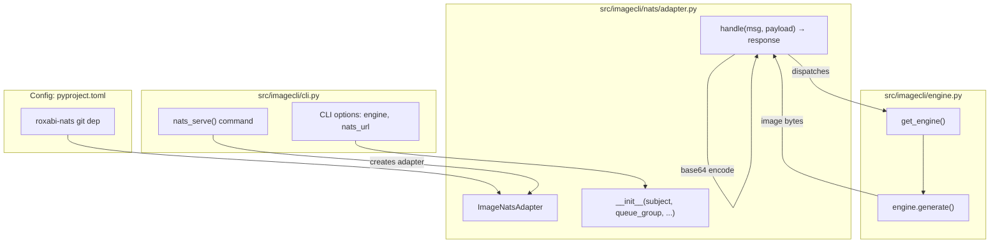
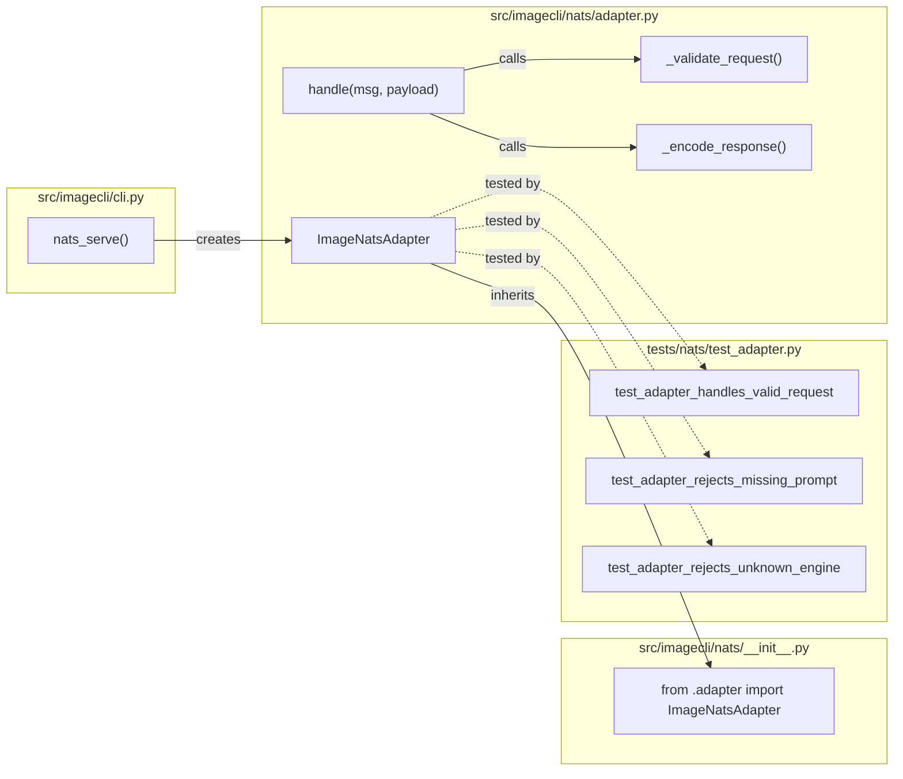

## Summary

Add NATS ingress to imageCLI via `roxabi-nats` SDK, enabling Lyra agents to request image generation asynchronously. Follows voiceCLI `nats-serve` pattern: `ImageNatsAdapter` subclassing `NatsAdapterBase`, CLI entry point, unit tests, and ADR.

## Architecture

### Data Flow



### File × Function Map



## Bootstrap Context

No analysis artifact exists. Reference pattern: voiceCLI `SttNatsAdapter` (Roxabi/voiceCLI#42). Key patterns:
- Lazy import shim for tests (try/except ImportError)
- MockMsg class with `reply` attribute for unit tests
- Payload builders with sensible defaults
- Semaphore-based concurrency control

## Agents

| Agent | Task count | Files |
|-------|-----------|-------|
| backend-dev | 6 | src/imagecli/nats/*.py, src/imagecli/cli.py, pyproject.toml |
| doc-writer | 1 | docs/architecture/adr/046-imagecli-nats-ingress.mdx |
| tester | 3 | tests/nats/*.py |

## Consistency Report

- Criteria covered: 15/15
- Uncovered criteria: none
- Tasks without spec backing: none
- Gold plating exemptions applied: 0

## Micro-Tasks

### Slice V1: SDK dependency + imports

#### Task 1: Add roxabi-nats dependency → backend-dev
- **File:** pyproject.toml
- **Snippet:**
```toml
[tool.uv.sources]
roxabi-nats = { git = "https://github.com/Roxabi/lyra.git", subdirectory = "packages/roxabi-nats", tag = "roxabi-nats/v0.1.0" }

[project.dependencies]
roxabi-nats = { version = ">=0.1.0" }
```
- **Verify:** `uv sync && uv run python -c "from roxabi_nats import NatsAdapterBase, nats_connect, CONTRACT_VERSION"` (ready)
- **Expected:** No import error
- **Time:** 2 min | **Difficulty:** 1
- **Traces:** SC-1 | **Phase:** GREEN

---

### Slice V2: ADR documentation

#### Task 2: Create ADR → doc-writer
- **File:** docs/architecture/adr/046-imagecli-nats-ingress.mdx
- **Snippet:**
```mdx
---
title: ADR-046: imageCLI NATS Ingress
---

## Context
...

## Decision
- Subject tree: `lyra.image.generate.request`, `lyra.image.generate.response`, `lyra.image.heartbeat`
- Payload contract: ...
- Error codes: ...
```
- **Verify:** `test -f docs/architecture/adr/046-imagecli-nats-ingress.mdx && grep -q "lyra.image.generate.request" docs/architecture/adr/046-imagecli-nats-ingress.mdx` (ready)
- **Expected:** File exists with subject tree
- **Time:** 5 min | **Difficulty:** 2
- **Traces:** SC-15 | **Phase:** GREEN

---

### Slice V3: Adapter skeleton

#### Task 3: Create nats package init → backend-dev
- **File:** src/imagecli/nats/__init__.py
- **Snippet:**
```python
"""imageCLI NATS subscriber for Lyra-driven image generation."""

from .adapter import ImageNatsAdapter

__all__ = ["ImageNatsAdapter"]
```
- **Verify:** `uv run python -c "from imagecli.nats import ImageNatsAdapter"` (ready)
- **Expected:** No import error
- **Time:** 1 min | **Difficulty:** 1
- **Traces:** SC-4 | **Phase:** GREEN

#### Task 4: Create ImageNatsAdapter skeleton → backend-dev
- **File:** src/imagecli/nats/adapter.py
- **Snippet:**
```python
"""NATS adapter for image generation requests."""

from __future__ import annotations

import logging
from typing import Any

from roxabi_nats import CONTRACT_VERSION, NatsAdapterBase

logger = logging.getLogger(__name__)


class ImageNatsAdapter(NatsAdapterBase):
    """NATS adapter for image generation requests from Lyra agents."""

    def __init__(self, default_engine: str = "flux2-klein", **kwargs) -> None:
        super().__init__(
            subject="lyra.image.generate.request",
            queue_group="IMAGE_WORKERS",
            envelope_name="image",
            schema_version="1",
            **kwargs,
        )
        self.default_engine = default_engine

    async def handle(self, msg, payload: dict) -> None:
        """Process validated image generation request."""
        # TODO: implement
        response = {"contract_version": CONTRACT_VERSION, "request_id": payload.get("request_id"), "ok": False, "error": "not_implemented"}
        await self.reply(msg, self._encode(response))

    def _encode(self, data: dict) -> bytes:
        import json
        return json.dumps(data).encode()
```
- **Verify:** `uv run python -c "from imagecli.nats import ImageNatsAdapter; a = ImageNatsAdapter(); print(a.subject)"` (ready)
- **Expected:** `lyra.image.generate.request`
- **Time:** 5 min | **Difficulty:** 3
- **Traces:** SC-4, SC-5, N1 | **Phase:** GREEN

---

### Slice V4: CLI entry point

#### Task 5: Add nats-serve command to CLI → backend-dev
- **File:** src/imagecli/cli.py
- **Snippet:**
```python
# Add nats_app as a sub-app
nats_app = typer.Typer(help="NATS subscriber for Lyra-driven image generation.")
app.add_typer(nats_app, name="nats-serve")

@nats_app.command("image")
def nats_serve(
    engine: str = typer.Option("flux2-klein", "--engine", "-e", help="Default engine for requests."),
    nats_url: str = typer.Option(..., envvar="NATS_URL", help="NATS server URL."),
) -> None:
    """Start NATS subscriber for image generation requests."""
    import asyncio
    from imagecli.nats import ImageNatsAdapter

    adapter = ImageNatsAdapter(default_engine=engine)
    try:
        asyncio.run(adapter.run(nats_url=nats_url))
    except KeyboardInterrupt:
        pass
```
- **Verify:** `uv run imagecli nats-serve --help` (ready)
- **Expected:** Help text shows nats-serve command
- **Time:** 5 min | **Difficulty:** 3
- **Traces:** SC-2, U1 | **Phase:** GREEN

---

### Slice V5: Request handling (unit)

#### Task 6: Implement payload validation → backend-dev
- **File:** src/imagecli/nats/adapter.py
- **Snippet:**
```python
def _validate_request(self, payload: dict) -> tuple[bool, str | None]:
    """Validate required fields. Returns (valid, error_message)."""
    if not payload.get("prompt"):
        return False, "missing_required_field: prompt"
    if not payload.get("engine"):
        return False, "missing_required_field: engine"
    return True, None
```
- **Verify:** `grep -q "_validate_request" src/imagecli/nats/adapter.py` (ready)
- **Expected:** Function exists
- **Time:** 3 min | **Difficulty:** 2
- **Traces:** SC-8, SC-9 | **Phase:** GREEN

#### Task 7: Implement engine dispatch → backend-dev
- **File:** src/imagecli/nats/adapter.py
- **Snippet:**
```python
async def handle(self, msg, payload: dict) -> None:
    """Process validated image generation request."""
    import time
    from imagecli.engine import get_engine, preflight_check

    request_id = payload.get("request_id")
    contract_version = CONTRACT_VERSION

    # Validate required fields
    valid, error = self._validate_request(payload)
    if not valid:
        response = {"contract_version": contract_version, "request_id": request_id, "ok": False, "error": error}
        await self.reply(msg, self._encode(response))
        return

    engine_name = payload.get("engine")
    # ... rest of implementation
```
- **Verify:** `grep -q "preflight_check" src/imagecli/nats/adapter.py` (ready)
- **Expected:** preflight_check called
- **Time:** 10 min | **Difficulty:** 4
- **Traces:** SC-3, SC-11, N1→Engine | **Phase:** GREEN

#### Task 8: Write unit tests → tester
- **File:** tests/nats/test_adapter.py
- **Snippet:**
```python
"""Unit tests for ImageNatsAdapter."""

import pytest

try:
    from imagecli.nats.adapter import ImageNatsAdapter
    _IMPORT_ERROR = None
except ImportError as e:
    _IMPORT_ERROR = e
    ImageNatsAdapter = None  # type: ignore


class MockMsg:
    def __init__(self, reply_subject: str = "reply.subject"):
        self.reply = reply_subject
        self._data = b""

    async def respond(self, data: bytes) -> None:
        self._data = data


@pytest.mark.skipif(_IMPORT_ERROR, reason=str(_IMPORT_ERROR))
def test_adapter_rejects_missing_prompt():
    """Missing prompt field returns error."""
    # ... test implementation
```
- **Verify:** `uv run pytest tests/nats/test_adapter.py -v` (ready)
- **Expected:** Tests pass
- **Time:** 8 min | **Difficulty:** 3
- **Traces:** SC-8, SC-9, SC-10 | **Phase:** RED

#### RED-GATE: RED complete V5 → tester
- **Verify:** All test tasks for V5 marked complete
- **Phase:** RED-GATE

---

### Slice V6: Integration test

#### Task 9: Write integration test → tester
- **File:** tests/nats/test_integration.py
- **Snippet:**
```python
"""Integration tests for NATS adapter with mock server."""

import asyncio
import pytest

try:
    from imagecli.nats import ImageNatsAdapter
    _IMPORT_ERROR = None
except ImportError as e:
    _IMPORT_ERROR = e


@pytest.mark.skipif(_IMPORT_ERROR, reason=str(_IMPORT_ERROR))
@pytest.mark.asyncio
async def test_adapter_handles_request_end_to_end():
    """Full request/response cycle with mock NATS."""
    # ... test implementation
```
- **Verify:** `uv run pytest tests/nats/ -v` (ready)
- **Expected:** All tests pass
- **Time:** 10 min | **Difficulty:** 4
- **Traces:** SC-14 | **Phase:** GREEN

#### Task 10: Create test package init → tester
- **File:** tests/nats/__init__.py
- **Snippet:** `"""NATS adapter tests."""`
- **Verify:** `test -f tests/nats/__init__.py` (ready)
- **Expected:** File exists
- **Time:** 1 min | **Difficulty:** 1
- **Traces:** — | **Phase:** GREEN

## Task IDs

<!-- Generated by /plan. Used by /implement to resume tasks on session restart. -->
- T1: 9 — Add roxabi-nats dependency to pyproject.toml
- T2: 10 — Create ADR for NATS ingress
- T3: 11 — Create nats package __init__.py
- T4: 12 — Create ImageNatsAdapter skeleton
- T5: 13 — Add nats-serve CLI command
- T6: 14 — Implement payload validation
- T7: 15 — Implement engine dispatch in handle()
- T8: 16 — Write unit tests for adapter
- T9: 17 — Write integration test
- T10: 18 — Create tests/nats/__init__.py
