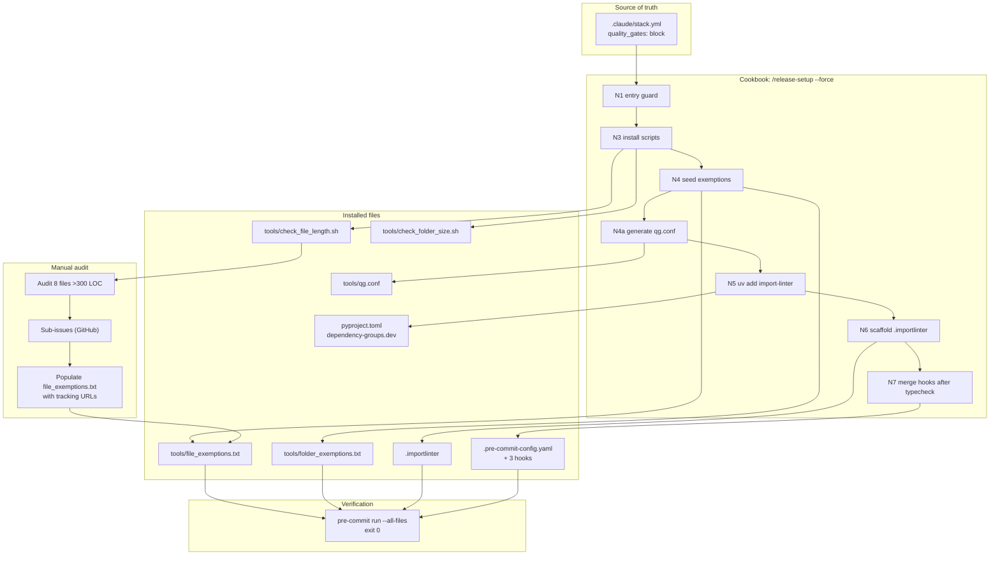
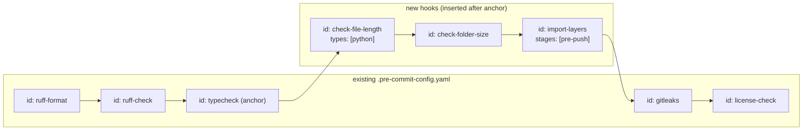
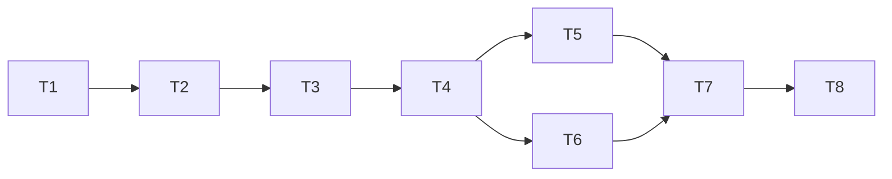

## Summary

Install the dev-core `quality_gates` machinery in `imageCLI` by adding the
`quality_gates:` block to `.claude/stack.yml` and running `/release-setup
--force`. The cookbook installs canonical scripts, scaffolds `.importlinter`,
wires three pre-commit hooks, and adds the `import-linter` dep. Then audit the
8 files over 300 LOC, file sub-issues for deferred splits, populate
`tools/file_exemptions.txt` with tracking URLs, and verify `pre-commit run
--all-files` is green.

## Architecture

### Data Flow



### Hook Insertion Map



## Bootstrap Context

- **Canonical scripts:** `${CLAUDE_PLUGIN_ROOT}/tools/check_file_length.sh`, `check_folder_size.sh` (dev-core plugin)
- **Cookbook:** `${CLAUDE_PLUGIN_ROOT}/skills/release-setup/cookbooks/quality-gates.md`
- **Package name for `.importlinter`:** `imagecli` (from `pyproject.toml [project].name`)
- **Pre-commit anchor:** `id: typecheck` exists at `.pre-commit-config.yaml` line 9
- **Oversized files (8 total, 300+ LOC):**

  | File | LOC |
  |---|---|
  | `src/imagecli/cli.py` | 807 |
  | `src/imagecli/engines/pulid_flux1_dev.py` | 569 |
  | `src/imagecli/engines/pulid_flux2_klein.py` | 502 |
  | `src/imagecli/engine.py` | 501 |
  | `src/imagecli/engines/flux2_klein_fp4.py` | 476 |
  | `src/imagecli/daemon.py` | 444 |
  | `src/imagecli/pivotal.py` | 396 |
  | `src/imagecli/nats/adapter.py` | 344 |

## Agents

| Agent | Task count | Files / responsibility |
|---|---|---|
| devops | 5 | `stack.yml`, cookbook invocation, `file_exemptions.txt`, pre-commit verification |
| product-lead | 3 | audit decisions, sub-issue filing |

## Consistency Report

- **Success criteria covered:** 12/12
- **Uncovered criteria:** none
- **Untraced micro-tasks:** none
- **Exemptions:** none

## Slices

| Slice | Spec section | Phase | Tasks |
|---|---|---|---|
| V1 | S1 — Install machinery | GREEN | T1, T2, T3 |
| V2 | S2 — Audit + sub-issues | REFACTOR | T4, T5, T6 |
| V3 | S3 — Seed exemptions + verify | GREEN + RED-GATE | T7, T8 |

## Micro-Tasks

### V1 — Install machinery (S1)

**T1. Add `quality_gates:` block to `.claude/stack.yml`** [not parallel] [devops] [SC: stack.yml block present]

- **File:** `.claude/stack.yml`
- **Snippet** (append after `standards:` block):
  ```yaml
  quality_gates:
    file_length:
      enabled: true
      max_lines: 300
      exemptions_file: tools/file_exemptions.txt
    folder_size:
      enabled: true
      max_files: 12
      exemptions_file: tools/folder_exemptions.txt
    import_layers:
      enabled: true
      stage: pre-push
  ```
- **Verify:** `uv run python -c "import yaml; d=yaml.safe_load(open('.claude/stack.yml')); assert d['quality_gates']['file_length']['enabled'] and d['quality_gates']['folder_size']['enabled'] and d['quality_gates']['import_layers']['enabled']; print('OK')"`
- **Expected:** `OK`
- **Time:** 3 min · **Difficulty:** 1 · **Phase:** GREEN

**T2. Invoke `/release-setup --force` cookbook** [blocked by T1] [devops] [SC: scripts, .importlinter, import-linter dep, 3 hooks]

- **Files created/modified:** `tools/check_file_length.sh`, `tools/check_folder_size.sh`, `tools/file_exemptions.txt`, `tools/folder_exemptions.txt`, `tools/qg.conf`, `.importlinter`, `pyproject.toml`, `uv.lock`, `.pre-commit-config.yaml`
- **Invocation:** `/release-setup --force` (cookbook runs N1–N8 per quality-gates.md)
- **Verify:** `test -x tools/check_file_length.sh && test -x tools/check_folder_size.sh && test -f .importlinter && grep -q '^\[importlinter\]' .importlinter && grep -q 'root_packages' .importlinter && test -f tools/qg.conf`
- **Expected:** exit 0
- **Time:** 5 min · **Difficulty:** 1 · **Phase:** GREEN

**T3. Verify S1 criteria — diff-clean scripts, hook ordering, dep present** [blocked by T2] [devops] [SC: hooks after typecheck, import-layers pre-push, import-linter dep]

- **Files read:** `.pre-commit-config.yaml`, `pyproject.toml`, `tools/check_*.sh`
- **Verify:**
  ```bash
  # (a) Scripts diff-clean against canonical
  diff -q "${CLAUDE_PLUGIN_ROOT}/tools/check_file_length.sh" tools/check_file_length.sh
  diff -q "${CLAUDE_PLUGIN_ROOT}/tools/check_folder_size.sh" tools/check_folder_size.sh
  # (b) 3 hooks present, ordered after typecheck
  uv run python -c "
  import yaml
  with open('.pre-commit-config.yaml') as f: d = yaml.safe_load(f)
  ids = [h['id'] for r in d['repos'] if r['repo']=='local' for h in r['hooks']]
  tc = ids.index('typecheck')
  for h in ('check-file-length','check-folder-size','import-layers'):
      assert ids.index(h) > tc, f'{h} not after typecheck'
  # import-layers pre-push
  for r in d['repos']:
      if r['repo']!='local': continue
      for h in r['hooks']:
          if h['id']=='import-layers': assert h.get('stages')==['pre-push']
  print('OK')
  "
  # (c) import-linter dep pinned
  uv run python -c "
  import tomllib
  with open('pyproject.toml','rb') as f: d = tomllib.load(f)
  deps = d.get('dependency-groups',{}).get('dev',[])
  assert any(isinstance(x,str) and x.startswith('import-linter') for x in deps), deps
  print('OK')
  "
  ```
- **Expected:** three `OK` lines, no diff output
- **Time:** 4 min · **Difficulty:** 2 · **Phase:** GREEN

**RED-GATE V1:** T1, T2, T3 all green → S1 machinery installed.

### V2 — Audit + sub-issues (S2)

**T4. Audit 8 oversized files — per-file split-vs-defer decision** [P] [blocked by T3] [product-lead] [SC: audit table produced]

- **Files read:** all 8 from Bootstrap Context table
- **Output:** one decision per file, documented inline in PR description or audit note. Judge by:
  - Cohesion (can it cleanly split by domain/concern?)
  - Risk of regression (engine files have subtle perf/VRAM invariants)
  - Time budget (keep within this PR's scope)
- **Default policy:** defer splits unless the file has an obvious single-concern extraction. `cli.py` is always deferred (tracked separately per issue step 3).
- **Verify:** audit note present listing each file + decision (split-in-PR | defer)
- **Expected:** 8 decisions documented
- **Time:** 10 min · **Difficulty:** 3 · **Phase:** REFACTOR

**T5. File sub-issue for `cli.py` split (required)** [blocked by T4] [product-lead] [SC: cli.py sub-issue exists, linked to #53]

- **Command:**
  ```bash
  bun ${CLAUDE_PLUGIN_ROOT}/skills/issue-triage/triage.ts create \
    --title "refactor(cli): split src/imagecli/cli.py (807 LOC) by command group" \
    --body "..." \
    --parent 53 --size M --priority Medium
  ```
- **Body template:**
  ```markdown
  ## Scope
  `src/imagecli/cli.py` is 807 LOC — over the 300 LOC quality_gates threshold.
  Split Typer commands by domain group (generate/batch/engines/info + daemon).

  **Parent:** #53 · **Spec:** artifacts/specs/53-quality-gates-spec.mdx

  ## Acceptance Criteria
  - [ ] `cli.py` under 300 LOC
  - [ ] All current CLI commands still work (help text, argument parsing unchanged)
  - [ ] Exemption line removed from `tools/file_exemptions.txt`
  ```
- **Verify:** `gh issue view <sub_N> --json number,title,body` — parent link visible
- **Expected:** sub-issue created, returned `#N`
- **Time:** 5 min · **Difficulty:** 2 · **Phase:** REFACTOR

**T6. File sub-issues for each deferred oversized file** [P] [blocked by T4] [product-lead] [SC: sub-issue per deferred file]

- **Same `triage.ts create` pattern as T5**, one per deferred file
- **Body:** scope = "split by concern", parent = #53, size = S or M based on LOC
- **Scope:** all files in the 8-file audit table whose T4 decision = "defer"
- **Verify:** `gh api graphql ... subIssues` returns N sub-issues linked to #53
- **Expected:** one sub-issue per deferred file
- **Time:** 3 min × N · **Difficulty:** 2 · **Phase:** REFACTOR

**RED-GATE V2:** all deferred files have tracking sub-issues → ready to populate exemptions.

### V3 — Seed exemptions + verify (S3)

**T7. Populate `tools/file_exemptions.txt` with one line per unsplit file** [blocked by T5, T6] [devops] [SC: exemption lines with URLs]

- **File:** `tools/file_exemptions.txt`
- **Format:** `<path> <issue-url>` (single-space separator) — one line per deferred file
- **Example:**
  ```
  src/imagecli/cli.py https://github.com/Roxabi/imageCLI/issues/54
  src/imagecli/engines/pulid_flux1_dev.py https://github.com/Roxabi/imageCLI/issues/55
  ...
  ```
- **Verify:** `while read path url; do [ -z "$path" ] || [[ "$path" =~ ^# ]] && continue; [ -f "$path" ] || { echo "missing: $path"; exit 1; }; [[ "$url" =~ ^https://github.com/ ]] || { echo "bad url: $url"; exit 1; }; done < tools/file_exemptions.txt && echo OK`
- **Expected:** `OK`
- **Time:** 5 min · **Difficulty:** 1 · **Phase:** GREEN

**T8. Run `pre-commit run --all-files` — confirm exit 0** [blocked by T7] [devops] [SC: pre-commit green]

- **Command:** `pre-commit run --all-files`
- **Verify:** exit code 0
- **If failure:** investigate — either a legitimate violation (new file over 300 LOC not in exemptions) or a config error (re-run cookbook with `--force`)
- **Expected:** all hooks pass; `check-file-length`, `check-folder-size`, `import-layers` each report green (no contracts in `.importlinter` ⇒ `lint-imports` passes trivially)
- **Time:** 3 min · **Difficulty:** 1 · **Phase:** GREEN

**RED-GATE V3:** `pre-commit run --all-files` exit 0 → feature complete.

## Dependencies



## Risks + Mitigations

| Risk | Mitigation |
|---|---|
| Cookbook strips comments from `.pre-commit-config.yaml` (PyYAML) | Re-inspect diff after T2; restore inline comments if any were present |
| `uv add` fails (no network, uv missing) | Cookbook warns via D⚠; install manually with `uv add --group dev 'import-linter>=2.0,<3.0'` |
| `.importlinter` already exists | Cookbook preserves (D1) — no action needed |
| Sub-issue filing fails mid-T6 | Retry per-file; T7 is blocked until all URLs exist |
| T8 fails on unexpected files | Check for new >300 LOC files not in audit; add to exemptions with tracking sub-issue |

## Task IDs

<!-- Generated by /plan. Used by /implement to resume tasks on session restart. -->
- T1: 12 — Add quality_gates block to .claude/stack.yml
- T2: 13 — Invoke /release-setup --force cookbook
- T3: 14 — Verify S1 (scripts diff-clean, hook ordering, dep present)
- T4: 15 — Audit 8 oversized files
- T5: 16 — File sub-issue for cli.py split
- T6: 17 — File sub-issues for deferred oversized files
- T7: 18 — Populate tools/file_exemptions.txt with tracking URLs
- T8: 19 — Run `pre-commit run --all-files` — confirm exit 0
