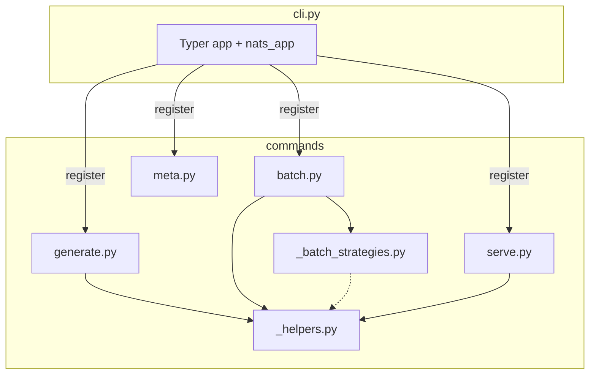
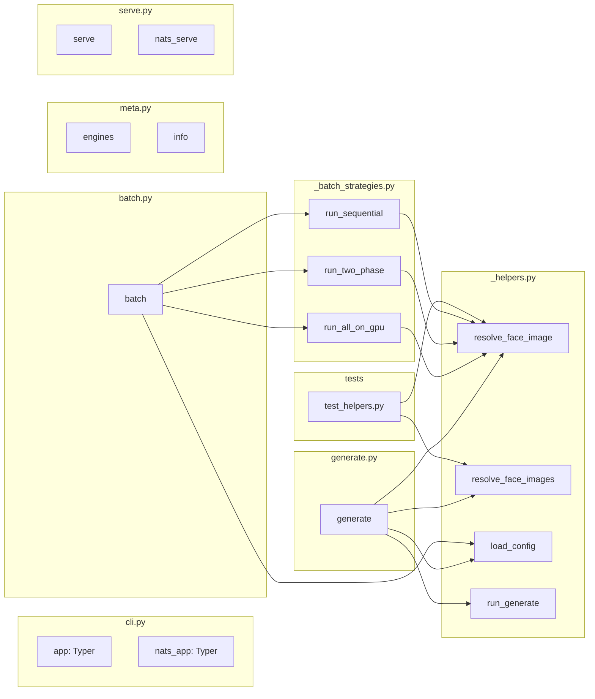

## Summary

Move CLI command bodies and the three batch strategies out of the 807-LOC `src/imagecli/cli.py` into a new `src/imagecli/commands/` subpackage, leaving `cli.py` as a thin Typer wiring file under 300 LOC. Drop the exemption, add unit tests for the extracted path-resolution helpers.

## Layout adjustment vs. spec

Spec placed helpers and batch strategies at `src/imagecli/` top level. Plan moves them **inside `commands/`** because `src/imagecli/` already holds ~10 files + 2 dirs and the `folder_size` gate caps at 12 files. Final tree:

```
src/imagecli/
  cli.py                         — thin Typer app (< 300 LOC)
  commands/
    __init__.py
    _helpers.py                  — _resolve_face_image(s), _load_config, _run_generate
    _batch_strategies.py         — run_all_on_gpu, run_two_phase, run_sequential
    generate.py                  — generate command
    batch.py                     — batch command
    meta.py                      — engines + info commands
    serve.py                     — serve + nats_serve commands
```

SC-9 grep check target updates from `src/imagecli/batch_strategies.py` → `src/imagecli/commands/_batch_strategies.py`. SC-10 still holds (commands/ has 7 files ≤ 12).

## Architecture





## Agents

| Agent | Tasks | Files |
|-------|-------|-------|
| backend-dev | 9 | src/imagecli/cli.py, src/imagecli/commands/*.py |
| tester | 1 | tests/test_commands_helpers.py |
| devops | 1 | tools/file_exemptions.txt, ruff/pytest gates |

## Consistency Report

- Success criteria covered: 11/11
- Slices covered: 5/5 (V1–V5)
- Uncovered SC: none
- Untraced tasks: none
- Exemption path update: SC-9 target `_batch_strategies.py` lives inside `commands/`

## Micro-Tasks

### V1 — Extract helpers + batch strategies

**T1** — Create `src/imagecli/commands/__init__.py` and `src/imagecli/commands/_helpers.py`; move `_resolve_face_image`, `_resolve_face_images`, `_load_config`, `_run_generate` from `cli.py`; rename to public names (`resolve_face_image`, `resolve_face_images`, `load_config`, `run_generate`) — leading underscores were module-local only.
- Files: `src/imagecli/commands/__init__.py`, `src/imagecli/commands/_helpers.py`
- Verify: `uv run python -c "from imagecli.commands._helpers import resolve_face_image, resolve_face_images, load_config, run_generate"`
- Expected: no import errors
- Agent: backend-dev · Slice: V1 · Phase: GREEN · Difficulty: 2 · Spec: U1–U6, N1

**T2** — Create `src/imagecli/commands/_batch_strategies.py`; move `_batch_all_on_gpu`, `_batch_two_phase`, `_batch_sequential` from `cli.py`; rename to `run_all_on_gpu`, `run_two_phase`, `run_sequential`. Import `resolve_face_image` from `_helpers` (not `cli`).
- Files: `src/imagecli/commands/_batch_strategies.py`
- Verify: `uv run python -c "from imagecli.commands._batch_strategies import run_all_on_gpu, run_two_phase, run_sequential"`
- Expected: no import errors
- Agent: backend-dev · Slice: V1 · Phase: GREEN · Difficulty: 2 · Spec: N2

**T3** — Update `src/imagecli/cli.py` to import helpers and batch strategies from the new modules (temporary back-compat while remaining commands still live in `cli.py`). Run smoke `--help` + a minimal generate to confirm no regression.
- Files: `src/imagecli/cli.py`
- Verify: `uv run imagecli --help && uv run imagecli engines`
- Expected: help output unchanged, engines list prints
- Agent: backend-dev · Slice: V1 · Phase: GREEN · Difficulty: 2 · Depends: T1, T2

### V2 — Move generate + meta

**T4** — Create `src/imagecli/commands/generate.py`; move `generate` command body (lines ~168–307 of current `cli.py`). Import helpers from `_helpers`. Export `generate` as module-level function decorated with `@app.command()` inside a register-function that takes the Typer app (pattern: `def register(app: typer.Typer) -> None: app.command()(generate)`). Rationale: `cli.py` must own the single `app` instance.
- Files: `src/imagecli/commands/generate.py`
- Verify: `uv run imagecli generate --help` matches pre-split output
- Expected: diff-clean help text
- Agent: backend-dev · Slice: V2 · Phase: GREEN · Difficulty: 3 · Depends: T3 · Spec: U1

**T5** — Create `src/imagecli/commands/meta.py`; move `engines` and `info` commands with same `register(app)` pattern.
- Files: `src/imagecli/commands/meta.py`
- Verify: `uv run imagecli engines && uv run imagecli info`
- Expected: output identical to pre-split
- Agent: backend-dev · Slice: V2 · Phase: GREEN · Difficulty: 2 · Depends: T3 · Spec: U3, U4

**T6** — Update `cli.py` to call `commands.generate.register(app)` and `commands.meta.register(app)`; delete the now-duplicate command defs from `cli.py`.
- Files: `src/imagecli/cli.py`
- Verify: `uv run imagecli --help`, `uv run imagecli generate --help`, `uv run imagecli engines`, `uv run imagecli info`
- Expected: all help/output diff-clean vs pre-split
- Agent: backend-dev · Slice: V2 · Phase: GREEN · Difficulty: 2 · Depends: T4, T5

### V3 — Move batch

**T7** — Create `src/imagecli/commands/batch.py`; move `batch` command (lines ~308–422); uses `run_all_on_gpu` / `run_two_phase` / `run_sequential` from `_batch_strategies`. Register via `register(app)` pattern.
- Files: `src/imagecli/commands/batch.py`
- Verify: `uv run imagecli batch --help`
- Expected: diff-clean help text
- Agent: backend-dev · Slice: V3 · Phase: GREEN · Difficulty: 3 · Depends: T6 · Spec: U2

**T8** — Delete `batch` command + the three batch helper defs from `cli.py`; wire `commands.batch.register(app)`.
- Files: `src/imagecli/cli.py`
- Verify: `uv run imagecli batch --help`; create a 2-prompt temp dir and run `uv run imagecli batch <dir>` with `flux2-klein` at low steps (1) and `--width 256 --height 256`
- Expected: 2 images produced, exit 0
- Agent: backend-dev · Slice: V3 · Phase: GREEN · Difficulty: 2 · Depends: T7

### V4 — Move serve

**T9** — Create `src/imagecli/commands/serve.py`; move `serve` and `nats_serve` + the `nats_app` sub-typer creation. Expose `register(app)` that (a) adds the `serve` command, (b) adds `nats_serve` to a local `nats_app`, (c) calls `app.add_typer(nats_app, name="nats")`. Delete from `cli.py`.
- Files: `src/imagecli/commands/serve.py`, `src/imagecli/cli.py`
- Verify: `uv run imagecli serve --help && uv run imagecli nats image --help`
- Expected: diff-clean help text
- Agent: backend-dev · Slice: V4 · Phase: GREEN · Difficulty: 3 · Depends: T6 · Spec: U5, U6

### V5 — Finalize + test

**T10** — Write `tests/test_commands_helpers.py` covering `resolve_face_image` and `resolve_face_images`: absolute path, path relative to prompt dir, `None` passthrough, list with mixed Nones/strings. [P]
- Files: `tests/test_commands_helpers.py`
- Verify: `uv run pytest tests/test_commands_helpers.py -v`
- Expected: all tests pass
- Agent: tester · Slice: V5 · Phase: GREEN · Difficulty: 2 · Depends: T1

**T11** — Remove `src/imagecli/cli.py` line from `tools/file_exemptions.txt`.
- Files: `tools/file_exemptions.txt`
- Verify: `grep -c "src/imagecli/cli.py" tools/file_exemptions.txt`
- Expected: `0`
- Agent: devops · Slice: V5 · Phase: REFACTOR · Difficulty: 1 · Depends: T8, T9

**T12** — RED-GATE: confirm `wc -l src/imagecli/cli.py < 300`, `uv run ruff format . && uv run ruff check .`, `uv run pytest`, `bash tools/check_file_length.sh` (or equivalent quality-gate hook). Grep that `torch` and `diffusers` do not appear at column 1 as `import`/`from` lines in any `src/imagecli/commands/*.py`.
- Files: —
- Verify:
  ```
  test $(wc -l < src/imagecli/cli.py) -lt 300 && \
  uv run ruff check . && \
  uv run pytest && \
  ! grep -En "^(import|from) (torch|diffusers)" src/imagecli/commands/*.py
  ```
- Expected: all conditions true, grep exits 1 (no matches)
- Agent: devops · Slice: V5 · Phase: RED-GATE · Difficulty: 2 · Depends: T10, T11

## Task IDs

<!-- Generated by /plan. Used by /implement to resume tasks on session restart. -->
- T1: 12 — extract helpers to commands/_helpers.py
- T2: 13 — extract batch strategies to commands/_batch_strategies.py
- T3: 14 — wire new modules back into cli.py; smoke test
- T4: 15 — create commands/generate.py with register(app) pattern
- T5: 16 — create commands/meta.py (engines + info)
- T6: 17 — wire generate + meta into cli.py, delete originals
- T7: 18 — create commands/batch.py
- T8: 19 — wire batch into cli.py, delete originals; smoke 2-prompt batch
- T9: 20 — create commands/serve.py (serve + nats_serve)
- T10: 21 — tests/test_commands_helpers.py for resolve_face_image(s)
- T11: 22 — remove cli.py exemption from tools/file_exemptions.txt
- T12: 23 — RED-GATE: LOC, ruff, pytest, no-top-level-torch grep
