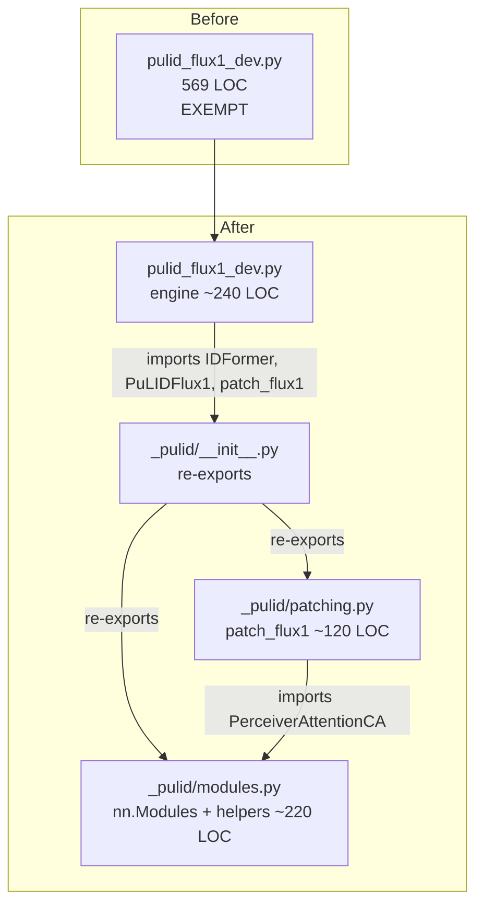
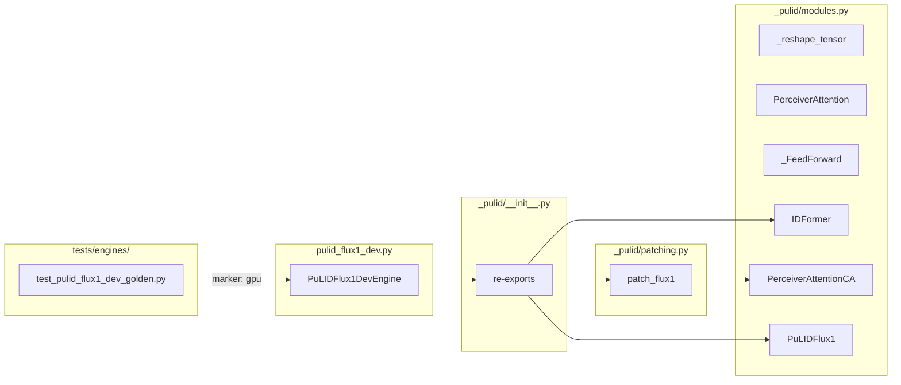

## Summary

Mechanical split of `src/imagecli/engines/pulid_flux1_dev.py` (569 LOC)
into an `_pulid/` sub-package (`modules.py`, `patching.py`,
`__init__.py`) while the engine file keeps `PuLIDFlux1DevEngine` only.
Remove the file-length gate exemption. Add a golden-image + VRAM
regression test (GPU-marked) to guard against forward-method-capture
regressions during the refactor.

## Architecture





## Agents Table

| Agent | Tasks | Files |
|---|---|---|
| backend-dev | T1–T6 | `src/imagecli/engines/_pulid/*`, `src/imagecli/engines/pulid_flux1_dev.py`, `tools/file_exemptions.txt` |
| tester | T7, GATE | `tests/engines/test_pulid_flux1_dev_golden.py`, golden fixture |

τ=F-lite → single domain, single session — agents listed for structure
but run in one pass.

## Consistency Report

- Success criteria in spec: 13
- Covered by tasks: 13 / 13
- Uncovered: 0
- Untraced tasks: 0
- Exemptions removed: 1 (`src/imagecli/engines/pulid_flux1_dev.py`)

## Micro-Tasks

Two slices. **V1** is the mechanical split (Slice 1 in spec). **V2** is
the regression test (Slice 2 in spec, GPU-marked). Tasks are mostly
sequential — file moves are order-dependent, and the golden fixture
must be captured from the pre-refactor engine.

### T0 — Capture golden-image baseline (pre-refactor)

- **File:** `tests/engines/golden/pulid_flux1_dev_baseline.png` (new),
  `tests/engines/golden/pulid_flux1_dev_baseline.json` (VRAM + hash)
- **Action:** Run a fixed-seed generate on current `HEAD` (before any
  code move) with a deterministic face_image + prompt, capture the
  output PNG + peak VRAM. Commit as fixture.
- **Face image source:** use a small Wikimedia-licensed test portrait
  checked into `tests/engines/golden/face_ref.png` (≤ 512×512).
- **Verify:**
  ```
  uv run imagecli generate tests/engines/golden/baseline_prompt.md \
    -e pulid-flux1-dev -o tests/engines/golden/pulid_flux1_dev_baseline.png \
    --seed 42
  sha256sum tests/engines/golden/pulid_flux1_dev_baseline.png
  ```
- **Expected:** PNG written; SHA256 captured and stored in the JSON
  sidecar along with peak `torch.cuda.max_memory_allocated()`.
- **Est:** 8 min · **Difficulty:** 2 · **Spec trace:** SC-11, SC-12
- **Agent:** tester · **Phase:** RED · **Deps:** —
- **Note:** this task runs against the ORIGINAL file; it fixes the
  baseline before T1-T5 mutate the code.

### T1 — Create `_pulid/modules.py`

- **File:** `src/imagecli/engines/_pulid/modules.py` (new)
- **Moves from `pulid_flux1_dev.py`:**
  - `_reshape_tensor` (L54)
  - `PerceiverAttention` (L61, drop leading `_` on class name —
    package-private via `_pulid/`)
  - `_FeedForward` (L92)
  - `IDFormer` (L102, drop `_`)
  - `PerceiverAttentionCA` (L190, drop `_`)
  - `PuLIDFlux1` (L248, drop `_`)
- **Keep private helpers as `_`-prefixed** (`_reshape_tensor`,
  `_FeedForward`). Expose the classes (`IDFormer`, etc.) via the
  package's `__init__.py`.
- **Imports:** `torch`, `torch.nn as nn`, `torch.nn.functional as F`.
  No imagecli-internal imports.
- **Verify:**
  ```
  uv run python -c "from imagecli.engines._pulid.modules import IDFormer, PuLIDFlux1, PerceiverAttentionCA, PerceiverAttention"
  wc -l src/imagecli/engines/_pulid/modules.py
  ```
- **Expected:** first no output; second < 300.
- **Est:** 6 min · **Difficulty:** 2 · **Spec trace:** SC-3
- **Agent:** backend-dev · **Phase:** GREEN · **Deps:** T0

### T2 — Create `_pulid/patching.py`

- **File:** `src/imagecli/engines/_pulid/patching.py` (new)
- **Moves from `pulid_flux1_dev.py`:** `_patch_flux1` (L274, rename to
  `patch_flux1` — public within package). Preserve every line of the
  original body verbatim including the schedule constants referenced
  inside; no refactor of the patching logic itself.
- **Imports:** `torch`, `from .modules import PerceiverAttentionCA`.
  Also any schedule constants (`_DOUBLE_INTERVAL`, `_SINGLE_INTERVAL`,
  `_N_DOUBLE`, `_N_SINGLE`, `_NUM_CA`) — keep them inlined at the top
  of this module since `patch_flux1` is their only consumer.
- **Verify:**
  ```
  uv run python -c "from imagecli.engines._pulid.patching import patch_flux1; import inspect; print(inspect.signature(patch_flux1))"
  wc -l src/imagecli/engines/_pulid/patching.py
  ```
- **Expected:** prints the same signature as the original `_patch_flux1`; second < 300.
- **Est:** 5 min · **Difficulty:** 2 · **Spec trace:** SC-4
- **Agent:** backend-dev · **Phase:** GREEN · **Deps:** T1

### T3 — Create `_pulid/__init__.py`

- **File:** `src/imagecli/engines/_pulid/__init__.py` (new)
- **Content:** re-export `IDFormer`, `PuLIDFlux1`, `PerceiverAttentionCA`, `patch_flux1`. Declare `__all__`.
- **Verify:**
  ```
  uv run python -c "from imagecli.engines._pulid import IDFormer, PuLIDFlux1, PerceiverAttentionCA, patch_flux1"
  wc -l src/imagecli/engines/_pulid/__init__.py
  ```
- **Expected:** first no output; second < 50.
- **Est:** 2 min · **Difficulty:** 1 · **Spec trace:** SC-2
- **Agent:** backend-dev · **Phase:** GREEN · **Deps:** T2

### T4 — Slim `pulid_flux1_dev.py` down to the engine class

- **File:** `src/imagecli/engines/pulid_flux1_dev.py` (rewrite)
- **Keep:** module docstring, logger, `_PULID_WEIGHTS`,
  `_INSIGHTFACE_DIR`, `_EVA_INTERMEDIATE_INDICES`, and the full
  `PuLIDFlux1DevEngine` class.
- **Remove:** nn.Module classes and `_patch_flux1` (now in `_pulid/`).
- **Update imports:** `from imagecli.engines._pulid import IDFormer,
  PuLIDFlux1, patch_flux1`. Any reference to `PerceiverAttentionCA` or
  other private classes inside the engine body becomes an import from
  `_pulid`.
- **Update call sites:** `_patch_flux1(...)` → `patch_flux1(...)`,
  `_IDFormer(...)` → `IDFormer(...)`, `_PuLIDFlux1(...)` → `PuLIDFlux1(...)`.
- **Verify:**
  ```
  uv run python -c "from imagecli.engines.pulid_flux1_dev import PuLIDFlux1DevEngine"
  wc -l src/imagecli/engines/pulid_flux1_dev.py
  uv run imagecli engines | grep pulid-flux1-dev
  ```
- **Expected:** first no output; second < 300; third prints the same
  engine row as before.
- **Est:** 7 min · **Difficulty:** 3 · **Spec trace:** SC-1, SC-9, SC-10
- **Agent:** backend-dev · **Phase:** GREEN · **Deps:** T3

### T5 — Remove exemption entry

- **File:** `tools/file_exemptions.txt`
- **Change:** remove the `src/imagecli/engines/pulid_flux1_dev.py https://github.com/Roxabi/imageCLI/issues/55` line. Leave the `pulid_flux2_klein.py` line (issue #56).
- **Verify:**
  ```
  grep -c "pulid_flux1_dev.py" tools/file_exemptions.txt
  bash tools/check_file_length.sh
  ```
- **Expected:** first prints `0`; second exits 0 with no new violations.
- **Est:** 2 min · **Difficulty:** 1 · **Spec trace:** SC-5, SC-13
- **Agent:** backend-dev · **Phase:** REFACTOR · **Deps:** T4

### T6 — `_pulid/` folder size check

- **Action:** Confirm `src/imagecli/engines/_pulid/` stays under the
  folder-size gate (12 files). With 3 files it's fine; this step
  confirms `tools/check_folder_size.sh` sees the new package.
- **Verify:** `bash tools/check_folder_size.sh`
- **Expected:** exits 0.
- **Est:** 1 min · **Difficulty:** 1 · **Spec trace:** SC-13
- **Agent:** backend-dev · **Phase:** REFACTOR · **Deps:** T5

### T7 — Golden-image + VRAM regression test

- **File:** `tests/engines/test_pulid_flux1_dev_golden.py` (new)
- **Content:** `@pytest.mark.gpu` test that
  1. Resets `torch.cuda.reset_peak_memory_stats()`.
  2. Runs `PuLIDFlux1DevEngine.generate(...)` with the same prompt +
     face_image + seed 42 captured in T0.
  3. Compares output PNG SHA256 to the baseline JSON.
  4. Asserts peak VRAM within `±0.2 GB` of baseline.
- **Verify:** `uv run pytest -m gpu tests/engines/test_pulid_flux1_dev_golden.py -v`
- **Expected:** passes on a machine with GPU + weights. Skipped on CI without `gpu` marker enabled.
- **Est:** 10 min · **Difficulty:** 3 · **Spec trace:** SC-11, SC-12
- **Agent:** tester · **Phase:** GREEN · **Deps:** T6

### RED-GATE V1+V2 — Full pipeline validation

- **Verify commands (must pass on any machine):**
  ```
  uv run ruff check .
  uv run ruff format --check .
  uv run pytest -m "not gpu"
  uv run imagecli engines > /tmp/engines_after.txt
  diff <(uv run imagecli engines) /tmp/engines_before.txt
  ```
- **Expected:** all exit 0; engines stdout byte-identical.
- **GPU verify (local, pre-merge):**
  ```
  uv run pytest -m gpu tests/engines/test_pulid_flux1_dev_golden.py
  ```
- **Expected:** golden + VRAM assertions pass.
- **Spec trace:** SC-6, SC-7, SC-8, SC-9, SC-10, SC-11, SC-12, SC-13
- **Agent:** tester · **Phase:** RED-GATE · **Deps:** T7

## Task IDs

<!-- Generated by /plan. Used by /implement to resume tasks on session restart. -->
- T0: 12 — Capture golden-image baseline (pre-refactor)
- T1: 13 — Create _pulid/modules.py
- T2: 14 — Create _pulid/patching.py
- T3: 15 — Create _pulid/__init__.py
- T4: 16 — Slim pulid_flux1_dev.py down to the engine class
- T5: 17 — Remove exemption entry
- T6: 18 — _pulid/ folder size check
- T7: 19 — Golden-image + VRAM regression test
- GATE: 20 — RED-GATE V1+V2 full pipeline validation
