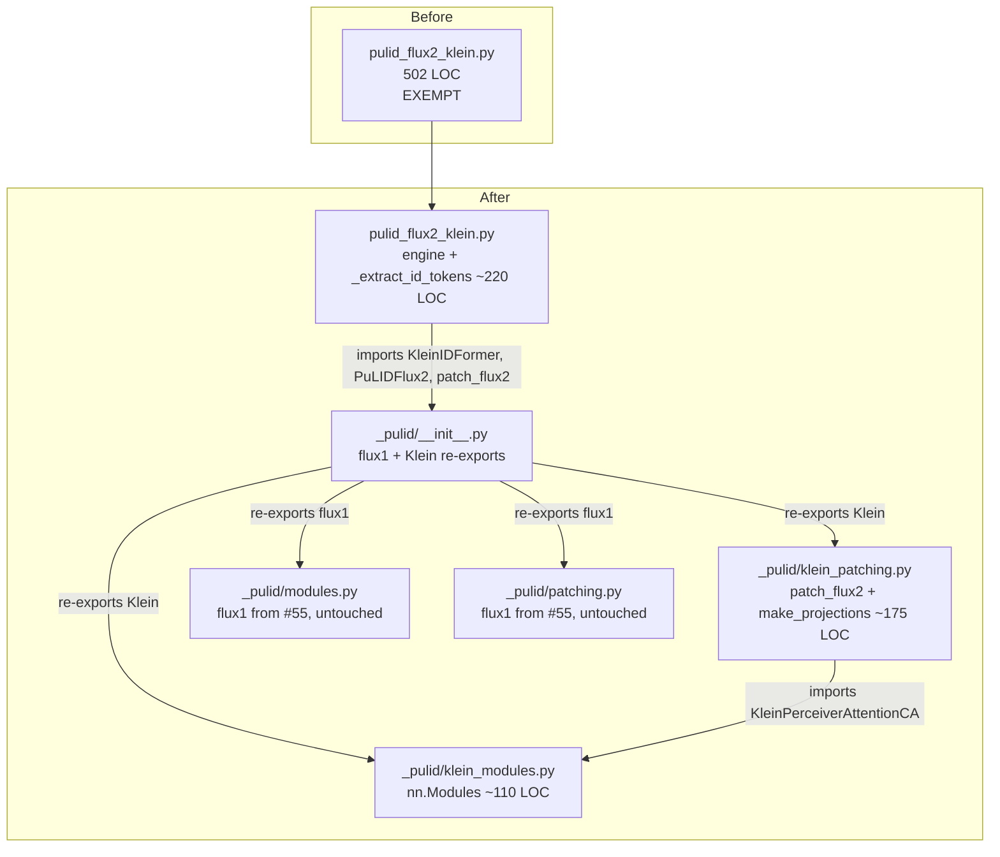
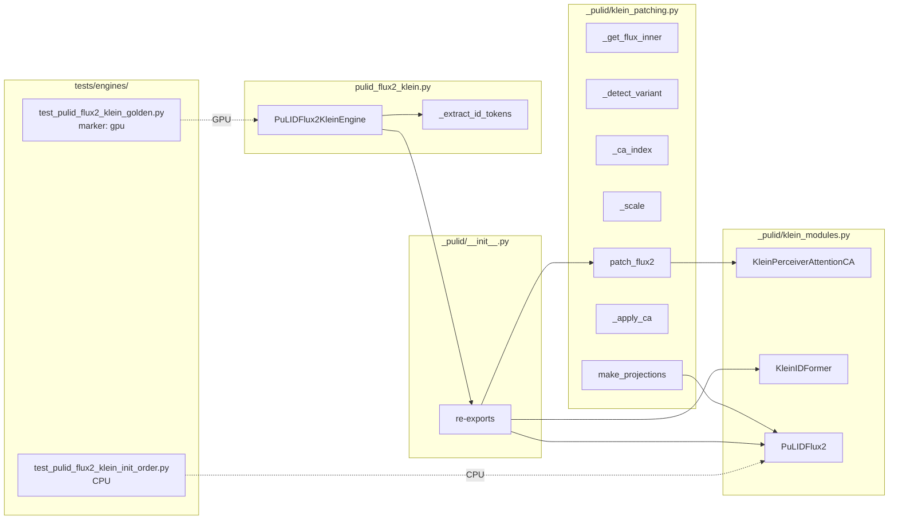

## Summary

Mechanical split of `src/imagecli/engines/pulid_flux2_klein.py`
(502 LOC) into Klein-specific sibling modules in the existing `_pulid/`
sub-package (`klein_modules.py`, `klein_patching.py`, amend
`__init__.py`). Engine file retains `PuLIDFlux2KleinEngine` +
`_extract_id_tokens` (engine-specific preprocessing). Remove the
exemption. Add three regression guards: CPU init-order test (T3
protects proj_up/proj_down vs trained-CA load order — documented
bug class), GPU golden-image test, GPU VRAM delta.

## Architecture





## Agents Table

| Agent | Tasks | Files |
|---|---|---|
| backend-dev | T1–T6 | `src/imagecli/engines/_pulid/klein_*.py`, `src/imagecli/engines/_pulid/__init__.py`, `src/imagecli/engines/pulid_flux2_klein.py`, `tools/file_exemptions.txt` |
| tester | T0, T7, T8, GATE | `tests/engines/test_pulid_flux2_klein_init_order.py`, `tests/engines/test_pulid_flux2_klein_golden.py`, golden fixture |

τ=F-lite → single domain, single session — agents listed for structure
but run in one pass.

## Consistency Report

- Success criteria in spec: 14
- Covered by tasks: 14 / 14
- Uncovered: 0
- Untraced tasks: 0
- Exemptions removed: 1 (`src/imagecli/engines/pulid_flux2_klein.py`)

## Micro-Tasks

Two slices. **V1** is the mechanical split (Spec slice 1). **V2** is
regression guards (Spec slice 2) — CPU init-order + GPU golden/VRAM.
Sequential: T0 captures golden on pre-refactor code; T1–T6 do the
split; T7 (CPU) and T8 (GPU) verify.

### T0 — Capture golden-image baseline (pre-refactor)

- **File:** `tests/engines/golden/pulid_flux2_klein_baseline.png` (new),
  `tests/engines/golden/pulid_flux2_klein_baseline.json` (VRAM + sha256),
  `tests/engines/golden/face_ref.png` (reuse #55 fixture if present),
  `tests/engines/golden/pulid_flux2_klein_baseline_prompt.md` (new)
- **Action:** Run a fixed-seed generate on current `HEAD` (before any
  code move) with a deterministic face_image + prompt, capture the
  output PNG + peak VRAM.
- **Verify:**
  ```
  uv run imagecli generate tests/engines/golden/pulid_flux2_klein_baseline_prompt.md \
    -e pulid-flux2-klein -o tests/engines/golden/pulid_flux2_klein_baseline.png \
    --seed 42
  sha256sum tests/engines/golden/pulid_flux2_klein_baseline.png
  ```
- **Expected:** PNG written; SHA256 + peak `torch.cuda.max_memory_allocated()` captured into JSON sidecar.
- **Est:** 10 min · **Difficulty:** 2 · **Spec trace:** SC-12, SC-13
- **Agent:** tester · **Phase:** RED · **Deps:** —
- **Note:** runs against the ORIGINAL file; fixes baseline before T1–T6 mutate code.

### T1 — Create `_pulid/klein_modules.py`

- **File:** `src/imagecli/engines/_pulid/klein_modules.py` (new)
- **Moves from `pulid_flux2_klein.py`:**
  - `_PerceiverAttentionCA` (L41) → renamed `KleinPerceiverAttentionCA` (collision with flux1 `PerceiverAttentionCA`)
  - `_IDFormer` (L68) → renamed `KleinIDFormer` (collision with flux1 `IDFormer`)
  - `_PuLIDFlux2` (L92) → renamed `PuLIDFlux2` (no collision)
- **Imports:** `torch`, `torch.nn as nn`, `torch.nn.functional as F`. No imagecli-internal imports.
- **Preserve `__init__` order inside `PuLIDFlux2` exactly** — matters for T7.
- **Verify:**
  ```
  uv run python -c "from imagecli.engines._pulid.klein_modules import KleinIDFormer, PuLIDFlux2, KleinPerceiverAttentionCA"
  wc -l src/imagecli/engines/_pulid/klein_modules.py
  ```
- **Expected:** first no output; second < 300.
- **Est:** 6 min · **Difficulty:** 2 · **Spec trace:** SC-2
- **Agent:** backend-dev · **Phase:** GREEN · **Deps:** T0

### T2 — Create `_pulid/klein_patching.py`

- **File:** `src/imagecli/engines/_pulid/klein_patching.py` (new)
- **Moves from `pulid_flux2_klein.py` (L148–307):**
  - Strategy B rationale docstring (currently at module top L7–L17) moves to the module docstring of `klein_patching.py` (where `make_projections` lives).
  - `_get_flux_inner` (L151)
  - `_detect_variant` (L160)
  - `_ca_index` (L173)
  - `_scale` (L177)
  - `_make_projections` (L184) → renamed `make_projections` (public within package — consumed by engine for init-order concerns)
  - `_apply_ca` (L206)
  - `_patch_flux` (L221) → renamed `patch_flux2`
- **Preserve every line of bodies verbatim** — no refactor of patching logic.
- **Imports:** `torch`, `torch.nn as nn`, `from .klein_modules import KleinPerceiverAttentionCA`.
- **Verify:**
  ```
  uv run python -c "from imagecli.engines._pulid.klein_patching import patch_flux2, make_projections; import inspect; print(inspect.signature(patch_flux2))"
  wc -l src/imagecli/engines/_pulid/klein_patching.py
  ```
- **Expected:** first prints same signature as original `_patch_flux`; second < 300.
- **Est:** 6 min · **Difficulty:** 2 · **Spec trace:** SC-3
- **Agent:** backend-dev · **Phase:** GREEN · **Deps:** T1

### T3 — Amend `_pulid/__init__.py` with Klein re-exports

- **File:** `src/imagecli/engines/_pulid/__init__.py` (amend)
- **Change:** add `from .klein_modules import KleinIDFormer, KleinPerceiverAttentionCA, PuLIDFlux2` and `from .klein_patching import patch_flux2, make_projections`. Extend `__all__` to include these symbols alongside existing flux1 names.
- **Verify:**
  ```
  uv run python -c "from imagecli.engines._pulid import IDFormer, PuLIDFlux1, patch_flux1, KleinIDFormer, KleinPerceiverAttentionCA, PuLIDFlux2, patch_flux2, make_projections"
  wc -l src/imagecli/engines/_pulid/__init__.py
  ```
- **Expected:** first no output; second < 50.
- **Est:** 2 min · **Difficulty:** 1 · **Spec trace:** SC-4
- **Agent:** backend-dev · **Phase:** GREEN · **Deps:** T2

### T4 — Slim `pulid_flux2_klein.py` to engine + `_extract_id_tokens`

- **File:** `src/imagecli/engines/pulid_flux2_klein.py` (rewrite)
- **Keep:** shortened module docstring (drop Strategy B details — now in `klein_patching.py`), logger, `_PULID_DIR`, `_INSIGHTFACE_DIR`, `_PULID_DEFAULT`, `_extract_id_tokens` (L311–384), full `PuLIDFlux2KleinEngine` class (L388–502).
- **Remove:** nn.Module classes (L41–147), patching + projection helpers (L148–307).
- **Update imports:** `from imagecli.engines._pulid import KleinIDFormer as IDFormer, PuLIDFlux2, patch_flux2, make_projections`. Local alias `IDFormer` keeps `_extract_id_tokens` body untouched.
- **Update call sites inside engine:** `_IDFormer(...)` → `IDFormer(...)`, `_PuLIDFlux2(...)` → `PuLIDFlux2(...)`, `_patch_flux(...)` → `patch_flux2(...)`, `_make_projections(...)` → `make_projections(...)`. Leave `_extract_id_tokens` call as-is (still local).
- **CRITICAL:** `make_projections` must be called at the same point in `_load()` as before — after trained-CA weights load onto `PuLIDFlux2.layers`. No reordering. T7 guards this.
- **Verify:**
  ```
  uv run python -c "from imagecli.engines.pulid_flux2_klein import PuLIDFlux2KleinEngine"
  wc -l src/imagecli/engines/pulid_flux2_klein.py
  uv run imagecli engines | grep pulid-flux2-klein
  ```
- **Expected:** first no output; second < 300; third prints same engine row.
- **Est:** 8 min · **Difficulty:** 3 · **Spec trace:** SC-1, SC-9, SC-10
- **Agent:** backend-dev · **Phase:** GREEN · **Deps:** T3

### T5 — Remove exemption entry

- **File:** `tools/file_exemptions.txt`
- **Change:** remove the `src/imagecli/engines/pulid_flux2_klein.py …` line.
- **Verify:**
  ```
  grep -c "pulid_flux2_klein.py" tools/file_exemptions.txt
  bash tools/check_file_length.sh
  ```
- **Expected:** first prints `0`; second exits 0 with no new violations.
- **Est:** 2 min · **Difficulty:** 1 · **Spec trace:** SC-5, SC-14
- **Agent:** backend-dev · **Phase:** REFACTOR · **Deps:** T4

### T6 — `_pulid/` folder size check

- **Action:** Confirm `src/imagecli/engines/_pulid/` stays under the folder-size gate (12 files). After this issue: `__init__.py`, `modules.py`, `patching.py`, `klein_modules.py`, `klein_patching.py` = 5 files. Fine.
- **Verify:** `bash tools/check_folder_size.sh`
- **Expected:** exits 0.
- **Est:** 1 min · **Difficulty:** 1 · **Spec trace:** SC-14
- **Agent:** backend-dev · **Phase:** REFACTOR · **Deps:** T5

### T7 — Init-order guard (CPU)

- **File:** `tests/engines/test_pulid_flux2_klein_init_order.py` (new)
- **Content:** CPU-only test (no `@pytest.mark.gpu`) that asserts the `PuLIDFlux2` model only gains `proj_up`/`proj_down` attributes **after** its trained-CA `layers` have been populated with loaded weights. Strategy: instantiate `PuLIDFlux2()` on CPU with tiny dim; record attribute presence after `__init__` (no projections yet); call a helper that simulates `load_state_dict` on `layers` then invokes `make_projections(model, hidden_size=3072)`; assert `model.proj_up` and `model.proj_down` exist and `model.layers[0].to_q.weight.abs().sum() > 0` (load must have run before projection attach).
- **Why:** protects against the documented bug class where `proj_up/proj_down` being constructed before CA weight load produces silent random-init regressions (see CLAUDE.md, module Strategy B docstring).
- **Verify:** `uv run pytest tests/engines/test_pulid_flux2_klein_init_order.py -v`
- **Expected:** passes on any machine (no CUDA, no weights — uses tiny synthetic dims).
- **Est:** 12 min · **Difficulty:** 3 · **Spec trace:** SC-11
- **Agent:** tester · **Phase:** GREEN · **Deps:** T6

### T8 — Golden-image + VRAM regression test (GPU)

- **File:** `tests/engines/test_pulid_flux2_klein_golden.py` (new)
- **Content:** `@pytest.mark.gpu` test that
  1. Resets `torch.cuda.reset_peak_memory_stats()`.
  2. Runs `PuLIDFlux2KleinEngine.generate(...)` with same prompt + face_image + seed 42 captured in T0.
  3. Compares output PNG SHA256 to baseline JSON.
  4. Asserts peak VRAM within `±0.2 GB` of baseline.
- **Verify:** `uv run pytest -m gpu tests/engines/test_pulid_flux2_klein_golden.py -v`
- **Expected:** passes on a machine with GPU + Klein weights + InsightFace models. Skipped on CI without `gpu` marker.
- **Est:** 10 min · **Difficulty:** 3 · **Spec trace:** SC-12, SC-13
- **Agent:** tester · **Phase:** GREEN · **Deps:** T7

### RED-GATE V1+V2 — Full pipeline validation

- **Verify commands (must pass on any machine):**
  ```
  uv run ruff check .
  uv run ruff format --check .
  uv run pytest -m "not gpu"
  uv run imagecli engines > /tmp/engines_after.txt
  diff /tmp/engines_before.txt /tmp/engines_after.txt
  ```
- **Expected:** all exit 0; engines stdout byte-identical.
- **GPU verify (local, pre-merge):**
  ```
  uv run pytest -m gpu tests/engines/test_pulid_flux2_klein_golden.py
  ```
- **Expected:** golden + VRAM assertions pass.
- **Spec trace:** SC-6, SC-7, SC-8, SC-9, SC-10, SC-12, SC-13, SC-14
- **Agent:** tester · **Phase:** RED-GATE · **Deps:** T8

## Task IDs

<!-- Generated by /plan. Used by /implement to resume tasks on session restart. -->
- T0: 12 — Capture golden-image baseline (pre-refactor)
- T1: 13 — Create _pulid/klein_modules.py
- T2: 14 — Create _pulid/klein_patching.py
- T3: 15 — Amend _pulid/__init__.py with Klein re-exports
- T4: 16 — Slim pulid_flux2_klein.py to engine + _extract_id_tokens
- T5: 17 — Remove exemption entry
- T6: 18 — _pulid/ folder size check
- T7: 19 — Init-order guard (CPU test)
- T8: 20 — Golden-image + VRAM regression test (GPU)
- GATE: 21 — RED-GATE V1+V2 full pipeline validation
