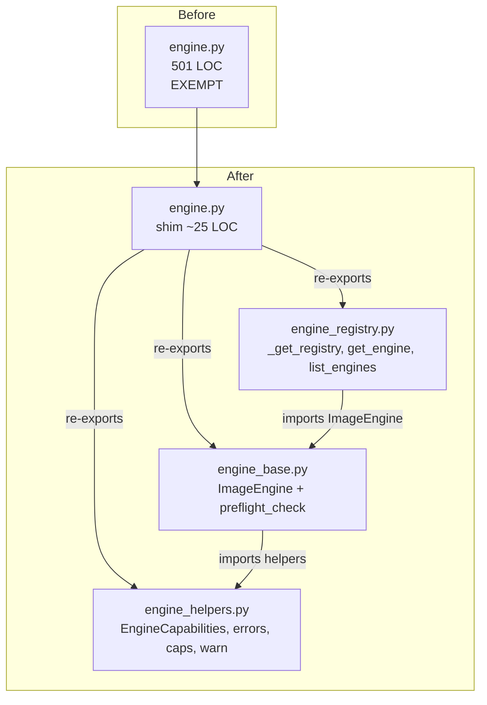
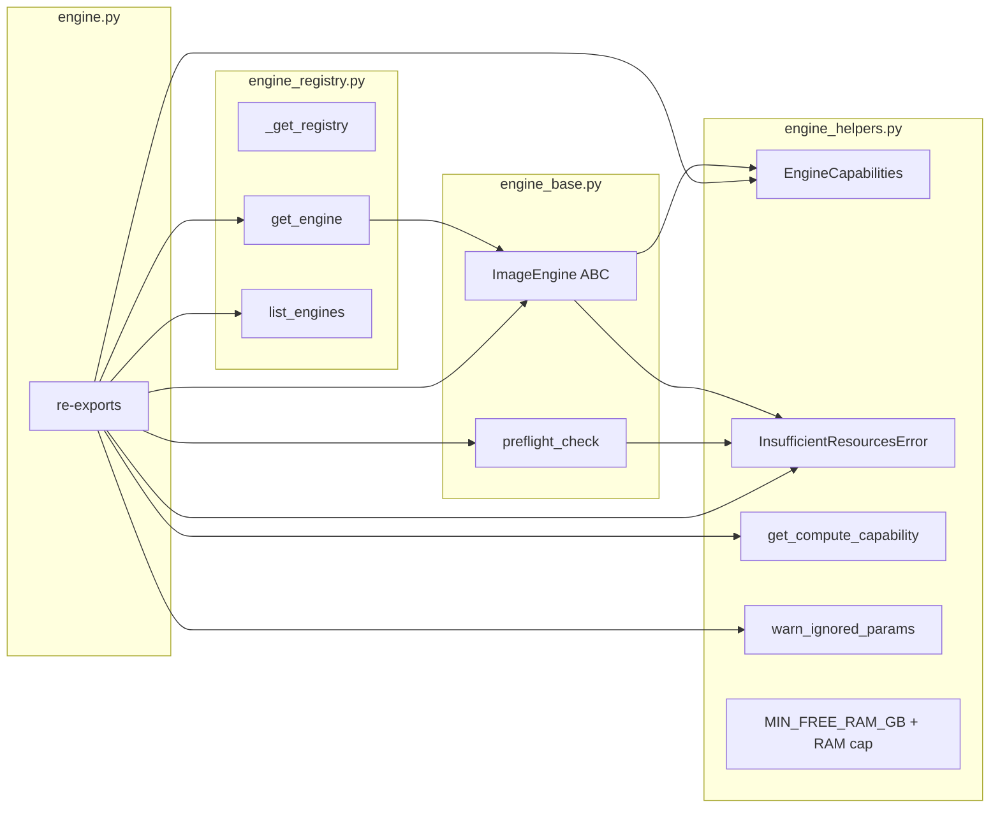

## Summary

Mechanical split of `src/imagecli/engine.py` (501 LOC) into three new modules
(`engine_base.py`, `engine_helpers.py`, `engine_registry.py`) while keeping
`engine.py` as a thin re-export shim so all 17 call sites and the public
library surface stay stable. Remove the file-length gate exemption when the
split lands.

## Architecture





## Agents Table

| Agent | Tasks | Files |
|---|---|---|
| backend-dev | T1–T5 | `src/imagecli/engine*.py`, `tools/file_exemptions.txt` |
| tester | T6 | smoke-test invocation |

τ=F-lite → single domain, single session — agents listed for structure but can run in one pass.

## Consistency Report

- Success criteria in spec: 12
- Covered by tasks: 12 / 12
- Uncovered: 0
- Untraced tasks: 0
- Exemptions removed: 1 (`src/imagecli/engine.py`)

## Micro-Tasks

Single slice V1. All tasks are RED (assert), GREEN (move code), or REFACTOR
(cleanup). Mostly sequential — file moves are order-dependent.

### T1 — Create `engine_helpers.py` with standalone helpers

- **File:** `src/imagecli/engine_helpers.py` (new)
- **Moves from `engine.py`:**
  - `MIN_FREE_RAM_GB` + `_max_ram_gb` env/resource block (lines 15–31)
  - `_tf32_set` module global
  - `@dataclass EngineCapabilities`
  - `class InsufficientResourcesError`
  - `def get_compute_capability`
  - `def warn_ignored_params`
  - module `logger` (kept here since helpers + base both use it; base re-imports)
- **Verify:** `uv run python -c "from imagecli.engine_helpers import EngineCapabilities, InsufficientResourcesError, get_compute_capability, warn_ignored_params, MIN_FREE_RAM_GB"`
- **Expected:** no output (success)
- **Est:** 5 min · **Difficulty:** 2 · **Spec trace:** SC-4
- **Agent:** backend-dev · **Phase:** GREEN

### T2 — Create `engine_base.py` with `ImageEngine` + `preflight_check`

- **File:** `src/imagecli/engine_base.py` (new)
- **Moves from `engine.py`:**
  - `class ImageEngine(ABC)` (full class including `_apply_pivotal_embeddings`, 2-phase stubs, `_optimize_pipe`, `_quantize_transformer`, `cleanup`, etc.)
  - `def preflight_check`
- **Imports from `engine_helpers`:** `EngineCapabilities`, `InsufficientResourcesError`, `MIN_FREE_RAM_GB`
- **Keeps** `global _tf32_set` access — re-import from `engine_helpers` and use `engine_helpers._tf32_set` or move the flag back into a thin module-local wrapper. Prefer: keep `_tf32_set` in `engine_helpers` and have `_optimize_pipe` reference it via `import imagecli.engine_helpers as _h; _h._tf32_set`. Avoid circular imports.
- **Verify:** `uv run python -c "from imagecli.engine_base import ImageEngine, preflight_check"`
- **Expected:** no output
- **Est:** 8 min · **Difficulty:** 3 · **Spec trace:** SC-2
- **Agent:** backend-dev · **Phase:** GREEN · **Deps:** T1

### T3 — Create `engine_registry.py` with factory

- **File:** `src/imagecli/engine_registry.py` (new)
- **Moves from `engine.py`:** `_get_registry`, `get_engine`, `list_engines`
- **Imports:** `ImageEngine` from `engine_base`
- **Verify:** `uv run python -c "from imagecli.engine_registry import get_engine, list_engines; print(len(list_engines()))"`
- **Expected:** `9`
- **Est:** 4 min · **Difficulty:** 1 · **Spec trace:** SC-3
- **Agent:** backend-dev · **Phase:** GREEN · **Deps:** T2

### T4 — Convert `engine.py` to re-export shim

- **File:** `src/imagecli/engine.py` (rewrite)
- **Content:** ~25 LOC — re-export from `engine_base`, `engine_helpers`, `engine_registry`. Include `__all__` matching the previous public surface.
- **Verify:**
  ```
  uv run python -c "from imagecli.engine import ImageEngine, InsufficientResourcesError, EngineCapabilities, get_engine, list_engines, preflight_check, warn_ignored_params, get_compute_capability"
  wc -l src/imagecli/engine.py
  ```
- **Expected:** first no output; second prints a number ≤ 30.
- **Est:** 3 min · **Difficulty:** 1 · **Spec trace:** SC-1, SC-10, SC-11
- **Agent:** backend-dev · **Phase:** GREEN · **Deps:** T3

### T5 — Remove exemption entry + verify gate

- **File:** `tools/file_exemptions.txt`
- **Change:** remove the `src/imagecli/engine.py ...` line.
- **Verify:**
  ```
  grep -c "src/imagecli/engine.py " tools/file_exemptions.txt
  bash tools/check_file_length.sh
  ```
- **Expected:** first prints `0`; second exits 0 with no new violations.
- **Est:** 2 min · **Difficulty:** 1 · **Spec trace:** SC-1, SC-12
- **Agent:** backend-dev · **Phase:** REFACTOR · **Deps:** T4

### RED-GATE V1 — Full pipeline validation

- **Verify commands (all must pass):**
  ```
  uv run ruff check .
  uv run ruff format --check .
  uv run pytest
  uv run imagecli engines > /tmp/engines_after.txt
  uv run imagecli info > /tmp/info_after.txt
  ```
- **Expected:** all exit 0; `engines` lists 9 engines with unchanged fields; `info` prints config table without traceback.
- **Smoke generate (optional; requires GPU):**
  ```
  uv run imagecli generate "a cat on a windowsill" -e flux2-klein --steps 2 --no-compile -o /tmp/_smoke.png
  ```
- **Expected:** exits 0; `/tmp/_smoke.png` ∃ and is a valid PNG.
- **Spec trace:** SC-5, SC-6, SC-7, SC-8, SC-9, SC-10, SC-11, SC-12
- **Agent:** tester · **Phase:** RED-GATE · **Deps:** T5

## Task IDs

<!-- Generated by /plan. Used by /implement to resume tasks on session restart. -->
- T1: 12 — Create engine_helpers.py with standalone helpers
- T2: 13 — Create engine_base.py with ImageEngine + preflight_check
- T3: 14 — Create engine_registry.py with factory
- T4: 15 — Convert engine.py to re-export shim
- T5: 16 — Remove exemption entry for engine.py
- GATE: 17 — RED-GATE V1 full pipeline validation
