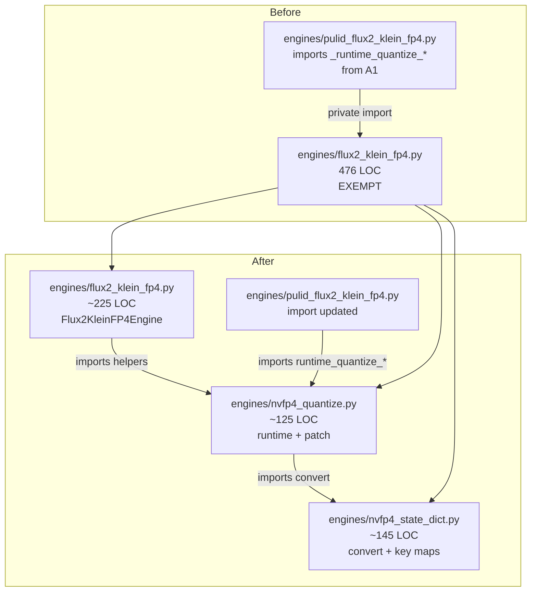
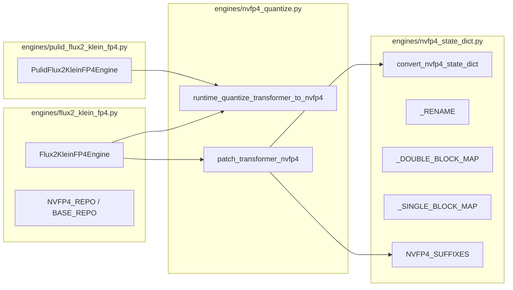

## Summary

Mechanical split of `src/imagecli/engines/flux2_klein_fp4.py` (476 LOC) into
two new sibling modules (`nvfp4_state_dict.py`, `nvfp4_quantize.py`) while
trimming the engine file to just `Flux2KleinFP4Engine`. Update the one
external consumer (`engines/pulid_flux2_klein_fp4.py:121`) to import the
runtime quantizer from its new home, and remove the file-length
exemption. Benchmark parity is a first-class gate — both helpers mutate
transformer tensors, so a silent regression is plausible.

## Architecture





## Agents Table

| Agent | Tasks | Files |
|---|---|---|
| backend-dev | T1–T5 | `src/imagecli/engines/nvfp4_state_dict.py`, `src/imagecli/engines/nvfp4_quantize.py`, `src/imagecli/engines/flux2_klein_fp4.py`, `src/imagecli/engines/pulid_flux2_klein_fp4.py`, `tools/file_exemptions.txt` |
| tester | GATE | ruff/pytest/LOC/bench verification |

τ=F-lite → single domain, single session. Agents listed for structure; one pass covers all.

## Consistency Report

- Success criteria in spec: 14
- Covered by tasks: 14 / 14
- Uncovered: 0
- Untraced tasks: 0
- Exemptions removed: 1 (`src/imagecli/engines/flux2_klein_fp4.py`)

## Micro-Tasks

Single slice V1. GREEN tasks move code; REFACTOR removes the exemption;
RED-GATE covers quality + benchmark parity. Mostly sequential because
later moves depend on earlier modules existing.

### T1 — Capture pre-split baseline

- **File:** none (baseline artifacts)
- **Purpose:** capture a reference image SHA + 512² it/s so T5 gate can verify parity (audit note: silent quant regressions).
- **Commands:**
  ```
  uv run imagecli generate "a cat on a bench" -e flux2-klein-fp4 \
    --steps 8 --seed 42 --width 512 --height 512 \
    -o /tmp/fp4_pre.png
  sha256sum /tmp/fp4_pre.png > /tmp/fp4_pre.sha
  ```
- **Verify:** `test -s /tmp/fp4_pre.png && test -s /tmp/fp4_pre.sha`
- **Expected:** both files non-empty.
- **Est:** 5 min · **Difficulty:** 1 · **Spec trace:** SC-10
- **Agent:** tester · **Phase:** RED

### T2 — Create `engines/nvfp4_state_dict.py` with converter + key maps

- **File:** `src/imagecli/engines/nvfp4_state_dict.py` (new)
- **Moves from `flux2_klein_fp4.py`:**
  - `_RENAME`, `_DOUBLE_BLOCK_MAP`, `_SINGLE_BLOCK_MAP` (kept `_`-prefixed — module-internal)
  - `_NVFP4_SUFFIXES` → renamed to `NVFP4_SUFFIXES` (public; imported by `nvfp4_quantize`)
  - `_convert_nvfp4_state_dict` → renamed to `convert_nvfp4_state_dict` (public)
- **Self-contained:** only imports `torch` lazily inside the function; no imagecli imports.
- **Verify:** `uv run python -c "from imagecli.engines.nvfp4_state_dict import convert_nvfp4_state_dict, NVFP4_SUFFIXES; print(NVFP4_SUFFIXES)"`
- **Expected:** prints the 4-tuple `('.weight', '.weight_scale', '.weight_scale_2', '.input_scale')`.
- **Est:** 6 min · **Difficulty:** 2 · **Spec trace:** SC-2
- **Agent:** backend-dev · **Phase:** GREEN · **Deps:** T1

### T3 — Create `engines/nvfp4_quantize.py` with runtime + patch helpers

- **File:** `src/imagecli/engines/nvfp4_quantize.py` (new)
- **Moves from `flux2_klein_fp4.py`:**
  - `_runtime_quantize_transformer_to_nvfp4` → renamed to `runtime_quantize_transformer_to_nvfp4`
  - `_patch_transformer_nvfp4` → renamed to `patch_transformer_nvfp4`
- **Imports:** `from imagecli.engines.nvfp4_state_dict import convert_nvfp4_state_dict, NVFP4_SUFFIXES`. Heavy imports (`torch`, `comfy_kitchen`, `safetensors`) stay function-local as they are today.
- **Verify:** `uv run python -c "from imagecli.engines.nvfp4_quantize import runtime_quantize_transformer_to_nvfp4, patch_transformer_nvfp4"`
- **Expected:** no output.
- **Est:** 6 min · **Difficulty:** 2 · **Spec trace:** SC-3, SC-15
- **Agent:** backend-dev · **Phase:** GREEN · **Deps:** T2

### T4 — Trim `flux2_klein_fp4.py` to engine class only

- **File:** `src/imagecli/engines/flux2_klein_fp4.py` (rewrite)
- **Remove:** `_RENAME`/`_DOUBLE_BLOCK_MAP`/`_SINGLE_BLOCK_MAP`/`_NVFP4_SUFFIXES`, `_convert_nvfp4_state_dict`, `_runtime_quantize_transformer_to_nvfp4`, `_patch_transformer_nvfp4`.
- **Keep:** module docstring, `NVFP4_REPO`, `NVFP4_FILENAME`, `BASE_REPO`, `logger`, `Flux2KleinFP4Engine`.
- **Add imports:** `from imagecli.engines.nvfp4_quantize import patch_transformer_nvfp4, runtime_quantize_transformer_to_nvfp4`.
- **Update callsites** in `_load_pipeline` (currently lines 341, 355) to use the un-underscored names.
- **Verify:**
  ```
  uv run python -c "from imagecli.engines.flux2_klein_fp4 import Flux2KleinFP4Engine"
  wc -l src/imagecli/engines/flux2_klein_fp4.py
  ```
- **Expected:** first no output; second ≤ 300.
- **Est:** 5 min · **Difficulty:** 2 · **Spec trace:** SC-1, SC-14
- **Agent:** backend-dev · **Phase:** GREEN · **Deps:** T3

### T5 — Update `pulid_flux2_klein_fp4.py` import + remove exemption

- **Files:**
  - `src/imagecli/engines/pulid_flux2_klein_fp4.py` — change line 121 import from `from imagecli.engines.flux2_klein_fp4 import _runtime_quantize_transformer_to_nvfp4` to `from imagecli.engines.nvfp4_quantize import runtime_quantize_transformer_to_nvfp4`. Update the call on line 134 to the new name.
  - `tools/file_exemptions.txt` — remove line 6 (`src/imagecli/engines/flux2_klein_fp4.py …`).
- **Verify:**
  ```
  grep -c "_runtime_quantize_transformer_to_nvfp4\|flux2_klein_fp4 import" src/imagecli/engines/pulid_flux2_klein_fp4.py
  grep -c "flux2_klein_fp4.py " tools/file_exemptions.txt
  uv run python -c "from imagecli.engines.pulid_flux2_klein_fp4 import PulidFlux2KleinFP4Engine"
  ```
- **Expected:** first `0` (old underscored name gone); second `0` (exemption gone); third no output.
- **Est:** 3 min · **Difficulty:** 1 · **Spec trace:** SC-4, SC-13
- **Agent:** backend-dev · **Phase:** REFACTOR · **Deps:** T4

### RED-GATE V1 — Quality + benchmark parity

- **Static gates:**
  ```
  uv run ruff check .
  uv run ruff format --check .
  uv run pytest
  bash tools/check_file_length.sh
  wc -l src/imagecli/engines/flux2_klein_fp4.py \
         src/imagecli/engines/nvfp4_state_dict.py \
         src/imagecli/engines/nvfp4_quantize.py
  uv run imagecli engines > /tmp/engines_after.txt
  diff <(uv run imagecli engines) /tmp/engines_after.txt   # or compare to pre-split baseline if captured
  ```
- **Expected:** ruff + pytest exit 0; file-length gate clean; each of the three files < 300 LOC; `imagecli engines` unchanged.
- **Image parity (fixed seed):**
  ```
  uv run imagecli generate "a cat on a bench" -e flux2-klein-fp4 \
    --steps 8 --seed 42 --width 512 --height 512 \
    -o /tmp/fp4_post.png
  sha256sum /tmp/fp4_post.png | awk '{print $1}' > /tmp/fp4_post.sha
  diff /tmp/fp4_pre.sha /tmp/fp4_post.sha
  ```
- **Expected:** empty diff (byte-identical image).
- **Benchmark (±5%):**
  ```
  uv run imagecli generate "a cat on a bench" -e flux2-klein-fp4 \
    --steps 20 --seed 42 --width 512 --height 512 \
    -o /tmp/fp4_bench.png
  # Record reported it/s; must be within 6.46–7.14 (6.8 ±5%).
  ```
- **2048² two-phase:**
  ```
  uv run imagecli batch images/prompts_in/_bench_fp4_2048/ -e flux2-klein-fp4 \
    --two-phase --width 2048 --height 2048 --steps 8
  # Record reported peak VRAM; must be within 8.38–9.26 GB (8.82 ±5%).
  ```
- **PuLID smoke:**
  ```
  uv run imagecli generate "portrait of a woman" -e pulid-flux2-klein-fp4 \
    --steps 8 --face-image images/prompts_in/_fixtures/face.png --seed 42 \
    -o /tmp/pulid_fp4_post.png
  ```
- **Expected:** exits 0, PNG produced (validates moved `runtime_quantize_transformer_to_nvfp4` resolves).
- **Spec trace:** SC-5 … SC-15
- **Agent:** tester · **Phase:** RED-GATE · **Deps:** T5

## Task IDs

<!-- Generated by /plan. Used by /implement to resume tasks on session restart. -->
- T1: 12 — Capture pre-split NVFP4 baseline image + SHA
- T2: 13 — Create engines/nvfp4_state_dict.py (converter + key maps)
- T3: 14 — Create engines/nvfp4_quantize.py (runtime + patch helpers)
- T4: 15 — Trim flux2_klein_fp4.py to engine class only
- T5: 16 — Update pulid_flux2_klein_fp4.py import + remove exemption
- GATE: 17 — Ruff/pytest/LOC + image SHA parity + bench + PuLID smoke
