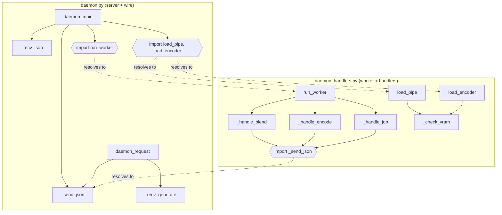
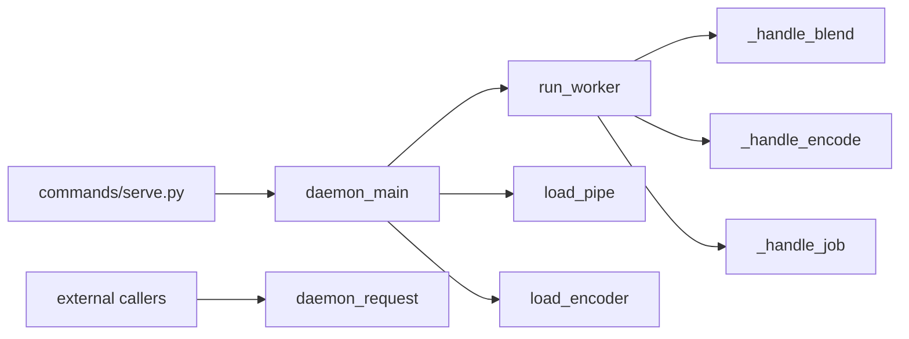

## Summary

Mechanical extraction. Create `src/imagecli/daemon_handlers.py` holding worker, model loaders, `_Job`, three handlers, `_check_vram` + VRAM constants. Slim `daemon.py` to server loop + wire protocol + public client API. Remove `file_exemptions.txt` entry. No behavior change.

## Architecture

## Agents

| Agent | Tasks | Files |
|---|---|---|
| backend-dev | T1–T3 | `src/imagecli/daemon.py`, `src/imagecli/daemon_handlers.py` |
| devops | T4 | `tools/file_exemptions.txt` |
| tester | T5 | smoke verification |

## Consistency

| Criterion (from spec) | Covered by |
|---|---|
| daemon.py ≤ 300 LOC | T2 |
| daemon_handlers.py ≤ 300 LOC | T1 |
| exemption removed | T4 |
| ruff check/format pass | T1–T4 (verify) |
| `imagecli.commands.serve` imports | T2 (verify) |
| `daemon_main, daemon_request, SOCKET_PATH` imports | T2 (verify) |
| smoke: ping + generate | T5 |
| wire bytes identical | T1–T2 (no wire change by construction) |

Coverage: 8/8. Untraced: 0.

## Micro-Tasks

### Slice V1 — Create handlers module

**T1** `[P:N]` — Create `src/imagecli/daemon_handlers.py` — agent: backend-dev · phase: GREEN · diff: 2 · trace: N5,N6,N7,N8
- File: `src/imagecli/daemon_handlers.py` (new)
- Move from `daemon.py`: `_Job` dataclass, `_VRAM_TRANSFORMER_VAE`, `_VRAM_TEXT_ENCODER`, `_check_vram`, `_load_pipe` → `load_pipe`, `_load_encoder` → `load_encoder`, `_worker` → `run_worker`, `_handle_blend`, `_handle_encode`, `_handle_job`.
- Add import: `from imagecli.daemon import _send_json`.
- Keep all logic bit-for-bit identical.
- Verify: `uv run python -c "from imagecli.daemon_handlers import run_worker, load_pipe, load_encoder, _Job"`
- Expected: exits 0, no output
- Est: 8 min

### Slice V2 — Slim daemon.py

**T2** — Reduce `src/imagecli/daemon.py` to server + wire — agent: backend-dev · phase: GREEN · diff: 2 · trace: N1,N2,N3,N4 · deps: T1
- File: `src/imagecli/daemon.py` (modify)
- Remove moved symbols (listed in T1).
- Add import: `from imagecli.daemon_handlers import run_worker, load_pipe, load_encoder, _Job`.
- Update `daemon_main` internals: `pipe = load_pipe()`, `encoder_pipe = load_encoder()`, thread target `run_worker`.
- Keep `SOCKET_PATH`, `_DEFAULT_TIMEOUT`, `daemon_request`, `_recv_generate`, `daemon_main`, `_send_json`, `_recv_json`.
- Verify: `wc -l src/imagecli/daemon.py src/imagecli/daemon_handlers.py`
- Expected: both ≤ 300
- Est: 5 min

### Slice V2 — Lint

**T3** `[P:Y]` — Format + lint new/modified files — agent: backend-dev · phase: REFACTOR · diff: 1 · deps: T2
- Files: `src/imagecli/daemon.py`, `src/imagecli/daemon_handlers.py`
- Run: `uv run ruff format src/imagecli/daemon.py src/imagecli/daemon_handlers.py && uv run ruff check src/imagecli/daemon.py src/imagecli/daemon_handlers.py`
- Verify: same command rerun
- Expected: `All checks passed!` + no reformat diff
- Est: 2 min

### Slice V3 — Remove exemption

**T4** — Drop `daemon.py` line from `tools/file_exemptions.txt` — agent: devops · phase: GREEN · diff: 1 · deps: T2
- File: `tools/file_exemptions.txt`
- Remove: `src/imagecli/daemon.py https://github.com/Roxabi/imageCLI/issues/59`
- Verify: `grep "daemon.py" tools/file_exemptions.txt; echo exit=$?`
- Expected: `exit=1` (no match)
- Est: 1 min

### Slice V3 — Smoke test

**T5** `[P:N]` — Import + structural smoke — agent: tester · phase: RED-GATE · diff: 2 · deps: T1,T2,T3,T4
- Verify A: `uv run python -c "from imagecli.commands.serve import serve; from imagecli.daemon import daemon_main, daemon_request, SOCKET_PATH; from imagecli.daemon_handlers import run_worker, load_pipe, load_encoder, _Job; print('ok')"`
- Expected A: `ok` on stdout, exit 0
- Verify B (LOC gates): `wc -l src/imagecli/daemon.py src/imagecli/daemon_handlers.py | awk '{if ($1>300 && $2 !~ /total/) exit 1}'`
- Expected B: exit 0
- Live-daemon smoke (manual, noted in PR): start `imagecli serve`, issue one ping, issue one `generate` with a pre-encoded embed → image written; this is the only check that exercises the worker path and `commands/serve.py` at runtime.
- Est: 5 min

## Task IDs

<!-- Generated by /plan. Used by /implement to resume tasks on session restart. -->
- T1: 1 — Create src/imagecli/daemon_handlers.py with worker + handlers + loaders
- T2: 2 — Slim src/imagecli/daemon.py to server loop + wire protocol
- T3: 3 — Ruff format + check on daemon.py and daemon_handlers.py
- T4: 4 — Remove daemon.py entry from tools/file_exemptions.txt
- T5: 5 — Import + LOC smoke test (RED-GATE)
