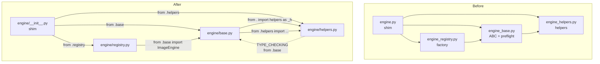
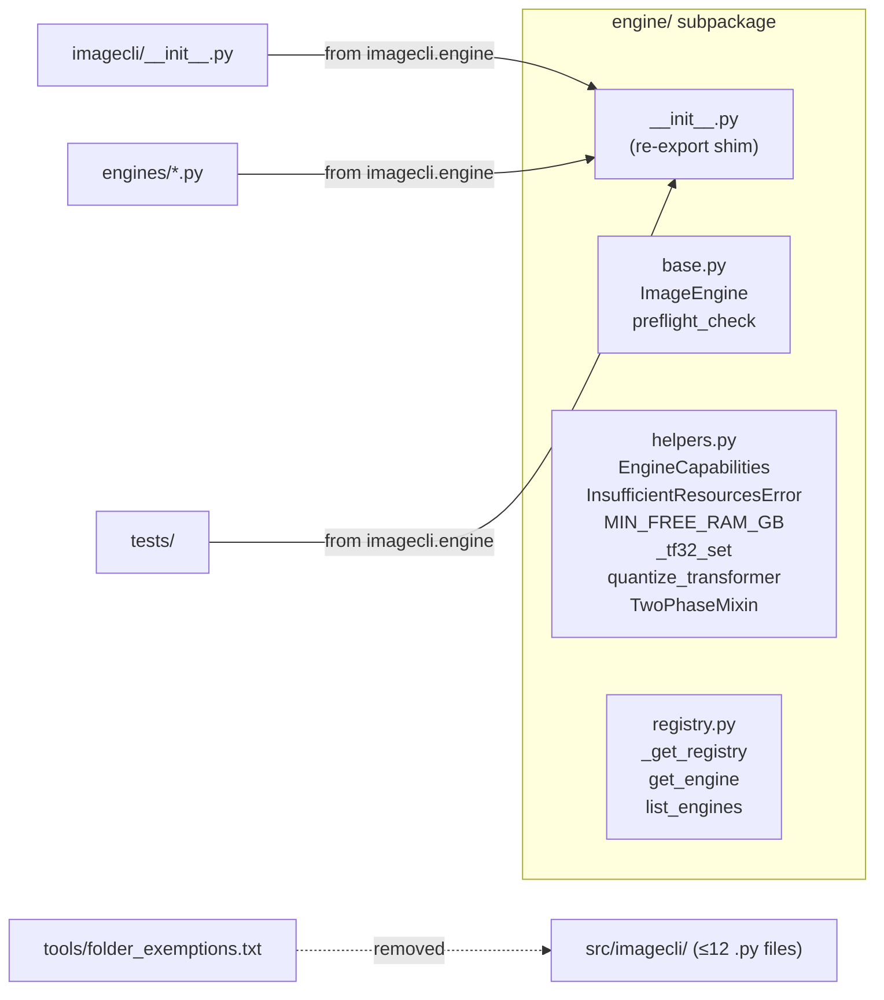

## Summary

Move `engine.py` + 3 siblings into an `engine/` subpackage, rewriting all internal cross-imports to relative form. All external `from imagecli.engine import X` callers remain untouched. Remove the folder_size exemption once the gate passes.

## Architecture

## Agents

| Agent | Tasks | Files |
|---|---|---|
| backend-dev | T1–T5 | `engine/helpers.py`, `engine/base.py`, `engine/registry.py`, `engine/__init__.py`, rm 4 old files |
| devops | T6 | `tools/folder_exemptions.txt` |
| tester | T7 | quality gate (pyright, ruff, pytest) |

## Reference Pattern

`src/imagecli/engines/nvfp4/` — subpackage extraction with `__init__.py` re-exports (created by #68).

## Micro-Tasks

### V1 — Create subpackage + move modules

**T1** — Create `engine/helpers.py` [RED]
- File: `src/imagecli/engine/helpers.py`
- Copy `engine_helpers.py` verbatim; update one import:
  - line 20 (TYPE_CHECKING guard): `from imagecli.engine_base import ImageEngine` → `from .base import ImageEngine`
- Verify: `python -c "from imagecli.engine.helpers import EngineCapabilities, TwoPhaseMixin"`
- Expected: exits 0
- Time: 3 min | Difficulty: 1 | [P]: N | Agent: backend-dev | Spec: SC-4

**T2** — Create `engine/base.py` [RED]
- File: `src/imagecli/engine/base.py`
- Copy `engine_base.py` verbatim; update two imports:
  - line 11: `from imagecli import engine_helpers as _h` → `from . import helpers as _h`
  - line 12: `from imagecli.engine_helpers import (` → `from .helpers import (`
- Verify: `python -c "from imagecli.engine.base import ImageEngine, preflight_check"`
- Expected: exits 0
- Time: 3 min | Difficulty: 2 | [P]: N | Deps: T1 | Agent: backend-dev | Spec: SC-4

**T3** — Create `engine/registry.py` [RED]
- File: `src/imagecli/engine/registry.py`
- Copy `engine_registry.py` verbatim; update one import:
  - line 10: `from imagecli.engine_base import ImageEngine` → `from .base import ImageEngine`
- Verify: `python -c "from imagecli.engine.registry import get_engine, list_engines"`
- Expected: exits 0 (lazy imports inside functions, so registry itself won't load engines)
- Time: 3 min | Difficulty: 1 | [P]: N | Deps: T2 | Agent: backend-dev | Spec: SC-4

**T4** — Create `engine/__init__.py` [RED]
- File: `src/imagecli/engine/__init__.py`
- Rewrite `engine.py` with relative imports:
  - `from imagecli.engine_base import ImageEngine, preflight_check` → `from .base import ImageEngine, preflight_check`
  - `from imagecli.engine_helpers import (` → `from .helpers import (`
  - `from imagecli.engine_registry import (` → `from .registry import (`
- Preserve `__all__` unchanged
- Verify: `python -c "from imagecli.engine import ImageEngine, EngineCapabilities, InsufficientResourcesError, MIN_FREE_RAM_GB, get_compute_capability, get_engine, list_engines, preflight_check, warn_ignored_params"`
- Expected: exits 0
- Time: 3 min | Difficulty: 1 | [P]: N | Deps: T1–T3 | Agent: backend-dev | Spec: SC-4

**RED-GATE V1** — Verify full import surface
- `uv run python -c "from imagecli.engine import ImageEngine, EngineCapabilities, InsufficientResourcesError, MIN_FREE_RAM_GB, get_compute_capability, get_engine, list_engines, preflight_check, warn_ignored_params"`
- Expected: exits 0

### V2 — Delete old flat files

**T5** — `git rm` 4 obsolete modules [GREEN]
- Files: `src/imagecli/engine.py`, `src/imagecli/engine_base.py`, `src/imagecli/engine_helpers.py`, `src/imagecli/engine_registry.py`
- Command: `git rm src/imagecli/engine.py src/imagecli/engine_base.py src/imagecli/engine_helpers.py src/imagecli/engine_registry.py`
- Verify: `python -c "from imagecli.engine import ImageEngine, get_engine"`
- Expected: exits 0 (subpackage takes over)
- Time: 2 min | Difficulty: 1 | [P]: N | Deps: RED-GATE V1 | Agent: backend-dev | Spec: SC-1

**RED-GATE V2** — Verify imports survive deletion
- `uv run python -c "from imagecli.engine import ImageEngine, EngineCapabilities, InsufficientResourcesError, MIN_FREE_RAM_GB, get_compute_capability, get_engine, list_engines, preflight_check, warn_ignored_params"`
- `find src/imagecli -maxdepth 1 -name "*.py" | wc -l` → ≤12
- Expected: both exit 0, count ≤12

### V3 — Remove folder exemption

**T6** — Remove `src/imagecli` line from exemptions [GREEN]
- File: `tools/folder_exemptions.txt`
- Remove the line: `src/imagecli https://github.com/Roxabi/imageCLI/issues/65`
- Verify: `bash tools/check_folder_size.sh`
- Expected: exits 0, no output
- Time: 2 min | Difficulty: 1 | [P]: Y | Deps: RED-GATE V2 | Agent: devops | Spec: SC-2, SC-3

**RED-GATE V3** — Gate passes clean
- `bash tools/check_folder_size.sh`
- Expected: exits 0, empty stdout

### REFACTOR — Quality gate

**T7** — Full quality gate [REFACTOR]
- `uv run pyright` → 0 errors
- `uv run ruff check .` → clean
- `uv run pytest` → all pass
- Time: 5 min | Difficulty: 1 | [P]: N | Deps: RED-GATE V3 | Agent: tester | Spec: SC-5, SC-6, SC-7

## Consistency Report

- Covered: 7/7 success criteria
- Uncovered: none
- Untraced: none

## Task IDs

<!-- Generated by /plan. Used by /implement to resume tasks on session restart. -->
- T1: 10 — Create src/imagecli/engine/helpers.py
- T2: 11 — Create src/imagecli/engine/base.py
- T3: 12 — Create src/imagecli/engine/registry.py
- T4: 13 — Create src/imagecli/engine/__init__.py (re-export shim)
- T5: 14 — git rm 4 obsolete engine flat files
- T6: 15 — Remove src/imagecli exemption from folder_exemptions.txt
- T7: 16 — Full quality gate: pyright + ruff + pytest
