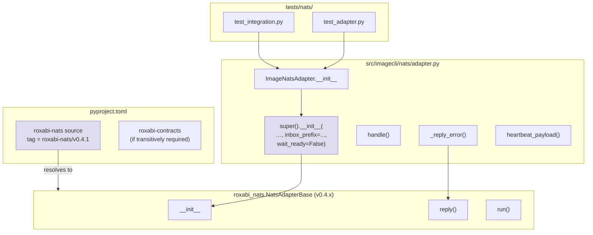
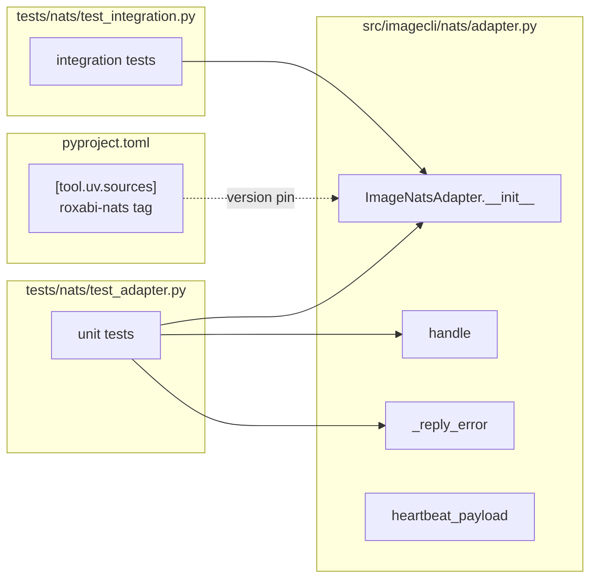

## Summary

Single-session dep upgrade: bump `roxabi-nats` to `v0.4.1`, add `inbox_prefix` + `wait_ready=False` to `ImageNatsAdapter.__init__`, and re-run the test suites that exercise the adapter contract. Sibling repos already implement the pattern — risk is bounded.

## Architecture

### Data flow



### File × Function map



## Agents

| Agent | Tasks | Files |
|-------|-------|-------|
| backend-dev | T1, T3 | `pyproject.toml`, `src/imagecli/nats/adapter.py` |
| tester | T2, T4, T5, T6 | `tests/nats/*`, validation gates |

τ = F-lite, single session — both agents collapse to direct execution by the orchestrator. Named for traceability.

## Wave Structure

3 waves, max 1 parallel agent (sequential by dep ordering). Elapsed ~15 min vs ~15 min sequential (no parallelism gain — work is inherently sequential).

| Wave | Trigger | Agents | Tasks |
|------|---------|--------|-------|
| 1 | start | 1 | backend-dev-A: T1 → T2 (RED-GATE-V1) |
| 2 | Wave 1 done | 1 | backend-dev-A: T3 → tester-A: T4 (RED-GATE-V2) |
| 3 | Wave 2 done | 1 | tester-A: T5 → T6 |

### Budget

| Task | Items | Class | Est. ops | Split? |
|------|-------|-------|----------|--------|
| T1 — pyproject.toml dep bump | 1 | bounded | 3 | — |
| T2 — RED-GATE-V1: verify base signature | 1 | trivial | 2 | — |
| T3 — adapter kwargs | 1 | bounded | 3 | — |
| T4 — RED-GATE-V2: test_adapter.py | 1 | bounded | 3 | — |
| T5 — full nats + suite | 1 | bounded | 3 | — |
| T6 — ruff + pyright | 1 | trivial | 2 | — |

**Total estimated ops: 16**

## Consistency Report

- Covered criteria: 10/10
- Uncovered criteria: 0
- Untraced tasks: 0
- Exemptions: none

| SC | Task |
|----|------|
| SC-1 (pyproject roxabi-nats v0.4.1) | T1 |
| SC-2 (roxabi-contracts pin if needed) | T1 (cond) |
| SC-3 (adapter super kwargs) | T3 |
| SC-4 (test_adapter.py passes) | T4 |
| SC-5 (test_integration.py passes) | T5 |
| SC-6 (full pytest passes) | T5 |
| SC-7 (ruff passes) | T6 |
| SC-8 (pyright passes) | T6 |
| SC-9 (manual: no ACL denials at startup) | T5 (documented in PR) |
| SC-10 (error envelope conformance) | T4 (existing tests cover the path) |

## Micro-Tasks

### V1 — Dep bump

#### T1 — Bump `roxabi-nats` tag in `pyproject.toml` to `v0.4.1`, `uv sync`

- **File:** `pyproject.toml`, `uv.lock`
- **Snippet:**
  ```toml
  roxabi-nats = { git = "https://github.com/Roxabi/lyra.git", subdirectory = "packages/roxabi-nats", tag = "roxabi-nats/v0.4.1" }
  ```
  If `uv sync` fails to resolve `roxabi-contracts` transitively, also add:
  ```toml
  roxabi-contracts = { git = "https://github.com/Roxabi/lyra.git", subdirectory = "packages/roxabi-contracts", tag = "roxabi-contracts/<latest stable>" }
  ```
  matching whatever sibling repos `llmCLI` / `voiceCLI` pin.
- **Verify:** `uv sync && uv run python -c "from roxabi_nats import NatsAdapterBase; import inspect; print('wait_ready' in inspect.signature(NatsAdapterBase.__init__).parameters)"`
- **Expected:** `True`
- **Time:** 3 min
- **[P]:** N
- **Agent:** backend-dev-A
- **Spec trace:** SC-1, SC-2
- **Slice:** V1
- **Phase:** GREEN
- **Difficulty:** 1

#### T2 — RED-GATE-V1: confirm new base signature reachable

- **Verify:** `uv run python -c "from roxabi_nats import NatsAdapterBase; import inspect; p=inspect.signature(NatsAdapterBase.__init__).parameters; assert 'wait_ready' in p and 'inbox_prefix' in p, p"`
- **Expected:** no AssertionError (silent success)
- **Time:** 1 min
- **[P]:** N
- **Agent:** backend-dev-A
- **Spec trace:** SC-1
- **Slice:** V1
- **Phase:** RED-GATE
- **Difficulty:** 1

### V2 — Adapter opt-in

#### T3 — Add `inbox_prefix` + `wait_ready=False` to `super().__init__()`

- **File:** `src/imagecli/nats/adapter.py` (lines 41–49 region)
- **Snippet:**
  ```python
  super().__init__(
      subject=SUBJECT,
      queue_group="IMAGE_WORKERS",
      envelope_name="image",
      schema_version=SCHEMA_VERSION,
      heartbeat_subject=HEARTBEAT_SUBJECT,
      heartbeat_interval=heartbeat_interval,
      drain_timeout=drain_timeout,
      inbox_prefix="_inbox.imagecli-image",
      wait_ready=False,  # worker semantics — see NatsAdapterBase docstring
  )
  ```
- **Verify:** `uv run python -c "from imagecli.nats.adapter import ImageNatsAdapter; a = ImageNatsAdapter(); print(a._inbox_prefix, a._wait_ready_flag)"`
- **Expected:** `_inbox.imagecli-image False`
- **Time:** 3 min
- **[P]:** N
- **Agent:** backend-dev-A
- **Spec trace:** SC-3
- **Slice:** V2
- **Phase:** GREEN
- **Difficulty:** 1

#### T4 — RED-GATE-V2: `tests/nats/test_adapter.py` passes

- **Verify:** `uv run pytest tests/nats/test_adapter.py -x`
- **Expected:** all pass
- **Time:** 3 min
- **[P]:** N
- **Agent:** tester-A
- **Spec trace:** SC-4, SC-10
- **Slice:** V2
- **Phase:** RED-GATE
- **Difficulty:** 2

### V3 — Validation

#### T5 — Full test suite + integration tests

- **Verify:** `uv run pytest tests/nats/ -x && uv run pytest -x`
- **Expected:** all pass, no regressions
- **Time:** 5 min
- **[P]:** N
- **Agent:** tester-A
- **Spec trace:** SC-5, SC-6, SC-9 (PR notes if no live hub)
- **Slice:** V3
- **Phase:** RED-GATE
- **Difficulty:** 2

#### T6 — Lint + typecheck

- **Verify:** `uv run ruff check . && uv run ruff format --check . && uv run pyright`
- **Expected:** clean
- **Time:** 2 min
- **[P]:** N
- **Agent:** tester-A
- **Spec trace:** SC-7, SC-8
- **Slice:** V3
- **Phase:** RED-GATE
- **Difficulty:** 1

## Task Seeding Blueprint

<!-- Used by /implement to seed TaskCreate calls on session start. -->

### Wave 1 — no deps, 1 agent

| Task | Agent instance | blockedBy | Subject |
|------|---------------|-----------|---------|
| T1 | backend-dev-A | — | Bump roxabi-nats tag in pyproject.toml + uv sync |
| T2 | backend-dev-A | T1 | RED-GATE-V1: confirm new base signature reachable |

### Wave 2 — after Wave 1, 1 agent

| Task | Agent instance | blockedBy | Subject |
|------|---------------|-----------|---------|
| T3 | backend-dev-A | T2 | Add inbox_prefix + wait_ready=False to super().__init__() |
| T4 | tester-A | T3 | RED-GATE-V2: tests/nats/test_adapter.py passes |

### Wave 3 — after Wave 2, 1 agent

| Task | Agent instance | blockedBy | Subject |
|------|---------------|-----------|---------|
| T5 | tester-A | T4 | Full pytest suite + integration tests |
| T6 | tester-A | T5 | ruff + pyright clean |

## Task IDs

<!-- Generated by /plan. Used by /implement to resume tasks on session restart. -->
- T1: 12 — Bump roxabi-nats tag in pyproject.toml + uv sync
- T2: 13 — RED-GATE-V1: confirm new base signature reachable
- T3: 14 — Add inbox_prefix + wait_ready=False to super().__init__()
- T4: 15 — RED-GATE-V2: tests/nats/test_adapter.py passes
- T5: 16 — Full pytest suite + integration tests
- T6: 17 — ruff + pyright clean
