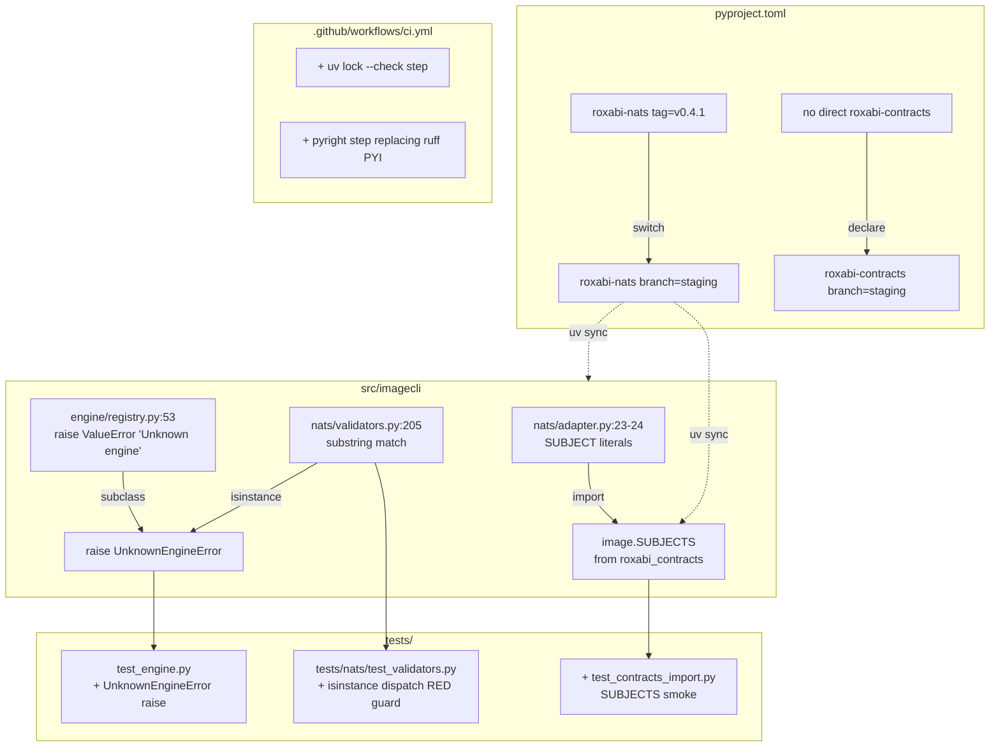
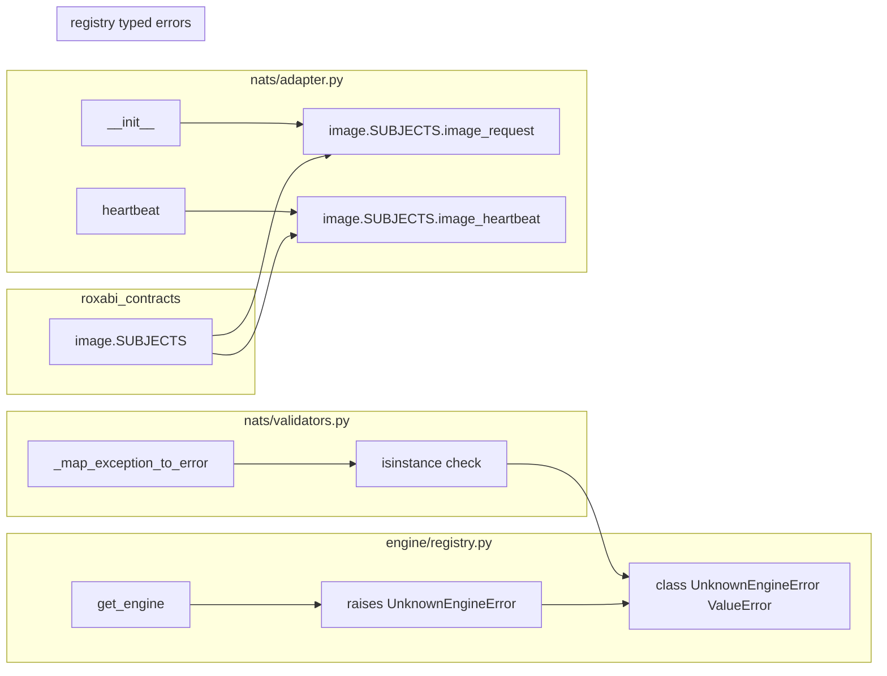

## Summary

PR-A bundles the 3 small cross-repo wins from spec slices 1–3: switch `roxabi-nats` to `branch=staging` + declare `roxabi-contracts` direct (Slice 1), consume `image.SUBJECTS` from contracts (Slice 2), introduce `UnknownEngineError` typed exception (Slice 3). Closes #86 in transit. Unblocks PR-B (sanitize_for_wire), which needs Slice 1's pin switch.

## Architecture

### Data flow — change surface



### File × function map



## Bootstrap Context

- Audit findings 4 (str(exc) socket leak — out of scope for PR-A; PR-B owns), 5 (substring-match dispatch — in PR-A).
- Cross-repo follow-ups #1 (image.SUBJECTS — in PR-A), #2 (pin staging — in PR-A), #3 (declare contracts direct — in PR-A, closes #86).
- Reference patterns:
  - **llmCLI** is the canonical "consume `llm.SUBJECTS` from contracts" reference. Specifically `llmCLI/src/llmcli/nats/llm_adapter.py` imports `from roxabi_contracts.llm import SUBJECTS`. Mirror this in `nats/adapter.py`.
  - **scripts/check-lyra-literals.sh** is an existing CI guard for `lyra.*` literals; verify the `image.SUBJECTS` migration doesn't trip it.
  - **`tests/nats/` exists** — existing validator/adapter test directory; new tests go here.

## Agents

| Agent | Instance | Task count | Files |
|---|---|---|---|
| devops | devops-A | 3 | `pyproject.toml`, `uv.lock`, `.github/workflows/ci.yml` |
| backend-dev | backend-dev-A | 3 | `src/imagecli/nats/adapter.py`, `src/imagecli/engine/registry.py`, `src/imagecli/nats/validators.py` |
| tester | tester-A | 3 | `tests/test_engine.py` (or new file), `tests/nats/test_validators.py`, `tests/test_contracts_import.py` (new) |

## Wave Structure

3 waves, max 3 parallel agents. Elapsed ~30 min vs ~75 min sequential.

| Wave | Trigger | Agents | Tasks |
|---|---|---|---|
| 1 | start | 3 ∥ | devops-A: T1 · backend-dev-A: T2→T3 · tester-A: T4 (RED) |
| 2 | Wave 1 done | 2 ∥ | backend-dev-A: T5 · tester-A: T6 (RED) |
| 3 | Wave 2 done | 2 ∥ | tester-A: T7 (GREEN) · devops-A: T8 |
| 4 | Wave 3 done | 1 | tester-A: T9 (RED-GATE V1+V2+V3) |

### Budget

| Task | Items | Class | Est. ops | Split? |
|---|---|---|---|---|
| T1 pyproject + lock + verify | 3 | bounded | 6 | — |
| T2 SUBJECTS import in adapter | 1 | bounded | 3 | — |
| T3 UnknownEngineError class + raise site | 1 | bounded | 3 | — |
| T4 RED test: substring-match guard | 1 | bounded | 3 | — |
| T5 validators.py isinstance dispatch | 1 | bounded | 3 | — |
| T6 RED test: SUBJECTS smoke + adapter wires | 1 | bounded | 3 | — |
| T7 GREEN: all tests pass | 1 | trivial | 2 | — |
| T8 CI gates: uv lock --check + pyright | 2 | bounded | 6 | — |
| T9 RED-GATE V1+V2+V3 | 1 | trivial | 2 | — |

**Total estimated ops: 31** — well under the 50 force-split threshold.

## Consistency Report

| Spec criterion | Covered by task |
|---|---|
| SC-pin-no-tag (`grep tag= == 0`) | T1, T9 |
| SC-pin-branch-staging (`grep branch="staging" == 1`) | T1, T9 |
| SC-contracts-direct-dep | T1, T9 |
| SC-image-SUBJECTS-importable | T1, T6 |
| SC-sanitize-for-wire-importable | T1 (verify only — full use is PR-B) |
| SC-no-literal-subjects | T2, T9 |
| SC-adapter-imports-SUBJECTS | T2, T6 |
| SC-86-auto-closed | T1 (PR body) |
| SC-UnknownEngineError-defined | T3, T7 |
| SC-registry-raises-typed | T3, T7 |
| SC-validators-isinstance | T5, T4 (regression guard) |
| SC-uv-lock-check-CI | T8 |
| SC-pyright-CI | T8 |
| SC-ruff/pytest/pyright pass | T7, T9 |

Uncovered (intentionally — PR-B/C/D scope): all `str(exc)` removal, `TwoPhaseBase` extraction, `PuLIDMixin`, `nvfp4` check extraction, container build smoke (PR-C decides since most changes are there).
Untraced: none.
Exemptions: SC-LOC-net-delta — manual count at PR-time per spec.

## Micro-Tasks

### Slice 1 — uv pin alignment

**T1** [P=N] devops-A · Bounded · Difficulty 2 · Spec trace: SC-pin-* + SC-contracts-direct + SC-86

Edit `pyproject.toml`:
1. Add `"roxabi-contracts"` to the `nats` optional-dependencies extras list.
2. Change `roxabi-nats = { ..., tag = "roxabi-nats/v0.4.1" }` → `roxabi-nats = { ..., branch = "staging" }`.
3. Add `roxabi-contracts = { git = "https://github.com/Roxabi/lyra.git", subdirectory = "packages/roxabi-contracts", branch = "staging" }` under `[tool.uv.sources]`.

Then run `uv sync --all-extras` to regenerate `uv.lock`. Verify:
```bash
uv run python -c "from roxabi_contracts.image import SUBJECTS; print(SUBJECTS.image_request)"
uv run python -c "from roxabi_nats import sanitize_for_wire; print('OK')"
grep -E '^\s*roxabi-nats.*tag\s*=' pyproject.toml | wc -l   # → 0
grep -E '^\s*roxabi-nats.*branch\s*=\s*"staging"' pyproject.toml | wc -l   # → 1
```
Expected: SUBJECTS prints `lyra.image.generate.request`; `sanitize_for_wire` import succeeds; the two grep counts are 0 and 1.

### Slice 2 — NATS subjects from contracts

**T2** [P=Y, depends T1] backend-dev-A · Bounded · Difficulty 2 · Spec trace: SC-no-literal-subjects, SC-adapter-imports-SUBJECTS

Edit `src/imagecli/nats/adapter.py`:
- Replace `SUBJECT = "lyra.image.generate.request"` and `HEARTBEAT_SUBJECT = "lyra.image.heartbeat"` (lines 23–24) with `from roxabi_contracts.image import SUBJECTS` at the top.
- Replace **all uses** of `SUBJECT` / `HEARTBEAT_SUBJECT` in this file with `SUBJECTS.image_request` / `SUBJECTS.image_heartbeat`.
- Run `bash scripts/check-lyra-literals.sh` to confirm no new `lyra.*` literals leaked outside the adapter.

Verify:
```bash
grep -nE '^(SUBJECT|HEARTBEAT_SUBJECT)\s*=' src/imagecli/nats/adapter.py | wc -l   # → 0
grep -nE 'SUBJECTS\.(image_request|image_heartbeat)' src/imagecli/nats/adapter.py | wc -l   # → ≥ 2 (def + uses)
bash scripts/check-lyra-literals.sh   # exits 0
uv run pytest tests/nats/ -x
```

### Slice 3 — typed UnknownEngineError

**T3** [P=Y, depends T1] backend-dev-A · Bounded · Difficulty 2 · Spec trace: SC-UnknownEngineError-defined, SC-registry-raises-typed

Edit `src/imagecli/engine/registry.py`:
- Add class definition near the top of the module (after imports, before `_get_registry`):
  ```python
  class UnknownEngineError(ValueError):
      """Raised when an engine name is not in the registry. Subclasses ValueError
      for backward compatibility with callers that catch ValueError generically."""
  ```
- Change the raise at line 53 from `raise ValueError(f"Unknown engine {name!r}. Available: {known}")` to `raise UnknownEngineError(f"Unknown engine {name!r}. Available: {known}")`.
- Export `UnknownEngineError` in `src/imagecli/engine/__init__.py` if there's a re-export pattern (check first).

Verify:
```bash
uv run python -c "from imagecli.engine.registry import UnknownEngineError; assert issubclass(UnknownEngineError, ValueError)"
uv run python -c "from imagecli.engine.registry import get_engine; \
                  try: get_engine('nope-not-a-real-engine'); \
                  except Exception as e: print(type(e).__name__)"
# Expected: UnknownEngineError
```

**T4** [P=Y] tester-A · Bounded · Difficulty 2 · **Phase: RED** · Spec trace: SC-validators-isinstance (regression guard)

Add **failing test** in `tests/nats/test_validators.py` (create if absent — directory exists):
- Test name: `test_unknown_engine_dispatch_isinstance_not_substring`.
- Construct an `UnknownEngineError("totally-rewritten message that does not contain the magic phrase")` and pass it to `_map_exception_to_error`.
- Assert returned code is `"unknown_engine"`.
- This MUST fail on `main` and `staging` HEAD (substring match), then pass after T5 lands.

Verify:
```bash
uv run pytest tests/nats/test_validators.py::test_unknown_engine_dispatch_isinstance_not_substring -x
# Expected this turn: FAIL (RED)
```

### Wave 2

**T5** [P=N, depends T3+T4] backend-dev-A · Bounded · Difficulty 2 · **Phase: GREEN** · Spec trace: SC-validators-isinstance

Edit `src/imagecli/nats/validators.py` around lines 205–206:
- Import `UnknownEngineError` at top: `from imagecli.engine.registry import UnknownEngineError`.
- Replace the substring-match block with:
  ```python
  if isinstance(exc, UnknownEngineError):
      msg = str(exc)
      detail = msg.split(": ", 1)[-1] if ": " in msg else "unknown"
      return "unknown_engine", detail
  ```
- The order of dispatch must still place `UnknownEngineError` AFTER `InsufficientResourcesError` and BEFORE `MemoryError` (preserve precedence).

Verify:
```bash
uv run pytest tests/nats/test_validators.py::test_unknown_engine_dispatch_isinstance_not_substring -x
# Expected this turn: PASS (GREEN)
grep -F '"Unknown engine" in str' src/imagecli/nats/validators.py | wc -l   # → 0
```

**T6** [P=Y] tester-A · Bounded · Difficulty 1 · **Phase: RED** · Spec trace: SC-image-SUBJECTS-importable, SC-adapter-imports-SUBJECTS

Add 2 tests (smoke + adapter wire):
- `tests/test_contracts_import.py` (new): `test_image_subjects_importable` — assert `image.SUBJECTS.image_request == "lyra.image.generate.request"`. No mocking; this is a real import smoke.
- `tests/nats/test_adapter.py` (or extend existing): `test_adapter_subscribes_to_subjects_from_contracts` — instantiate the adapter (or mock its NATS client) and assert it subscribes to `SUBJECTS.image_request`, not to a hardcoded string.

Verify:
```bash
uv run pytest tests/test_contracts_import.py tests/nats/test_adapter.py -x
# Expected: PASS (the contracts import is already available post-T1; adapter test passes post-T2)
```

### Wave 3

**T7** [P=Y, depends T5+T6] tester-A · Trivial · Difficulty 1 · **Phase: GREEN** · Spec trace: SC-ruff/pytest/pyright pass

Run the full test + lint matrix locally:
```bash
uv run ruff check . && \
uv run ruff format --check . && \
uv run pytest && \
uv run pyright
```
Expected: all 4 commands exit 0. If pyright surfaces new errors from the typed-error introduction, fix narrowly (add `from __future__ import annotations` or explicit imports as needed).

**T8** [P=Y, depends T5] devops-A · Bounded · Difficulty 3 · Spec trace: SC-uv-lock-check-CI, SC-pyright-CI

Edit `.github/workflows/ci.yml`:
- Insert `- name: Lockfile drift\n  run: uv lock --check` step BEFORE the `Install dependencies` step.
- Replace `- name: Typecheck\n  run: uv run ruff check --select=PYI .` with `- name: Typecheck\n  run: uv run pyright`.
- Keep existing ruff (lint), shellcheck, check-lyra-literals, pytest, trufflehog steps as-is.

Verify locally:
```bash
uv lock --check   # exit 0 with current lockfile
uv run pyright    # exit 0 with PR-A changes
# CI itself verified by the PR-A run, gated in Wave 4.
```

### RED-GATE — Wave 4

**T9** [P=N, depends all] tester-A · Trivial · Difficulty 1 · **Phase: RED-GATE V1+V2+V3** · Spec trace: all SC- for PR-A

Run the full PR-A acceptance gate:
```bash
cd /home/mickael/projects/imageCLI
# Slice 1
grep -E '^\s*roxabi-nats.*tag\s*=' pyproject.toml | wc -l                          # → 0
grep -E '^\s*roxabi-nats.*branch\s*=\s*"staging"' pyproject.toml | wc -l           # → 1
grep -E 'roxabi-contracts' pyproject.toml | grep -E 'branch\s*=\s*"staging"' | wc -l  # → ≥ 1
uv run python -c "from roxabi_contracts.image import SUBJECTS; from roxabi_nats import sanitize_for_wire; print('OK')"

# Slice 2
grep -nE '^(SUBJECT|HEARTBEAT_SUBJECT)\s*=\s*"lyra' src/imagecli/nats/adapter.py | wc -l   # → 0
grep -F 'from roxabi_contracts.image import SUBJECTS' src/imagecli/nats/adapter.py | wc -l # → 1
bash scripts/check-lyra-literals.sh

# Slice 3
uv run python -c "from imagecli.engine.registry import UnknownEngineError; assert issubclass(UnknownEngineError, ValueError)"
grep -F '"Unknown engine" in str' src/imagecli/nats/validators.py | wc -l         # → 0

# CI gates
grep -F 'uv lock --check' .github/workflows/ci.yml | wc -l                         # → 1
grep -F 'uv run pyright' .github/workflows/ci.yml | wc -l                          # → 1

# Full validation
uv run ruff check .
uv run ruff format --check .
uv run pytest
uv run pyright
```
**All checks must pass.** If any fail, the failing slice's tasks loop back into the wave.

## Task Seeding Blueprint

<!-- Used by /implement to seed TaskCreate calls on session start.
     Format: T{n} | agent-instance | blockedBy | subject
     blockedBy refs T-numbers within this list (not session task IDs).
     Seed in wave order; within a wave all rows are parallel. -->

### Wave 1 — start, 3 agents ∥

| Task | Agent instance | blockedBy | Subject |
|------|---------------|-----------|---------|
| T1 | devops-A | — | pyproject pin to branch=staging + declare roxabi-contracts direct + uv lock + import smoke |
| T2 | backend-dev-A | T1 | nats/adapter.py — replace SUBJECT literals with image.SUBJECTS import |
| T3 | backend-dev-A | T1 | engine/registry.py — define UnknownEngineError + use at raise site |
| T4 | tester-A | T1 | RED test — substring-match-regression guard on _map_exception_to_error |

### Wave 2 — Wave 1 done, 2 agents ∥

| Task | Agent instance | blockedBy | Subject |
|------|---------------|-----------|---------|
| T5 | backend-dev-A | T3,T4 | nats/validators.py — isinstance(exc, UnknownEngineError) dispatch (GREEN) |
| T6 | tester-A | T1,T2 | RED test — image.SUBJECTS import smoke + adapter wires to SUBJECTS |

### Wave 3 — Wave 2 done, 2 agents ∥

| Task | Agent instance | blockedBy | Subject |
|------|---------------|-----------|---------|
| T7 | tester-A | T5,T6 | GREEN — full ruff + ruff format + pytest + pyright local |
| T8 | devops-A | T5 | .github/workflows/ci.yml — add uv lock --check + replace ruff PYI with pyright |

### Wave 4 — Wave 3 done, 1 agent

| Task | Agent instance | blockedBy | Subject |
|------|---------------|-----------|---------|
| T9 | tester-A | T7,T8 | RED-GATE V1+V2+V3 — full PR-A acceptance grep + import + test matrix |

## Task IDs

<!-- Generated by /plan. Used by /implement to resume tasks on session restart. -->
- T1: 14 — T1 pyproject pin → branch=staging + roxabi-contracts direct + uv lock + import smoke
- T2: 15 — T2 nats/adapter.py — replace SUBJECT literals with image.SUBJECTS import
- T3: 16 — T3 engine/registry.py — define UnknownEngineError + use at raise site
- T4: 17 — T4 RED test — substring-match regression guard on _map_exception_to_error
- T5: 18 — T5 nats/validators.py — isinstance(exc, UnknownEngineError) dispatch (GREEN)
- T6: 19 — T6 RED test — image.SUBJECTS import smoke + adapter wires to SUBJECTS
- T7: 20 — T7 GREEN — full local validation (ruff + format + pytest + pyright)
- T8: 21 — T8 ci.yml — add uv lock --check + replace ruff PYI with pyright
- T9: 22 — T9 RED-GATE V1+V2+V3 — full PR-A acceptance gate
