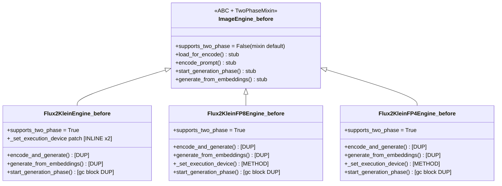
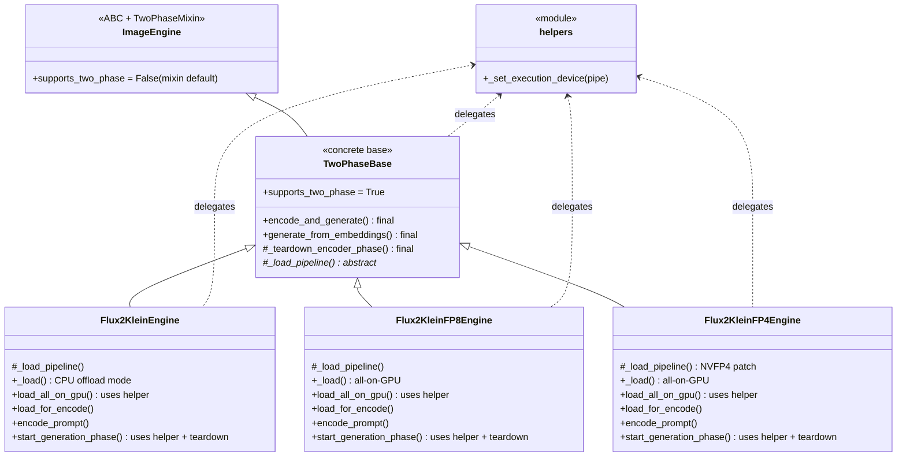
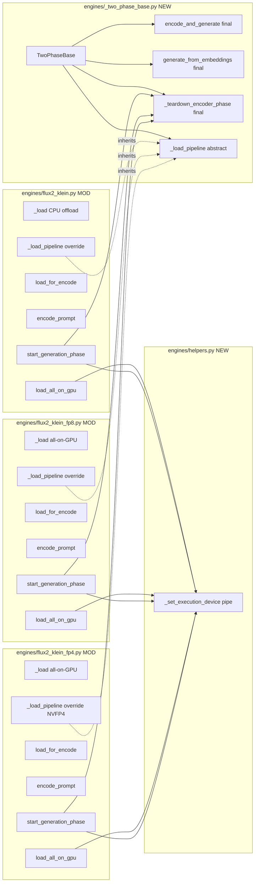

## Summary

PR-C extracts `TwoPhaseBase(ImageEngine)` with finalized `encode_and_generate`, `generate_from_embeddings`, `_teardown_encoder_phase` methods; refactors the 3 quant engines (`flux2-klein`, `flux2-klein-fp8`, `flux2-klein-fp4`) to inherit. Adds `engines/helpers.py::_set_execution_device(pipe)` free function consumed by `TwoPhaseBase` + the 3 engines (4 inline sites collapse to 1). Net LOC delta ≥ −130; existing `TwoPhaseMixin` (stubs on `ImageEngine`) stays — `TwoPhaseBase` simply overrides its stubs with concrete impls.

## Architecture

### Inheritance — before / after





### File × call map



## Bootstrap Context

Pulled from `artifacts/specs/89-stage-axis-refactor-spec.mdx` (status: approved) + `artifacts/analyses/stage-axis-audit-2026-05-20.md` (Finding 1) + direct code read:

- Existing `TwoPhaseMixin` (`engine/helpers.py:132`) mixes into `ImageEngine` and provides `supports_two_phase: ClassVar[bool] = False` + 4 stub methods (NotImplementedError). `TwoPhaseBase` will inherit `ImageEngine` (which carries `TwoPhaseMixin`) and override stubs with concrete impls — no need to touch `TwoPhaseMixin`.
- `_set_execution_device` exists at 4 inline sites currently within Slice-5 scope:
  - `flux2_klein.py:108-117` (inline in `load_all_on_gpu`)
  - `flux2_klein.py:215-224` (inline in `start_generation_phase`)
  - `flux2_klein_fp8.py:101-115` (extracted instance method)
  - `flux2_klein_fp4.py:95-107` (extracted instance method)
  - **Out of scope:** `pulid_flux2_klein_fp4.py:79` (Slice 6 / PR-D).
- The 3 engines have *byte-identical* `encode_and_generate` bodies (modulo a single `assert self._pipe is not None` line missing in fp4) — safe to consolidate verbatim onto base.
- `_save_image` lives on `ImageEngine` base (`engine/base.py:146`) — already inherited; no change.
- `supports_two_phase` consumers: `commands/batch.py:120`, `tests/test_batch.py` (MagicMock specs). Both will continue to work because `TwoPhaseBase` keeps `supports_two_phase = True` and `ImageEngine` (via `TwoPhaseMixin`) keeps the `False` default.
- Spec batching constraint: PR-C touches `engines/flux2_klein_fp4.py`; PR-D (Slice 6, #93) touches `pulid_flux2_klein_fp4.py`. Different files but may collide on `engines/__init__.py` imports at rebase time — PR-C adds no new exports to `engines/__init__.py` (the base + helpers stay internal-import).

## Agents

| Agent instance | Tasks | Files |
|----------------|-------|-------|
| backend-dev-A | T1, T2, T3, T4, T5 | engines/helpers.py, engines/_two_phase_base.py, flux2_klein.py, flux2_klein_fp8.py, flux2_klein_fp4.py |
| tester-A | T6, T7 | repo-wide quality gates + manual M₂ smoke parity |

F-lite single-domain: 1 backend-dev sequential keeps review friction low. T3/T4/T5 are `[P]` parallel-safe by file boundary but kept on one agent for pattern consistency across the 3 engines.

## Wave Structure

3 waves, max 1 parallel agent. Elapsed ~1 session vs ~1 session sequential.

| Wave | Trigger | Agents | Tasks |
|------|---------|--------|-------|
| 1 | start | 1 ∥ | backend-dev-A: T1→T2 |
| 2 | Wave 1 done | 1 ∥ | backend-dev-A: T3→T4→T5 |
| 3 | Wave 2 done | 1 ∥ | tester-A: T6→T7 |

### Budget

| Task | Items | Class | Est. ops | Split? |
|------|-------|-------|----------|--------|
| T1 helpers.py | 1 fn | bounded | 2 | — |
| T2 _two_phase_base.py | 1 class + 4 methods | judgmental | 4 | — |
| T3 flux2_klein.py refactor | ~6 edits | judgmental | 6 | — |
| T4 flux2_klein_fp8.py refactor | ~6 edits | judgmental | 5 | — |
| T5 flux2_klein_fp4.py refactor | ~6 edits | judgmental | 5 | — |
| T6 quality gates | 4 commands + 4 greps | bounded | 4 | — |
| T7 smoke parity (M₂) | 3 engines × 3 modes | judgmental | 9 | — |

**Total estimated ops: ~35** — well below force-split threshold.

## Consistency Report

- **Covered / total criteria:** 7 / 8 (one criterion partial: net LOC delta is empirical, measured at T6).
- **Uncovered:** none — all spec Slice-5 criteria addressed by T1–T7.
- **Untraced tasks:** none.
- **Spec-side exemptions** (deferred to Slice 6 / PR-D, not failures of PR-C):
  - `_set_execution_device` 2nd site remains in `pulid_flux2_klein_fp4.py:79` — PR-D cleans up via PuLIDMixin refactor.

## Micro-Tasks

### Slice V5 — TwoPhaseBase extraction

#### T1 [P] backend-dev-A — Create `engines/helpers.py`

- **File:** `src/imagecli/engines/helpers.py` (new)
- **Description:** Add `_set_execution_device(pipe)` free function: monkey-patches `_execution_device` property on the pipe's class (idempotent via `_orig_execution_device` sentinel) + sets `_execution_device_override = torch.device("cuda")` on the instance. Extract verbatim from `flux2_klein_fp8.py:101-115`.
- **Skeleton:**
  ```python
  """Free helpers shared across engine implementations."""
  from __future__ import annotations

  def _set_execution_device(pipe) -> None:
      """Patch pipeline execution device to cuda (idempotent class-level monkey-patch)."""
      import torch
      pipe._execution_device_override = torch.device("cuda")
      orig_cls = type(pipe)
      if not hasattr(orig_cls, "_orig_execution_device"):
          orig_cls._orig_execution_device = orig_cls._execution_device
          orig_cls._execution_device = property(
              lambda p: (
                  getattr(p, "_execution_device_override", None)
                  or orig_cls._orig_execution_device.fget(p)
              )
          )
  ```
- **Verify:** `grep -c "^def _set_execution_device" src/imagecli/engines/helpers.py` → `1`
- **Expected:** `1`
- **Time:** 3 min · **Difficulty:** 1 · **Spec trace:** T5 · **Phase:** GREEN

#### T2 backend-dev-A — Create `engines/_two_phase_base.py` (depends on T1)

- **File:** `src/imagecli/engines/_two_phase_base.py` (new)
- **Description:** Define `class TwoPhaseBase(ImageEngine)` with `supports_two_phase: ClassVar[bool] = True`, abstract `_load_pipeline`, concrete `_teardown_encoder_phase()` (4-line gc block: text_encoder→cpu, empty_cache, gc.collect), concrete `encode_and_generate()` (verbatim from `flux2_klein.py:121-169`), concrete `generate_from_embeddings()` (verbatim from `flux2_klein.py:229-277`). Keep `assert self._pipe is not None` lines for type-narrowing.
- **Skeleton:**
  ```python
  """Concrete base for 2-phase quant engines (flux2-klein family)."""
  from __future__ import annotations
  import gc
  from abc import abstractmethod
  from pathlib import Path
  from typing import ClassVar

  from imagecli.engine import ImageEngine

  class TwoPhaseBase(ImageEngine):
      supports_two_phase: ClassVar[bool] = True

      @abstractmethod
      def _load_pipeline(self) -> None: ...

      def _teardown_encoder_phase(self) -> None:
          import torch
          assert self._pipe is not None
          self._pipe.text_encoder.to("cpu")
          torch.cuda.empty_cache()
          gc.collect()

      def encode_and_generate(self, prompt: str, *, width=1024, height=1024, steps=50,
                              guidance=4.0, seed=None, output_path: Path, callback=None) -> Path:
          # verbatim body from flux2_klein.py:133-169
          ...

      def generate_from_embeddings(self, embeddings: dict, *, width=1024, height=1024,
                                    steps=50, guidance=4.0, seed=None,
                                    output_path: Path, callback=None) -> Path:
          # verbatim body from flux2_klein.py:241-277
          ...
  ```
- **Verify:** `grep -c "^class TwoPhaseBase" src/imagecli/engines/_two_phase_base.py` → `1` AND `grep -c "def encode_and_generate\|def generate_from_embeddings\|def _teardown_encoder_phase\|def _load_pipeline" src/imagecli/engines/_two_phase_base.py` → `4`
- **Expected:** `1` then `4`
- **Time:** 8 min · **Difficulty:** 2 · **Spec trace:** T1+T2+T3+T4 · **Phase:** GREEN

#### T3 [P] backend-dev-A — Refactor `engines/flux2_klein.py` (depends on T2)

- **File:** `src/imagecli/engines/flux2_klein.py`
- **Description:**
  1. Change base: `class Flux2KleinEngine(TwoPhaseBase)` (was `ImageEngine`).
  2. Remove `supports_two_phase` line (inherited).
  3. Add imports: `from imagecli.engines._two_phase_base import TwoPhaseBase` + `from imagecli.engines.helpers import _set_execution_device`.
  4. Remove `encode_and_generate` (lines 121-169) entirely.
  5. Remove `generate_from_embeddings` (lines 229-277) entirely.
  6. In `load_all_on_gpu`: replace lines 108-117 (inline `_execution_device_override` patch) with `_set_execution_device(self._pipe)`.
  7. In `start_generation_phase`: replace the gc block (lines 198-206: text_encoder→cpu + empty_cache + gc.collect — note the duplicate `import torch` at line 208 to also remove) with `self._teardown_encoder_phase()`; replace lines 215-224 (inline `_execution_device_override` patch) with `_set_execution_device(self._pipe)`.
- **Verify:**
  - `grep -c "def encode_and_generate" src/imagecli/engines/flux2_klein.py` → `0`
  - `grep -c "def generate_from_embeddings" src/imagecli/engines/flux2_klein.py` → `0`
  - `grep -c "_execution_device_override = " src/imagecli/engines/flux2_klein.py` → `0`
  - `grep -c "TwoPhaseBase" src/imagecli/engines/flux2_klein.py` → `≥2` (import + base)
- **Expected:** `0 / 0 / 0 / ≥2`
- **Time:** 8 min · **Difficulty:** 3 · **Spec trace:** T2+T3+T4+T5 · **Phase:** REFACTOR

#### T4 [P] backend-dev-A — Refactor `engines/flux2_klein_fp8.py` (depends on T2)

- **File:** `src/imagecli/engines/flux2_klein_fp8.py`
- **Description:**
  1. Change base: `class Flux2KleinFP8Engine(TwoPhaseBase)`.
  2. Remove `supports_two_phase` line.
  3. Add imports for `TwoPhaseBase` + `_set_execution_device`.
  4. **Delete** the `_set_execution_device(self)` method (lines 101-115) — the file's `load_all_on_gpu` (124) + `start_generation_phase` (217) currently call `self._set_execution_device()`; rewire those to call the imported free function `_set_execution_device(self._pipe)`.
  5. Remove `encode_and_generate` (lines 129-177).
  6. Remove `generate_from_embeddings` (lines 222-270).
  7. In `start_generation_phase`: replace the gc block (lines 211-213: text_encoder→cpu + empty_cache + gc.collect) with `self._teardown_encoder_phase()`.
- **Verify:**
  - `grep -c "def encode_and_generate" src/imagecli/engines/flux2_klein_fp8.py` → `0`
  - `grep -c "def generate_from_embeddings" src/imagecli/engines/flux2_klein_fp8.py` → `0`
  - `grep -c "def _set_execution_device" src/imagecli/engines/flux2_klein_fp8.py` → `0`
- **Expected:** `0 / 0 / 0`
- **Time:** 8 min · **Difficulty:** 3 · **Spec trace:** T2+T3+T4+T5 · **Phase:** REFACTOR

#### T5 [P] backend-dev-A — Refactor `engines/flux2_klein_fp4.py` (depends on T2)

- **File:** `src/imagecli/engines/flux2_klein_fp4.py`
- **Description:** Same recipe as T4. Delete method `_set_execution_device` (lines 95-107). Rewire 3 callsites (line 116 in `_load`, 125 in `load_all_on_gpu`, 200 in `start_generation_phase`). Remove `encode_and_generate` (129-172), `generate_from_embeddings` (204-247). In `start_generation_phase` (192-202): replace `text_encoder.to("cpu") + empty_cache + gc.collect` (lines 196-198) with `self._teardown_encoder_phase()`.
- **Verify:**
  - `grep -c "def encode_and_generate" src/imagecli/engines/flux2_klein_fp4.py` → `0`
  - `grep -c "def generate_from_embeddings" src/imagecli/engines/flux2_klein_fp4.py` → `0`
  - `grep -c "def _set_execution_device" src/imagecli/engines/flux2_klein_fp4.py` → `0`
- **Expected:** `0 / 0 / 0`
- **Time:** 8 min · **Difficulty:** 3 · **Spec trace:** T2+T3+T4+T5 · **Phase:** REFACTOR

#### T6 tester-A — Quality gates + grep-based success criteria (depends on T5)

- **Files:** repo-wide
- **Description:** Run all quality gates and assert the success-criteria greps.
- **Commands:**
  ```bash
  uv run ruff check . && uv run ruff format --check . && uv run pyright && uv run pytest
  # success criteria
  test "$(grep -c 'def encode_and_generate' src/imagecli/engines/*.py | awk -F: '{s+=$2}END{print s}')" = "0"  # all moved to base
  test "$(grep -c 'def generate_from_embeddings' src/imagecli/engines/*.py | awk -F: '{s+=$2}END{print s}')" = "0"
  # base has them
  grep -q "def encode_and_generate" src/imagecli/engines/_two_phase_base.py
  grep -q "def generate_from_embeddings" src/imagecli/engines/_two_phase_base.py
  # 3 quant engines declare TwoPhaseBase
  for f in flux2_klein.py flux2_klein_fp8.py flux2_klein_fp4.py; do
    grep -q "TwoPhaseBase" "src/imagecli/engines/$f" || { echo "FAIL: $f missing TwoPhaseBase"; exit 1; }
  done
  # net LOC reduction in engines/flux2_klein*.py vs pre-refactor (informational; ≥ -130 expected)
  git diff --stat staging -- 'src/imagecli/engines/flux2_klein*.py'
  ```
- **Expected:** all gates green; criteria asserts pass.
- **Time:** 5 min · **Difficulty:** 2 · **Spec trace:** SC-TwoPhaseBase (grep counts) · **Phase:** GREEN

#### T7 [RED-GATE] tester-A — Manual M₂ smoke parity (depends on T6)

- **Environment:** M₂ (ROXABITOWER, RTX 5070 Ti, Blackwell sm_120)
- **Description:** For each of `flux2-klein`, `flux2-klein-fp8`, `flux2-klein-fp4`: run seeded generation pre-refactor (on `staging`) and post-refactor (on PR-C branch); SHA-256 the decoded pixel array of the output PNG; assert bit-identical.
- **Procedure:**
  ```bash
  # On staging (pre):
  git checkout staging
  for e in flux2-klein flux2-klein-fp8 flux2-klein-fp4; do
    uv run imagecli generate "a red apple on a wooden table, studio lighting" \
      -e "$e" --seed 4242 -o "/tmp/smoke_pre_${e}.png"
    python -c "import hashlib, PIL.Image, numpy as np; \
      arr=np.array(PIL.Image.open('/tmp/smoke_pre_${e}.png')); \
      print('${e} pre', hashlib.sha256(arr.tobytes()).hexdigest())"
  done

  # On PR-C branch (post):
  git checkout <pr-c-branch>
  for e in flux2-klein flux2-klein-fp8 flux2-klein-fp4; do
    uv run imagecli generate "a red apple on a wooden table, studio lighting" \
      -e "$e" --seed 4242 -o "/tmp/smoke_post_${e}.png"
    python -c "import hashlib, PIL.Image, numpy as np; \
      arr=np.array(PIL.Image.open('/tmp/smoke_post_${e}.png')); \
      print('${e} post', hashlib.sha256(arr.tobytes()).hexdigest())"
  done
  # Assert pre == post for each engine
  ```
- **Batch parity (lighter):** run `imagecli batch` and `imagecli batch --two-phase` on a 2-prompt fixture; assert outputs bit-identical pre/post.
- **Expected:** SHA-256 pre == post for each engine × each mode (3 × 3 = 9 comparisons; all bit-identical on same GPU + CUDA kernel path).
- **Time:** 15-20 min (model loads dominate) · **Difficulty:** 3 · **Spec trace:** SC-TwoPhaseBase (M₂ smoke) · **Phase:** RED-GATE

## Task Seeding Blueprint

<!-- Used by /implement to seed TaskCreate calls on session start.
     Format: T{n} | agent-instance | blockedBy | subject
     blockedBy refs T-numbers within this list (not session task IDs).
     Seed in wave order; within a wave all rows are parallel (∥). -->

### Wave 1 — no deps, 1 agent ∥

| Task | Agent instance | blockedBy | Subject |
|------|---------------|-----------|---------|
| T1 | backend-dev-A | — | Create engines/helpers.py with _set_execution_device free function |
| T2 | backend-dev-A | T1 | Create engines/_two_phase_base.py with TwoPhaseBase concrete class |

### Wave 2 — after Wave 1, 1 agent ∥

| Task | Agent instance | blockedBy | Subject |
|------|---------------|-----------|---------|
| T3 | backend-dev-A | T2 | Refactor engines/flux2_klein.py to inherit TwoPhaseBase + use helper |
| T4 | backend-dev-A | T3 | Refactor engines/flux2_klein_fp8.py to inherit TwoPhaseBase + delete _set_execution_device method |
| T5 | backend-dev-A | T4 | Refactor engines/flux2_klein_fp4.py to inherit TwoPhaseBase + delete _set_execution_device method |

### Wave 3 — after Wave 2, 1 agent ∥

| Task | Agent instance | blockedBy | Subject |
|------|---------------|-----------|---------|
| T6 | tester-A | T5 | Run ruff + pyright + pytest + assert grep-based success criteria |
| T7 | tester-A | T6 | M₂ smoke parity: 3 engines × 3 modes SHA-256 pre/post bit-identical |

## Task IDs

<!-- Generated by /plan. Used by /implement to resume tasks on session restart. -->
- T1: 13 — Create engines/helpers.py with _set_execution_device free function
- T2: 14 — Create engines/_two_phase_base.py with TwoPhaseBase concrete class
- T3: 15 — Refactor engines/flux2_klein.py to inherit TwoPhaseBase + use helper
- T4: 16 — Refactor engines/flux2_klein_fp8.py + delete _set_execution_device method
- T5: 17 — Refactor engines/flux2_klein_fp4.py + delete _set_execution_device method
- T6: 18 — Quality gates + grep-based success criteria
- T7: 19 — M₂ smoke parity: 3 engines × 3 modes SHA-256 bit-identical
