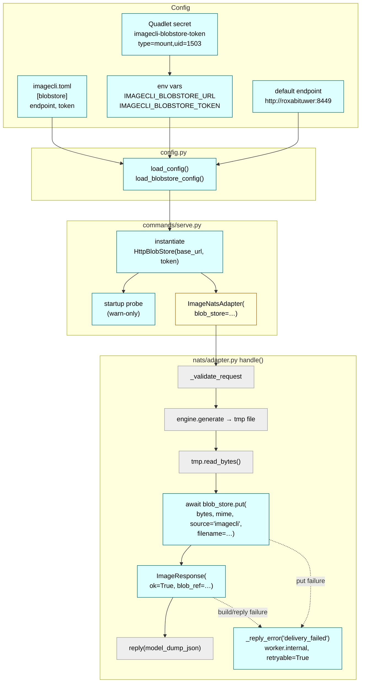
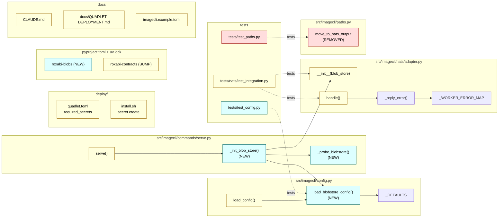

## Summary

Catch-up to upstream `lyra#1064` (V2 BlobRef contract) + `lyra#1330` (HttpBlobStore). Three vertical slices: wire `HttpBlobStore` client + Quadlet secret + warn-only probe (no behavior change) → atomic contract pin bump + NATS adapter rewrite + tests → config tests + docs + final validate. 18 micro-tasks across 5 waves; max parallelism = 5 agents in Wave 1.

## Architecture

### Data flow



### File × function map



## Agents

| Agent | Instances | Task count | Files |
|---|---|---|---|
| backend-dev | A, B | 5 | `src/imagecli/config.py`, `src/imagecli/commands/serve.py`, `src/imagecli/nats/adapter.py`, `src/imagecli/paths.py` |
| devops | A, B | 4 | `pyproject.toml`, `uv.lock`, `deploy/quadlet.toml`, `deploy/install.sh` |
| tester | A, B, C | 6 | `tests/nats/test_integration.py`, `tests/test_config.py`, `tests/test_paths.py` (validate run) |
| doc-writer | A, B | 3 | `imagecli.example.toml`, `CLAUDE.md`, `docs/QUADLET-DEPLOYMENT.md` |

## Wave Structure

5 waves, max 5 parallel agents in Wave 1. Elapsed ~3–4 sessions vs ~10 sequential.

| Wave | Trigger | Agents | Tasks |
|------|---------|--------|-------|
| 1 | start | 5 ∥ | doc-writer-A: T1 · backend-dev-A: T2 · devops-A: T3 · devops-B: T4 · doc-writer-B: T7 |
| 2 | Wave 1 done | 3 ∥ | devops-B: T5 · backend-dev-A: T6 · doc-writer-A: T17 |
| 2-GATE | Wave 2 done | — | RED-GATE-S1: `uv sync && imagecli serve --help` succeeds, no behavior change |
| 3 | Wave 2-GATE | 1 | tester-B: T8→T9→T10 (sequential, same instance) |
| 3-GATE | Wave 3 done | — | RED-GATE-S2-A: 3 new tests **fail** against pre-V2 lock (correct RED) |
| 4 | Wave 3-GATE | 2 sequential | devops-A: T11 → backend-dev-B: T12→T13→T14 |
| 4-GATE | Wave 4 done | — | RED-GATE-S2-B: `pytest tests/nats/` passes ∧ `grep -rE "image_b64\|file_path" src/imagecli/nats/` returns 0 |
| 5 | Wave 4-GATE | 2 ∥ → 1 | tester-A: T15, T16 ∥ → tester-C: T18 |
| 5-GATE | Wave 5 done | — | RED-GATE-S3: `uv run ruff check . && uv run pyright && uv run pytest` all green |

### Budget — per task

| Task | Class | Est. ops |
|------|-------|----------|
| T1 example.toml stub | trivial | 2 |
| T2 config loader | judgmental | 5 |
| T3 add roxabi-blobs dep | bounded | 3 |
| T4 Quadlet secret decl | bounded | 2 |
| T5 install.sh secret create | bounded | 3 |
| T6 HttpBlobStore wiring + probe | judgmental | 5 |
| T7 QUADLET-DEPLOYMENT.md rotation | bounded | 2 |
| T8 RED happy-path test | judgmental | 4 |
| T9 RED put-failure test | bounded | 3 |
| T10 RED post-PUT/pre-reply test | bounded | 2 |
| T11 contracts pin bump | trivial | 1 |
| T12 adapter __init__ refactor | bounded | 3 |
| T13 adapter handle() refactor | judgmental | 6 |
| T14 remove move_to_nats_output | bounded | 2 |
| T15 remove paths test | trivial | 2 |
| T16 config loader tests | judgmental | 4 |
| T17 CLAUDE.md note | bounded | 2 |
| T18 final validate | bounded | 3 |

**Total estimated ops: 54.**

### Budget — per agent instance

| Instance | Tasks | Σ ops | Subjects | Split? |
|----------|-------|-------|----------|--------|
| backend-dev-A | T2, T6 | 10 | config-loader, http-startup | — |
| backend-dev-B | T12, T13, T14 | 11 | nats-adapter | — |
| devops-A | T3, T11 | 4 | deps | — |
| devops-B | T4, T5 | 5 | quadlet-secret | — |
| tester-A | T15, T16 | 6 | paths-tests, config-tests | — |
| tester-B | T8, T9, T10 | 9 | nats-adapter-tests | — |
| tester-C | T18 | 3 | validate | — |
| doc-writer-A | T1, T17 | 4 | config-docs | — |
| doc-writer-B | T7 | 2 | quadlet-runbook | — |

No splits required.

## Consistency Report

| Spec section | Covered by | Note |
|---|---|---|
| C1 (toml) | T1 | ✓ |
| C2 (env) | T2 | ✓ |
| C3 (Quadlet secret) | T4, T5 | ✓ |
| C4 (rotation runbook) | T7 | ✓ |
| N1 (adapter __init__) | T12 | ✓ |
| N2 (handle refactor + single try) | T13 | ✓ |
| N3 (error map row) | T13 | ✓ no-op (kept) |
| N4 (startup probe) | T6 | ✓ |
| D1 (roxabi-blobs dep) | T3 | ✓ |
| D2 (contracts pin bump) | T11 | ✓ |
| S1 (startup wiring) | T6 | ✓ |
| T1 (happy-path test) | T8 | ✓ |
| T2 (error-path tests) | T9, T10 | ✓ split into put-fail + post-PUT/pre-reply |
| T3 (config tests) | T16 | ✓ |
| X1 (cleanup move_to_nats_output) | T14, T15 | ✓ |
| SC #1 pyproject roxabi-blobs | T3 | ✓ |
| SC #2 lock past e99cc6a | T11 | ✓ |
| SC #3 grep zero image_b64 | T13 + RED-GATE-S2-B | ✓ |
| SC #4 adapter ok=True blob_ref | T13 + T8 | ✓ |
| SC #5 single-try wrap | T13 | ✓ |
| SC #6 happy-path blob_ref fields | T8 | ✓ |
| SC #7 two error-path tests | T9, T10 | ✓ |
| SC #8 config precedence | T2 + T16 | ✓ |
| SC #9 startup probe warn | T6 | ✓ |
| SC #10 example.toml [blobstore] | T1 | ✓ |
| SC #11 quadlet secret + install.sh | T4, T5 | ✓ |
| SC #12 QUADLET-DEPLOYMENT rotation | T7 | ✓ |
| SC #13 move_to_nats_output removed | T14, T15 | ✓ |
| SC #14 contract_version validates | T8 (assertion) | ✓ |
| SC #15 ruff+pyright+pytest pass | T18 | ✓ |

**Covered: 15/15 affordances · 15/15 success criteria.** No untraced tasks.

## Micro-Tasks

### Slice 1 — Config + wiring + secret (no behavior change)

#### T1 — Add `[blobstore]` stub to `imagecli.example.toml`

- **File:** `imagecli.example.toml`
- **Description:** Append a `[blobstore]` section (commented) showing endpoint + token shape; note canonical M₁ URL.
- **Snippet:**
  ```toml
  # [blobstore]
  # endpoint = "http://roxabituwer:8449"   # M₁ lyra-blobstore.container
  # token    = ""                          # prefer Quadlet secret / env
  ```
- **Verify:** `grep -F "[blobstore]" imagecli.example.toml`
- **Expected:** match exists
- **Time:** 2 min · `[P]` · `doc-writer-A` · subject: config-docs · trace: C1, SC#10 · slice: V1 · phase: GREEN · diff: 1

#### T2 — Add blobstore config loader in `src/imagecli/config.py`

- **File:** `src/imagecli/config.py`
- **Description:** Add `load_blobstore_config() -> dict` that resolves `endpoint` + `token` with precedence `imagecli.toml [blobstore]` > env (`IMAGECLI_BLOBSTORE_URL`, `IMAGECLI_BLOBSTORE_TOKEN`) > defaults (`endpoint = "http://roxabituwer:8449"`; `token = None`). Reuse the existing `_find_config` walker.
- **Snippet:**
  ```python
  _BLOBSTORE_DEFAULT_ENDPOINT = "http://roxabituwer:8449"

  def load_blobstore_config() -> dict[str, str | None]:
      """Resolve {endpoint, token} from toml > env > default."""
      raw: dict = {}
      path = _find_config()
      if path is not None:
          with path.open("rb") as f:
              raw = tomllib.load(f).get("blobstore", {}) or {}
      endpoint = raw.get("endpoint") or os.environ.get("IMAGECLI_BLOBSTORE_URL") \
                 or _BLOBSTORE_DEFAULT_ENDPOINT
      token = raw.get("token") or os.environ.get("IMAGECLI_BLOBSTORE_TOKEN")
      return {"endpoint": endpoint, "token": token}
  ```
- **Verify:** `uv run python -c "from imagecli.config import load_blobstore_config; print(load_blobstore_config())"`
- **Expected:** dict with `endpoint` non-None
- **Time:** 5 min · `[P]` · `backend-dev-A` · subject: config-loader · trace: C2, SC#8 · slice: V1 · phase: GREEN · diff: 2

#### T3 — Add `roxabi-blobs` dep + `uv lock`

- **File:** `pyproject.toml`, `uv.lock`
- **Description:** Add `roxabi-blobs` under `[project.dependencies]` and under `[tool.uv.sources]` with `git = "https://github.com/Roxabi/lyra.git", subdirectory = "packages/roxabi-blobs", branch = "staging"` (mirror existing `roxabi-contracts` source). Run `uv lock` to update lockfile.
- **Snippet:**
  ```toml
  # [project.dependencies] additions
  "roxabi-blobs",

  # [tool.uv.sources] additions
  roxabi-blobs = { git = "https://github.com/Roxabi/lyra.git", subdirectory = "packages/roxabi-blobs", branch = "staging" }
  ```
- **Verify:** `grep -A1 'name = "roxabi-blobs"' uv.lock`
- **Expected:** entry with `source = { git = ... subdirectory=packages%2Froxabi-blobs ...}`
- **Time:** 3 min · `[P]` · `devops-A` · subject: deps · trace: D1, SC#1 · slice: V1 · phase: GREEN · diff: 2

#### T4 — Declare `imagecli-blobstore-token` secret in `deploy/quadlet.toml`

- **File:** `deploy/quadlet.toml`
- **Description:** Extend `required_secrets` to include `imagecli-blobstore-token`, and add a `[[secrets]]` (or equivalent existing-schema) entry declaring the mount type, `uid=1503`, `gid=1503`, `mode=0400`. Match the existing `imagecli-nats-gen` declaration shape.
- **Snippet:** depends on existing `quadlet.toml` schema — mirror the imagecli-nats-gen block exactly with the new name.
- **Verify:** `grep -F "imagecli-blobstore-token" deploy/quadlet.toml`
- **Expected:** ≥1 match (in `required_secrets` and any mount spec)
- **Time:** 3 min · `[P]` · `devops-B` · subject: quadlet-secret · trace: C3, SC#11 · slice: V1 · phase: GREEN · diff: 2

#### T5 — Add idempotent secret creation in `deploy/install.sh`

- **File:** `deploy/install.sh`
- **Description:** Extend the existing secret-creation block (parallel to `imagecli-nats-gen`) to create `imagecli-blobstore-token` if missing. Support `--dry-run`. Document that the actual token value is supplied by the operator at first install (e.g., via an env var or interactive prompt — match existing convention).
- **Verify:** `bash deploy/install.sh --dry-run 2>&1 | grep imagecli-blobstore-token`
- **Expected:** dry-run output mentions the secret create call
- **Time:** 4 min · `backend-dev-A`? no → `devops-B` · subject: quadlet-secret · trace: C3, SC#11 · slice: V1 · phase: GREEN · diff: 2 · blockedBy: T4

#### T6 — Wire `HttpBlobStore` + warn-only startup probe in `src/imagecli/commands/serve.py`

- **File:** `src/imagecli/commands/serve.py`
- **Description:** Add `_init_blob_store()` that reads config via `load_blobstore_config()`, raises if `token` is None (fail-fast), instantiates `HttpBlobStore(base_url=endpoint, token=token)`, and runs a best-effort connectivity probe (e.g., `await httpx.AsyncClient().get(f"{endpoint}/healthz", timeout=2.0)` — adapt to whatever the lyra-blobstore service exposes; on failure log a warning with `log.warning(...)` and return the store unchanged). Pass the returned store to `ImageNatsAdapter(blob_store=...)`. **Do not change adapter behavior** in this slice — adapter still emits b64/file_path under pre-V2 lock.
- **Snippet:** see N4 + S1 in spec breadboard.
- **Verify:** `uv run imagecli serve --help` (must still import + parse)
- **Expected:** exits 0 (help text)
- **Time:** 6 min · `backend-dev-A` · subject: http-startup · trace: N4 + S1, SC#9 · slice: V1 · phase: GREEN · diff: 3 · blockedBy: T2, T3

#### T7 — Add rotation runbook to `docs/QUADLET-DEPLOYMENT.md`

- **File:** `docs/QUADLET-DEPLOYMENT.md`
- **Description:** Add a section parallel to the existing `imagecli-nats-gen` rotation: `podman secret create --replace imagecli-blobstore-token <new-token>`, then `systemctl --user restart imagecli-gen` (mount-type secrets bind at container init).
- **Verify:** `grep -F "imagecli-blobstore-token" docs/QUADLET-DEPLOYMENT.md`
- **Expected:** ≥1 match in the rotation section
- **Time:** 3 min · `[P]` · `doc-writer-B` · subject: quadlet-runbook · trace: C4, SC#12 · slice: V1 · phase: GREEN · diff: 1

#### T17 — Add `[blobstore]` config note to `CLAUDE.md`

- **File:** `CLAUDE.md`
- **Description:** Add a brief line in the Config section pointing to the new `[blobstore]` toml stanza and the env-var fallback. Keep terse (≤3 lines).
- **Verify:** `grep -F "[blobstore]" CLAUDE.md`
- **Expected:** ≥1 match
- **Time:** 2 min · `[P]` · `doc-writer-A` · subject: config-docs · trace: SC#10 (indirect) · slice: V1 · phase: GREEN · diff: 1 · blockedBy: T1

#### RED-GATE-S1 — Smoke

- **Trigger:** all Slice 1 tasks (T1-T7, T17) done
- **Verify:** `uv sync && uv run imagecli serve --help`
- **Expected:** clean exit, no import errors. The worker is still pre-V2 (emits b64/file_path) — that's correct for slice 1.

### Slice 2 — Atomic contract migration (RED → GREEN → REFACTOR)

#### T8 (RED) — Happy-path test asserting `blob_ref`

- **File:** `tests/nats/test_integration.py`
- **Description:** Add a test fixture `mock_blob_store` that returns a canned `BlobRef(store_key="ck-test", content_hash="0"*64, mime="image/png", size=68, source="imagecli")`. Write `test_handle_success_returns_blob_ref` exercising the full `handle()` path; assert response payload has `blob_ref.store_key`, `blob_ref.content_hash`, `blob_ref.mime`, `blob_ref.size`, and contains **no** `image_b64` and **no** `file_path` keys.
- **Verify:** `uv run pytest tests/nats/test_integration.py::test_handle_success_returns_blob_ref`
- **Expected (RED):** **FAIL** against pre-V2 lock (adapter still emits image_b64/file_path)
- **Time:** 5 min · `tester-B` · subject: nats-adapter-tests · trace: T1, SC#6 · slice: V2 · phase: RED · diff: 3

#### T9 (RED) — Error-path test: `put()` raises

- **File:** `tests/nats/test_integration.py`
- **Description:** Add `test_handle_blobstore_put_failure_returns_delivery_failed`. Mock `blob_store.put` to raise `httpx.HTTPError("simulated")`. Assert `ImageResponse(ok=False, error="delivery_failed", worker_error.code="worker.internal", worker_error.retryable=True)`.
- **Verify:** `uv run pytest tests/nats/test_integration.py::test_handle_blobstore_put_failure_returns_delivery_failed`
- **Expected (RED):** **FAIL** (no blob_store wired yet)
- **Time:** 3 min · `tester-B` · subject: nats-adapter-tests · trace: T2, SC#7 · slice: V2 · phase: RED · diff: 2 · blockedBy: T8

#### T10 (RED) — Error-path test: post-PUT / pre-reply failure

- **File:** `tests/nats/test_integration.py`
- **Description:** Add `test_handle_reply_failure_after_put_returns_delivery_failed`. Mock `blob_store.put` to return a `BlobRef`, then mock `self.reply()` to raise. Assert the eventual reply (via `_reply_error`) is `delivery_failed/worker.internal/retryable=True`. The leaked blob is acceptable (server-side TTL).
- **Verify:** `uv run pytest tests/nats/test_integration.py::test_handle_reply_failure_after_put_returns_delivery_failed`
- **Expected (RED):** **FAIL**
- **Time:** 3 min · `tester-B` · subject: nats-adapter-tests · trace: T2, SC#7 · slice: V2 · phase: RED · diff: 2 · blockedBy: T9

#### RED-GATE-S2-A — Tests fail with pre-V2 lock

- **Trigger:** T8, T9, T10 written
- **Verify:** `uv run pytest tests/nats/test_integration.py -k "blob_ref or delivery_failed" -x`
- **Expected:** all three new tests **FAIL** (correct RED — code change not yet applied)

#### T11 (GREEN) — Bump `roxabi-contracts` pin

- **File:** `uv.lock`
- **Description:** `uv lock --upgrade-package roxabi-contracts`. Confirm new resolved commit > 2026-05-22 (lyra#1064 merge). `grep -F "e99cc6a" uv.lock` returns zero.
- **Verify:** `grep -F "e99cc6a" uv.lock || echo "OK: e99cc6a no longer pinned"`
- **Expected:** `OK: e99cc6a no longer pinned`
- **Time:** 2 min · `devops-A` · subject: deps · trace: D2, SC#2 · slice: V2 · phase: GREEN · diff: 1 · blockedBy: RED-GATE-S2-A

#### T12 (GREEN) — `ImageNatsAdapter.__init__` accepts `blob_store`

- **File:** `src/imagecli/nats/adapter.py`
- **Description:** Add required keyword arg `blob_store: BlobStore` to `__init__`. Stash on `self._blob_store`. Update import: `from roxabi_blobs.protocol import BlobStore`.
- **Verify:** `uv run pyright src/imagecli/nats/adapter.py`
- **Expected:** no new errors
- **Time:** 3 min · `backend-dev-B` · subject: nats-adapter · trace: N1 · slice: V2 · phase: GREEN · diff: 2 · blockedBy: T11

#### T13 (GREEN) — Refactor `handle()` (drop b64/file branches, single-try wrap)

- **File:** `src/imagecli/nats/adapter.py`
- **Description:** In `handle()` (lines ~201-280), remove the `output_mode` branching, the `image_b64` encoding + 750KB cap, and the `file_path_str`/`move_to_nats_output` branch. Replace with a single block: read bytes, `await self._blob_store.put(image_bytes, mime=f"image/{fmt}", source="imagecli", filename=f"{request_id}.{fmt}")` → `ImageResponse(ok=True, blob_ref=…, mime_type=…, …)`. Wrap PUT + response build + `await self.reply(...)` in ONE `try` block so any exception (PUT or reply) routes to `_reply_error("delivery_failed")`. Keep `_WORKER_ERROR_MAP["delivery_failed"]` row unchanged.
- **Verify:** `grep -nE "image_b64|file_path|move_to_nats_output|output_mode" src/imagecli/nats/adapter.py | grep -v '^\s*#'`
- **Expected:** zero non-comment matches
- **Time:** 8 min · `backend-dev-B` · subject: nats-adapter · trace: N2, SC#3, SC#4, SC#5 · slice: V2 · phase: GREEN · diff: 4 · blockedBy: T12

#### T14 (REFACTOR) — Remove `move_to_nats_output()` from `src/imagecli/paths.py`

- **File:** `src/imagecli/paths.py`
- **Description:** Confirm no caller remains (`grep -rF "move_to_nats_output" src/ tests/` — only the test file should reference it). Remove the function and its `__all__` entry. If `~/.roxabi/imagecli/nats_out/` directory init is also handled by this helper, ensure no other code paths rely on the directory existing.
- **Verify:** `grep -F "move_to_nats_output" src/ -r 2>/dev/null`
- **Expected:** zero matches (only test file removed in T15)
- **Time:** 2 min · `backend-dev-B` · subject: nats-adapter · trace: X1, SC#13 · slice: V2 · phase: REFACTOR · diff: 1 · blockedBy: T13

#### RED-GATE-S2-B — Atomic migration green

- **Trigger:** T11–T14 done
- **Verify:** `uv run pytest tests/nats/ && grep -nrE "image_b64|file_path" src/imagecli/nats/ | grep -v '^\s*#' | wc -l`
- **Expected:** all nats tests pass ∧ count is 0

### Slice 3 — Config tests + final validate

#### T15 — Remove `move_to_nats_output` test in `tests/test_paths.py`

- **File:** `tests/test_paths.py`
- **Description:** Delete the test function(s) referencing `move_to_nats_output`. Leave the rest of the file intact.
- **Verify:** `grep -F "move_to_nats_output" tests/test_paths.py`
- **Expected:** zero matches
- **Time:** 2 min · `[P]` · `tester-A` · subject: paths-tests · trace: X1, SC#13 · slice: V3 · phase: REFACTOR · diff: 1 · blockedBy: T14

#### T16 — Config loader tests

- **File:** `tests/test_config.py`
- **Description:** Add `test_load_blobstore_from_toml` (write tmp toml with `[blobstore] endpoint=…`), `test_load_blobstore_from_env` (set env vars, expect them honored when toml absent), `test_load_blobstore_default_endpoint` (no toml, no env → default `http://roxabituwer:8449`), `test_load_blobstore_missing_token_fail_fast` (verify the wiring side raises if token is None — test the assertion in `_init_blob_store`).
- **Verify:** `uv run pytest tests/test_config.py -k blobstore`
- **Expected:** 4 tests pass
- **Time:** 5 min · `[P]` · `tester-A` · subject: config-tests · trace: T3, SC#8 · slice: V3 · phase: GREEN · diff: 3 · blockedBy: T2, T6

#### T18 — Final validate

- **File:** (runner)
- **Description:** Run `uv run ruff check . && uv run ruff format --check . && uv run pyright && uv run pytest`. Fix any incidental failures (whitespace, unused imports) inline.
- **Verify:** see command above
- **Expected:** all gates exit 0
- **Time:** 5 min · `tester-C` · subject: validate · trace: SC#15 · slice: V3 · phase: REFACTOR · diff: 1 · blockedBy: T15, T16

#### RED-GATE-S3 — All quality gates green

- **Trigger:** T18 done
- **Verify:** `uv run ruff check . && uv run pyright && uv run pytest`
- **Expected:** exit 0 across all three

## Task Seeding Blueprint

<!-- Used by /implement to seed TaskCreate calls on session start.
     Format: T{n} | agent-instance | blockedBy | subject
     blockedBy refs T-numbers within this list (not session task IDs).
     Agent instances are named so parallel tasks map to distinct spawned agents.
     Seed in wave order; within a wave all rows marked [P] are parallel (∥). -->

### Wave 1 — no deps, 5 agents ∥

| Task | Agent instance | blockedBy | Subject |
|------|---------------|-----------|---------|
| T1 | doc-writer-A | — | config-docs |
| T2 | backend-dev-A | — | config-loader |
| T3 | devops-A | — | deps |
| T4 | devops-B | — | quadlet-secret |
| T7 | doc-writer-B | — | quadlet-runbook |

### Wave 2 — after Wave 1, 3 agents ∥

| Task | Agent instance | blockedBy | Subject |
|------|---------------|-----------|---------|
| T5 | devops-B | T4 | quadlet-secret |
| T6 | backend-dev-A | T2, T3 | http-startup |
| T17 | doc-writer-A | T1 | config-docs |

### Wave 3 — after Wave 2 + RED-GATE-S1, 1 agent

| Task | Agent instance | blockedBy | Subject |
|------|---------------|-----------|---------|
| T8 | tester-B | T6 | nats-adapter-tests |
| T9 | tester-B | T8 | nats-adapter-tests |
| T10 | tester-B | T9 | nats-adapter-tests |

### Wave 4 — after Wave 3 + RED-GATE-S2-A, 1 agent at a time (sequential)

| Task | Agent instance | blockedBy | Subject |
|------|---------------|-----------|---------|
| T11 | devops-A | T10 | deps |
| T12 | backend-dev-B | T11 | nats-adapter |
| T13 | backend-dev-B | T12 | nats-adapter |
| T14 | backend-dev-B | T13 | nats-adapter |

### Wave 5 — after Wave 4 + RED-GATE-S2-B, 2 agents ∥ then 1

| Task | Agent instance | blockedBy | Subject |
|------|---------------|-----------|---------|
| T15 | tester-A | T14 | paths-tests |
| T16 | tester-A | T2, T6 | config-tests |
| T18 | tester-C | T15, T16 | validate |

## Task IDs

<!-- Generated by /plan. Used by /implement to resume tasks on session restart. -->
- T1: 13 — config-docs (doc-writer-A)
- T2: 14 — config-loader (backend-dev-A)
- T3: 15 — deps (devops-A)
- T4: 16 — quadlet-secret (devops-B)
- T5: 17 — quadlet-secret (devops-B)
- T6: 18 — http-startup (backend-dev-A)
- T7: 19 — quadlet-runbook (doc-writer-B)
- T8: 20 — nats-adapter-tests RED (tester-B)
- T9: 21 — nats-adapter-tests RED (tester-B)
- T10: 22 — nats-adapter-tests RED (tester-B)
- T11: 23 — deps (devops-A)
- T12: 24 — nats-adapter (backend-dev-B)
- T13: 25 — nats-adapter (backend-dev-B)
- T14: 26 — nats-adapter (backend-dev-B)
- T15: 27 — paths-tests (tester-A)
- T16: 28 — config-tests (tester-A)
- T17: 29 — config-docs (doc-writer-A)
- T18: 30 — validate (tester-C)
