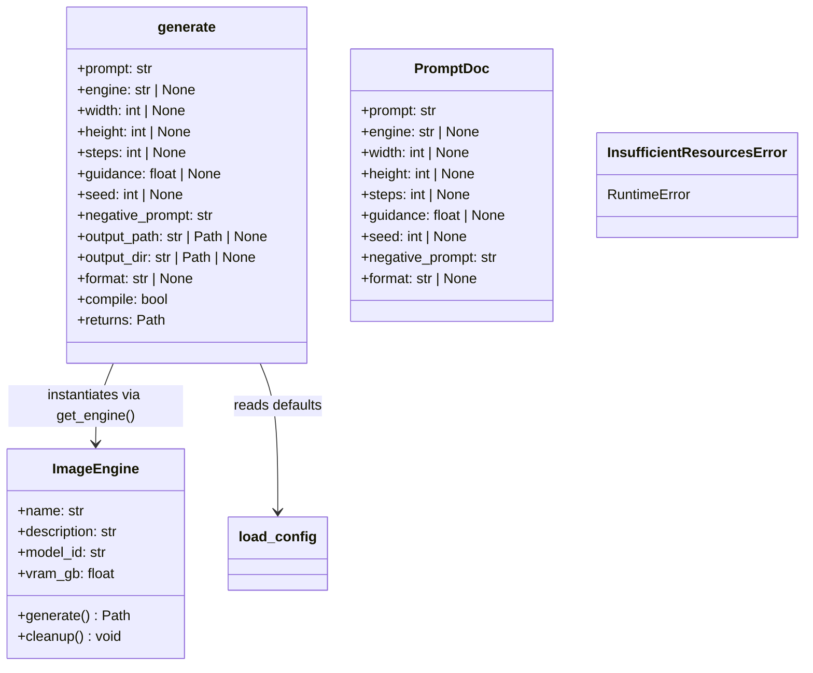
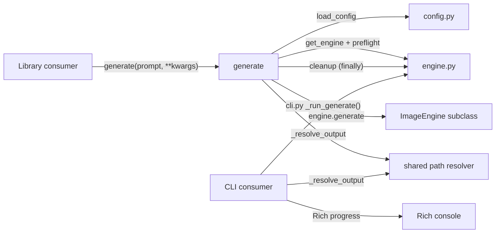

## Context

imageCLI is CLI-only. Core logic is already decoupled from CLI concerns but `__init__.py` exports nothing. This spec defines the public Python API surface so other projects can `from imagecli import generate`.

## Goal

Expose a stable, importable Python API that lets callers generate images with a single function call, without shelling out to the CLI.

## Users

- **Primary:** Python developers integrating image generation into scripts, services, or pipelines
- **Secondary:** imageCLI maintainers — explicit `__all__` clarifies public vs. internal

## Expected Behavior

### Simple usage

```python
from imagecli import generate

path = generate("a cat in space")
# => PosixPath('images/images_out/image.png')
```

### With options

```python
from imagecli import generate

path = generate(
    "a cat in space",
    engine="flux1-dev",
    width=1280,
    height=720,
    steps=30,
    guidance=4.0,
    seed=42,
    negative_prompt="blurry, ugly",
    output_path="my_image.png",
    format="png",
    compile=True,
)
```

### Advanced usage (reuse engine)

```python
from imagecli import get_engine, preflight_check
from pathlib import Path

engine = get_engine("flux1-dev")
preflight_check(engine)

try:
    for i, prompt in enumerate(prompts):
        engine.generate(prompt, output_path=Path(f"output_{i}.png"))
finally:
    engine.cleanup()
```

Note: when using `engine.generate()` directly, callers are responsible for preflight, cleanup, and output path resolution (no anti-clobber suffixing). The convenience `generate()` handles all of this.

### Behavior details

- `generate()` loads config defaults from `imagecli.toml` (same walk-up logic as CLI)
- Explicit kwargs override config defaults. `None` kwargs fall through to config. Priority: **kwarg > config > hardcoded default**
- `generate()` signature uses `None` sentinels for all optional params — actual defaults come from `load_config()`
- `generate()` handles preflight check, engine instantiation, generation, and cleanup (in `finally`) internally
- No Rich/Typer output — library is silent (no progress bars, no console prints, no `warnings.warn`)
- `engine.py` bare `print()` calls in `_optimize_pipe()` and `_quantize_transformer()` must be converted to `logging.info()` / `logging.warning()` so library consumers can control output via standard logging config
- Errors raise Python exceptions (`InsufficientResourcesError`, `ValueError`, etc.) — no `sys.exit()`
- `output_path` takes precedence over `output_dir` + auto-naming
- When neither `output_path` nor `output_dir` is given, uses config's `output_dir` default with anti-clobber suffix (`_1`, `_2`, etc.)
- `generate()` accepts only `str` prompts, not `.md` file paths. To use `.md` files, call `parse_prompt_file()` then pass `doc.prompt` and fields to `generate()`
- Not thread-safe — GPU state (`_tf32_set`, `torch.cuda.*`) is process-global. Concurrent calls from multiple threads are unsupported

### Output path resolution

The anti-clobber logic (`_resolve_output`) currently lives in `cli.py`. For the library API, move it to a shared `_resolve_output()` in `engine.py` (or a thin `_utils.py`) so both `cli.py` and `generate()` can use it without duplication.

## Data Model & Consumers





| Consumer | Fields consumed | When | Status |
|---|---|---|---|
| `generate()` top-level | all kwargs + config defaults | library call | this issue |
| `cli.py _run_generate()` | same params via CLI flags/config | CLI invocation | existing (unchanged) |
| Future callers (pipelines) | `generate()` return value (Path) | post-generation | future |

## Breadboard

| Affordance | ID | Handler | Data |
|---|---|---|---|
| `generate(prompt, **kwargs)` | U1 | `__init__.generate` | config + kwargs → Path (handles preflight, load, gen, cleanup) |
| `get_engine(name, compile=True)` | U2 | `engine.get_engine` | engine name + compile flag → ImageEngine |
| `list_engines()` | U3 | `engine.list_engines` | → list[dict] |
| `preflight_check(engine)` | U4 | `engine.preflight_check` | engine → None or raises InsufficientResourcesError |
| `parse_prompt_file(path)` | U5 | `markdown.parse_prompt_file` | Path → PromptDoc |
| `load_config()` | U6 | `config.load_config` | → dict |
| Type exports | T1 | re-exports | `ImageEngine`, `PromptDoc`, `InsufficientResourcesError` |

## Slices

| # | Slice | Affordances | Demo |
|---|---|---|---|
| 1 | Re-exports + `__all__` + convert `print()` to `logging` | U2–U6, T1 | `from imagecli import get_engine` works; engine load uses logging not print |
| 2 | Convenience `generate()` + shared `_resolve_output` | U1 | `from imagecli import generate; generate("cat")` returns Path to image |
| 3 | API docs | — | `docs/api.md` documents all public symbols with examples |

## Success Criteria

- [ ] `from imagecli import generate` works without error
- [ ] `from imagecli import get_engine, list_engines, preflight_check` works
- [ ] `from imagecli import ImageEngine, PromptDoc, InsufficientResourcesError` works
- [ ] `from imagecli import parse_prompt_file, load_config` works
- [ ] `__all__` is defined and lists all public symbols
- [ ] `generate("prompt")` returns a `Path` object to the saved image
- [ ] `generate()` applies config defaults from `imagecli.toml` when kwargs are `None`
- [ ] `generate()` handles preflight, engine load, generation, and cleanup (in `finally`) internally
- [ ] `generate()` raises `InsufficientResourcesError` on preflight failure (not `sys.exit()`)
- [ ] `generate()` produces no output to stdout or stderr (no Rich, no `print()`, no `warnings.warn`)
- [ ] `engine.py` `print()` calls replaced with `logging.info()` / `logging.warning()`
- [ ] `output_path` kwarg takes precedence over `output_dir` + auto-naming
- [ ] Anti-clobber suffix logic (`_1`, `_2`) works in library `generate()` via shared `_resolve_output`
- [ ] `generate(compile=False)` passes through to engine, skipping `torch.compile`
- [ ] CLI (`imagecli generate "prompt"`) still works identically (no breaking changes)
- [ ] `docs/api.md` documents all public symbols with usage examples
- [ ] Unit test verifies `__all__` matches actual exports
