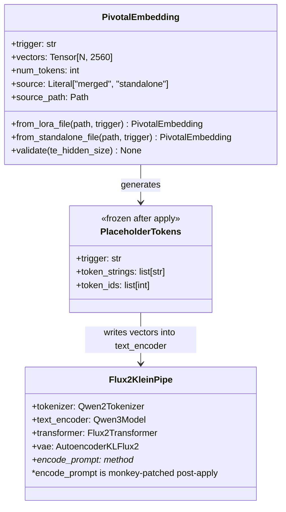
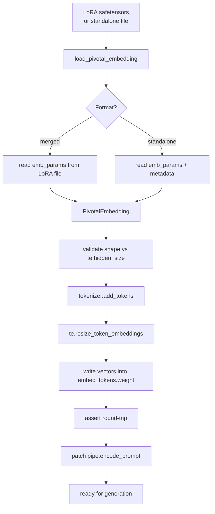
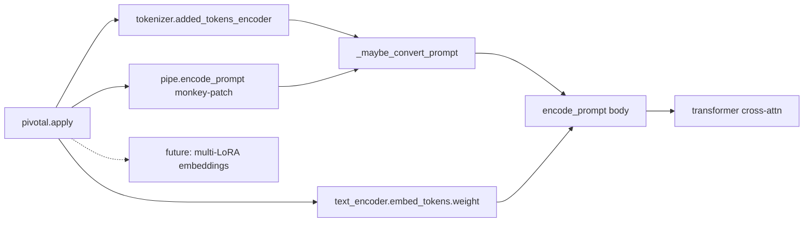

## Context

Promoted from `artifacts/analyses/31-pivotal-tuning-embeddings-analysis.mdx` (approved 2026-04-05).

Shape 1 locked: a single new `src/imagecli/pivotal.py` module (~100 LOC) called from each Klein engine's `_load_pipeline` between LoRA fuse/unload and transformer quantization. Engine injection point is **after `unload_lora_weights()` and before `transformer.to("cuda")`** on fp4 (keeps TE writes on CPU) / before `quantize(transformer)` on quanto FP8.

## Goal

Make a pivotal-trained ai-toolkit LoRA (`network:` + `embedding:` blocks) produce images through imageCLI that reflect the trained trigger word, on `flux2-klein` and `flux2-klein-fp4`.

## Users

- **Primary:** Mickael — blocked V23b (Lyra pivotal attribution run) and all future identity LoRAs that need pivotal tuning to tighten trigger-word semantics at 16 GB VRAM
- **Secondary:** any imageCLI user who enables ai-toolkit's `embedding:` block in training — currently hitting the silent drop without realizing it

## Expected Behavior

### Happy path (merged format — primary use case)

```bash
imagecli generate "lyraface standing in a field, cinematic lighting" \
  --lora ./v23b_lyraface_000002000.safetensors \
  --trigger lyraface
```

1. CLI parses flags → threads `lora_path`, `trigger` into the engine constructor
2. Engine loads pipeline (bf16), loads LoRA, fuses, unloads
3. Engine calls `pivotal.apply_pivotal_to_pipe(pipe, lora_path, trigger)`:
   - Reads `emb_params` tensor from the LoRA safetensors (shape `(N, 2560)`)
   - Validates shape vs `te.config.hidden_size`, raises on mismatch
   - Derives placeholder tokens: `[lyraface, lyraface_1, lyraface_2, ..., lyraface_{N-1}]`
   - `tokenizer.add_tokens(placeholder_tokens)` — must add exactly N tokens
   - `te.resize_token_embeddings(len(tokenizer))`
   - Writes `emb_params[i]` into `embed_tokens.weight[placeholder_ids[i]]` for each i
   - Runs deterministic assertion (Success Criteria SC-6)
   - Monkey-patches `pipe.encode_prompt` to run `_maybe_convert_prompt` on the input prompt before delegating
4. Engine quantizes transformer (unchanged)
5. Generation proceeds. The user's prompt `"lyraface standing..."` is rewritten inside the patched `encode_prompt` to `"lyraface lyraface_1 lyraface_2 lyraface_3 standing..."` before tokenization. The trained vectors flow into the transformer via cross-attention.

### Frontmatter variant

```markdown
---
engine: flux2-klein-fp4
lora_path: /absolute/or/relative/to/this/file/v23b_lyraface_000002000.safetensors
trigger: lyraface
---
lyraface standing in a field, cinematic lighting
```

Same flow. CLI flag `--trigger` overrides frontmatter if both are present.

### Standalone embedding file (secondary support)

```bash
imagecli generate "lyraface cat" \
  --lora ./v23b_lora_000002000.safetensors \
  --embedding ./lyraface000002000.safetensors \
  --trigger lyraface
```

`--embedding` takes precedence over `emb_params` in the LoRA file. Trigger still required (can be auto-detected from metadata `name`, but flag is recommended for explicitness).

### Error paths

| Condition | Behavior |
|---|---|
| LoRA contains `emb_params` + no `--trigger`/frontmatter/standalone file | **Hard error**: `LoRA contains emb_params (pivotal tuning) but no trigger was provided. Pass --trigger <word> or set trigger: in frontmatter. Without a trigger the embeddings are silently ignored.` |
| `emb_params.shape[-1] != te.config.hidden_size` | **Hard error**: `Pivotal embedding dim (N) does not match text encoder hidden_size (2560). LoRA was likely trained against a different base model.` |
| `emb_params.ndim != 2` or `shape[0] < 1` or `shape[0] > 32` | **Hard error**: `Invalid emb_params shape {shape}: expected (N, 2560) with 1 <= N <= 32.` |
| `--trigger` provided but no `emb_params` found anywhere | **Warning + continue** (degraded to vanilla LoRA): `--trigger provided but no embedding weights found. Continuing with LoRA only.` |
| `--trigger` provided + no `--lora` + no `--embedding` | **Warning + continue**: `--trigger provided but no LoRA or embedding file was given. Trigger has no effect.` |
| Prompt at inference already contains `{trigger}_1` (manual pre-expansion) | **Warning** (once per load): `Prompt already contains placeholder '{trigger}_1' — possible double-expansion. Write the bare trigger once and let pivotal.py expand it.` |
| `tokenizer.add_tokens` returns fewer than N | **Hard error**: `Trigger {trigger} (or its suffixes) already exist in the tokenizer vocabulary. Use a different trigger word.` |
| Safetensors unreadable | **Hard error** (standard safetensors error propagates) |

## Data Model & Consumers

### Pivotal Embedding data shape



### Data flow at load time



### Consumer map



### Consumer summary

| Consumer | Fields used | When | Status |
|---|---|---|---|
| `_maybe_convert_prompt` (copied helper) | `tokenizer.added_tokens_encoder` | Every `encode_prompt` call | **this issue** |
| `text_encoder.forward` (unchanged) | `embed_tokens.weight[placeholder_ids]` | Every `encode_prompt` call | **this issue** |
| Deterministic assertion | `token_ids`, `vectors`, `embed_tokens.weight[token_ids]` | Once at `apply_pivotal_to_pipe` return | **this issue** |
| `flux2_klein.py::_load_pipeline` | `apply_pivotal_to_pipe(pipe, path, trigger)` | After LoRA fuse/unload, before quantize | **this issue** |
| `flux2_klein_fp4.py::_load_pipeline` | same | Same load-order slot | **this issue** |
| `flux2_klein_fp8.py::_load_pipeline` | same | Same load-order slot | **this issue** (bonus — see SC-8) |
| Multi-LoRA with independent embeddings | `apply_pivotal_to_pipe(pipe, path_i, trigger_i)` × K | — | future (out of scope) |
| diffusers upstream mixin | (replaces our code if ever adopted) | — | future (correct long-term follow-up) |

## Breadboard

### Affordances

**CLI affordances (`src/imagecli/cli.py`)**

| ID | Name | Location | Handler | Data |
|----|------|----------|---------|------|
| U1 | `--trigger <word>` flag | `generate` command | threads into `_run_generate` → `get_engine(trigger=...)` | string |
| U2 | `--trigger <word>` flag | `batch` command | threads into `get_engine` per-engine | string |
| U3 | `--embedding <path>` flag | `generate` command | threads into `get_engine(embedding_path=...)` | Path |
| U4 | `--embedding <path>` flag | `batch` command | threads into `get_engine` per-engine | Path |
| U5 | Log line on first load | `generate` / `batch` (existing logger) | emits `INFO Pivotal: loaded N tokens for '<trigger>' from <path>` (INFO once per load); on first `_maybe_convert_prompt` rewrite per load, emits `INFO Pivotal: expanded 'trigger' → 'trigger trigger_1 ... trigger_{N-1}'`, subsequent rewrites at DEBUG | string |

**Frontmatter affordances (`src/imagecli/markdown.py`)**

| ID | Name | Field | Type | Default |
|----|------|-------|------|---------|
| N1 | `trigger` | `PromptDoc.trigger` | `str \| None` | None |
| N2 | `embedding_path` | `PromptDoc.embedding_path` | `str \| None` | None |

**Library affordances (`src/imagecli/pivotal.py` — new)**

| ID | Name | Signature | Raises |
|----|------|-----------|--------|
| L1 | `PivotalEmbedding` dataclass | `(trigger, vectors, num_tokens, source, source_path)` | — |
| L2 | `load_pivotal_embedding(lora_path, trigger, *, embedding_path=None)` | `→ PivotalEmbedding \| None` | `ValueError` on shape/format issues, `FileNotFoundError` |
| L3 | `apply_pivotal_to_pipe(pipe, pivotal)` | `→ list[int]` (placeholder_ids) | `ValueError` on tokenizer/TE wire-up issues, `AssertionError` on round-trip mismatch |
| L4 | `_maybe_convert_prompt(prompt, tokenizer)` | `→ str` | — |
| L5 | `_patch_encode_prompt(pipe)` | `→ None` (mutates instance) | — |
| L6 | `detect_pivotal_in_lora(lora_path)` | `→ bool` (has `emb_params` key) | — |

**Engine integration (`src/imagecli/engine.py` + engines + CLI plumbing)**

| ID | Name | Location | Handler |
|----|------|----------|---------|
| S1 | `ImageEngine.__init__` accepts `trigger`, `embedding_path` | base class | stores on `self` |
| S1.5 | `_run_generate(..., trigger, embedding_path)` | `cli.py:55-76` | threads into `get_engine` (currently only has `lora_path`, `lora_scale`) |
| S2 | `get_engine(..., trigger, embedding_path)` | registry | threads through |
| S2.5 | `batch` command single-engine path `get_engine` call | `cli.py:316-319` | threads `trigger`/`embedding_path` from CLI flags + first file's frontmatter |
| S2.6 | `_batch_sequential` mid-loop `get_engine` construction | `cli.py:558-564` | resolves `trigger`/`embedding_path` from `lora_override`/doc at the construction site, not just at top-level `batch` |
| S3 | `_load_pipeline` hook | `flux2_klein.py` | calls L2 + L3 between LoRA fuse/unload and `quantize(transformer)` |
| S4 | `_load_pipeline` hook | `flux2_klein_fp4.py` | **after `unload_lora_weights()` (line 331), before `transformer.to("cuda")` (line 333)** — TE is on CPU in bf16, no GPU conflict. Also covers the no-LoRA + standalone-`--embedding` branch (lines 338-345) when `embedding_path` is set without a LoRA |
| S5 | `_load_pipeline` hook | `flux2_klein_fp8.py` | same slot (bonus, SC-13) |

**Wiring**

```
CLI[--trigger,--embedding]
  └→ _run_generate(..., trigger, embedding_path)
       └→ get_engine(trigger=, embedding_path=)
            └→ ImageEngine(trigger=, embedding_path=)
                 └→ engine._load_pipeline()
                      ├→ load_pipeline + load_lora + fuse + unload
                      ├→ if lora_path and (trigger or embedding_path):
                      │     pivotal = load_pivotal_embedding(lora, trigger, embedding_path)
                      │     if pivotal:
                      │         apply_pivotal_to_pipe(pipe, pivotal)
                      │         # round-trip assert inside
                      │         _patch_encode_prompt(pipe)
                      └→ quantize(transformer)
```

## Slices

| # | Slice | Scope | Demo criterion | Blocks |
|---|-------|-------|----------------|--------|
| 1 | **Pivotal library core** | `src/imagecli/pivotal.py` (L1, L2, L4, L6), unit tests for loader + `_maybe_convert_prompt`. No engine wiring yet. | `pytest tests/test_pivotal.py` green: loads merged + standalone fixtures, validates shapes, rejects bad inputs, `_maybe_convert_prompt` rewrites correctly | 2, 3 |
| 2 | **flux2-klein wire-up + assertion** | Extend `ImageEngine.__init__` (S1), `_run_generate` (S1.5), `get_engine` (S2), `cli.py` `--trigger`/`--embedding` on `generate` (U1, U3) **and log line** (U5), `markdown.py` (N1, N2), engine hook in `flux2_klein.py` (S3), apply + `_patch_encode_prompt` (L3, L5). Round-trip assertion SC-6 runs at load. | `imagecli generate "lyraface cat" --lora X.safetensors --trigger lyraface -e flux2-klein` succeeds, log shows `Pivotal: loaded N tokens for 'lyraface'`, assertion passes | 3, 4 |
| 3 | **flux2-klein-fp4 wire-up** | Engine hook in `flux2_klein_fp4.py` (S4). Verify NVFP4 runtime quantize leaves TE untouched (already true per architect review). | Same command with `-e flux2-klein-fp4` succeeds, assertion passes on NVFP4 | 4 |
| 4 | **Batch + visual A/B + docs** | `batch` command flags (U2, U4, S2.5, S2.6), docs in `docs/lora.md` + CLAUDE.md, smoke-test recipe. Train 250-step pivotal LoRA in ai-toolkit, generate WITH + WITHOUT the fix, confirm visual diff. | `imagecli batch prompts_in/ --lora X --trigger lyraface` works on a mixed dir; **A/B images visually differ at the face**; artifacts saved under `~/.roxabi/forge/lyra/brand/V24-pivotal-verification/` with filenames including seed and engine, plus a one-paragraph directory README naming the LoRA step and the silent-drop failure mode this closes | (optional) 5 |
| 5 | **flux2-klein-fp8 (bonus)** | Engine hook in `flux2_klein_fp8.py` (S5), docs update to list the third engine. | `imagecli generate ... -e flux2-klein-fp8 --trigger ...` succeeds | — |

**Dependency order:** 1 → 2 → 3 → 4 → (optional 5). Slice 2 is the first demonstrably-working user-visible state. Slice 4 is where acceptance ships. Slice 5 can be deferred to a follow-up issue if slice 4 runs over.

## Success Criteria

- [ ] **SC-1** `from imagecli.pivotal import PivotalEmbedding, load_pivotal_embedding, apply_pivotal_to_pipe, _maybe_convert_prompt, _patch_encode_prompt, detect_pivotal_in_lora` succeeds without error
- [ ] **SC-2a** `load_pivotal_embedding` reads the **merged format** (`emb_params` key inside a LoRA safetensors file alongside LoRA state keys) and returns a `PivotalEmbedding` with `source == "merged"`
- [ ] **SC-2b** `load_pivotal_embedding` reads the **standalone format** (`emb_params` tensor + metadata `string_to_param = {"*": "emb_params"}`, filename `{trigger}{step_num}.safetensors`) and returns a `PivotalEmbedding` with `source == "standalone"`
- [ ] **SC-3** Shape validation hard-errors on each of: `emb_params.ndim != 2`, `shape[0] < 1`, `shape[0] > 32`, `shape[-1] != te.config.hidden_size`. Covered by four unit tests, one per condition
- [ ] **SC-4** `emb_params` present in LoRA file + no trigger resolved (no `--trigger`, no frontmatter `trigger:`, no unambiguous sibling file) → raises an error whose message includes the substring `--trigger` and names the silent-drop failure mode
- [ ] **SC-5a** `apply_pivotal_to_pipe` calls `tokenizer.add_tokens(placeholder_tokens)` and asserts the return value equals `N = emb_params.shape[0]`; raises if fewer were added
- [ ] **SC-5b** `apply_pivotal_to_pipe` is independent of `unload_lora_weights` — calling `pipe.unload_lora_weights()` AFTER `apply_pivotal_to_pipe` leaves `tokenizer.added_tokens_encoder[trigger]` and `embed_tokens.weight[placeholder_ids[0]]` unchanged (unit test with a mock `unload_lora_weights` that is a no-op for TE/tokenizer)
- [ ] **SC-6** Deterministic round-trip assertion at load time (inside `apply_pivotal_to_pipe`, run on every pivotal load):
  ```python
  assert tokenizer.convert_tokens_to_ids(trigger) == placeholder_ids[0]
  te_rows = te.get_input_embeddings().weight[placeholder_ids].detach().float().cpu()
  src    = vectors.detach().float().cpu()
  assert torch.allclose(te_rows, src, atol=1e-2), "pivotal round-trip failed"
  ```
  `atol=1e-2` is the correct bound: `emb_params` is typically stored as fp32 by ai-toolkit, the TE is bf16, and fp32→bf16→fp32 round-trip introduces error up to ~7.8e-3 (one bf16 ULP at magnitude 1). `1e-6` would always fail; `1e-2` still catches a completely wrong row (random-init) while tolerating the expected precision loss
- [ ] **SC-7** Pivotal inference works on `flux2-klein` (quanto FP8) end-to-end: engine loads, SC-6 assertion passes, `imagecli generate "lyraface cat" --lora … --trigger lyraface -e flux2-klein` writes a valid PNG, peak VRAM within ±0.2 GB of the baseline LoRA path
- [ ] **SC-8** Pivotal inference works on `flux2-klein-fp4` (NVFP4) end-to-end: engine loads, SC-6 assertion passes after `_runtime_quantize_transformer_to_nvfp4`, `imagecli generate … -e flux2-klein-fp4` writes a valid PNG
- [ ] **SC-9** Visual A/B: same pivotal LoRA + same seed + prompt containing the bare trigger, run WITH the fix vs WITHOUT (git-checkout a pre-fix commit for the "without" half). Generated images visibly differ at the face. Artifact directory `~/.roxabi/forge/lyra/brand/V24-pivotal-verification/` contains:
  - `before_seed<N>_<engine>.png` (no-pivotal)
  - `after_seed<N>_<engine>.png` (with-pivotal)
  - `README.md` with: the LoRA checkpoint step, the seed, the engine, a one-sentence note on the silent-drop failure mode this verifies
- [ ] **SC-10** Batch mode (`imagecli batch … --lora … --trigger …`) works on `flux2-klein` 2-phase AND all-on-GPU paths (phase-1 hits `encode_prompt` which has the patch; phase-2 consumes pre-computed embeddings and inherits the expansion). Test with ≥2 prompt files
- [ ] **SC-11a** Unit tests in `tests/test_pivotal.py` — loader: merged format, standalone format, shape mismatch (each of SC-3's four conditions), missing trigger (SC-4), emb_params absent (degraded warning path)
- [ ] **SC-11b** Unit tests in `tests/test_pivotal.py` — `_maybe_convert_prompt`: single-vector expansion, multi-vector expansion, trigger absent from prompt (no-op), trigger substring collision (e.g. `lyraface` vs `lyrafaces`), double-expansion warning fires when `trigger_1` already in prompt
- [ ] **SC-12** `docs/lora.md` has a "Pivotal tuning inference" section documenting: `--trigger` flag, `--embedding` flag, frontmatter fields, the **"bare trigger once"** user rule (prompt expansion is not idempotent on manual pre-expansion), the supported engines. CLAUDE.md markdown-frontmatter block lists `trigger:` and `embedding_path:` fields
- [ ] **SC-13** (conditional) `flux2-klein-fp8` (torchao) supports pivotal OR a follow-up issue is filed. **Deferral rule:** if slices 1–4 consume more than 1.5× the appetite estimate (>1.5 days code + >4.5 h verification), implement agent stops before slice 5, files a follow-up issue, and reports the decision to the user. Otherwise slice 5 ships in this PR

## χ Items (non-blocking — resolved inline)

All previously open clarifications have been resolved in the sections above:

- ~~χ-1 standalone sibling glob~~ — resolved in Error Paths + Wiring: auto-detect only if exactly one `{trigger}*.safetensors` match in the LoRA directory; error on ambiguity; `--embedding` always takes precedence
- ~~χ-2 fp8 deferral cutoff~~ — resolved in SC-13: 1.5× appetite threshold, implement agent decides, follow-up issue filed
- ~~χ-3 log volume~~ — resolved in U5 breadboard row: INFO on first load + first rewrite per load, DEBUG thereafter

No open χ items. `/plan` is unblocked.
