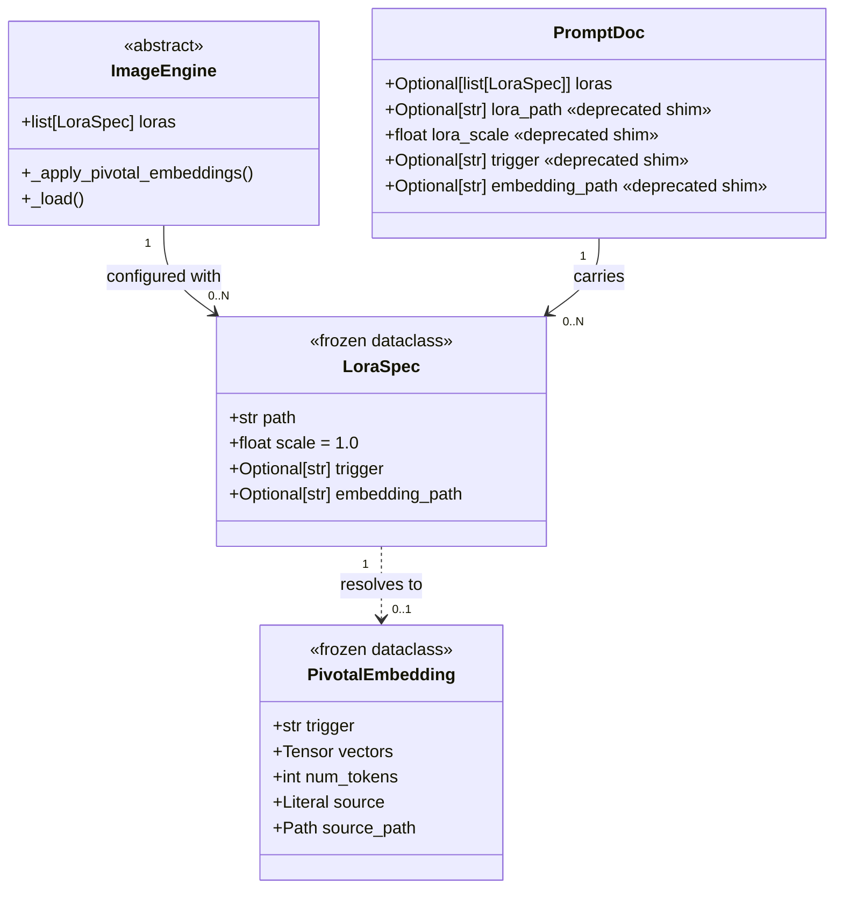

## Context

- **Source:** GitHub issue #34, frame `artifacts/frames/34-multi-lora-pivotal-stacking-frame.mdx`, analysis `artifacts/analyses/34-multi-lora-pivotal-stacking-analysis.mdx`.
- **Promoted from:** analysis — Shape C recommended (frontmatter `loras:` list + repeatable CLI flags, with singular fields as N=1 shortcut).
- **Depends on:** #31 / PR #32 (singular pivotal path), #57 (engine split placing `_apply_pivotal_embeddings` on the base class).

## Goal

Users of `flux2-klein` / `flux2-klein-fp8` can load N ≥ 1 ai-toolkit pivotal-tuned LoRAs in a single generation, each with its own trigger and pivotal embedding, with all current correctness invariants preserved and the singular-flag path unchanged.

## Users

- **Primary:** imageCLI users composing two identity-locked subjects in one frame (downstream: Lyra multi-agent gen).
- **Secondary:** single-LoRA users (backward compat — N=1 path must be byte-identical); future engines inheriting `_apply_pivotal_embeddings`.

## Expected Behavior

A user with two ai-toolkit pivotal LoRAs at `/p/lyra.sft` (trigger `lyraface`) and `/p/mick.sft` (trigger `mickface`) writes a markdown prompt:

```markdown
---
engine: flux2-klein
loras:
  - path: /p/lyra.sft
    trigger: lyraface
  - path: /p/mick.sft
    trigger: mickface
---

A photo of lyraface and mickface standing side by side in a park.
```

Running `imagecli generate prompt.md` produces an image where both identities are visible. Under the hood:

1. `markdown.py` parses `loras:` into a list of dicts; compat shim converts any singular `lora_path:` / `trigger:` / `embedding_path:` to a one-element `loras:` list (raises if both forms coexist).
2. `generate.py` passes `loras: list[LoraSpec]` to the engine constructor.
3. `Flux2KleinEngine._load_pipeline` loads each LoRA as a named adapter, sets per-adapter scales, calls `fuse_lora()` once (diffusers merges all adapters into the base in a single pass), unloads adapters.
4. `_apply_pivotal_embeddings()` iterates: calls `load_pivotal_embedding` per spec, collects valid `PivotalEmbedding`s, calls **new** `apply_pivotals_to_pipe(pipe, pivotals: list[PivotalEmbedding])` which performs an atomic multi-trigger tokenizer pre-check, adds all tokens in one `add_tokens` call, resizes the TE once, writes N blocks of vectors, and runs the per-LoRA round-trip assertion.
5. `_patch_encode_prompt(pipe)` installs the prompt-expansion monkey-patch exactly once (sentinel attribute `pipe._imagecli_pivotal_patched = True`).
6. Generation proceeds; `_maybe_convert_prompt` expands both `lyraface` → `lyraface lyraface_1 …` and `mickface` → `mickface mickface_1 …` in a single pass.

CLI override: `imagecli generate prompt.md --lora /p/other.sft --trigger other` **replaces** the frontmatter `loras:` list with a one-element list (matches override semantics for other fields like `--steps`). Mixing `--lora` with frontmatter `loras:` is not "append" — it is "replace."

Daemon path (`daemon.py` / NATS): threads `loras` list through same as CLI. No N=1 boundary.

## Data Model & Consumers

### Core types



### Consumer map

```mermaid
flowchart LR
    MD[markdown.py\nparser] -->|PromptDoc.loras| CLI[commands/generate.py\ncommands/batch.py]
    CLI_FLAGS["--lora / --trigger / ..."] -->|override policy| CLI
    CLI -->|loras: list[LoraSpec]| ENG[ImageEngine.__init__]
    DAEMON[daemon.py\nNATS ingress] -->|loras: list[LoraSpec]| ENG
    ENG -->|self.loras| LOAD[_load_pipeline\nper-engine]
    LOAD -->|iter LoRAs| FUSE[diffusers\nload_lora_weights\nfuse_lora]
    ENG -->|self.loras| APPLY[_apply_pivotal_embeddings\nbase class]
    APPLY -->|per spec| LOADP[pivotal_load\nload_pivotal_embedding]
    LOADP -->|list[PivotalEmbedding]| APPLYP[pivotal_apply\napply_pivotals_to_pipe NEW]
    APPLYP --> PATCH[_patch_encode_prompt\nidempotent]
```

### Consumer summary

| Consumer | Fields consumed | When | Status |
|---|---|---|---|
| `markdown.py` (parser) | `loras:` list + singular shim | File parse | this issue |
| `commands/generate.py` | `--lora`/`--trigger`/`--lora-scale`/`--embedding` (repeatable) | CLI invocation | this issue |
| `commands/batch.py` | same as generate | Batch invocation | this issue |
| `commands/_helpers.py` | `loras: list[LoraSpec]` | Engine construction | this issue |
| `daemon.py` | `loras` in request payload | NATS message | this issue |
| `ImageEngine.__init__` | `loras: list[LoraSpec]` (+ deprecated singular shim) | Engine init | this issue |
| `flux2_klein._load_pipeline` | `self.loras` | First generate | this issue |
| `flux2_klein_fp8._load_pipeline` | `self.loras` | First generate | this issue |
| `flux2_klein_fp4._load_pipeline` | `self.loras` (raise on any LoRA — existing behavior) | First generate | this issue (raise msg update only) |
| `_apply_pivotal_embeddings` (base) | `self.loras` | After LoRA fuse | this issue |
| `apply_pivotals_to_pipe` **new** | `list[PivotalEmbedding]` | After `_apply_pivotal_embeddings` load | this issue |
| `_maybe_convert_prompt` | `tokenizer.added_tokens_encoder` (N triggers) | Each `encode_prompt` call | unchanged |
| `_patch_encode_prompt` | `pipe` | Once per load (idempotent) | this issue (idempotency guard) |

## Breadboard

### Affordances — CLI

| ID | Affordance | Handler | Data |
|---|---|---|---|
| U1 | `--lora PATH` (repeatable) | `generate.py` / `batch.py` Typer option | `list[Path]` |
| U2 | `--trigger WORD` (repeatable) | same | `list[str]` |
| U3 | `--lora-scale F` (repeatable) | same | `list[float]` |
| U4 | `--embedding PATH` (repeatable) | same | `list[Path]` |
| U5 | Mismatched count validation | CLI-entry validator in `_helpers.py` | raise if `len(lora) != len(trigger)` etc. (see edge cases) |

### Affordances — Frontmatter

| ID | Affordance | Handler | Data |
|---|---|---|---|
| N1 | `loras:` YAML list | `markdown.py:parse_prompt_file` | `list[dict]` → `list[LoraSpec]` |
| N2 | Singular `lora_path:` / `trigger:` / `embedding_path:` / `lora_scale:` | same (compat shim) | folded into 1-element `loras:` |
| N3 | Mixed-form rejection | `markdown.py` validator | raise if both `loras:` and any singular field present |

### Affordances — Engine / pivotal

| ID | Affordance | Handler | Data |
|---|---|---|---|
| S1 | `ImageEngine.__init__(loras=[...])` | `engine_base.py` | stored as `self.loras` |
| S2 | Deprecated singular kwargs (`lora_path=`, `trigger=`, etc.) | `engine_base.py` compat shim | folded into `self.loras`; raise on mixed use |
| S3 | `_apply_pivotal_embeddings` loop | `engine_base.py` | calls `load_pivotal_embedding` per spec, collects, delegates |
| S4 | `apply_pivotals_to_pipe(pipe, pivotals)` **new** | `pivotal_apply.py` | atomic multi-trigger tokenizer pre-check + apply |
| S5 | Idempotent `_patch_encode_prompt` | `pivotal_apply.py` | sentinel attr `pipe._imagecli_pivotal_patched` |
| S6 | Adapter-named LoRA load + fuse | `flux2_klein.py:_load_pipeline` (+ fp8 mirror) | `load_lora_weights(path, adapter_name=f"lora_{i}")` |
| S7 | FP4 LoRA rejection (existing — message update) | `flux2_klein_fp4.py` | raise `ValueError` if `self.loras` |

### Wiring

```
parse prompt file (N1,N2,N3) → PromptDoc.loras
                                      │
CLI flags (U1..U4) --------------+    │
                                 ↓    ↓
                         _helpers.py: resolve_loras()
                         (override policy: CLI non-empty ⇒ replace)
                                      │
                                      ↓
                         ImageEngine(loras=[LoraSpec...])  (S1,S2)
                                      │
                                      ↓
                         _load_pipeline (S6)
                         load+fuse each, then
                         _apply_pivotal_embeddings (S3)
                                      │
                                      ↓
                         apply_pivotals_to_pipe (S4)
                         _patch_encode_prompt (S5)
                                      │
                                      ↓
                         generate  → _maybe_convert_prompt (unchanged)
                         expands all N triggers in the prompt
```

## Slices

| # | Slice | Demo | Scope |
|---|---|---|---|
| 1 | Internal data model + engine shim | Unit tests: `LoraSpec` frozen dataclass; `ImageEngine(loras=[...])` stores; singular kwargs fold into list; mixed-use raises. No user-visible change yet. | `engine_base.py`, new/updated tests |
| 2 | Atomic multi-trigger pivotal apply | Unit tests: `apply_pivotals_to_pipe` with N=1 (parity w/ old `apply_pivotal_to_pipe`), N=2 distinct triggers, N=2 with cross-collision (raises atomically — no tokenizer mutation), per-LoRA round-trip. Idempotent `_patch_encode_prompt` guard. | `pivotal_apply.py`, `tests/test_pivotal.py` |
| 3 | Klein engine multi-LoRA fuse path | Integration test: stub `load_lora_weights` / `fuse_lora` in `flux2_klein._load_pipeline`, assert N adapters loaded with correct names + scales, `fuse_lora` called once, `unload_lora_weights` called. Mirror in fp8. FP4 raise-message updated. | `engines/flux2_klein.py`, `engines/flux2_klein_fp8.py`, `engines/flux2_klein_fp4.py` |
| 4 | Markdown `loras:` list parsing | Unit tests: parse `loras:` list into `list[LoraSpec]`; singular fields still work; mixed form raises; empty list treated as "no LoRA." | `markdown.py`, `tests/test_markdown.py` |
| 5 | CLI repeatable flags + override policy | Unit+integration: `--lora` repeated N times with matching `--trigger`, mismatched counts raise, CLI non-empty replaces frontmatter list. | `commands/generate.py`, `commands/batch.py`, `commands/_helpers.py` |
| 6 | Daemon + NATS threading | Integration: NATS ingress accepts `loras` list in payload; passes through unchanged. | `daemon.py`, `nats/adapter.py` |
| 7 | Docs + smoke test | `docs/lora.md` updated with multi-LoRA section; end-to-end smoke (markdown → engine → stubbed pipe) proves the full wiring. | `docs/lora.md`, `tests/test_lora_multi.py` |

Slices 1–5 are sequential (each uses the previous). Slice 6 can parallelize with 4–5 once Slice 1 lands. Slice 7 is last.

## Success Criteria

- [ ] `LoraSpec` is a frozen dataclass with fields `path: str`, `scale: float = 1.0`, `trigger: str | None = None`, `embedding_path: str | None = None`.
- [ ] `ImageEngine.__init__` accepts `loras: list[LoraSpec] | None = None`; stores as `self.loras: list[LoraSpec]` (never `None`).
- [ ] Passing both `loras=[...]` and any singular kwarg (`lora_path`, `trigger`, `lora_scale`, `embedding_path`) to `ImageEngine.__init__` raises `ValueError` with a message naming both fields.
- [ ] Passing only singular kwargs constructs a one-element `self.loras` equal to `[LoraSpec(path=lora_path, scale=lora_scale, trigger=trigger, embedding_path=embedding_path)]` when `lora_path` is set; `[]` otherwise.
- [ ] `apply_pivotals_to_pipe(pipe, pivotals: list[PivotalEmbedding])` exists and is the primary entry point; the old singular `apply_pivotal_to_pipe` continues to work (calls the plural internally with a one-element list).
- [ ] `apply_pivotals_to_pipe` atomically validates every trigger (+ its `_1..._{n-1}` suffixes) against the existing vocab AND against each other before any tokenizer mutation; on collision, raises `ValueError` naming all colliding tokens and leaves the tokenizer untouched.
- [ ] `apply_pivotals_to_pipe` calls `tok.add_tokens(all_placeholders)` exactly once and `te.resize_token_embeddings(len(tok))` exactly once regardless of N.
- [ ] Each pivotal's round-trip assertion (`atol=5e-2` via `torch.allclose`, explicit `raise RuntimeError`) runs after vector write; failure of any one raises and the load fails.
- [ ] `_patch_encode_prompt` is idempotent: a sentinel attribute `pipe._imagecli_pivotal_patched` is set after first patch; subsequent calls are a no-op.
- [ ] `_maybe_convert_prompt` correctly expands a prompt containing N distinct triggers in a single pass (no ordering dependence between triggers).
- [ ] `Flux2KleinEngine._load_pipeline` iterates `self.loras`: loads each via `load_lora_weights(path, adapter_name=f"lora_{i}")`, sets adapter weights if any `scale != 1.0`, calls `fuse_lora()` once, calls `unload_lora_weights()`. Mirrors the same flow in `Flux2KleinFp8Engine._load_pipeline`.
- [ ] `Flux2KleinFp4Engine` raises `ValueError` with a clear message when `self.loras` is non-empty (update existing behavior if present, or add).
- [ ] `markdown.py` parses a `loras:` list into `PromptDoc.loras: list[LoraSpec] | None`. When absent and any singular LoRA field is present, returns a one-element list. When both forms are present, raises `ValueError`.
- [ ] `commands/generate.py` and `commands/batch.py` accept `--lora`, `--trigger`, `--lora-scale`, `--embedding` as repeatable options. Passing them a non-zero number of times replaces any frontmatter `loras:` entirely. Mismatched counts between these flags (e.g. 2 `--lora` + 1 `--trigger` where pivotal is expected) raise with a clear pairing-error message.
- [ ] Singular CLI usage (`--lora X --trigger Y --lora-scale Z --embedding W`, max 1 of each) remains byte-identical to the pre-change behavior: existing integration tests pass without modification.
- [ ] `daemon.py` / NATS ingress accepts a `loras` list in the request payload and threads it through unchanged. Legacy singular payload keys are still accepted via the same shim.
- [ ] `docs/lora.md` has a "Multi-LoRA stacking" section with a working frontmatter example and an equivalent CLI-flag example.
- [ ] All existing tests pass unmodified; new tests cover N=2 pivotal load, cross-trigger collision, idempotent patch, CLI repeat flags, markdown list parsing, mixed-form rejection.

## Edge Cases

| Case | Handling |
|---|---|
| `loras: []` (empty list) | Treated as "no LoRA" — same as `loras: None`. |
| Duplicate paths in `loras:` | Allowed (user may want to stack same weights with different scales — unusual but not forbidden). Duplicate triggers raise via the atomic pre-check. |
| N=1 `loras:` list | Works identically to singular — the shim-folded list is indistinguishable. |
| Mismatched CLI flag counts (e.g. 2 `--lora`, 0 `--trigger`) | Allowed if none of the LoRAs are pivotal (trigger is optional). Raise only if pivotal detected (`emb_params` in the file) without a matching trigger — same error as today, extended to pairing. |
| `--lora` present but frontmatter has `loras:` | Replace (see override policy). Emit one-line INFO log: `"CLI --lora overrides frontmatter loras: list (N=X)"`. |
| FP4 engine + `loras=[...]` | Raise at engine construction or first `_load`, with message: `"flux2-klein-fp4 does not support LoRA loading (weights are pre-quantized). Use flux2-klein or flux2-klein-fp8."` |
| Cross-trigger collision (`lyra` + `lyraface` where `lyra_1` collides) | Atomic pre-check raises before any mutation; error names both triggers and the colliding suffix. |
| N > 3 | No hard cap, but docs mention practical limit. No enforcement. |
| Single-trigger regression | Covered by "byte-identical singular CLI" criterion — existing integration tests must pass. |

## Risks Carried from Analysis

1. Diffusers multi-adapter `fuse_lora()` semantics — verified in Slice 3 integration test.
2. Daemon re-instantiation — Slice 6 threads through.
3. Prompt expansion ordering — Slice 2 tests `_maybe_convert_prompt` with N distinct triggers.
4. Silent double-patch of `encode_prompt` — S5 sentinel closes it.

## Out of Scope (carried)

- Multi-LoRA without pivotal (simpler; separate feature).
- Runtime hot-swap, per-LoRA scale sweeps.
- FP4 LoRA support.
- Non-Klein engines.
- N>3 stack depth enforcement.
- Deprecation timeline for singular fields (stays as indefinite shim).
