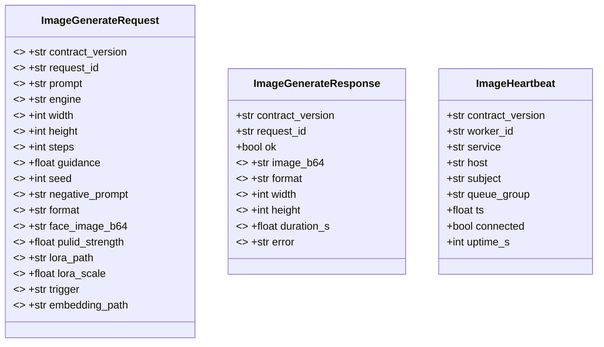
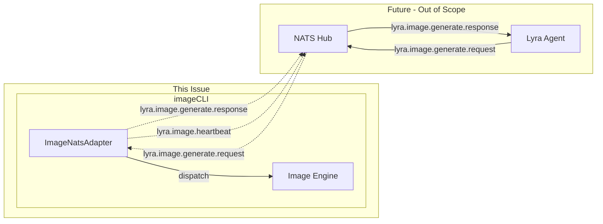

## Context

Promoted from [frame](../frames/50-nats-ingress-frame.mdx). Follows voiceCLI NATS adapter pattern (Roxabi/voiceCLI#42).

## Goal

Enable Lyra agents to request image generation asynchronously via NATS pub/sub, consistent with voicecli STT/TTS pattern.

## Users

- **Primary:** Lyra agents — publish `lyra.image.generate.request`, receive `lyra.image.generate.response`
- **Secondary:** imageCLI users — benefit from async generation triggered by Lyra workflows

## Expected Behavior

### Happy Path

1. Lyra agent publishes a request to `lyra.image.generate.request` with payload containing prompt, engine, and generation params
2. `imagecli nats-serve` subscriber receives the request, validates envelope, dispatches to engine
3. Image generates, result is base64-encoded and published to reply subject
4. Heartbeats published to `lyra.image.heartbeat` every 5s

### Edge Cases

| Scenario | Behavior |
|----------|----------|
| Missing `prompt` field | Reply `ok: false`, `error: "missing_required_field: prompt"` |
| Missing `engine` field | Reply `ok: false`, `error: "missing_required_field: engine"` |
| Unknown engine name | Reply `ok: false`, `error: "unknown_engine: {name}"` |
| `preflight_check()` fails (OOM) | Reply `ok: false`, `error: "insufficient_resources: vram"` |
| Engine `_load()` fails | Reply `ok: false`, `error: "engine_load_failed: {reason}"` |
| Generation exception | Reply `ok: false`, `error: "generation_failed: {exception_msg}"` |
| Missing `msg.reply` subject | Log warning, skip reply (fire-and-forget) |
| NATS connection loss | SDK handles reconnect via `reconnected_cb`; pending requests timeout |
| Invalid `contract_version` | Log warning, proceed normally (defensive read) |

## Data Model & Consumers

### Constructor Params

`ImageNatsAdapter.__init__` passes to `NatsAdapterBase`:
- `subject="lyra.image.generate.request"`
- `queue_group="IMAGE_WORKERS"`
- `envelope_name="image"` — identifies payload type
- `schema_version="1"` — payload schema version (distinct from `contract_version`)
- `heartbeat_subject="lyra.image.heartbeat"` (optional, SDK default)

### Payload Schemas



**Note on LoRA:** LoRA weights are not sent per-request. Instead, `lora_path` is a server-local file path (loaded at satellite startup). Per-request LoRA over NATS would exceed NATS's 1MB default max payload (LoRA files are 10s-100s of MB).

**Note on Heartbeat VRAM:** VRAM fields removed from heartbeat schema. SDK's `heartbeat_payload()` does not include them, and adding them requires overriding the method. Acceptable trade-off — monitoring via separate health endpoint if needed.



### Consumer Table

| Consumer | Fields Consumed | Required? | When | Status |
|----------|----------------|-----------|------|--------|
| ImageNatsAdapter | contract_version, request_id, prompt, engine | ✓ | On request | This issue |
| ImageNatsAdapter | width, height, steps, guidance, seed, negative_prompt, format | ✗ | On request | This issue |
| ImageNatsAdapter | face_image_b64, pulid_strength | ✗ | On request (PuLID engines) | This issue |
| ImageNatsAdapter | lora_path, lora_scale, trigger, embedding_path | ✗ | On request (LoRA) | This issue |
| Lyra Agent | image_b64, format, width, height, duration_s | ✓ | On response | Future |
| NATS Hub | all heartbeat fields | ✓ | Every 5s | This issue |

## Breadboard

### Affordances

| ID | Element | Handler | Data In | Data Out |
|----|---------|----------|---------|----------|
| U1 | `imagecli nats-serve` CLI command | `_nats_serve()` | NATS_URL, engine_name | — |
| U2 | Request message on `lyra.image.generate.request` | `ImageNatsAdapter.handle()` | request payload | response payload |
| N1 | `ImageNatsAdapter` class | Implements `handle()` | NATS connection | heartbeat |
| N2 | `nats_connect()` from roxabi-nats | — | url, nkey seed | NATS client |
| S1 | Heartbeat loop | `_heartbeat_loop()` (SDK base) | health state | heartbeat to `lyra.image.heartbeat` |
| S2 | Reply subject | `msg.reply` | response bytes | — |

### Wiring

```
U1 ──creates──> N1
U1 ──calls──> N2 ──returns──> nc
N1.__init__ ──passes──> NatsAdapterBase(subject, queue_group, envelope_name, schema_version)
N1 ──subscribes──> lyra.image.generate.request (queue: IMAGE_WORKERS)
N1 ──inherits──> S1 (heartbeat loop publishes to lyra.image.heartbeat)
U2 ──triggers──> N1.handle()
N1.handle ──validates──> payload
N1.handle ──dispatches──> Engine.generate
N1.handle ──encodes──> image_b64
N1.handle ──replies──> S2 (msg.reply, ok=true)
N1.handle ──on_error──> S2 (msg.reply, ok=false, error=...)
```

### Error Codes

| Code | When | Example |
|------|------|---------|
| `missing_required_field: {field}` | Request lacks required field | `missing_required_field: prompt` |
| `unknown_engine: {name}` | Engine name not in registry | `unknown_engine: flux3-pro` |
| `insufficient_resources: vram` | `preflight_check()` fails | — |
| `engine_load_failed: {reason}` | Engine `_load()` exception | `engine_load_failed: CUDA OOM` |
| `generation_failed: {msg}` | Generation exception | `generation_failed: timeout` |

## Slices

| # | Name | Demo-able | Acceptance Criteria Covered |
|---|------|-----------|----------------------------|
| 1 | **SDK dependency + imports** | `uv run python -c "from roxabi_nats import NatsAdapterBase, nats_connect, CONTRACT_VERSION"` | pyproject.toml declares roxabi-nats |
| 2 | **ADR documentation** | ADR exists with subject tree + payload contract | ADR added |
| 3 | **Adapter skeleton** | Adapter class compiles, inherits `NatsAdapterBase`, implements `handle()` | Subclasses NatsAdapterBase |
| 4 | **CLI entry point** | `imagecli nats-serve --help` works | CLI entry point exists |
| 5 | **Request handling (unit)** | Unit test: mock payload → `handle()` returns response dict | Uses nats_connect, dispatches to engine |
| 6 | **Integration test** | `uv run pytest tests/nats/` passes against mock NATS server | Integration test passes |

## Success Criteria

- [ ] `pyproject.toml` declares `roxabi-nats` via git source, tag-pinned to `roxabi-nats/v0.1.0`
- [ ] `imagecli nats-serve` CLI entry point exists and shows help
- [ ] Uses `nats_connect()` — no direct `nats.connect()` calls
- [ ] `ImageNatsAdapter` subclasses `NatsAdapterBase`, implements abstract `handle(msg, payload)`
- [ ] Constructor passes: `subject="lyra.image.generate.request"`, `queue_group="IMAGE_WORKERS"`, `envelope_name="image"`, `schema_version="1"`
- [ ] Subscribes to `lyra.image.generate.request` with queue group `IMAGE_WORKERS`
- [ ] Publishes heartbeats to `lyra.image.heartbeat` every 5s (inherited from SDK base)
- [ ] Request payload validation: missing `prompt` → `ok: false`, `error: "missing_required_field: prompt"`
- [ ] Request payload validation: missing `engine` → `ok: false`, `error: "missing_required_field: engine"`
- [ ] Unknown engine name → `ok: false`, `error: "unknown_engine: {name}"`
- [ ] `preflight_check()` failure → `ok: false`, `error: "insufficient_resources: vram"`
- [ ] Generation exception → `ok: false`, `error: "generation_failed: {msg}"`
- [ ] Response payload includes `contract_version: "1"`, `request_id`, `ok`, `image_b64` (on success) or `error` (on failure)
- [ ] Integration test in `tests/nats/` passes against mock NATS server (in-process, not docker-compose)
- [ ] ADR at `docs/architecture/adr/046-imagecli-nats-ingress.mdx` documents subject tree, payload contract, and error codes
