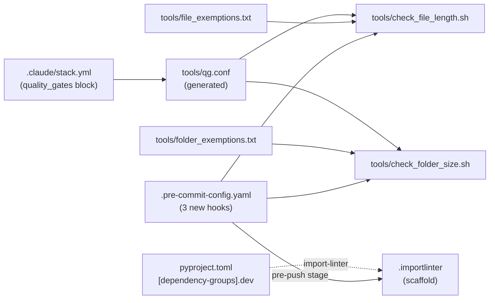

## Context

Promoted from [frame 53-quality-gates-frame.mdx](../frames/53-quality-gates-frame.mdx).

Upstream feature PR [Roxabi/roxabi-plugins#115](https://github.com/Roxabi/roxabi-plugins/pull/115)
ships canonical `quality_gates` guards (file length, folder size, import layers).
The installation is automated by the `/release-setup --force` cookbook
([quality-gates.md](https://github.com/Roxabi/roxabi-plugins/blob/staging/plugins/dev-core/skills/release-setup/cookbooks/quality-gates.md)).

Current `imageCLI` state (audited 2026-04-19):

| Concern | Status |
|---|---|
| `quality_gates:` in `.claude/stack.yml` | absent |
| `tools/check_file_length.sh` / `check_folder_size.sh` | absent (only `license_check.py` present) |
| `.importlinter` | absent |
| `import-linter` in `[dependency-groups].dev` | absent |
| Pre-commit `typecheck` anchor | present (safe for hook insertion) |
| `schema_version` in `stack.yml` | `"1.0"` (satisfies cookbook N1a gate) |

Files over 300 LOC (8 total — audit updates issue-body count of 7):

| File | LOC | Split candidate? |
|---|---|---|
| `src/imagecli/cli.py` | 807 | **Yes** — always split (per issue step 3) |
| `src/imagecli/engines/pulid_flux1_dev.py` | 569 | Audit required |
| `src/imagecli/engines/pulid_flux2_klein.py` | 502 | Audit required |
| `src/imagecli/engine.py` | 501 | Audit required (registry base class) |
| `src/imagecli/engines/flux2_klein_fp4.py` | 476 | Audit required |
| `src/imagecli/daemon.py` | 444 | Audit required |
| `src/imagecli/pivotal.py` | 396 | Audit required |
| `src/imagecli/nats/adapter.py` | 344 | Audit required |

## Goal

Install the dev-core `quality_gates` machinery so `pre-commit run --all-files`
passes on a clean checkout, with every oversized file either split immediately
or exempted via a tracked sub-issue.

## Users

- **Primary:** Mickael — future commits in `imageCLI` are gated by the same
  guards already active across the Roxabi fleet.
- **Secondary:** Downstream consumers (`lyra`, `roxabi-idna`) — consistent code
  hygiene baseline across all `imageCLI` dependants.

## Expected Behavior

**Happy path:** Developer runs `git commit`. Pre-commit chain runs
`check_file_length.sh` + `check_folder_size.sh` + existing hooks. Pre-push
runs `lint-imports`. All pass because every oversized file is listed in
`tools/file_exemptions.txt` with a tracking issue, and no currently-present
folder is over the size threshold.

**Adding a new oversized file:** File-length hook fails with a path + LOC
count. Developer either (a) refactors below threshold, or (b) adds an
exemption line referencing a tracking issue URL.

**Adding a cross-layer import:** `lint-imports` fails at pre-push (scaffolded
config has no active contracts yet — emits "No contracts" success until
contracts are added in a future issue).

## Data Model & Consumers

| Consumer | Reads | When | Status |
|---|---|---|---|
| `check_file_length.sh` | `qg.conf` (thresholds), `file_exemptions.txt` | pre-commit on `*.py` | this issue |
| `check_folder_size.sh` | `qg.conf`, `folder_exemptions.txt` | pre-commit (all) | this issue |
| `lint-imports` | `.importlinter` | pre-push | this issue (no active contracts) |
| Future contract work | `.importlinter` | separate issue | out of scope |

## Breadboard

No new UI/API surface — infra-only change. The "affordances" are files the
developer edits to manage exemptions.

| Affordance | Handler | Data |
|---|---|---|
| Edit `tools/file_exemptions.txt` | Checked by `check_file_length.sh` on pre-commit | `<path> <issue-url>` per line |
| Edit `tools/folder_exemptions.txt` | Checked by `check_folder_size.sh` on pre-commit | `<path> <issue-url>` per line |
| Edit `.importlinter` contracts | Checked by `lint-imports` on pre-push | INI-style contract blocks |
| Edit `quality_gates:` in `stack.yml` | Regenerates `tools/qg.conf` on next `/release-setup` | YAML config |

## Slices

Each slice lands in the same PR but is independently verifiable. Order matters:
S1 produces the machinery that S2's sub-issues reference, and S3's exemptions
reference those sub-issues.

| # | Slice | Verification |
|---|-------|--------------|
| S1 | Add `quality_gates:` to `stack.yml`, run `/release-setup --force` cookbook (installs scripts, seeds exemption headers, adds `import-linter` dep, scaffolds `.importlinter`, wires 3 pre-commit hooks after `typecheck`). | `tools/check_*.sh` diff-clean vs canonical; `.importlinter` present; `import-linter>=2.0,<3.0` in `[dependency-groups].dev`; hook IDs `check-file-length`, `check-folder-size`, `import-layers` present in `.pre-commit-config.yaml` after `id: typecheck`; `import-layers` has `stages: [pre-push]`. |
| S2 | Audit the 8 oversized files listed in Context → decide per-file whether to split in this PR or defer. File one sub-issue per deferred split. | GitHub sub-issues filed, linked to #53. Each sub-issue has title + scope + acceptance criteria. `cli.py` split sub-issue always filed (issue step 3). |
| S3 | Seed `tools/file_exemptions.txt` with one line per deferred oversized file (from S2's audit), each pointing at its sub-issue URL. Verify `pre-commit run --all-files` is green. | `pre-commit run --all-files` exits 0. |

## Success Criteria

- [ ] `.claude/stack.yml` contains `quality_gates:` with all 3 sub-blocks (`file_length`, `folder_size`, `import_layers`) each `enabled: true`
- [ ] `tools/check_file_length.sh` and `tools/check_folder_size.sh` present, executable, and `diff -q` clean against the canonical source at `${CLAUDE_PLUGIN_ROOT}/tools/<script>.sh` (resolved by the cookbook; verification re-runs `/release-setup --force` and confirms cookbook reports `no-op` for both scripts)
- [ ] `tools/file_exemptions.txt` and `tools/folder_exemptions.txt` present with header comment
- [ ] `tools/qg.conf` generated with values matching `stack.yml`
- [ ] `.importlinter` present with `[importlinter]` header and `root_packages = imagecli`
- [ ] `import-linter>=2.0,<3.0` appears in `[dependency-groups].dev` in `pyproject.toml`
- [ ] `uv.lock` includes `import-linter`
- [ ] `.pre-commit-config.yaml` contains `check-file-length`, `check-folder-size`, and `import-layers` hooks inserted after `id: typecheck`; `import-layers` hook has `stages: [pre-push]`
- [ ] Sub-issue filed for `src/imagecli/cli.py` split (linked from `file_exemptions.txt`)
- [ ] Sub-issue filed for every file listed in the Context oversized-files table that is not split in this PR
- [ ] `tools/file_exemptions.txt` has one line per unsplit file from the Context table, each referencing its sub-issue URL
- [ ] `pre-commit run --all-files` exits 0 on a clean checkout

## Edge Cases

| Case | Handling |
|---|---|
| Script drift vs canonical (cookbook warns without `--force`) | Run with `--force` (mandated by issue step 1) — re-stamps files |
| `PyYAML` strips comments from `.pre-commit-config.yaml` | Known cookbook limitation; re-inspect diff, restore any lost comments post-run |
| An audited engine file is split in this PR | No exemption line needed; sub-issue not filed for that file |
| Sub-issue creation fails (gh API) | Block S3 until sub-issues exist — exemption lines without tracking URLs violate acceptance criteria |
| New contracts added to `.importlinter` during audit | Out of scope — contracts are a separate future issue |
