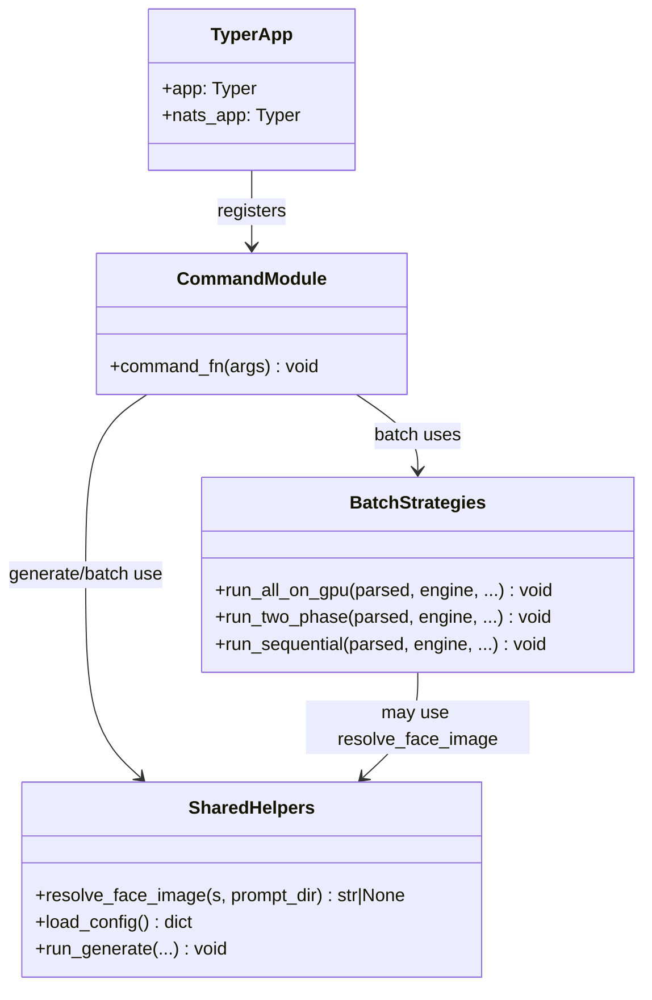
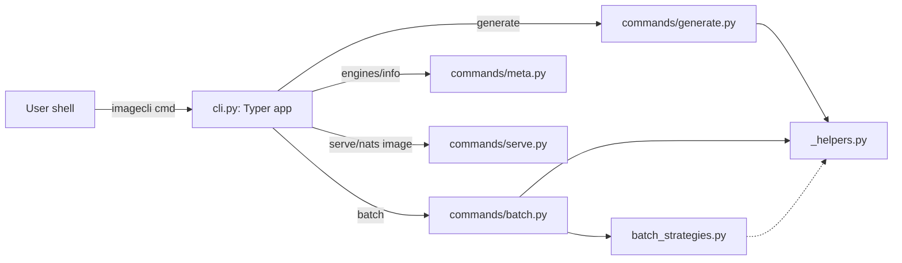

## Context

Promoted from `artifacts/frames/54-split-cli-py-by-command-group-frame.mdx`. Parent: #53 (quality_gates install). `src/imagecli/cli.py` is 807 LOC (exempted in `tools/file_exemptions.txt`); the batch strategy helpers are intertwined with CLI state and engine dispatch per the #53 audit finding.

## Goal

Split `src/imagecli/cli.py` into a thin Typer app plus per-command modules under `src/imagecli/commands/`, with the three batch strategies extracted to a dedicated module — all behavior-identical — and drop the `cli.py` exemption on merge.

## Users

- **Primary:** imagecli maintainers editing CLI commands / batch logic.
- **Secondary:** future contributors adding engines or flags.

## Expected Behavior

After the split, running `imagecli --help`, `imagecli generate …`, `imagecli batch …`, `imagecli engines`, `imagecli info`, `imagecli serve`, `imagecli nats image` must produce byte-for-byte identical user-visible output (help text, argument parsing, exit codes, logs) as before. Frontmatter parsing, config precedence (CLI > frontmatter > toml > default), memory safety (`preflight_check`/`cleanup`), and engine lazy-loading semantics are unchanged.

`src/imagecli/cli.py` becomes a minimal Typer wiring file that imports command functions from `src/imagecli/commands/` submodules and registers them on the `app` (and `nats_app` sub-typer). The three batch strategies (`_batch_all_on_gpu`, `_batch_two_phase`, `_batch_sequential`) live in `src/imagecli/batch_strategies.py` with a narrow public surface.

Heavy imports (`torch`, `diffusers`) remain deferred: they must not appear at module top-level in any new file — they load via `ImageEngine._load()` as today.

## Data Model & Consumers

### Consumer summary

| Consumer | Uses | When | Status |
|----------|------|------|--------|
| `cli.py` (app wiring) | command functions from each module | at import time to register | this issue |
| `commands/generate.py` | `_run_generate`, `_resolve_face_image(s)`, `_load_config` | per CLI invocation | this issue |
| `commands/batch.py` | batch strategy fns, `_load_config`, frontmatter parser | per CLI invocation | this issue |
| `commands/serve.py` | daemon adapter (unchanged), `_load_config` | per CLI invocation | this issue |
| `commands/meta.py` | engine registry (unchanged) | per CLI invocation | this issue |
| `batch_strategies.py` | engine instance, parsed prompts, cfg | called from `batch` command | this issue |
| external tests | stable public entry points `imagecli.cli:app` and per-command fn imports | test time | this issue |

## Breadboard

### Affordances → handlers → data

| ID | Affordance | Handler | Data |
|----|-----------|---------|------|
| U1 | `imagecli generate` | `commands.generate:generate` | prompt, flags, cfg |
| U2 | `imagecli batch` | `commands.batch:batch` | dir, flags, cfg |
| U3 | `imagecli engines` | `commands.meta:engines` | registry |
| U4 | `imagecli info` | `commands.meta:info` | registry, torch caps |
| U5 | `imagecli serve` | `commands.serve:serve` | socket path, cfg |
| U6 | `imagecli nats image` | `commands.serve:nats_serve` | NATS cfg |
| N1 | shared helpers | `_helpers:resolve_face_image(s)`, `load_config`, `run_generate` | — |
| N2 | batch strategies | `batch_strategies:run_all_on_gpu / run_two_phase / run_sequential` | parsed, engine, cfg |
| S1 | app registration | `cli.py` imports U1–U6 handlers and registers on `app` / `nats_app` | — |

### Wiring rules

- `cli.py` imports only from `commands/` and constructs `app` / `nats_app` — no command logic.
- `commands/*.py` import only from `_helpers`, `batch_strategies`, `config`, `markdown`, `engine`, stdlib, `typer`, `rich`.
- `batch_strategies.py` imports from `_helpers`, `engine` (type), stdlib; never from `commands/`.
- No heavy imports (`torch`, `diffusers`) at module top-level anywhere.

## Slices

| # | Slice | Demo | Depends on |
|---|-------|------|-----------|
| 1 | Extract shared helpers + batch strategies to new modules; `cli.py` imports them back. All commands keep working via `imagecli --help` and one smoke `generate`. | `imagecli generate "hi" -e flux2-klein --steps 1 --width 256 --height 256` runs; `imagecli --help` unchanged. | — |
| 2 | Move `generate`, `engines`, `info` into `commands/generate.py` and `commands/meta.py`; `cli.py` registers them. | Same smoke `generate` + `imagecli engines` + `imagecli info`. | 1 |
| 3 | Move `batch` into `commands/batch.py`; verify all three strategies still dispatch correctly. | `imagecli batch <tmp-dir>` (default), `… --two-phase`, sequential path via different engine. | 1, 2 |
| 4 | Move `serve` + `nats_serve` into `commands/serve.py`; register sub-typer. | `imagecli serve --help`, `imagecli nats image --help`. | 2 |
| 5 | Confirm `cli.py` < 300 LOC; drop `src/imagecli/cli.py` from `tools/file_exemptions.txt`; add unit tests for any extracted helpers with pure logic (e.g. `_resolve_face_image` path resolution). | `uv run ruff check`, quality-gates pre-push passes, `uv run pytest` green. | 1–4 |

## Success Criteria

- [ ] `src/imagecli/cli.py` is strictly below 300 LOC (measured by `wc -l`).
- [ ] `tools/file_exemptions.txt` no longer lists `src/imagecli/cli.py`.
- [ ] `imagecli --help`, `imagecli generate --help`, `imagecli batch --help`, `imagecli engines --help`, `imagecli info --help`, `imagecli serve --help`, `imagecli nats image --help` produce output identical to pre-split (compared via diff).
- [ ] `imagecli engines` and `imagecli info` print unchanged output (diff pre/post).
- [ ] A smoke `generate` run produces an image and exits 0 with a seed-reproducible pixel-identical file at the same settings (or, if pixel-identical is impractical due to kernel noise, bit-wise identical metadata/header).
- [ ] `imagecli batch` exercising all three strategies (`all-on-gpu`, `two-phase`, sequential fallback) completes without error on a 2-prompt input dir.
- [ ] `uv run pytest` passes. New unit tests cover `_resolve_face_image` / `_resolve_face_images` path resolution (abs, relative, None).
- [ ] `uv run ruff check .` and `uv run ruff format --check .` pass.
- [ ] Quality-gates `file_length` check passes pre-push with no new exemptions added.
- [ ] No file under `src/imagecli/commands/` or `src/imagecli/batch_strategies.py` imports `torch` or `diffusers` at module top level (grep check).
- [ ] `src/imagecli/commands/` contains ≤ 12 files (folder_size gate).

## Edge Cases

| Case | Handling |
|------|----------|
| Typer sub-typer (`nats_app`) registration order | `cli.py` must call `app.add_typer(nats_app, name="nats")` after both `serve` and `nats_serve` are registered — covered by slice 4 test. |
| Circular import between `commands/batch.py` and `batch_strategies.py` | Batch strategies take engine + parsed data as args, never import from `commands/`. Enforced by grep check. |
| Hidden global state in `cli.py` (e.g. module-level `console`, `app` instance) | Move `app`/`nats_app` to `cli.py` only; commands receive `console` locally or import from a `_console.py` helper if shared. |
| `_load_config()` called at import time | Verify it stays inside command bodies — currently called on demand; preserve that. |
| Frontmatter `face_image` relative-path behavior | Must be preserved: resolved against prompt's `.md` parent dir. Unit test added in slice 5. |
| Ruff import ordering after split | `uv run ruff format` run post-split; commit only formatted code. |
