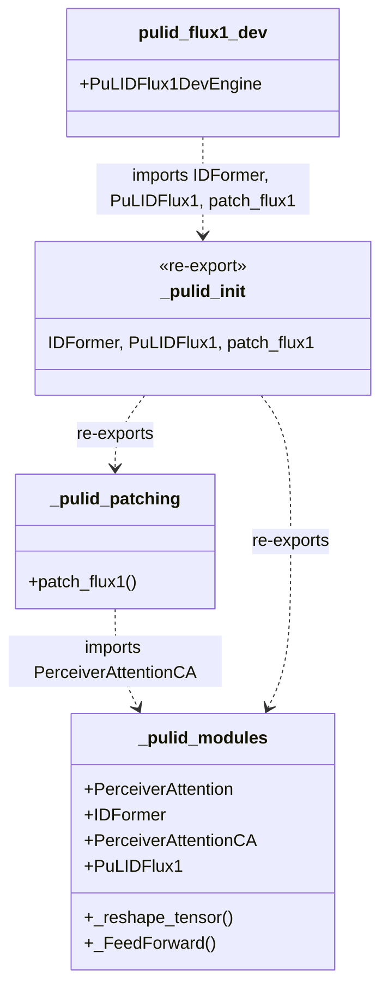

## Context

Promoted from [frame #55](../frames/55-split-pulid-flux1-dev-frame.mdx).

`src/imagecli/engines/pulid_flux1_dev.py` is 569 LOC and currently
exempted from the 300 LOC file-length quality gate (#53). The file holds
three concerns:

1. Inlined PuLID `nn.Module` classes — `_reshape_tensor` (L54),
   `_PerceiverAttention` (L61), `_FeedForward` (L92), `_IDFormer`
   (L102), `_PerceiverAttentionCA` (L190), `_PuLIDFlux1` (L248). These
   match the weights in `pulid_flux_v0.9.1.safetensors` exactly.
2. Transformer monkey-patching — `_patch_flux1` (L274, ~113 LOC) rewrites
   FLUX.1-dev double/single-block forwards to inject PuLID CA.
3. The engine class — `PuLIDFlux1DevEngine` (L387, ~183 LOC).

## Goal

Split `pulid_flux1_dev.py` into sibling modules under
`src/imagecli/engines/_pulid/` (module package) so the engine file
drops below the 300 LOC gate, preserves PuLID v0.9.1 face-lock
behavior bit-for-bit, and keeps the existing `from
imagecli.engines.pulid_flux1_dev import PuLIDFlux1DevEngine` import
intact.

## Users

- **Primary:** imageCLI maintainer — file-length gate regains meaning,
  exemption entry is removed.
- **Secondary:** future contributors debugging PuLID — smaller, focused
  modules are easier to audit (nn.Modules vs. patching vs.
  orchestration).

## Expected Behavior

- `imagecli generate <prompt.md>` with `engine: pulid-flux1-dev` and a
  `face_image` frontmatter produces a face-locked PNG byte-identical to
  pre-change output at a fixed seed (golden-image regression).
- VRAM profile during generate unchanged (±0.2 GB tolerance, measured
  via `torch.cuda.max_memory_allocated()`).
- `from imagecli.engines.pulid_flux1_dev import PuLIDFlux1DevEngine`
  still works (registry entry in `engine_registry.py` / old `engine.py`
  stays pointed at the same path).
- No `torch.compile` is attempted for this engine (documented in
  CLAUDE.md — `_patch_flux1` captures forward methods per-instance).
- After split:
  - `pulid_flux1_dev.py` — engine class + minimal imports, ~240 LOC
  - `_pulid/__init__.py` — public surface re-exports
  - `_pulid/modules.py` — nn.Module classes + helpers, ~220 LOC
  - `_pulid/patching.py` — `patch_flux1` (public name), ~120 LOC

## Data Model & Consumers

### Consumer Summary

| Consumer | Symbols used | Status |
|---|---|---|
| `engine_registry.py` | `PuLIDFlux1DevEngine` | This issue — path unchanged |
| `engines/pulid_flux1_dev.py` (engine class) | `IDFormer`, `PuLIDFlux1`, `patch_flux1` | This issue |
| `_pulid/__init__.py` | re-exports from `modules` + `patching` | This issue |
| `_pulid/patching.py` | `PerceiverAttentionCA` | This issue |
| External callers | none — these are internal nn.Modules | No change |

## Breadboard

### Affordances

| ID | Kind | Name | Handler |
|---|---|---|---|
| N1 | module | `engines/_pulid/__init__.py` | new — re-exports |
| N2 | module | `engines/_pulid/modules.py` | new — nn.Module classes + helpers |
| N3 | module | `engines/_pulid/patching.py` | new — `patch_flux1` |
| U1 | engine | `engines/pulid_flux1_dev.py` | slimmed to engine class only |
| S1 | gate | file_length quality gate | exemption for `pulid_flux1_dev.py` removed |
| T1 | test | golden-image regression | new — fixed seed + face_image, assert byte-identical PNG |
| T2 | test | VRAM delta | new — `max_memory_allocated` pre/post ±0.2 GB |

### Wiring

- `N2` contains `_reshape_tensor`, `PerceiverAttention`, `_FeedForward`,
  `IDFormer`, `PerceiverAttentionCA`, `PuLIDFlux1`. Drop the leading
  underscore on class names that are re-exported (idiomatic private
  package, public within package). Keep helper underscores
  (`_reshape_tensor`, `_FeedForward`).
- `N3` imports `PerceiverAttentionCA` from `N2`, exposes
  `patch_flux1` (renamed from `_patch_flux1`).
- `N1` re-exports `IDFormer`, `PuLIDFlux1`, `PerceiverAttentionCA`,
  `patch_flux1` for engine consumption.
- `U1` imports `from imagecli.engines._pulid import IDFormer,
  PuLIDFlux1, patch_flux1`. Rest of engine class untouched.
- `S1`: remove the `src/imagecli/engines/pulid_flux1_dev.py …` line
  from `tools/file_exemptions.txt`.
- `T1` lives in `tests/engines/test_pulid_flux1_dev_golden.py`;
  gated by `@pytest.mark.gpu` marker (requires weights + CUDA).
- `T2` shares the fixture with `T1`.

## Slices

| # | Slice | Files | Demo |
|---|---|---|---|
| 1 | Extract `_pulid/` package, slim engine file | `_pulid/__init__.py`, `_pulid/modules.py`, `_pulid/patching.py`, `engines/pulid_flux1_dev.py`, `tools/file_exemptions.txt` | `uv run ruff check .`, `uv run pytest` (non-GPU) pass; `wc -l` each file < 300 |
| 2 | Golden-image + VRAM regression test | `tests/engines/test_pulid_flux1_dev_golden.py`, fixture face image | `uv run pytest -m gpu` on RTX 5070 Ti: byte-identical PNG vs. pre-change baseline, VRAM ±0.2 GB |

Slice 2 is gated behind GPU marker — CI skips unless GPU runner is
available. Local developer runs it manually before merge.

## Success Criteria

- [ ] `src/imagecli/engines/pulid_flux1_dev.py` is < 300 LOC after split.
- [ ] `src/imagecli/engines/_pulid/__init__.py` exists and is < 50 LOC.
- [ ] `src/imagecli/engines/_pulid/modules.py` exists and is < 300 LOC.
- [ ] `src/imagecli/engines/_pulid/patching.py` exists and is < 300 LOC.
- [ ] Exemption line for `pulid_flux1_dev.py` removed from `tools/file_exemptions.txt`.
- [ ] `uv run ruff check .` passes with zero new findings.
- [ ] `uv run ruff format --check .` clean.
- [ ] `uv run pytest` (non-GPU suite) passes with the same test count as before plus the new tests.
- [ ] `from imagecli.engines.pulid_flux1_dev import PuLIDFlux1DevEngine` works unchanged.
- [ ] `imagecli engines` still lists `pulid-flux1-dev` (byte-identical stdout).
- [ ] Golden-image regression: generating from a fixed prompt + face_image + seed produces a PNG byte-identical to the pre-change baseline (captured once before the split and checked into `tests/engines/golden/`).
- [ ] VRAM usage during generate stays within ±0.2 GB of pre-change baseline (logged in test output).
- [ ] `tools/verify_file_length.py` (or equivalent gate hook) reports no new violations.
