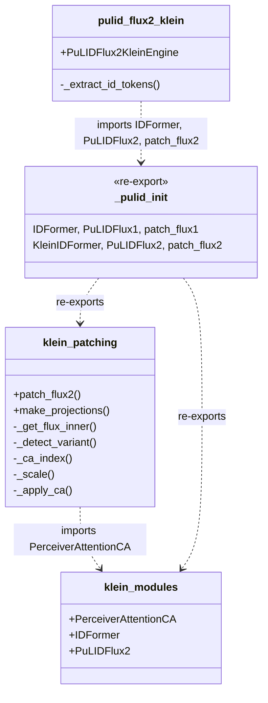
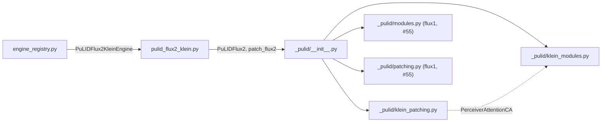

## Context

Promoted from [frame #56](../frames/56-split-pulid-flux2-klein-frame.mdx).

`src/imagecli/engines/pulid_flux2_klein.py` is 502 LOC and currently
exempted from the 300 LOC file-length quality gate (#53). The file holds
four concerns:

1. Klein-specific PuLID `nn.Module` classes — `_PerceiverAttentionCA`
   (L41), `_IDFormer` (L68), `_PuLIDFlux2` (L92). Shapes differ from the
   flux1-dev variants already extracted in #55 (trained at dim=4096 for
   Klein 9B; we run against Klein 4B at hidden_size=3072).
2. Transformer patching + dim-projection wiring — `_get_flux_inner`,
   `_detect_variant`, `_ca_index`, `_scale`, `_make_projections`
   (3072↔4096 proj_up/proj_down), `_apply_ca`, `_patch_flux`
   (L148–307). The `_make_projections` wiring is the Strategy B core.
3. Identity-token preprocessing — `_extract_id_tokens` (L311–384), the
   InsightFace + EVA-CLIP preprocessing that feeds `PuLIDFlux2`.
4. The engine class — `PuLIDFlux2KleinEngine` (L388–502).

The `_pulid/` package already exists (from #55) and re-exports flux1-dev
symbols. We add Klein-specific sibling modules alongside; no changes to
the flux1-dev modules.

## Goal

Split `pulid_flux2_klein.py` into sibling modules under
`src/imagecli/engines/_pulid/` so the engine file drops below the 300
LOC gate, preserves PuLID Klein v2 face-lock behavior bit-for-bit at a
fixed seed, preserves the load-order-sensitive dim-projection init
relative to trained-CA weight loading, and keeps the existing `from
imagecli.engines.pulid_flux2_klein import PuLIDFlux2KleinEngine` import
intact.

## Users

- **Primary:** imageCLI maintainer — file-length gate regains meaning,
  exemption entry is removed.
- **Secondary:** future contributors debugging PuLID Klein v2 — smaller
  focused modules (nn.Modules vs. patching+projection vs.
  orchestration) are easier to audit.

## Expected Behavior

- `imagecli generate <prompt.md>` with `engine: pulid-flux2-klein` and a
  `face_image` frontmatter produces a face-locked PNG byte-identical to
  pre-change output at a fixed seed (golden-image regression).
- VRAM profile during generate unchanged (±0.2 GB tolerance of ~9–10 GB
  baseline, measured via `torch.cuda.max_memory_allocated()`).
- `from imagecli.engines.pulid_flux2_klein import PuLIDFlux2KleinEngine`
  still works (registry entry unchanged).
- `_make_projections` is constructed **after** trained-CA weights load,
  matching current init order — no silent random-init regression.
- No `torch.compile` attempted for this engine (documented in
  CLAUDE.md — patching captures forward methods per-instance).
- Strategy B docstring (dim-projection rationale, 3072→4096→3072) stays
  at the top of the new `klein_patching.py` where the projection code
  lives.
- After split:
  - `pulid_flux2_klein.py` — engine class + `_extract_id_tokens` +
    imports, ~220 LOC
  - `_pulid/klein_modules.py` — Klein-specific `nn.Module`s, ~110 LOC
  - `_pulid/klein_patching.py` — patching + projection helpers, ~175 LOC
  - `_pulid/__init__.py` — adds Klein re-exports alongside flux1

## Data Model & Consumers

### Consumer Summary

| Consumer | Symbols used | Status |
|---|---|---|
| `engine_registry.py` | `PuLIDFlux2KleinEngine` | This issue — path unchanged |
| `engines/pulid_flux2_klein.py` (engine class) | `IDFormer`, `PuLIDFlux2`, `patch_flux2` | This issue |
| `_pulid/__init__.py` | re-exports flux1 (#55) + Klein (this issue) | This issue |
| `_pulid/klein_patching.py` | `PerceiverAttentionCA` | This issue |
| External callers | none — internal nn.Modules | No change |

## Breadboard

### Affordances

| ID | Kind | Name | Handler |
|---|---|---|---|
| N1 | module | `engines/_pulid/klein_modules.py` | new — Klein nn.Module classes |
| N2 | module | `engines/_pulid/klein_patching.py` | new — patching + `make_projections` |
| U1 | engine | `engines/pulid_flux2_klein.py` | slimmed — engine class + `_extract_id_tokens` only |
| U2 | package | `engines/_pulid/__init__.py` | amend — add Klein re-exports |
| S1 | gate | `tools/file_exemptions.txt` | remove `pulid_flux2_klein.py` line |
| T1 | test | golden-image regression | new — fixed seed + face_image, byte-identical PNG |
| T2 | test | VRAM delta | new — `max_memory_allocated` pre/post ±0.2 GB |
| T3 | test | init-order guard | new — assert `PuLIDFlux2.proj_up`/`proj_down` constructed after CA weight load |

### Wiring

- `N1` contains `PerceiverAttentionCA`, `IDFormer`, `PuLIDFlux2` — drop
  leading underscore on classes that are re-exported (idiomatic private
  package, public within package). Follows the pattern #55 established.
- `N2` imports `PerceiverAttentionCA` from `N1`, exposes `patch_flux2`
  (renamed from `_patch_flux`) and `make_projections` (renamed from
  `_make_projections`). Private helpers (`_get_flux_inner`,
  `_detect_variant`, `_ca_index`, `_scale`, `_apply_ca`) keep leading
  underscore — module-private. Strategy B rationale docstring moves
  from `pulid_flux2_klein.py` top to `N2` top (where projection code
  lives).
- `U2`: amend `__all__` to add `IDFormer` **as** `IDFormer` —
  **collision with flux1** `IDFormer` already exported. Resolution:
  rename Klein class to `KleinIDFormer` in `N1` and re-export; update
  `U1` import accordingly. Same collision exists for
  `PerceiverAttentionCA` (flux1 already exports). Resolution: rename
  Klein version to `KleinPerceiverAttentionCA`. `PuLIDFlux2` has no
  collision; keep as-is.
- `U1` imports `from imagecli.engines._pulid import KleinIDFormer as
  IDFormer, PuLIDFlux2, patch_flux2`. Keeps local alias `IDFormer` so
  `_extract_id_tokens` body doesn't change. `_extract_id_tokens` stays
  in `U1` (engine-specific preprocessing, not pure nn.Module / not
  patching). Rest of engine class untouched.
- `S1`: remove `src/imagecli/engines/pulid_flux2_klein.py …` line from
  `tools/file_exemptions.txt`.
- `T1`/`T2` live in `tests/engines/test_pulid_flux2_klein_golden.py`;
  gated by `@pytest.mark.gpu` (requires weights + CUDA sm_120).
- `T3` is a lightweight non-GPU test: monkey-patch `PuLIDFlux2.__init__`
  to record construction order of `layers` (trained CA) vs `proj_up` /
  `proj_down`, assert `proj_up.__init_subclass__` call index > last
  `layers[i]` construction index. Protects against silent regressions
  during future edits.

## Slices

| # | Slice | Files | Demo |
|---|---|---|---|
| 1 | Extract Klein modules, slim engine file, remove exemption | `_pulid/klein_modules.py`, `_pulid/klein_patching.py`, `_pulid/__init__.py`, `engines/pulid_flux2_klein.py`, `tools/file_exemptions.txt` | `uv run ruff check .`, `uv run pytest` (non-GPU) pass; `wc -l` each file < 300; `imagecli engines` output byte-identical |
| 2 | Init-order guard + golden-image + VRAM regression tests | `tests/engines/test_pulid_flux2_klein_init_order.py`, `tests/engines/test_pulid_flux2_klein_golden.py`, fixture face image | `uv run pytest tests/engines/test_pulid_flux2_klein_init_order.py` passes on CPU; `uv run pytest -m gpu` on RTX 5070 Ti: byte-identical PNG vs pre-change baseline, VRAM ±0.2 GB |

Slice 2 golden/VRAM portion is gated behind GPU marker — CI skips
unless GPU runner available. Local developer runs manually before
merge. The init-order test (T3) runs on CPU in default CI.

## Success Criteria

- [ ] `src/imagecli/engines/pulid_flux2_klein.py` is < 300 LOC after split.
- [ ] `src/imagecli/engines/_pulid/klein_modules.py` exists and is < 300 LOC.
- [ ] `src/imagecli/engines/_pulid/klein_patching.py` exists and is < 300 LOC.
- [ ] `src/imagecli/engines/_pulid/__init__.py` exports `KleinIDFormer`, `KleinPerceiverAttentionCA`, `PuLIDFlux2`, `patch_flux2` alongside existing flux1 symbols.
- [ ] Exemption line for `pulid_flux2_klein.py` removed from `tools/file_exemptions.txt`.
- [ ] `uv run ruff check .` passes with zero new findings.
- [ ] `uv run ruff format --check .` clean.
- [ ] `uv run pytest` (non-GPU suite) passes with same test count as before + new init-order test.
- [ ] `from imagecli.engines.pulid_flux2_klein import PuLIDFlux2KleinEngine` works unchanged.
- [ ] `imagecli engines` still lists `pulid-flux2-klein` (byte-identical stdout).
- [ ] Init-order guard (T3) asserts `proj_up`/`proj_down` constructed after trained CA `layers`.
- [ ] Golden-image regression: fixed prompt + face_image + seed produces a PNG byte-identical to pre-change baseline (captured once before the split, checked into `tests/engines/golden/`).
- [ ] VRAM usage during generate stays within ±0.2 GB of pre-change baseline (logged in test output).
- [ ] `tools/verify_file_length.py` (or equivalent gate hook) reports no new violations.
