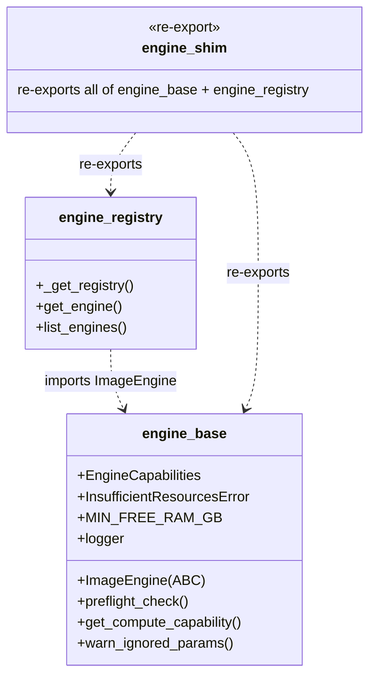
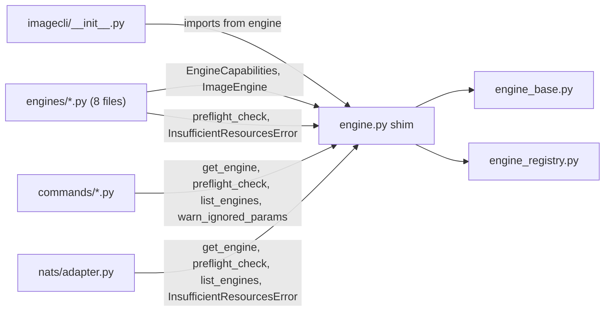

## Context

Promoted from [frame #57](../frames/57-split-engine-py-base-registry-frame.mdx).

`src/imagecli/engine.py` is 501 LOC and currently exempted from the 300 LOC
file-length quality gate (#53). The file holds two concerns:

1. The `ImageEngine` ABC and shared helpers (`preflight_check`,
   `get_compute_capability`, `warn_ignored_params`, `EngineCapabilities`,
   `InsufficientResourcesError`, the env-var driven RAM cap, `_tf32_set`,
   `logger`).
2. The engine registry factory (`_get_registry`, `get_engine`,
   `list_engines`).

Landing after #54 keeps the diff focused.

## Goal

Split `engine.py` into `engine_base.py` (ABC + helpers) and
`engine_registry.py` (factory) while preserving the public
`imagecli.engine` import surface, so the 300 LOC gate applies cleanly and
the exemption entry can be removed.

## Users

- **Primary:** imageCLI maintainer — the file-length gate regains meaning.
- **Secondary:** future contributors — thinner modules are easier to read.
- **External consumers of `imagecli` as a library** — `from imagecli
  import ...` and `from imagecli.engine import ...` must keep working.

## Expected Behavior

- `imagecli engines`, `imagecli info`, `imagecli generate`, `imagecli batch`
  — byte-for-byte identical stdout/stderr, same exit codes.
- Each of the 8 engine classes still constructs, loads, and generates.
- `from imagecli.engine import ImageEngine, get_engine, preflight_check,
  list_engines, InsufficientResourcesError, warn_ignored_params,
  EngineCapabilities` still works (kept as a re-export shim).
- `from imagecli import ImageEngine, get_engine, ...` still works
  (`imagecli/__init__.py` unchanged).
- After split: `engine.py` ≤ 30 LOC (shim), `engine_base.py` ~380 LOC,
  `engine_registry.py` ~60 LOC — all under the 300 LOC gate except
  `engine_base.py` which must land under 300 (see Slice 1 for how).

## Data Model & Consumers

### Consumer Summary

| Consumer | Symbols used | Status |
|---|---|---|
| `imagecli/__init__.py` | `ImageEngine`, `InsufficientResourcesError`, `get_engine`, `list_engines`, `preflight_check` | This issue — keep via shim |
| `engines/flux1_dev.py` | `EngineCapabilities`, `ImageEngine` | This issue |
| `engines/flux1_schnell.py` | `EngineCapabilities`, `ImageEngine` | This issue |
| `engines/flux2_klein.py` | `EngineCapabilities`, `ImageEngine` | This issue |
| `engines/flux2_klein_fp4.py` | `EngineCapabilities`, `ImageEngine` | This issue |
| `engines/flux2_klein_fp8.py` | `EngineCapabilities`, `ImageEngine` | This issue |
| `engines/pulid_flux1_dev.py` | `EngineCapabilities`, `ImageEngine` | This issue |
| `engines/pulid_flux2_klein.py` | `EngineCapabilities`, `ImageEngine`, `InsufficientResourcesError` | This issue |
| `engines/pulid_flux2_klein_fp4.py` | `EngineCapabilities`, `ImageEngine`, `preflight_check` | This issue |
| `engines/sd35.py` | `EngineCapabilities`, `ImageEngine` | This issue |
| `commands/_helpers.py` | `ImageEngine`, `get_engine`, `preflight_check`, `warn_ignored_params` | This issue |
| `commands/batch.py` | `get_engine` | This issue |
| `commands/meta.py` | `list_engines` | This issue |
| `commands/_batch_all_on_gpu.py` | `preflight_check` | This issue |
| `commands/_batch_sequential.py` | `ImageEngine`, `get_engine` | This issue |
| `commands/_batch_two_phase.py` | `preflight_check` | This issue |
| `nats/adapter.py` | `InsufficientResourcesError`, `get_engine`, `preflight_check`, `list_engines` | This issue |

## Breadboard

### Affordances

| ID | Kind | Name | Handler |
|---|---|---|---|
| N1 | module | `imagecli.engine_base` | new — ABC + helpers |
| N2 | module | `imagecli.engine_registry` | new — factory |
| N3 | module | `imagecli.engine` | shim — re-exports |
| U1 | cmd | `imagecli engines` | unchanged; reads via shim |
| U2 | cmd | `imagecli info` | unchanged |
| U3 | cmd | `imagecli generate` | unchanged |
| U4 | cmd | `imagecli batch` | unchanged |
| S1 | gate | file_length quality gate | exemption for `engine.py` removed |

### Wiring

- `N1` defines `ImageEngine`, helpers, module-level state. Self-contained.
- `N2` imports `ImageEngine` from `N1`, defines registry + factory.
- `N3` re-exports the full public surface so `from imagecli.engine import X` keeps working.
- `U1-U4` stay wired to `N3`.
- `S1`: remove the `src/imagecli/engine.py …` line from `tools/file_exemptions.txt`.

## Slices

| # | Slice | Files | Demo |
|---|---|---|---|
| 1 | Extract base + registry, keep shim | `engine_base.py` (new), `engine_registry.py` (new), `engine.py` (→ shim), `tools/file_exemptions.txt` | `uv run pytest`, `imagecli engines`, `imagecli info` all pass; `wc -l src/imagecli/engine*.py` each < 300 |

Single-slice. F-lite, mechanical.

### Slice 1 notes

- Before code move: confirm `engine_base.py` will be < 300 LOC. Current non-registry content = 501 − ~60 (registry block) − ~3 (module docstring/imports already needed) ≈ 438 LOC.
- 438 > 300. Mitigation options (pick one in `/plan`):
  - **a.** Split helpers further: move `_apply_pivotal_embeddings` (≈ 35 LOC) and the 2-phase batch interface stubs (≈ 30 LOC) into small sibling modules if they stand alone. **Risk:** widens scope; reject.
  - **b.** Keep `ImageEngine` in `engine_base.py` and accept that `engine_base.py` needs its own exemption entry pointing at follow-up issue. **Risk:** replaces one exemption with another.
  - **c.** Move `warn_ignored_params`, `EngineCapabilities`, `InsufficientResourcesError`, `get_compute_capability`, and the RAM-cap env handling into a new `engine_helpers.py` leaving only `ImageEngine` + `preflight_check` in `engine_base.py`. Brings `engine_base.py` below 300 LOC without new exemption.
- **Preferred: c.** `engine_helpers.py` for the small standalone pieces, `engine_base.py` for `ImageEngine` + `preflight_check`, `engine_registry.py` for factory, `engine.py` as shim. All four files < 300 LOC.

## Success Criteria

- [ ] `src/imagecli/engine.py` is ≤ 30 LOC (re-export shim) and exemption line removed from `tools/file_exemptions.txt`.
- [ ] `src/imagecli/engine_base.py` exists and is < 300 LOC.
- [ ] `src/imagecli/engine_registry.py` exists and is < 300 LOC.
- [ ] If created, `src/imagecli/engine_helpers.py` is < 300 LOC.
- [ ] `uv run ruff check .` passes with zero new findings.
- [ ] `uv run ruff format --check .` clean.
- [ ] `uv run pytest` passes with the same test count as before the change.
- [ ] `imagecli engines` stdout is byte-identical to pre-change baseline.
- [ ] `imagecli info` stdout is byte-identical to pre-change baseline.
- [ ] `from imagecli.engine import ImageEngine, get_engine, list_engines, preflight_check, InsufficientResourcesError, warn_ignored_params, EngineCapabilities` works without deprecation warnings.
- [ ] `from imagecli import ImageEngine, get_engine, list_engines, preflight_check, InsufficientResourcesError` works.
- [ ] A single engine smoke generate (`imagecli generate "a cat" -e flux2-klein --steps 2 --no-compile`) completes without error. *(Tier smoke: 1 engine is sufficient; all 8 share the same import surface — if one loads, all load.)*
- [ ] `tools/verify_file_length.py` (or equivalent gate hook) reports no new violations.
