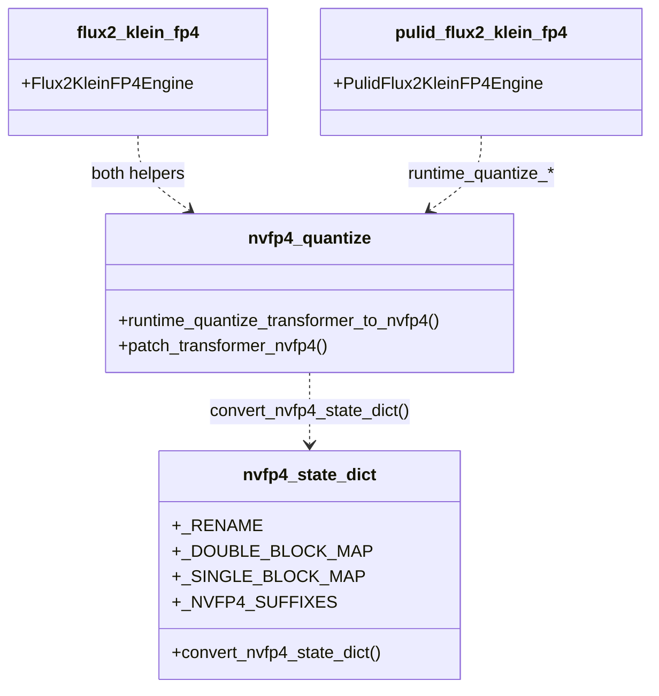
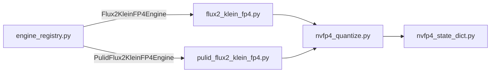

## Context

Promoted from [frame #58](../frames/58-split-flux2-klein-fp4-py-frame.mdx).

`src/imagecli/engines/flux2_klein_fp4.py` is 476 LOC and currently exempted
from the 300 LOC file-length quality gate (#53,
`tools/file_exemptions.txt:6`). The file holds three concerns:

1. BFL→diffusers NVFP4 state-dict converter + key-mapping tables
   (`_convert_nvfp4_state_dict`, `_RENAME`, `_DOUBLE_BLOCK_MAP`,
   `_SINGLE_BLOCK_MAP`, `_NVFP4_SUFFIXES`) — ~130 LOC.
2. Runtime NVFP4 quantizer / patcher
   (`_runtime_quantize_transformer_to_nvfp4`, `_patch_transformer_nvfp4`) —
   ~110 LOC.
3. The `Flux2KleinFP4Engine` class itself — ~200 LOC.

Sibling `engines/pulid_flux2_klein_fp4.py:121` imports
`_runtime_quantize_transformer_to_nvfp4` from `flux2_klein_fp4`; the split
must not break that consumer.

## Goal

Split the module into two sibling modules (state-dict converter, runtime
quantizer) that the engine and the PuLID variant both consume, keeping
every file under the 300 LOC gate and preserving the NVFP4 benchmark
parity from #58's acceptance criteria.

## Users

- **Primary:** imageCLI maintainer — file-length gate regains meaning once
  the exemption is removed.
- **Secondary:** future contributors reading/modifying the FP4 path —
  state-dict conversion and runtime quantization become independently
  testable sibling modules.
- **Internal consumer:** `engines/pulid_flux2_klein_fp4.py` — currently
  reaches into `flux2_klein_fp4` for the runtime quantizer; will import
  from the new quantize module instead.

## Expected Behavior

- `imagecli generate -e flux2-klein-fp4 …` and `imagecli batch … -e
  flux2-klein-fp4 [--two-phase]` produce byte-for-byte identical images at
  a fixed seed vs. the pre-split build.
- NVFP4 path benchmarks at ~6.8 it/s at 512×512 (within ±5%); 2048×2048
  still fits at ~8.82 GB peak in `--two-phase` mode.
- `imagecli engines` and `imagecli info` output unchanged for
  `flux2-klein-fp4`.
- `-e pulid-flux2-klein-fp4` still loads and quantizes; the import
  `_runtime_quantize_transformer_to_nvfp4` resolves via the new module.
- After split: `flux2_klein_fp4.py` ≤ 300 LOC; two new sibling modules
  each < 300 LOC; exemption line removed from `tools/file_exemptions.txt`.

## Data Model & Consumers

### Consumer Summary

| Consumer | Symbols used | Status |
|---|---|---|
| `engines/flux2_klein_fp4.py` (engine class) | `patch_transformer_nvfp4`, `runtime_quantize_transformer_to_nvfp4` | This issue — import from `engines.nvfp4_quantize` |
| `engines/pulid_flux2_klein_fp4.py` | `runtime_quantize_transformer_to_nvfp4` | This issue — import from `engines.nvfp4_quantize` (was `engines.flux2_klein_fp4`) |
| `engines.nvfp4_quantize` | `convert_nvfp4_state_dict`, `_NVFP4_SUFFIXES` | This issue |
| `engine_registry.py` | `Flux2KleinFP4Engine` | Unchanged |

## Breadboard

### Affordances

| ID | Kind | Name | Handler |
|---|---|---|---|
| N1 | module | `imagecli.engines.nvfp4_state_dict` | new — BFL→diffusers key remap + constants |
| N2 | module | `imagecli.engines.nvfp4_quantize` | new — runtime quant + disk-weight patch |
| N3 | module | `imagecli.engines.flux2_klein_fp4` | trimmed — only the engine class + local logger |
| U1 | cmd | `imagecli generate -e flux2-klein-fp4` | unchanged behavior |
| U2 | cmd | `imagecli batch -e flux2-klein-fp4` | unchanged behavior |
| U3 | cmd | `imagecli generate -e pulid-flux2-klein-fp4` | unchanged behavior (import path updated) |
| S1 | gate | file_length quality gate | exemption for `flux2_klein_fp4.py` removed |

### Wiring

- `N1` is self-contained: takes a `dict[str, Tensor]`, returns remapped dict.
  No imports from other imagecli modules.
- `N2` imports from `N1` (`convert_nvfp4_state_dict`, `_NVFP4_SUFFIXES`).
  Exposes `runtime_quantize_transformer_to_nvfp4` and
  `patch_transformer_nvfp4` as public (no leading `_`) since they now
  cross module boundaries.
- `N3` imports the two public quantize helpers from `N2`. Keeps
  `NVFP4_REPO`, `NVFP4_FILENAME`, `BASE_REPO` constants (used only by the
  engine class). No other public surface changes.
- `pulid_flux2_klein_fp4.py:121` updates its import from
  `imagecli.engines.flux2_klein_fp4` → `imagecli.engines.nvfp4_quantize`.
- `S1`: remove the `src/imagecli/engines/flux2_klein_fp4.py …` line from
  `tools/file_exemptions.txt`.

### Naming note

Private helpers (`_convert_…`, `_runtime_quantize_…`, `_patch_…`) get
renamed without the leading underscore when they move to their own
modules, since the leading `_` signaled "module-private" — no longer true
once they cross module boundaries. `_RENAME`, `_DOUBLE_BLOCK_MAP`,
`_SINGLE_BLOCK_MAP` stay underscored (internal to `nvfp4_state_dict.py`).
`_NVFP4_SUFFIXES` becomes `NVFP4_SUFFIXES` (imported by `nvfp4_quantize`).

## Slices

| # | Slice | Files | Demo |
|---|---|---|---|
| 1 | Extract converter + quantizer into sibling modules; update PuLID import; remove exemption | `engines/nvfp4_state_dict.py` (new), `engines/nvfp4_quantize.py` (new), `engines/flux2_klein_fp4.py` (trimmed), `engines/pulid_flux2_klein_fp4.py` (1-line import update), `tools/file_exemptions.txt` (1 line removed) | `uv run pytest`; `wc -l` each new/changed engine file < 300; `imagecli generate "a cat on a bench" -e flux2-klein-fp4 --steps 8 --seed 42` SHA matches pre-split baseline; 512² it/s within ±5% of 6.8; 2048² `--two-phase` fits ~8.82 GB |

Single-slice. F-lite, mechanical move with one import-consumer update.

### Slice 1 notes

- LOC math (target):
  - `nvfp4_state_dict.py`: `_RENAME`/`_DOUBLE_BLOCK_MAP`/`_SINGLE_BLOCK_MAP`/`NVFP4_SUFFIXES` (~40 LOC) + `convert_nvfp4_state_dict` (~95 LOC) + imports/docstring (~10 LOC) ≈ **145 LOC**.
  - `nvfp4_quantize.py`: `runtime_quantize_transformer_to_nvfp4` (~30 LOC) + `patch_transformer_nvfp4` (~80 LOC) + imports/docstring (~15 LOC) ≈ **125 LOC**.
  - `flux2_klein_fp4.py`: engine class (~200 LOC) + module docstring (~15 LOC) + NVFP4 repo constants + 2 helper imports ≈ **225 LOC**.
- All three comfortably under 300. No follow-up exemption needed.
- Quantization-path risk (audit note from #58): both helpers mutate
  transformer tensors in `_load()`. Benchmark + fixed-seed image SHA
  comparison before marking the slice done.

## Success Criteria

- [ ] `src/imagecli/engines/flux2_klein_fp4.py` is < 300 LOC.
- [ ] `src/imagecli/engines/nvfp4_state_dict.py` exists and is < 300 LOC.
- [ ] `src/imagecli/engines/nvfp4_quantize.py` exists and is < 300 LOC.
- [ ] Line for `src/imagecli/engines/flux2_klein_fp4.py` is removed from `tools/file_exemptions.txt`.
- [ ] `tools/verify_file_length.py` (or equivalent gate hook) reports no new violations.
- [ ] `uv run ruff check .` passes with zero new findings.
- [ ] `uv run ruff format --check .` clean.
- [ ] `uv run pytest` passes with the same test count as before the change.
- [ ] `imagecli engines` stdout is byte-identical to pre-change baseline.
- [ ] `imagecli generate "a cat on a bench" -e flux2-klein-fp4 --steps 8 --seed 42 --width 512 --height 512` produces an image whose SHA-256 matches the pre-split baseline (captured in the plan).
- [ ] 512×512 single-image benchmark (`--steps 20 --seed 42`) reports it/s within ±5% of the 6.8 it/s baseline recorded in `docs/benchmark.md`.
- [ ] `imagecli batch … -e flux2-klein-fp4 --two-phase` at 2048×2048 reports peak VRAM within ±5% of 8.82 GB.
- [ ] `imagecli generate "portrait of a woman" -e pulid-flux2-klein-fp4 --steps 8 --face-image <fixture> --seed 42` loads without `ImportError` and completes (validates the PuLID variant still resolves the moved `runtime_quantize_transformer_to_nvfp4`).
- [ ] `from imagecli.engines.nvfp4_quantize import runtime_quantize_transformer_to_nvfp4, patch_transformer_nvfp4` works.
- [ ] `from imagecli.engines.nvfp4_state_dict import convert_nvfp4_state_dict` works.
