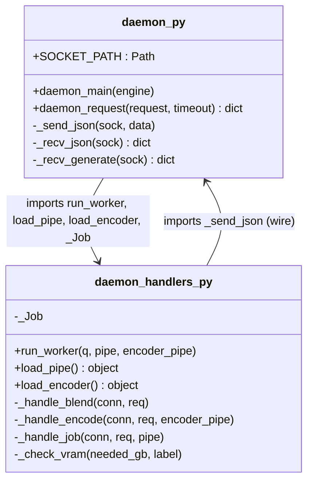
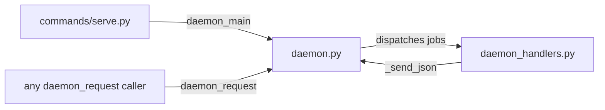

## Context

Promoted from: [59-daemon-split-frame.mdx](../frames/59-daemon-split-frame.mdx)

`src/imagecli/daemon.py` currently: **459 LOC**, exempted in `tools/file_exemptions.txt` (line 5). Parent gate: #53. Only external import is `src/imagecli/commands/serve.py:14`: `from imagecli.daemon import daemon_main`.

## Goal

Extract handler + worker + model-loading code into `src/imagecli/daemon_handlers.py` so `daemon.py` is the server loop + wire protocol, both files under the 300 LOC gate, with zero behavior change.

## Users

- **Primary:** imageCLI contributors editing daemon code
- **Secondary:** `imagecli_gen` supervisor service and any `daemon_request` caller — wire + public API must be bit-for-bit identical

## Expected Behavior

Before and after the split:

- `imagecli serve` (Typer command) starts the daemon identically
- `daemon_main(engine="flux2-klein")` continues to preload transformer+VAE then text encoder, spawn the worker thread, bind `~/.local/share/imagecli/daemon.sock`, accept connections, ping-respond, and enqueue jobs
- `daemon_request(request, timeout)` wire behavior unchanged (JSON line framing, `ping`/`generate`/`encode`/`blend` actions, progress streaming for `generate`)
- `_Job` payload shape unchanged (worker consumes `conn` + `req` identically)
- Worker dispatch rules unchanged: `encode` → `_handle_encode`, `blend` → `_handle_blend`, default → `_handle_job`

## Data Model & Consumers

| Consumer | Symbols consumed | When | Status |
|---|---|---|---|
| `commands/serve.py` | `daemon_main` | `imagecli serve` | this issue (unchanged signature) |
| external clients | `daemon_request`, `SOCKET_PATH` | runtime IPC | this issue (unchanged) |
| `daemon.py` server loop | `run_worker`, `load_pipe`, `load_encoder`, `_Job` | startup | this issue (new import) |
| `daemon_handlers.py` handlers | `_send_json` | per-response | this issue (new import) |

## Breadboard

| ID | Affordance | Handler / symbol | Data touched |
|----|-----------|------------------|--------------|
| N1 | `daemon.py` — public client API | `daemon_request`, `_recv_generate` | socket + request dict |
| N2 | `daemon.py` — server loop | `daemon_main` | socket bind, queue, thread |
| N3 | `daemon.py` — wire protocol | `_send_json`, `_recv_json` | JSON framing |
| N4 | `daemon.py` — shared constants | `SOCKET_PATH`, `_DEFAULT_TIMEOUT` | paths, timeouts |
| N5 | `daemon_handlers.py` — worker loop | `run_worker` (renamed from `_worker`) | queue consumer, dispatch |
| N6 | `daemon_handlers.py` — model loaders | `load_pipe`, `load_encoder` (renamed), `_check_vram`, VRAM constants | CUDA, diffusers |
| N7 | `daemon_handlers.py` — job handlers | `_handle_blend`, `_handle_encode`, `_handle_job` | torch ops, disk I/O |
| N8 | `daemon_handlers.py` — job payload | `_Job` dataclass | worker contract |

**Wiring:** N2 calls N6 (twice at startup) → spawns thread on N5 → N5 consumes `_Job` (N8) → dispatches to N7. N7 uses N3 (`_send_json`) for responses. N1 uses N3 for framing.

**Rename rationale:** `_worker` → `run_worker`, `_load_pipe` → `load_pipe`, `_load_encoder` → `load_encoder` lose the leading underscore because they cross module boundaries. `_check_vram`, `_handle_*`, `_Job` stay underscore-prefixed (internal to handlers module).

## Slices

| # | Slice | Deliverable | Demo-able |
|---|-------|-------------|-----------|
| 1 | Create `daemon_handlers.py` | Move `_worker`, `_load_pipe`, `_load_encoder`, `_check_vram`, `_handle_blend`, `_handle_encode`, `_handle_job`, `_Job`, VRAM constants; rename crossings; import `_send_json` from `.daemon` | `imagecli serve` boots, processes a ping + one generate job end-to-end |
| 2 | Slim `daemon.py` | Keep `daemon_main`, `daemon_request`, `_recv_generate`, `_send_json`, `_recv_json`, `SOCKET_PATH`, `_DEFAULT_TIMEOUT`; import `run_worker`, `load_pipe`, `load_encoder`, `_Job` from `.daemon_handlers` | `wc -l src/imagecli/daemon.py` < 300 |
| 3 | Remove exemption | Delete line 5 of `tools/file_exemptions.txt` | `uv run pre-commit run --all-files` passes file-length gate (or equivalent local invocation) |

## Success Criteria

- [ ] `wc -l src/imagecli/daemon.py` reports ≤ 300
- [ ] `wc -l src/imagecli/daemon_handlers.py` reports ≤ 300
- [ ] `src/imagecli/daemon.py` no longer listed in `tools/file_exemptions.txt`
- [ ] `uv run ruff check src/imagecli/daemon.py src/imagecli/daemon_handlers.py` passes
- [ ] `uv run ruff format --check src/imagecli/daemon.py src/imagecli/daemon_handlers.py` passes
- [ ] `python -c "from imagecli.commands.serve import serve"` imports clean
- [ ] `python -c "from imagecli.daemon import daemon_main, daemon_request, SOCKET_PATH"` imports clean
- [ ] Smoke: `imagecli serve` (manually, or via `imagecli_gen` supervisor) starts, ping responds `{"ok": true}`, one generate job completes and writes an image
- [ ] No changes to `commands/serve.py` beyond (optional) none — existing `from imagecli.daemon import daemon_main` continues to work
- [ ] Wire JSON framing unchanged: bytes-for-bytes identical request/response shapes for `ping`, `generate`, `encode`, `blend`
