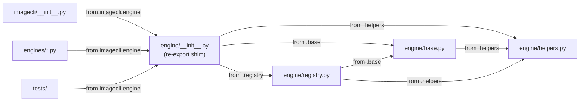

## Context

Derived from: [`artifacts/frames/65-engine-subpackage-frame.mdx`](../frames/65-engine-subpackage-frame.mdx)

Follow-up to #57. The engine.py split landed with a `folder_exemptions.txt` entry because `src/imagecli/` hit 16 `.py` files against the 12-file gate. Moving the four engine modules into an `engine/` subpackage drops the count to 12 and removes the exemption.

## Goal

Promote `engine.py`, `engine_base.py`, `engine_helpers.py`, `engine_registry.py` into an `engine/` subpackage with a re-export `__init__.py`, such that all existing `from imagecli.engine import X` callers continue to work without modification and the `src/imagecli` folder_size exemption is deleted.

## Users

- **Primary:** maintainers — folder_size gate passes clean, exemption removed, no suppressed signals.
- **Secondary:** library consumers importing `imagecli.engine` — zero breaking changes.

## Data Model & Consumers

### Module structure (before → after)

```
classDiagram
    direction LR
    class `engine.py` { <<shim>> re-exports all }
    class `engine_base.py` { ImageEngine\npreflight_check }
    class `engine_helpers.py` { EngineCapabilities\nInsufficientResourcesError\nMIN_FREE_RAM_GB\nget_compute_capability\nwarn_ignored_params }
    class `engine_registry.py` { _get_registry\nget_engine\nlist_engines }

    class `engine/__init__.py` { <<shim>> re-exports all }
    class `engine/base.py` { ImageEngine\npreflight_check }
    class `engine/helpers.py` { EngineCapabilities\nInsufficientResourcesError\nMIN_FREE_RAM_GB\nget_compute_capability\nwarn_ignored_params }
    class `engine/registry.py` { _get_registry\nget_engine\nlist_engines }
```

### Consumer map



### Consumer summary

| Consumer | Import path | Change needed |
|---|---|---|
| `imagecli/__init__.py` | `from imagecli.engine import …` | None (shim unchanged) |
| All `engines/*.py` | `from imagecli.engine import …` | None |
| All `tests/` | `from imagecli.engine import …` | None |
| `engine.py` (self) | replaced by `engine/__init__.py` | Rewrite to relative imports |
| `engine_base.py` → `engine/base.py` | `from imagecli import engine_helpers as _h` (line 11) + `from imagecli.engine_helpers import (…)` (line 12) | → `from . import helpers as _h` + `from .helpers import (…)` |
| `engine_helpers.py` → `engine/helpers.py` | `from imagecli.engine_base import ImageEngine` (TYPE_CHECKING guard, line 20) | → `from .base import ImageEngine` |
| `engine_registry.py` → `engine/registry.py` | `from imagecli.engine_base import ImageEngine` (line 10) | → `from .base import ImageEngine` |

## Expected Behavior

1. `src/imagecli/engine/` directory is created containing `__init__.py`, `base.py`, `helpers.py`, `registry.py`.
2. `engine/__init__.py` re-exports the full `__all__` surface currently in `engine.py`, using relative imports (`from .base import …`, etc.).
3. Internal cross-imports within the subpackage use relative imports (e.g. `engine/registry.py` imports `from .base import ImageEngine`).
4. Old flat files (`engine.py`, `engine_base.py`, `engine_helpers.py`, `engine_registry.py`) are deleted.
5. `tools/folder_exemptions.txt` no longer contains the `src/imagecli` entry.
6. `bash tools/check_folder_size.sh` exits 0 with no output.

## Breadboard

| Affordance | Handler | Data in → out |
|---|---|---|
| `engine/__init__.py` | re-export shim | imports from `.base`, `.helpers`, `.registry` → re-exports `__all__` |
| `engine/base.py` | moved `engine_base.py` | internal imports updated to `from .helpers` |
| `engine/helpers.py` | moved `engine_helpers.py` | no internal imagecli imports |
| `engine/registry.py` | moved `engine_registry.py` | updated to `from .base`, `from .helpers` |
| delete old flat files | `git rm` | removes 4 obsolete files |
| strip exemption line | edit `folder_exemptions.txt` | removes `src/imagecli …` line |

## Slices

| # | Slice | Files touched | Demo |
|---|---|---|---|
| 1 | Create subpackage + move modules | `engine/__init__.py`, `engine/base.py`, `engine/helpers.py`, `engine/registry.py` | `python -c "from imagecli.engine import ImageEngine, get_engine"` succeeds |
| 2 | Delete old flat files | rm `engine.py`, `engine_base.py`, `engine_helpers.py`, `engine_registry.py` | imports still resolve |
| 3 | Remove folder exemption | `tools/folder_exemptions.txt` | `bash tools/check_folder_size.sh` exits 0 |

## Success Criteria

- [ ] `src/imagecli/*.py` file count is ≤12 (verified by `find src/imagecli -maxdepth 1 -name "*.py" | wc -l`)
- [ ] `bash tools/check_folder_size.sh` exits 0 with no output
- [ ] `tools/folder_exemptions.txt` contains no `src/imagecli` entry
- [ ] `python -c "from imagecli.engine import ImageEngine, EngineCapabilities, InsufficientResourcesError, MIN_FREE_RAM_GB, get_compute_capability, get_engine, list_engines, preflight_check, warn_ignored_params"` exits 0
- [ ] `uv run pyright` exits 0 (no new type errors)
- [ ] `uv run ruff check .` exits 0
- [ ] `uv run pytest` exits 0 (all tests pass)
