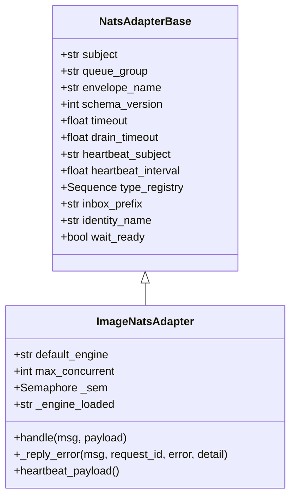
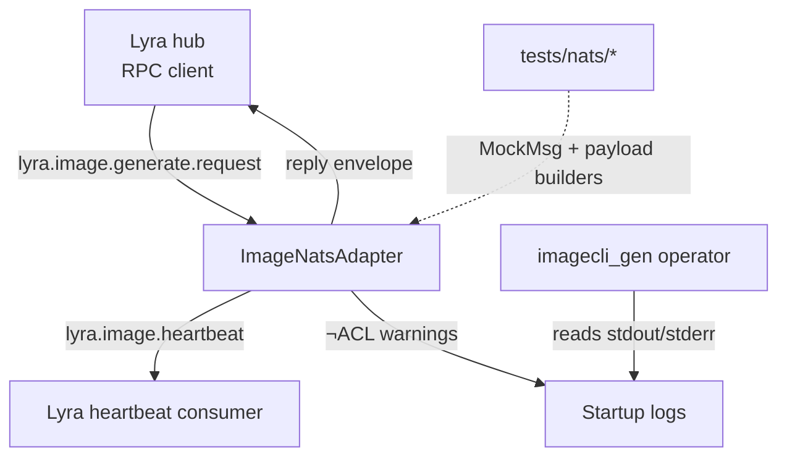

## Context

Promoted from [frame](../frames/84-bump-roxabi-nats-v041-frame.mdx). Tier **F-lite** — single domain (NATS adapter), upstream contract churn requires deliberate validation, no architectural change.

Sibling implementations already on `roxabi-nats v0.4.x` (tracking `branch = "staging"`):
- `llmCLI/src/llmcli/nats/llm_adapter.py:59` — `super().__init__(..., inbox_prefix="_inbox.llmcli-llm", wait_ready=False)`
- `voiceCLI/src/voicecli/nats/tts_adapter.py:78` — same pattern, `inbox_prefix="_inbox.voice-tts"`
- `voiceCLI/src/voicecli/nats/stt_adapter.py:75` — same pattern, `inbox_prefix="_inbox.voice-stt"`

Current `roxabi-nats v0.4.x` `NatsAdapterBase.__init__` signature (verified against the installed copy in `llmCLI/.venv`):

```python
def __init__(
    self, subject, queue_group, envelope_name, schema_version,
    timeout=30.0, drain_timeout=30.0, *,
    heartbeat_subject=None, heartbeat_interval=5.0,
    type_registry=None, inbox_prefix=None, identity_name=None,
    wait_ready=True,
)
```

`inbox_prefix` and `identity_name` are mutually exclusive; sibling repos use `inbox_prefix` (legacy, pre-ADR-051 — still supported).

## Goal

Pin `roxabi-nats` at `v0.4.1`, add `inbox_prefix` + `wait_ready=False` to `ImageNatsAdapter.__init__` super call, and verify the adapter still satisfies the `lyra.image.*` contract (request/reply, WorkerError envelope, heartbeat) with zero ACL denial warnings on startup.

## Users

- **Primary:** `imagecli_gen` operator (M₁ hub) — clean startup logs, contract-conformant replies
- **Secondary:** Lyra hub (RPC client of `lyra.image.generate.request`) — depends on imageCLI conforming to the v0.4.x reply envelope and heartbeat contract

## Expected Behavior

1. `uv sync` resolves `roxabi-nats v0.4.1` (and `roxabi-contracts` transitively if required by the dep graph).
2. `ImageNatsAdapter()` instantiates without raising, picks up `inbox_prefix="_inbox.imagecli-image"` and `wait_ready=False`.
3. `imagecli serve` starts: **no JetStream KV ACL denial warnings** in logs.
4. Heartbeats publish on `lyra.image.heartbeat` with current payload shape (envelope unchanged: `engine_loaded`, `active_requests`, `vram_used_mb`, `vram_total_mb`).
5. Lyra-sent `lyra.image.generate.request` produces a reply matching the v0.4.x envelope (success path unchanged from v0.1; error path conforms to current `{contract_version, request_id, ok: false, error, error_detail?}` shape — verified against `roxabi-contracts` types if those exist).
6. Existing test suites under `tests/nats/test_adapter.py` and `tests/nats/test_integration.py` pass without modification (or with only mechanical updates if base-class symbol locations moved).

## Data Model & Consumers

**Data structure — NatsAdapterBase init contract (v0.4.x)**



**Consumer map — who depends on the upgraded adapter**



| Consumer | Fields consumed | When | Status |
|----------|----------------|------|--------|
| Lyra hub | request_id, contract_version, ok, error, error_detail, image_data | per request | this issue (verify) |
| Lyra heartbeat monitor | engine_loaded, active_requests, vram_used_mb, vram_total_mb | every 5s | this issue (verify) |
| Operator logs | absence of `$JS.API.>` ACL denials | startup | this issue (verify) |
| `tests/nats/*` | adapter constructor surface | CI / pre-push | this issue (verify) |

## Breadboard

| Element | Type | Wiring |
|---------|------|--------|
| N1 — `pyproject.toml` `roxabi-nats` source | dep pin | `tag = "roxabi-nats/v0.1.0"` → `tag = "roxabi-nats/v0.4.1"` |
| N2 — `pyproject.toml` `roxabi-contracts` source | dep pin (cond) | Add `{ git, subdirectory = "packages/roxabi-contracts", tag = "roxabi-contracts/<latest>" }` if transitively required and not auto-resolved |
| N3 — `ImageNatsAdapter.__init__` super call | call site | Add `inbox_prefix="_inbox.imagecli-image"` (kw) |
| N4 — `ImageNatsAdapter.__init__` super call | call site | Add `wait_ready=False` (kw) with comment `# worker semantics — see NatsAdapterBase docstring` matching sibling style |
| S1 — `uv sync` resolves | startup gate | Lock file regenerates cleanly |
| S2 — `imagecli serve` startup | runtime gate | No ACL denials, no AttributeError on base class symbols |
| S3 — `tests/nats/test_adapter.py` | test gate | All pass |
| S4 — `tests/nats/test_integration.py` | test gate | All pass |
| S5 — Smoke RPC (manual or scripted) | runtime gate | Round-trip request → reply against running Lyra hub |

## Slices

| # | Slice | Includes | Demo-able |
|---|-------|----------|-----------|
| 1 | **Dep bump only** | N1 (+ N2 if needed); run `uv sync`; commit lockfile | `uv sync` succeeds; `python -c "from roxabi_nats import NatsAdapterBase; import inspect; print('wait_ready' in inspect.signature(NatsAdapterBase.__init__).parameters)"` prints `True` |
| 2 | **Adapter opt-in** | N3 + N4; adapter constructor uses new kwargs | Unit test instantiating `ImageNatsAdapter()` passes; `tests/nats/test_adapter.py` green |
| 3 | **Validation** | Run `uv run pytest tests/nats/`; manual smoke if Lyra hub reachable | Test suite green; smoke shows no ACL denials in `imagecli serve` startup |

Slices ordered: 1 unblocks 2 (constructor needs new kwarg surface); 2 unblocks 3 (validation needs the change in place).

## Success Criteria

- [ ] `pyproject.toml` lists `roxabi-nats` at `tag = "roxabi-nats/v0.4.1"`
- [ ] If `roxabi-contracts` is required transitively, it is pinned at a compatible tag and `uv sync` resolves without error
- [ ] `ImageNatsAdapter.__init__` super call includes `inbox_prefix="_inbox.imagecli-image"` and `wait_ready=False` (with comment matching sibling style)
- [ ] `uv run pytest tests/nats/test_adapter.py` passes
- [ ] `uv run pytest tests/nats/test_integration.py` passes
- [ ] `uv run pytest` (full suite) passes — no regressions in unrelated tests
- [ ] `uv run ruff check src tests` passes
- [ ] `uv run pyright` passes
- [ ] Manual: `imagecli serve` startup logs contain zero `$JS.API.>` ACL denial warnings (smoke test against running NATS hub; documented in PR if hub unavailable in CI)
- [ ] Error reply path emits the existing `{contract_version, request_id, ok: false, error, error_detail?}` envelope (verified via existing `test_adapter.py` error-path cases — if tests pass without modification, contract is conformant)

## Risks / Edge Cases

- **`roxabi-contracts` transitive resolution:** if `roxabi-nats v0.4.1` lists it as a runtime dep, `uv sync` should pull it transitively. If not, add an explicit pin matching the sibling repos' tag. Watch for `ImportError` at adapter import time as the signal.
- **Base class symbol moves:** v0.4.x might have moved helpers (e.g. `_TypeHintResolver`). The adapter currently imports only `NatsAdapterBase` from `roxabi_nats`, so this is low-risk. If `tests/nats/` import additional symbols, fix locations.
- **`inbox_prefix` value choice:** `"_inbox.imagecli-image"` follows the sibling naming convention (`_inbox.<repo>-<role>`). Document choice in commit message.
- **Smoke test access:** if no NATS hub is reachable from the dev environment, document this in the PR and rely on the test suite + sibling parity as the conformance evidence.
