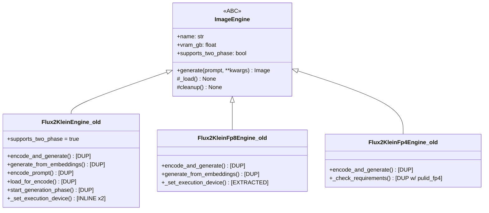
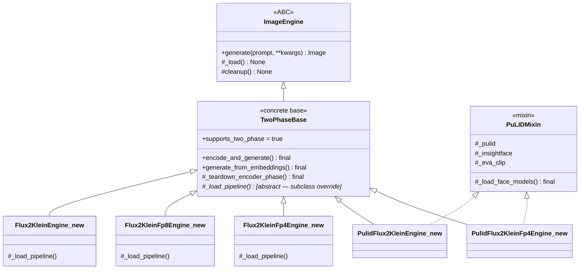
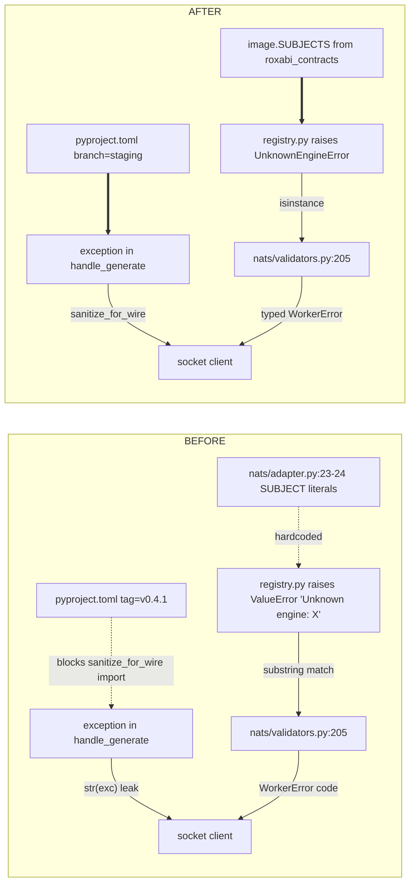

## Context

- Promoted from frame `artifacts/frames/89-stage-axis-refactor-frame.mdx` (approved 2026-05-21).
- Backed by audit `artifacts/analyses/stage-axis-audit-2026-05-20.md` (5 findings, 4 cross-repo follow-ups).
- Framework: lyra #1277 (stage-axis decomposition).
- Upstream contracts ready: lyra #1291 (closed) delivered `roxabi_contracts.image.SUBJECTS` (in installed `v0.4.0`) and `roxabi_nats.errors.sanitize_for_wire` (on `staging`, post-`v0.4.1` tag — requires pin switch).
- Closes: #86 (subsumed — see Slice 1).

## Goal

Eliminate the hottest N×M duplication in `imagecli/engines/` (76 lines × 3 quant files), remove socket-bound `str(exc)` leaks, and consume the new upstream contracts — so that the **next** quant variant or PuLID composition costs ≤30 LOC of subclass + a registry entry.

## Users

- **Primary:** future imageCLI engine-variant authors (next quant: quanto int8 / Ampere; next PuLID composition).
- **Secondary:**
  - daemon-socket clients (currently receive raw exception strings — file paths, traces).
  - 3-CLI fleet (`llmCLI` + `voiceCLI` + `imageCLI`) maintainers — version-drift removal.

## Expected Behavior

1. After `uv sync`, `roxabi_contracts.image.SUBJECTS.image_request` resolves to `"lyra.image.generate.request"`; `roxabi_nats.sanitize_for_wire(exc)` is callable.
2. `imagecli serve` starts the NATS satellite; subject literals are no longer present in `imagecli/nats/adapter.py` (sourced from contracts package).
3. A handler-level `OSError("/tmp/foo.png permission denied")` raised inside `daemon_handlers.handle_generate` is delivered to the socket client as a sanitized, truncated string with no file paths or stack frames.
4. Asking an unknown engine via NATS returns `WorkerError{ code: "unknown_engine" }` — and the code path is reached via `isinstance(exc, UnknownEngineError)`, not by substring match on `str(exc)`.
5. `flux2-klein`, `flux2-klein-fp8`, `flux2-klein-fp4` generate images byte-identical (per seed) to before the refactor (same `_pipe`, same `_build_pipe_kwargs`, same `--two-phase` semantics).
6. Calling `imagecli generate -e flux2-klein` works for both single-image (CPU offload) and batch modes (all-on-GPU). PuLID engines (`pulid-flux2-klein`, `pulid-flux2-klein-fp4`, `pulid-flux1-dev`) still resolve face references and produce face-locked images.
7. `pyproject.toml` shows `roxabi-nats` and `roxabi-contracts` both on `branch = "staging"`; no `tag = "roxabi-nats/v0.4.1"`.

## Data Model & Consumers

### Engine inheritance

#### Before

#### After

*Legend:* `<|--` = inheritance, `<|..` = mixin/realization. `*` = abstract, must be implemented by subclasses.

### Error/contract wiring — current vs target

### Consumer summary

| Consumer | Fields / symbols consumed | When | Status |
|---|---|---|---|
| `nats/adapter.py` | `image.SUBJECTS.image_request`, `image.SUBJECTS.image_heartbeat` | NATS satellite startup | this issue |
| `daemon_handlers.py:83,154,238` | `sanitize_for_wire(exc)` | every socket error path | this issue |
| `nats/validators.py:205` | `isinstance(exc, UnknownEngineError)` | NATS request dispatch | this issue |
| Each `engines/flux2_klein*.py` | `TwoPhaseBase` methods (5) | engine `_load()` + batch 2-phase | this issue |
| Each `engines/pulid_flux2_klein*.py` | `PuLIDMixin._load_face_models()` | engine `_load()` | this issue |
| Future `engines/flux2_klein_int8.py` (anticipated) | `TwoPhaseBase` methods | not yet — out of scope | future |
| Future `engines/pulid_*_dev.py` variants | `PuLIDMixin._load_face_models()` | not yet — out of scope | future |

## Breadboard

*Prefix legend:* `N` = NATS / pin, `E` = error, `T` = TwoPhaseBase, `Q` = nvfp4 requirements check, `P` = PuLID.

| ID | Affordance | Handler / target | Source |
|---|---|---|---|
| N1 | `roxabi-nats` declared on `branch="staging"` | `pyproject.toml` `[tool.uv.sources]` | Cross-repo #2 |
| N2 | `roxabi-contracts` declared direct + on `branch="staging"` | `pyproject.toml` `[project.optional-dependencies] nats` + `[tool.uv.sources]` | Cross-repo #3 (closes #86) |
| N3 | `image.SUBJECTS` imported in `nats/adapter.py` | replaces `SUBJECT` + `HEARTBEAT_SUBJECT` literals (lines 23-24) | Cross-repo #1 |
| E1 | `UnknownEngineError(ValueError)` defined | `engine/registry.py` (with the raise site at `:50`) | Finding 5 |
| E2 | `nats/validators.py:205` dispatches via `isinstance` | replaces substring match on `str(exc)` | Finding 5 |
| E3 | `sanitize_for_wire(exc)` replaces `str(exc)` | `daemon_handlers.py:83,154,238` | Finding 4 + Cross-repo #4 |
| T1 | `TwoPhaseBase(ImageEngine)` defined | new file `engines/_two_phase_base.py` (or `engines/base.py`) | Finding 1 |
| T2 | `TwoPhaseBase.encode_and_generate` final | replaces inline copies in all 3 quant engines | Finding 1 |
| T3 | `TwoPhaseBase.generate_from_embeddings` final | replaces inline copies | Finding 1 |
| T4 | `_teardown_encoder_phase()` helper | replaces verbatim gc block in 3 sites | Finding 1 |
| T5 | `_set_execution_device(pipe)` free function in `engines/helpers.py` (property-on-pipe-class monkey-patch) | replaces 4 sites across 4 files; `TwoPhaseBase` delegates | Finding 2 |
| Q1 | `_check_nvfp4_requirements()` in `engines/nvfp4/__init__.py` | replaces 2 near-identical blocks | Finding 3 |
| P1 | `PuLIDMixin` defined | new file `engines/_pulid/mixin.py` (sub-package exists) | Bonus |
| P2 | `_load_face_models()` final | replaces 3× InsightFace+EVA-CLIP blocks (7 lines each) | Bonus |

## Slices

| # | Slice | Affordances | Domain | Demo |
|---|---|---|---|---|
| 1 | **uv pin alignment** — switch `roxabi-nats` to `branch=staging`; declare `roxabi-contracts` direct dep on same branch. Closes #86 in transit. | N1, N2 | `pyproject.toml` + `uv.lock` | `uv sync` succeeds; `roxabi_nats.sanitize_for_wire` import works; existing tests green; closes #86. |
| 2 | **NATS subjects from contracts** — replace `SUBJECT` + `HEARTBEAT_SUBJECT` literals with imports from `roxabi_contracts.image.SUBJECTS`. (Test-time depends on Slice 1's `branch=staging` pin to ensure runtime `image.SUBJECTS` matches the lyra-hub literal.) | N3 | `nats/adapter.py` | `imagecli serve` connects + heartbeats; integration test asserts adapter subscribes to `image.SUBJECTS.image_request`. |
| 3 | **typed `UnknownEngineError`** — introduce subclass + raise site; dispatch in validators via `isinstance`. | E1, E2 | `engine/registry.py`, `nats/validators.py` | NATS request with unknown engine returns `WorkerError{code:"unknown_engine"}`; new unit test asserts `isinstance` path is taken even when message is rewritten. |
| 4 | **`sanitize_for_wire` on socket paths** — replace 3 `str(exc)` sites in `daemon_handlers.py`. **Depends on Slice 1.** | E3 | `daemon_handlers.py` | Socket client receives sanitized string (no `/path/`, no stack) on injected error; existing socket tests still pass. |
| 5 | **`TwoPhaseBase` extraction** — new concrete base with finalized `encode_and_generate`, `generate_from_embeddings`, `_teardown_encoder_phase`; refactor 3 quant engines to inherit. | T1, T2, T3, T4, T5 | `engines/_two_phase_base.py`, `engines/flux2_klein.py`, `engines/flux2_klein_fp8.py`, `engines/flux2_klein_fp4.py`, `engines/helpers.py` | All 3 engines produce byte-identical output (seeded smoke test) across `generate` + `batch` + `batch --two-phase`; net LOC reduction ≥ 130. |
| 6 | **`PuLIDMixin` + `_check_nvfp4_requirements`** — extract InsightFace+EVA-CLIP loading into mixin; extract NVFP4 req check into `engines/nvfp4/__init__.py`; compose into 2 PuLID engines (Klein + Klein-fp4); Flux1-dev keeps its bespoke load but consumes mixin for the face-models helper. | Q1, P1, P2 | `engines/nvfp4/__init__.py`, `engines/_pulid/mixin.py`, `engines/pulid_flux2_klein.py`, `engines/pulid_flux2_klein_fp4.py`, `engines/pulid_flux1_dev.py` | All 3 PuLID engines produce face-locked images on the existing `face_image` reference; net LOC reduction ≥ 60. |

**Dependency arrows:**
- Slice 4 ← Slice 1 (needs `sanitize_for_wire` available on installed package)
- Slice 2 ← Slice 1 (test-time only; the new `image.SUBJECTS` constant lives in `roxabi-contracts v0.4.0+`, already installed, but the lyra-hub literal it must match against is sourced from the same `branch=staging`)
- Slice 5 ⊥ Slice 6 (independent; can land in parallel after Slice 1+2+3) — **file-coupling caveat:** Slice 6 touches `engines/pulid_flux2_klein_fp4.py` for the NVFP4 req-check extraction; Slice 5 touches `engines/flux2_klein_fp4.py` for TwoPhaseBase. Different files, but a rebase against `staging` may collide on imports/header changes in `engines/__init__.py` if both PRs add new exports. `/plan` should serialize them or split by file boundary.
- Slice 1 ⊥ Slice 2 ⊥ Slice 3 (independent; can bundle into 1 PR if convenient)

**Suggested PR batching (handed off to `/plan`):**
- PR-A = Slices 1 + 2 + 3 (small cross-repo wins, sets up the rest). PR-A body: `closes #86`, `part of #89` — **do not use `closes #89` until Slice 6 PR**.
- PR-B = Slice 4 (needs PR-A merged + `uv sync`'d). Body: `part of #89`.
- PR-C = Slice 5 (`TwoPhaseBase`). Body: `part of #89`.
- PR-D = Slice 6 (`PuLIDMixin` + nvfp4 check). Body: `closes #89`.

## Success Criteria

**Cross-repo consumption**
- [ ] `grep -E '^\s*roxabi-nats.*tag\s*=' pyproject.toml | wc -l` returns `0` (no tag pin).
- [ ] `grep -E '^\s*roxabi-nats.*branch\s*=\s*"staging"' pyproject.toml | wc -l` returns `1`.
- [ ] `roxabi-contracts` listed under `[project.optional-dependencies] nats` AND `[tool.uv.sources]` with `branch="staging"`.
- [ ] `uv run python -c "from roxabi_contracts.image import SUBJECTS; assert SUBJECTS.image_request == 'lyra.image.generate.request'"` exits 0.
- [ ] `uv run python -c "from roxabi_nats import sanitize_for_wire"` exits 0.
- [ ] `grep -nE '^(SUBJECT|HEARTBEAT_SUBJECT)\s*=\s*"lyra' src/imagecli/nats/adapter.py | wc -l` returns `0`.
- [ ] `nats/adapter.py` imports `SUBJECTS` from `roxabi_contracts.image`.
- [ ] Issue #86 auto-closed by PR-A body (`closes #86`). PR-A does NOT include `closes #89`; only PR-D (Slice 6) does.

**Typed errors + sanitization**
- [ ] `UnknownEngineError(ValueError)` exported from `engine/registry.py`.
- [ ] `engine/registry.py` raise site uses `UnknownEngineError`, not `ValueError`.
- [ ] `nats/validators.py:205` (or new line) uses `isinstance(exc, UnknownEngineError)`, no `"Unknown engine" in str(exc)`.
- [ ] `grep -F "str(exc)" src/imagecli/daemon_handlers.py | wc -l` returns `0`.
- [ ] All 3 socket-bound error paths use `sanitize_for_wire(exc)`.
- [ ] Unit test: unknown-engine NATS request returns `WorkerError{code:"unknown_engine"}` even when raise-site message is rewritten (regression guard against substring match).
- [ ] Unit test: `daemon_handlers` injected `OSError("/secret/path: denied")` is sanitized in socket response (no `/secret/path`).

**TwoPhaseBase**
- [ ] `grep -c "def encode_and_generate" src/imagecli/engines/*.py` returns exactly `1` (in the base).
- [ ] `grep -c "def generate_from_embeddings" src/imagecli/engines/*.py` returns exactly `1`.
- [ ] `TwoPhaseBase` defined, exported from `engines/__init__.py` (or stays internal — chosen at /plan).
- [ ] 3 engines (`flux2_klein`, `flux2_klein_fp8`, `flux2_klein_fp4`) declare `TwoPhaseBase` as base.
- [ ] `_set_execution_device` exists at exactly 1 site (the helper); ¬inline copies.
- [ ] Smoke test on M₂ (RTX 5070 Ti): seeded generation for each of the 3 engines produces a file with size > 0; SHA-256 of decoded pixel array is bit-identical to a pre-refactor reference captured on the same GPU + same `_pipe`-class path (deterministic on identical CUDA kernel).
- [ ] Net LOC delta in `src/imagecli/engines/flux2_klein*.py` ≥ -130 (manual count at PR time).

**PuLIDMixin + nvfp4 check**
- [ ] `PuLIDMixin` defined under `engines/_pulid/` sub-package.
- [ ] `PuLIDMixin._load_face_models()` is the sole InsightFace + EVA-CLIP loader; ¬verbatim 7-line copies in any of the 3 PuLID engines.
- [ ] `engines/nvfp4/__init__.py` exports `_check_nvfp4_requirements()`; ¬verbatim 14-line near-duplicates in `flux2_klein_fp4.py` + `pulid_flux2_klein_fp4.py`.
- [ ] **[MANUAL]** PuLID engines (`pulid-flux2-klein`, `pulid-flux2-klein-fp4`, `pulid-flux1-dev`) still produce face-locked outputs on a held-out `face_image` reference. (Visual check on M₂; not auto-testable due to `compile=False` constraint per CLAUDE.md.)

**Project-level quality gates**
- [ ] `uv run ruff check .` passes.
- [ ] `uv run ruff format --check .` passes.
- [ ] `uv run pyright` passes — and `.github/workflows/ci.yml` actually invokes it (current CI runs only `ruff --select=PYI`; spec requires real `pyright` step).
- [ ] `uv lock --check` passes in CI (lockfile-drift gate added before `uv sync --frozen` install step).
- [ ] `uv run pytest` passes (existing tests + the new unit tests).
- [ ] Container build smoke: `docker build -f Dockerfile.gen --target builder .` succeeds against the new lockfile.
- [ ] No file exceeds 300 LOC (stack.yml gate); no folder exceeds 12 files.
- [ ] All 9 existing engines listed by `imagecli engines` (no regressions in registry).

**Cleanup**
- [ ] All PRs link `#89` and reference the corresponding slice number.
- [ ] `nats/adapter.py` LOC ≤ 300 (currently ~357; the SUBJECTS extraction trims it).

## Resolved Clarifications

- **File placement of `TwoPhaseBase`:** sibling file `engines/_two_phase_base.py` (single file; no sub-package needed since there are no other exports to bundle). Matches `_pulid/` precedent in spirit but avoids over-structuring.
- **`_set_execution_device` placement:** free function in `engines/helpers.py`; `TwoPhaseBase` delegates. Rationale: the monkey-patch operates on `Flux2KleinPipeline` instances regardless of quant variant — it has no conceptual ownership on the base class — and keeping it free makes it available to `load_all_on_gpu` paths that don't inherit `TwoPhaseBase`.
