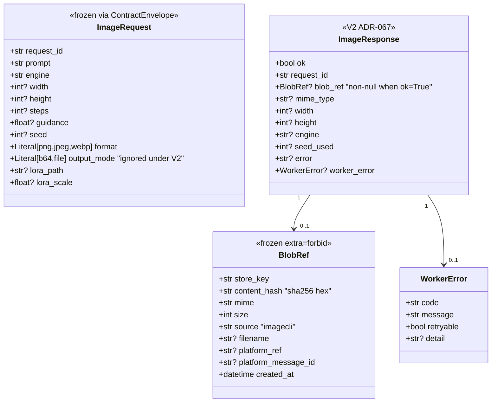
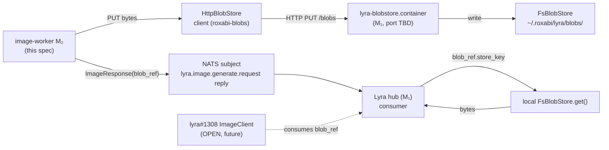

## Context

Source: `artifacts/frames/97-image-worker-blobref-adoption-frame.mdx` (approved 2026-05-27).
Catch-up to upstream `lyra#1064` (V2 `BlobRef` contract, closed 2026-05-22) and `lyra#1330` (V8 `HttpBlobStore` HTTP-fronted service, closed 2026-05-25). Local `uv.lock` pins `roxabi-contracts` to commit `e99cc6a` (pre-V2), so the worker compiles and runs today; bumping the pin without code changes breaks Pydantic validation in `src/imagecli/nats/adapter.py:233-246`. Scope is the NATS adapter only — local CLI `generate`/`batch` paths are unchanged.

## Goal

Replace the inline-bytes response surface (`image_b64` / `file_path`) of the imageCLI NATS image-worker with a single `blob_ref: BlobRef` populated via the upstream `HttpBlobStore` HTTP client over tailnet (M₂ → M₁), in lock-step with a `roxabi-contracts` pin bump past V2.

## Users

- **Image-worker process** on M₂ (`imagecli-gen.container`, currently `.disabled`; revivable on demand) — produces `ImageResponse`.
- **Lyra hub** on M₁ — consumes `ImageResponse.blob_ref` and resolves bytes via its own local `FsBlobStore`.
- **`lyra-blobstore.container`** on M₁ — receives the worker's HTTP PUT and writes through `FsBlobStore`.
- **Operators** — set the HttpBlobStore endpoint + token in `imagecli.toml` / env / Quadlet secret.

## Expected Behavior

Happy path:
1. Worker receives `lyra.image.generate.request` over NATS (validated via `_validate_request`).
2. Engine generates the image into a temp file (unchanged).
3. Worker reads bytes from the temp file (unchanged).
4. Worker `await http_blob_store.put(bytes, mime="image/{fmt}", source="imagecli", filename=f"{request_id}.{fmt}")` → returns `BlobRef` (with concrete `store_key`, `content_hash`, `size`).
5. Worker constructs `ImageResponse(ok=True, request_id=…, blob_ref=…, mime_type=…, width=…, height=…, engine=…, seed_used=…)` — no `image_b64`, no `file_path`.
6. Worker `reply()` with `model_dump_json(exclude_none=True)`.
7. Temp file deleted in `finally`.

Error paths:
- Generation failure → unchanged (`worker.crash` / `image.engine_unavailable` / `worker.capacity` / `worker.validation` codes route as today).
- `HttpBlobStore.put()` failure (network, 5xx, auth) → reply `ImageResponse(ok=False, error="delivery_failed", worker_error=WorkerError(code="worker.internal", retryable=True))`. Temp file still deleted.
- **Post-PUT / pre-reply failure** (PUT succeeded → bytes written on M₁ → NATS reply errored): reply with `delivery_failed` like the put-failure case. The blob on M₁ leaks; this is acceptable given upstream `BlobStore` has server-side retention/TTL and `lyra` hub will not have received a `blob_ref` to dereference. Wrap the response build + `reply()` in the same `try` so any exception after PUT routes through `_reply_error` rather than `ok=True` with no `blob_ref`.
- `HttpBlobStore` not configured at startup (no endpoint or no token) → adapter raises at construction time (fail-fast); systemd restarts on next config push.
- `HttpBlobStore` configured but **endpoint unreachable at startup** (lyra-blobstore down, tailnet flap) → log a warning, do **not** fail-fast. The worker accepts NATS requests; the first `put()` will fail and route via `delivery_failed` (`retryable=True`) until the endpoint is reachable. Operator sees the warning in `journalctl --user -u imagecli-gen`.

Behavior NOT changing:
- Local CLI `imagecli generate` / `imagecli batch` — still write to `~/.roxabi/imagecli/out/` via the existing `_save_with_unique_name` path.
- NATS subjects, queue-group, heartbeat, validation, error code mapping.
- `ImageRequest.output_mode` is accepted but ignored — worker always emits `blob_ref` under V2.

## Data Model & Consumers

### Data structure



### Consumer map



### Consumer summary

| Consumer | Fields read | When | Status |
|---|---|---|---|
| Lyra hub (`src/lyra/nats/nats_image_codec.py`) | `ImageResponse.{ok,request_id,blob_ref,mime_type,width,height,engine,seed_used,worker_error}` | per request reply | shipped in lyra#1064 |
| `lyra-blobstore.container` HTTP service | request body (bytes) + `Content-Type`, `X-Blob-Source`, `X-Blob-Filename` headers | per HttpBlobStore.put | shipped in lyra#1330 |
| `lyra#1308` ImageClient (thin domain client) | same `ImageResponse` shape | per request reply | future (OPEN) |

## Breadboard

### Affordances

| ID | Kind | Element | Where |
|---|---|---|---|
| C1 | config | `[blobstore]` section in `imagecli.toml` with `endpoint: str` and `token: str` (default endpoint = `http://roxabituwer:8449`) | `imagecli.example.toml`, `src/imagecli/config.py` |
| C2 | env vars | `IMAGECLI_BLOBSTORE_URL`, `IMAGECLI_BLOBSTORE_TOKEN` | `src/imagecli/config.py` |
| C3 | Quadlet secret | `imagecli-blobstore-token` mounted in `imagecli-gen.container` as `type=mount,uid=1503,gid=1503,mode=0400` (mirrors `imagecli-nats-gen` pattern; UID 1503 per CLAUDE.md) | `deploy/quadlet.toml`, `deploy/install.sh` |
| C4 | Rotation runbook | extend `docs/QUADLET-DEPLOYMENT.md` rotation section with `imagecli-blobstore-token` flow — `type=mount` requires **container restart** after `podman secret create --replace` (same constraint as `imagecli-nats-gen`) | `docs/QUADLET-DEPLOYMENT.md`, `deploy/install.sh` |
| N1 | NATS adapter init | `ImageNatsAdapter` constructor accepts `blob_store: BlobStore` (Protocol-typed), required | `src/imagecli/nats/adapter.py` |
| N2 | NATS adapter handle | `handle()` calls `await self._blob_store.put(...)` instead of `image_b64`/`file_path` branches; PUT + response build + `reply()` are wrapped in a single `try` so post-PUT failures route through `_reply_error("delivery_failed")` rather than building an `ok=True` response with no `blob_ref` | `src/imagecli/nats/adapter.py:201-280` |
| N3 | Error map row | `delivery_failed` (existing) covers HttpBlobStore failures too — keep `worker.internal, retryable=True` mapping | `src/imagecli/nats/adapter.py:34-41` |
| N4 | Startup connectivity probe | `commands/serve.py` performs a single best-effort HEAD/GET against `HttpBlobStore.base_url` and logs a warning on failure; does **not** raise — worker still starts (degraded; first PUT triggers `delivery_failed`) | `src/imagecli/commands/serve.py` |
| D1 | Dep add | `roxabi-blobs` in `pyproject.toml` (git source, same branch as `roxabi-contracts`) | `pyproject.toml`, `uv.lock` |
| D2 | Pin bump | `roxabi-contracts` lock re-resolved past commit `e99cc6a` (i.e., past lyra#1064 merge 2026-05-22) | `uv.lock` |
| S1 | Startup wiring | `commands/serve.py` (or equivalent NATS bootstrap) instantiates `HttpBlobStore(base_url, token)` from config and passes it to `ImageNatsAdapter(blob_store=…)`. Raises if either is missing (fail-fast). | `src/imagecli/commands/serve.py` |
| T1 | Adapter test | `tests/nats/test_integration.py` — mock `BlobStore` (returns canned `BlobRef`); assert response carries `blob_ref` (with `store_key`/`content_hash`/`mime`/`size`) and contains neither `image_b64` nor `file_path` | `tests/nats/test_integration.py` |
| T2 | Error-path test | `tests/nats/test_integration.py` — (a) mock `BlobStore.put` raises `httpx.HTTPError`; (b) mock `BlobStore.put` succeeds but `reply()` raises. Both assert `ImageResponse(ok=False, error="delivery_failed", worker_error.code="worker.internal", worker_error.retryable=True)` | `tests/nats/test_integration.py` |
| T3 | Config test | unit test for `config.py` blobstore section + env-var fallback + precedence (`imagecli.toml [blobstore]` > env > default — there is no CLI/frontmatter analog for server config) | `tests/test_config.py` |
| X1 | Cleanup | drop `move_to_nats_output()` from `src/imagecli/paths.py` (and its tests in `tests/test_paths.py`) if no other caller remains | `src/imagecli/paths.py`, `tests/test_paths.py` |

### Wiring

```
        ┌─ pyproject.toml ─┐         ┌─ imagecli.toml ──┐         ┌─ Quadlet ──────────┐
        │ + roxabi-blobs   │         │ [blobstore]      │         │ Secret: imagecli-  │
        │ ~ contracts pin  │         │ endpoint=...     │         │   blobstore-token  │
        └────────┬─────────┘         │ token=...        │         └────────┬───────────┘
                 │                   └────────┬─────────┘                  │
                 │ uv sync                    │                            │
                 ▼                            ▼                            ▼
        ┌─ commands/serve.py ─────────────────────────────────────────────────┐
        │ http_store = HttpBlobStore(base_url, token)                         │
        │ adapter = ImageNatsAdapter(blob_store=http_store, ...)              │
        └────────────────────────────┬────────────────────────────────────────┘
                                     │
                                     ▼
        ┌─ nats/adapter.py ──────────────────────────────────────────────────┐
        │ async def handle(msg, payload):                                    │
        │   ... generate to tmp ...                                          │
        │   bytes = tmp.read_bytes()                                         │
        │   blob_ref = await self._blob_store.put(                           │
        │       bytes, mime=f"image/{fmt}", source="imagecli",               │
        │       filename=f"{request_id}.{fmt}")                              │
        │   resp = ImageResponse(ok=True, ..., blob_ref=blob_ref)            │
        │   await reply(msg, resp.model_dump_json(exclude_none=True))        │
        │ except HttpBlobStoreError:                                         │
        │   reply_error(msg, ..., "delivery_failed")                         │
        └────────────────────────────────────────────────────────────────────┘
```

## Slices

| # | Title | Affordances | Demoable outcome | Independently mergeable |
|---|---|---|---|---|
| 1 | **Config + client wiring + Quadlet secret (no behavior change)** | C1, C2, C3, C4, D1, N4, S1 | `imagecli serve` starts with `HttpBlobStore(base_url="http://roxabituwer:8449", token=…)` instantiated; startup probe logs warning iff endpoint unreachable. Adapter still emits `image_b64`/`file_path` because `roxabi-contracts` pin not yet bumped. Quadlet secret `imagecli-blobstore-token` created by `install.sh`. | ✅ — safe to merge alone; behavior of NATS path unchanged |
| 2 | **Atomic contract migration** | D2, N1, N2, N3, T1, T2, X1 | After `uv sync`, `tests/nats/test_integration.py` passes with `blob_ref` assertions; adapter emits `ImageResponse(ok=True, blob_ref=…)`; put-failure + post-PUT/pre-reply error paths both green. Legacy `move_to_nats_output()` removed. | ❌ — must land atomically with the contracts-pin bump |
| 3 | **Config tests + docs** | T3, CLAUDE.md note on `[blobstore]` config | `pytest tests/test_config.py` passes; CLAUDE.md updated; example toml refreshed. | ✅ — pure docs+tests, mergeable last |

Recommended landing order: 1 → 2 → 3. Slice 2 is the atomic-coupling unit.

## Success Criteria

- [ ] `pyproject.toml` declares `roxabi-blobs` as a dep with the same git source pattern as `roxabi-contracts` (branch=staging).
- [ ] `uv.lock` resolves `roxabi-contracts` to a commit ≥ the lyra#1064 merge commit (`closedAt: 2026-05-22T14:13:23Z`); `grep -F "e99cc6a" uv.lock` returns zero matches.
- [ ] `grep -rE "image_b64|file_path" src/imagecli/nats/` returns zero non-comment matches.
- [ ] `src/imagecli/nats/adapter.py` builds `ImageResponse` with `blob_ref` populated on `ok=True` and without `image_b64`/`file_path` arguments.
- [ ] `src/imagecli/nats/adapter.py` wraps `put()` + response-build + `reply()` in a single `try`, so post-PUT failures route to `_reply_error("delivery_failed")` rather than producing an `ok=True` response without `blob_ref`.
- [ ] `tests/nats/test_integration.py` exercises a happy-path test that asserts the reply payload contains `blob_ref.store_key`, `blob_ref.content_hash`, `blob_ref.mime`, and `blob_ref.size` and contains neither `image_b64` nor `file_path`.
- [ ] `tests/nats/test_integration.py` exercises **two** error-path cases — (a) `BlobStore.put` raises `httpx.HTTPError`; (b) `BlobStore.put` succeeds but `reply()` raises — and both yield `ImageResponse(ok=False, error="delivery_failed", worker_error.code="worker.internal", worker_error.retryable=True)`.
- [ ] Config loader resolves `endpoint` + `token` from `imagecli.toml [blobstore]` > env (`IMAGECLI_BLOBSTORE_URL` / `IMAGECLI_BLOBSTORE_TOKEN`) > default; missing **token** raises a clear error at adapter construction (fail-fast); missing **endpoint** falls back to default `http://roxabituwer:8449`.
- [ ] `commands/serve.py` performs a best-effort startup connectivity probe against `HttpBlobStore.base_url` and logs a warning (NOT raises) on failure.
- [ ] `imagecli.example.toml` includes a `[blobstore]` section (commented stub OK) with endpoint + token fields and the canonical M₁ URL noted.
- [ ] `deploy/quadlet.toml` declares an `imagecli-blobstore-token` secret entry (`type=mount,uid=1503,gid=1503,mode=0400`) mounted into `imagecli-gen.container`; `deploy/install.sh` creates the secret if missing using the same idempotency pattern as `imagecli-nats-gen`.
- [ ] `docs/QUADLET-DEPLOYMENT.md` rotation section documents the `podman secret create --replace imagecli-blobstore-token` + container restart flow (mount-type secrets bind at init).
- [ ] `move_to_nats_output()` is removed from `src/imagecli/paths.py` (and its tests) if no other caller remains, OR an explicit note is added explaining why it's retained.
- [ ] `ImageResponse(contract_version="1", …)` continues to validate against the V2 model after the pin bump (or `contract_version` is updated to the V2-accepted value); confirmed by the happy-path test.
- [ ] `uv run ruff check .` + `uv run pyright` + `uv run pytest` all pass.

## Resolved during expert review (2026-05-27)

- ✅ **HttpBlobStore endpoint** — confirmed `http://roxabituwer:8449` from `lyra/deploy/quadlet/lyra-blobstore.container:51` (bound to `${TAILSCALE_IPV4}`, port 8449). MagicDNS `roxabituwer` resolves from M₂ over tailnet.
- ✅ **Token rotation** — static Bearer token, Quadlet secret with `type=mount` (mirrors `imagecli-nats-gen`). Rotation requires container restart after `podman secret create --replace` (mount-type binding). Documented in `QUADLET-DEPLOYMENT.md` per C4.
- ✅ **HttpBlobStore retry semantics** — `roxabi-blobs/http_store.py` has **no** internal retry loop; per-request timeout 5s/5s. Adapter treats each `put()` as a single attempt; `retryable=True` in the WorkerError lets the lyra hub re-dispatch. Double-delivery is the hub's concern (idempotency by `BlobRef.content_hash` server-side).

## NEEDS CLARIFICATION

1. [NEEDS CLARIFICATION] **`ImageRequest.output_mode` request field.** V2 keeps `ImageRequest.output_mode: Literal["b64", "file"]` but the response only carries `blob_ref`. Confirmed deprecated/ignored by upstream, or does it imply a hint to the worker (e.g., skip large encodes)? Assumed **ignored** for this spec; raise in lyra#1308 if a semantic remains.
